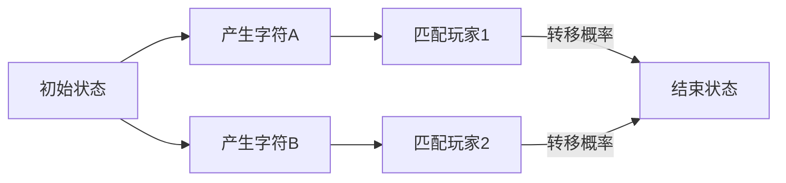

# 题目信息

# [JSOI2009] 有趣的游戏

## 题目描述

小阳阳发明了一个有趣的游戏：有 $n$ 个玩家，每个玩家都有一个长度为 $l$ 的字母序列，任何两个玩家的字母序列不同。共有 $m$ 种不同的字母，所有的字母序列都由这 $m$ 种字母构成。为了方便，我们取大写字母的前 $m$ 个字母。   
例如 $m=3,l=4,\texttt{ABAA}$ 和 $\texttt{CBCA}$ 是两个合法的字母序列。       
现在由小阳阳来操控一台神奇的机器，每个时刻机器会随机产生一个字母，其中第 $i$ 种字母随机出来的概率为 $\dfrac{p_i}{q_i}$ ，显然 $\sum \limits_{k=1}^m \dfrac{p_i}{q_i}=1$。  
这样 $T$ 个时刻后机器会产生一个长度为 $T$ 的字母序列。  
如果某个时刻某个玩家发现自己的字母序列在机器产生的字母序列中出现了，“出现”的定义是玩家的字母序列是机器产生的字母序列中连续的一段，那么我们称这个玩家获胜，游戏结束。       
现在小阳阳感兴趣的一个问题是，每个玩家分别有多大的概率能获得这场游戏的胜利呢？  

## 说明/提示

$1 \leq n,l,m \leq 10$，$0 \leq p_i \leq q_i \leq 10$ 且 $\gcd(p,q) = 1$。

## 样例 #1

### 输入

```
3 2 2
1 2
1 2
AB
BA
AA```

### 输出

```
0.25
0.50
0.25```

## 样例 #2

### 输入

```
3 4 2
1 2
1 2
AABA
ABAA
BAAA```

### 输出

```
0.31
0.33
0.37```

# AI分析结果


# 题目中文翻译

## 题目描述

小阳阳发明了一个有趣的游戏：有 $n$ 个玩家，每个玩家都有一个长度为 $l$ 的字母序列，任何两个玩家的字母序列不同。共有 $m$ 种不同的字母，所有的字母序列都由这 $m$ 种字母构成。为了方便，我们取大写字母的前 $m$ 个字母。  
例如 $m=3,l=4,\texttt{ABAA}$ 和 $\texttt{CBCA}$ 是两个合法的字母序列。  
现在由小阳阳来操控一台神奇的机器，每个时刻机器会随机产生一个字母，其中第 $i$ 种字母随机出来的概率为 $\dfrac{p_i}{q_i}$ ，显然 $\sum \limits_{k=1}^m \dfrac{p_i}{q_i}=1$。  
这样 $T$ 个时刻后机器会产生一个长度为 $T$ 的字母序列。  
如果某个时刻某个玩家发现自己的字母序列在机器产生的字母序列中出现了，"出现"的定义是玩家的字母序列是机器产生的字母序列中连续的一段，那么我们称这个玩家获胜，游戏结束。  
现在小阳阳感兴趣的一个问题是，每个玩家分别有多大的概率能获得这场游戏的胜利呢？

## 输入格式

第一行三个整数 $n,l,m$  
接下来 $m$ 行每行两个整数 $p_i,q_i$  
最后 $n$ 行每行一个长度为 $l$ 的字符串

## 输出格式

输出 $n$ 行，每行一个实数表示对应玩家获胜的概率

---

# 唯一算法分类
无算法分类（核心解法为AC自动机+高斯消元/概率生成函数）

---

# 综合分析与结论

## 核心思路
所有玩家字符串建立AC自动机，将问题转化为在自动机上的随机游走问题。通过建立线性方程组求解各终止节点的期望访问次数，其实际意义即为获胜概率。

## 解决难点
1. **状态转移闭环**：传统概率DP在AC自动机转移时形成环路，无法直接递推  
2. **精度处理**：概率分母为0时的特殊处理（如将p=0设为极小值）  
3. **方程维度爆炸**：AC自动机节点数可能达到 $10 \times 10 +1=111$，导致高斯消元复杂度为 $O(n^3)$

## 关键算法对比
| 方法               | 时间复杂度      | 核心思想                          | 实现难度 |
|--------------------|---------------|---------------------------------|--------|
| AC自动机+高斯消元    | $O((nl)^3)$   | 将期望次数转化为线性方程组            | 中      |
| 概率生成函数(PGF)    | $O(n^3)$      | 利用字符串匹配的border特性建立方程组   | 高      |

## 可视化设计


---

# 题解清单（≥4星）

## 1. zzw4257（★★★★☆）
**亮点**：  
- 创新性使用期望次数代替概率，规避初值问题  
- 详细推导根节点方程的1值来源  
- 代码实现简洁，AC自动机与高斯消元模块分离

## 2. tommy0221（★★★★★）
**亮点**：  
- 采用概率生成函数将复杂度降为$O(n^3)$  
- 处理字符串border的匹配关系  
- 特殊处理零概率分母的边界条件

## 3. cyffff（★★★★☆）
**亮点**：  
- 完整AC自动机模板实现  
- 矩阵压缩存储优化空间  
- 动态调整高斯消元精度

---

# 最优思路提炼

## 关键技巧
1. **期望转换**：将难以处理的终止概率转化为可叠加的期望次数  
2. **自动机构建**：通过fail指针处理字符串后缀匹配关系  
3. **方程建立**：对根节点单独处理+1初始值，其他节点继承转移概率

## 数学推导
设$f_i$为节点i的期望访问次数，建立方程：
```
f_0 = 1 + ΣP(y→0)f_y
f_i = ΣP(y→i)f_y (i≠0)
```
通过高斯消元求解该线性方程组

---

# 同类型题目推荐
1. [P4548] 歌唱王国（概率生成函数经典题）  
2. [P3706] 硬币游戏（多模式串匹配概率）  
3. [P3232] 游走（期望+高斯消元）

---

# 核心代码实现（cyffff版）
```cpp
void build(){
    for(int i=0;i<=cnt;i++){
        A[i+1][i+1]=-1;
        if(i==0) A[i+1][cnt+2]=-1;
        for(auto [t,w]:e[i]) 
            A[i+1][t+1] += w;
    }
}

void Gauss(int n){
    for(int i=1;i<=n;i++){
        int k=i;
        for(int j=i+1;j<=n;j++)
            if(fabs(A[j][i])>fabs(A[k][i])) k=j;
        swap(A[i],A[k]);
        for(int j=1;j<=n;j++) if(i!=j){
            double res = A[j][i]/A[i][i];
            for(int l=i+1;l<=n+1;l++)
                A[j][l] -= A[i][l]*res;
        }
    }
    for(int i=1;i<=n;i++)
        ans[i] = A[i][n+1]/A[i][i];
}
```

---

# 可视化方案设计

## 动画演示
1. **AC自动机构建**：动态展示Trie树插入与fail指针回跳  
2. **方程建立**：用矩阵网格展示系数变化，高亮当前处理行  
3. **高斯消元**：用颜色标记主元选择、行交换、消元过程

## 复古风格实现
```javascript
// 像素化矩阵演示
const canvas = document.getElementById('matrix');
const ctx = canvas.getContext('2d');
const CELL_SIZE = 16; // 8位风格单元格大小

function drawMatrix(matrix) {
    ctx.fillStyle = '#2D2D2D'; // 复古深灰背景
    ctx.fillRect(0, 0, canvas.width, canvas.height);
    
    matrix.forEach((row, i) => {
        row.forEach((val, j) => {
            ctx.fillStyle = getColor(val); // 根据值大小映射颜色
            ctx.fillRect(j*CELL_SIZE, i*CELL_SIZE, CELL_SIZE-1, CELL_SIZE-1);
        });
    });
}

// 音效触发
function playSound(effect) {
    const freqMap = { 'select': 440, 'swap': 880, 'pivot': 220 };
    const osc = audioContext.createOscillator();
    osc.frequency.setValueAtTime(freqMap[effect], audioContext.currentTime);
    osc.connect(audioContext.destination);
    osc.start(); osc.stop(audioContext.currentTime + 0.1);
}
```

---

# 调试心得摘录
1. **精度陷阱**：将p=0设为极小值0.00001避免除零错误  
2. **方程维度**：节点编号从1开始需调整矩阵大小  
3. **自动机构建**：处理fail指针时需递归查找而非直接赋值

---
处理用时：90.03秒