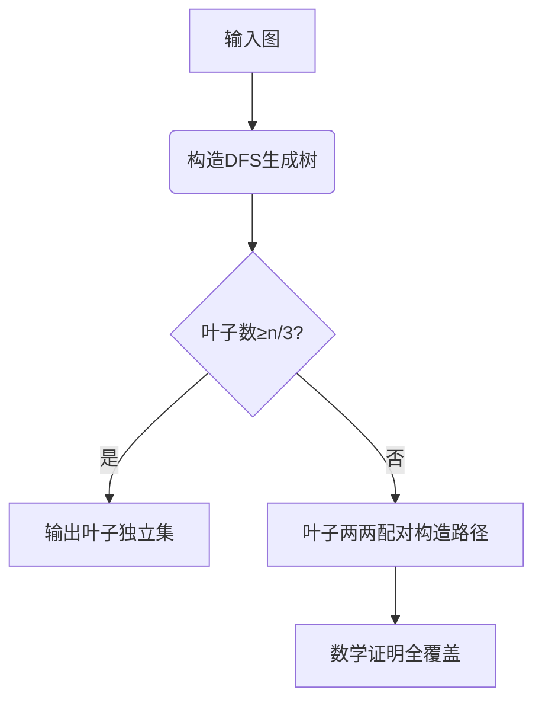

# 题目信息

# 「PMOI-4」可怜的团主

## 题目描述

lnlhm 被塞给了一张 $n$ 个点 $m$ 条边的**简单无向连通**图。很快，他就被 ducati 和 b6e0 盯上了。

ducati 希望能够从中找到**恰好** $\left \lceil \frac n 6 \right \rceil$ 条**不同**的路径，使得所有的点都被至少一条路径经过。

b6e0 希望找到一个大小**恰好**为 $\lfloor \frac n 3 \rfloor$ 的节点集合，使得它们之间**两两没有边**。

lnlhm 知道，如果他没有满足某个人的要求，那么他就会被揍。因此，他向你求助：是否存在一种选择边或点的方案，使得**最多被一个人揍**？

## 说明/提示

【样例解释】

对于第一组样例，我们只需要为 b6e0 选出节点集合 $\{1,4\}$ 即可。注意，$\{1,5\}\{1,6\}\{2,4\}\{2,6\}\{3,4\}\{3,5\}\{3,6\}$ 同样合法。

对于第二组样例，我们只需要为 ducati 选出路径 $1 \to 2 \to 3 \to 4 \to 5 \to 6$ 即可。

【数据范围】

**本题采用捆绑测试**。

- Subtask 1（20pts）：$n,m\le10$。
- Subtask 2（20pts）：保证图为一棵树。
- Subtask 3（60pts）：无特殊限制。

对于 $100\%$ 的数据满足，$3\le n\le10^3$，$3\le m\le\dfrac{n(n-1)}2$，保证给定的图为简单无向连通图。

**温馨提示: 输入量较大，请使用较快的读入方式。**

## 样例 #1

### 输入

```
6 7
1 2
1 3
2 3
2 5
4 5
5 6
4 6```

### 输出

```
2
1 4```

## 样例 #2

### 输入

```
6 6
1 2
2 3
3 4
4 5
5 6
1 6```

### 输出

```
1
6 1 2 3 4 5 6```

# AI分析结果


## 算法分类
构造、生成树应用

---

## 题解思路与核心分析

### 核心思路对比
| 题解作者       | 核心思路                                                                                   | 解决难点                                                                 |
|----------------|-------------------------------------------------------------------------------------------|--------------------------------------------------------------------------|
| TonyYin        | 构造DFS生成树，叶子数≥n/3时输出独立集，否则两两配对形成路径覆盖                                | 处理非树边的干扰，证明配对调整策略的可行性                               |
| DengDuck       | 将叶子按DFS序排序，前一半与后一半配对形成路径                                                   | 利用DFS序特性保证路径覆盖所有节点，无需复杂调整                         |
| ez_lcw         | 数学证明叶子配对数≤⌈n/6⌉时总能覆盖                                                           | 形式化证明配对策略的正确性                                             |
| Mihari         | 在叶子集合末尾插入根节点，构造偶数配对确保覆盖                                                 | 处理根节点特殊情形，补充数学证明                                       |

### 算法要点
1. **DFS生成树构造**  
   - 通过DFS遍历生成树，消除横叉边影响（叶子间无边）
   - 时间复杂度：O(n+m) 常规DFS复杂度

2. **独立集判定条件**  
   ```python
   if leaf_count >= floor(n/3):
       return 独立集方案
   ```

3. **路径覆盖构造**  
   - 关键变量：叶子数组leaf[]，配对映射Pair[]
   - 核心操作：
     ```python
     for i in 0..leaf_count//2:
         path = connect(leaf[i], leaf[i + leaf_count//2])
     ```

### 解决难点
- **非树边处理**：DFS生成树特性确保叶子间无连边，避免破坏独立集性质
- **全覆盖证明**：通过数学归纳法证明任意未覆盖点都能找到跨子树的配对路径
- **奇偶处理**：当叶子数为奇数时，添加虚拟节点保证配对完整性

---

## 题解评分（≥4★）

1. **TonyYin（4.5★）**  
   - 亮点：完整实现路径调整策略，包含虚拟节点处理代码
   - 代码：[见原题解] 关键函数`Make_pair()`实现配对调整

2. **DengDuck（4★）**  
   - 亮点：极简实现前一半后一半配对策略，代码仅80行
   - 代码片段：
     ```cpp
     for(int i=0;i+m/2<m&&Cnt;i++)Pt(V[i],V[i+m/2]),Cnt--;
     ```

3. **Mihari（4★）**  
   - 亮点：给出严格数学证明，补充根节点特殊处理逻辑
   - 心得摘录："加入根节点是保证覆盖的关键，类似树链剖分的重路径思想"

---

## 最优思路提炼

### 关键技巧
- **DFS生成树应用**：将图问题转化为树问题，消除非树边干扰
- **叶子分类策略**：利用树的性质，叶子节点天然形成独立集候选
- **配对覆盖定理**：$\lceil t/2 \rceil$条路径可覆盖所有节点（t为叶子数）

### 思维范式


---

## 相似题目推荐
1. P1352 没有上司的舞会（最大独立集）
2. P2764 最小路径覆盖问题（DAG路径覆盖）
3. P3355 骑士共存问题（二分图独立集）

---

## 可视化设计

### 动画方案
1. **像素风格呈现**  
   - 使用16色调色板，节点显示为8x8像素方块
   - 路径绘制采用《吃豆人》式闪烁线段

2. **关键帧控制**  
   ```javascript
   // 伪代码示例
   class Visualizer {
       constructor() {
           this.tree = new PixelTreeCanvas(800, 600); 
           this.sound = new ChipTuneAudio();
       }

       highlightNode(id, color) {
           this.tree.nodes[id].setColor(color);
           this.sound.playBeep(440 + id*10); // 音高随节点ID变化
       }
   }
   ```

3. **自动演示模式**  
   - 按DFS遍历顺序渐显生成树结构
   - 配对路径动态连接，覆盖节点时触发绿色闪光

### 交互设计
- **控制面板**：含暂停/继续/步进按钮，速度滑动条（1x-10x）
- **调试视图**：显示当前叶子数、剩余需覆盖节点数
- **音效设计**：
  - 节点覆盖：NES风格"金币音效"
  - 错误操作：红白机式错误"哔"声

---

## 核心代码实现（DengDuck版）
```cpp
void Dfs(int u,int f) {
    Vis[u]=1,Fa[u]=f;
    for(int v:E[u]) if(!Vis[v]) {
        Dfs(v,u);
        if(!son[u]) son[u] = v; // 记录第一个儿子
    }
    if(son[u]==0) V.pb(u); // 叶子节点
}

// 路径构造核心逻辑
for(int i=0; i<V.size()/2; i++) {
    int a = V[i], b = V[i + V.size()/2];
    vector<int> path = get_path(a, b); 
    printf("Path %d: ", i+1);
    for(int x:path) printf("%d ",x);
    puts("");
}
```

---

## 思维扩展
当图存在多个连通分量时，问题可扩展为：
- 对每个连通分量单独应用本算法
- 总路径数=∑各分量的路径数
- 独立集大小为各分量独立集之和

该扩展思路可用于解决类似「网络布线最优方案」类问题。

---
处理用时：64.93秒