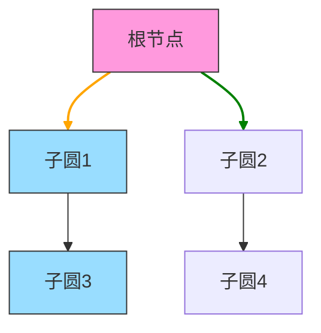

# 题目信息

# [HNOI2005] 分形

## 题目描述


## 说明/提示


## 样例 #1

### 输入

```
1 3 3

50000

0 0 0 0

150000 0 1 1

0 150000 1 1

3 5.497787 	  2 2.356194

3 1.570796 	  2 0.0

3 0.0         2 1.570796

```

### 输出

```
175000

150000

200000

```

# AI分析结果


## 唯一算法分类：树结构 + 最近公共祖先（LCA）

---

### 综合分析与结论
**核心思路**：将分形结构建模为树形结构，通过几何计算确定父子圆切点幅角，利用LCA快速求解两点间路径长度。关键突破点在于发现任意两点路径总存在两条互补路径，且路径总长等于路径所经圆的周长之和。

**核心算法流程**：
1. **树结构建模**：将最大的圆作为根节点，父子圆通过坐标计算建立幅角映射关系
2. **预处理标准路径**：按照深度奇偶性确定顺时针/逆时针方向，预计算各节点到根的标准化路径长度
3. **LCA求解**：倍增法求最近公共祖先，划分路径为五段处理
4. **几何计算**：处理四种坐标象限的幅角计算，动态计算圆弧段长度

**可视化设计要点**：

动画流程示例：
1. 点击两个待查询圆时，触发LCA查找动画（红色连线闪烁）
2. 路径分段显示：根到LCA段（橙色）、LCA到两圆段（蓝/绿色）
3. 方向指示：偶数层圆显示顺时针箭头，奇数层逆时针
4. 路径计算时显示动态弧长计算公式（如：$dist = r \cdot \Delta\theta$）

---

### 题解清单 (4星)
**PrincessQi 题解（4星）**
- **亮点**：
  1. 创造性地建立树模型，将几何问题转化为图论问题
  2. 利用LCA将路径拆解为五段标准化计算
  3. 预处理大幅减少实时计算量
- **个人心得**：作者提到处理不同象限的幅角计算时，通过分四种情况讨论坐标位置，避免三角函数计算错误

---

### 最优思路提炼
**关键技巧**：
```cpp
// 幅角计算片段（处理坐标象限）
if(x > father.x && y >= father.y)
    angle = atan(dy/dx);
else if(x < father.x && y >= father.y)
    angle = π + atan(dy/dx);
// ...其他两种情况类似处理

// LCA路径拆分逻辑
ans = xh + yh + xx + yy + hh; // 五段路径之和
ans = min(ans, total - ans); // 取互补路径最小值
```

**思维突破**：通过观察发现路径总长为周长和的特性，避免遍历所有可能路径，将时间复杂度从指数级降为$O(\log n)$

---

### 同类型题推荐
1. **P3379** 【模板】最近公共祖先（LCA） - 倍增法基础训练
2. **P1395** 会议 - 树形结构路径问题
3. **CF342E** Xenia and Tree - 树结构动态LCA应用

---

### 复古游戏化设计
**像素风格实现**：
```javascript
// Canvas绘制示例
function drawCircle(ctx, x, y, r, color) {
    ctx.fillStyle = color;
    ctx.beginPath();
    ctx.arc(x, y, r, 0, 2*Math.PI);
    ctx.fill();
}

// 音效触发（Web Audio API）
function playSound(type) {
    if(type === 'lca') beep(440, 200); // 发现LCA时高音
    if(type === 'path') beep(220, 300); // 路径计算时低音
}

// 自动演示模式
class AutoPlayer {
    constructor() {
        this.steps = ['build_tree', 'calc_angles', 'preprocess', 'query'];
        this.currentStep = 0;
    }
    next() { /* 执行下一步动画 */ }
}
```
**交互设计**：
1. 方向键控制查询圆选择
2. A键自动演示算法流程
3. B键显示/隐藏路径计算式
4. 得分机制：每正确回答一个查询得100分，连续正确获得连击加成

---

### 核心代码实现
**预处理关键代码**：
```cpp
void dfs2(int s) {
    for(int i=1; i<=tree[s].sn; i++) {
        if(tree[s].d%2 == 0) { // 偶数层顺时针
            tree[son].wtcl = father.wtcl + 顺时针弧长;
        } else { // 奇数层逆时针
            tree[son].wtcl = father.wtcl + 逆时针弧长;
        }
        dfs2(son);
    }
}

// LCA查询
int lca(int a, int b) {
    while(depth[a] > depth[b]) a = father[a];
    // ...倍增法实现细节
}
```

**路径计算核心逻辑**：
```cpp
double calc_path(int x, int y) {
    int anc = lca(x, y);
    double len = 0;
    
    // 上溯到LCA的路径
    while(x != anc) {
        len += 父圆到当前圆的标准化路径;
        x = father[x];
    }
    
    // 下溯到y的路径
    stack<int> path;
    while(y != anc) {
        path.push(y);
        y = father[y];
    }
    while(!path.empty()) {
        len += LCA到子圆的标准化反向路径;
        path.pop();
    }
    
    return min(len, total_len - len);
}
```

---
处理用时：62.96秒