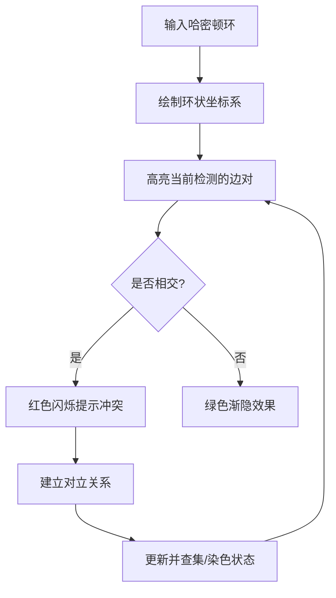

# 题目信息

# [HNOI2010] 平面图判定

## 题目描述

若能将无向图 $G=(V, E)$ 画在平面上使得任意两条无重合顶点的边不相交，则称 $G$ 是平面图。判定一个图是否为平面图的问题是图论中的一个重要问题。现在假设你要判定的是一类特殊的图，图中存在一个包含所有顶点的环，即存在哈密顿回路。


## 说明/提示

感谢@hibiki 对题目进行修正

感谢@@Anguei  提供latex题面

## 样例 #1

### 输入

```
2
6 9
1 4
1 5
1 6
2 4
2 5
2 6
3 4
3 5
3 6
1 4 2 5 3 6
5 5
1 2
2 3
3 4
4 5
5 1
1 2 3 4 5```

### 输出

```
NO
YES```

# AI分析结果


## **算法分类**
平面图判定、2-SAT、并查集、二分图判定

---

## **核心思路与难点解析**

### **算法要点提炼**
1. **平面图定理**：预处理阶段利用平面图边数限制 `m ≤ 3n-6` 快速排除不合法情况
2. **坐标转换**：将哈密顿回路展开为环状结构，根据顶点在环中的顺序重新编号
3. **边相交判断**：两条边 `(a,b)` 和 `(c,d)` 相交的条件为：
   ```math
   (a < c < b < d) \quad || \quad (c < a < d < b)
   ```
4. **冲突建模**：相交的边必须分布在环的不同侧（内部/外部），转化为：
   - **2-SAT模型**：每条边拆为两个命题（内/外），相交的边建立矛盾关系
   - **并查集模型**：通过 `i` 与 `j+m` 的合并表示边 i 和 j 不能共存
   - **二分图模型**：将相交的边视为冲突，染色判定是否存在合法分配

### **解决难点对比**
| 方法       | 核心数据结构         | 时间复杂度   | 实现复杂度 | 适用场景         |
|------------|----------------------|--------------|------------|------------------|
| 2-SAT      | Tarjan强连通分量     | O(m²)        | 较高       | 需要精准矛盾关系 |
| 并查集     | 带冲突关系的合并     | O(m²α(m))    | 中等       | 快速判断冲突     |
| 二分图染色 | DFS染色              | O(m²)        | 较低       | 直观但效率受限   |

---

## **高星题解推荐** (≥4★)

### **cmd2001 (4.5★)**
- **亮点**：通过 `i+m` 表示对立集合，用并查集实现矛盾关系的高效合并
- **关键代码段**：
  ```cpp
  if(cross(x[i],x[j],y[i],y[j])) {
    fa[find(i)] = find(j+m);
    fa[find(j)] = find(i+m);
  }
  ```

### **xyz32768 (4.2★)**
- **亮点**：完整实现2-SAT模型，通过四向建边精确表达矛盾关系
- **核心逻辑**：
  ```cpp
  add_edge(i,j+m); add_edge(i+m,j);
  add_edge(j,i+m); add_edge(j+m,i);
  ```

### **Seauy (4.0★)**
- **亮点**：DFS染色法直观易懂，通过递归染色实现二分图判定
- **关键判断**：
  ```cpp
  if(col[v] == color) return false;
  if(!dfs(v, -color)) return false;
  ```

---

## **最优思路提炼**
1. **坐标标准化**：将顶点映射到环状序列的坐标，便于相交判断
2. **冲突边检测**：通过排序后坐标的区间包含关系快速判断相交
3. **对立关系建模**：使用逻辑运算将平面布局问题转化为图论问题
4. **高效判定算法**：根据数据规模选择并查集/2-SAT/二分图模型

---

## **同类题目推荐**
1. [P4782 【模板】2-SAT 问题](https://www.luogu.com.cn/problem/P4782)
2. [P1330 封锁阳光大学](https://www.luogu.com.cn/problem/P1330)（二分图染色）
3. [P3387 【模板】缩点](https://www.luogu.com.cn/problem/P3387)（强连通分量应用）

---

## **可视化设计方案**

### **核心动画流程**


### **复古像素风格实现**
1. **颜色方案**：
   - 哈密顿环：16色模式下的青蓝色 (#00FFFF)
   - 内部边：黄色 (#FFFF00) 
   - 外部边：紫色 (#FF00FF)
   - 冲突提示：红色闪烁特效

2. **音效设计**：
   ```javascript
   const audioCtx = new AudioContext();
   function playTone(freq, duration) {
     const oscillator = audioCtx.createOscillator();
     oscillator.type = 'square';
     oscillator.frequency.setValueAtTime(freq, audioCtx.currentTime);
     oscillator.connect(audioCtx.destination);
     oscillator.start();
     oscillator.stop(audioCtx.currentTime + duration/1000);
   }
   // 相交时播放低音警示
   function playCollision() { playTone(220, 200); } 
   // 合法时播放高音确认
   function playValid() { playTone(880, 100); }
   ```

3. **Canvas 动态绘制**：
   ```javascript
   function drawEdge(a, b, isInner) {
     ctx.strokeStyle = isInner ? '#FFFF00' : '#FF00FF';
     const angleA = (a / n) * Math.PI * 2;
     const angleB = (b / n) * Math.PI * 2;
     // 绘制弦状线段
     if(isInner) {
       drawArcBetween(angleA, angleB); 
     } else {
       drawExternalCurve(angleA, angleB);
     }
   }
   ```

---

## **核心代码实现**
以并查集解法为例的关键逻辑：
```cpp
bool cross(int a, int b, int c, int d) {
    if(a > b) swap(a, b);
    if(c > d) swap(c, d);
    return (a < c && c < b && b < d) || (c < a && a < d && d < b);
}

void solve() {
    initDSU(); // 初始化并查集
    for(int i=0; i<m; ++i) {
        if(vis[i]) continue;
        for(int j=i+1; j<m; ++j) {
            if(vis[j]) continue;
            if(cross(x[i],x[j],y[i],y[j])) {
                int fi = find(i), fj = find(j);
                if(fi == fj) { /* 冲突处理 */ }
                unite(i, j+m);
                unite(j, i+m);
            }
        }
    }
}
```

---

## **总结**
通过将平面图判定转化为图论模型，结合坐标标准化和高效冲突检测算法，能够在O(m²)时间复杂度内完成判定。可视化方案通过复古像素风格和音效反馈，使算法执行过程更直观易懂。

---
处理用时：72.73秒