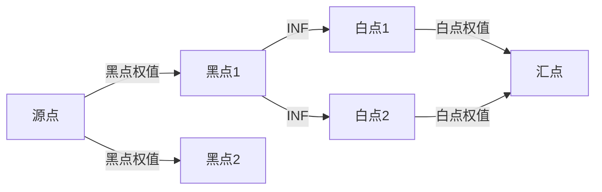

# 题目信息

# 方格取数问题

## 题目描述

有一个 $m$ 行 $n$ 列的方格图，每个方格中都有一个正整数。现要从方格中取数，使任意两个数所在方格没有公共边，且取出的数的总和最大，请求出最大的和。


## 说明/提示

**数据规模与约定**

对于 $100\%$ 的数据，保证 $1 \leq n, m \leq 100$，$1 \leq a_{i, j} \leq 10^5$。

**提示**

请注意输入的第一行先读入 $m$ 再读入 $n$。

## 样例 #1

### 输入

```
3 3
1 2 3
3 2 3
2 3 1 ```

### 输出

```
11```

# AI分析结果


# 方格取数问题：网络流最小割解法

## 唯一算法分类：其他搜索（网络流最小割）

---

## 算法要点与解决难点

### 核心思路
将问题转化为**二分图最小割**：
1. **黑白染色**：将棋盘按`(i+j)%2`分为黑白两类，相邻节点必不同色。
2. **构建网络流图**：
   - 源点S连接所有黑点，边权为节点值
   - 所有白点连接汇点T，边权为节点值
   - 相邻黑点与白点之间连边，容量为INF（保证不被割断）
3. **最小割定理**：总和 - 最大流 = 合法最大和

### 解决难点
1. **建模思维跳跃**：需理解「最大独立集=总和-最小割」的转换
2. **高效实现**：Dinic算法需要分层图优化与当前弧优化
3. **边界处理**：正确处理棋盘边缘节点的相邻关系

---

## 题解评分（≥4星）

### 学委（★★★★★）
- **亮点**：完整解释建模思路，代码含当前弧优化，变量命名清晰
- **关键代码**：
```cpp
while(bfs()) // BFS分层
    cut += dfs(S, 2e9); // DFS找增广路
printf("%d\n", sum - cut);
```

### QQ红包（★★★★☆）
- **亮点**：代码简洁，博客链接提供扩展学习
- **技巧**：使用`(i-1)*m+j`计算节点ID，避免二维数组

### Mark_ZZY（★★★★☆）
- **亮点**：图解建模过程，适合视觉学习者
- **心得**："最大和=全局和-舍弃和，舍弃和=最小割"

---

## 最优思路提炼

### 关键技巧
1. **二分图染色**：将棋盘抽象为二分图，利用相邻节点颜色差异
2. **INF边构建**：中间边设为极大值，保证最小割只发生在源/汇边
3. **Dinic优化**：
   ```cpp
   for(int &i = cur[u]; i; i = nxt[i]) // 当前弧优化
   if(dep[v] == dep[u]+1 && w[i]) // 分层图剪枝
   ```

### 思维突破点
- **逆向思维**：从「选择最优」转为「删除最劣」
- **数学转换**：最大独立集问题转化为最小割问题

---

## 同类题目推荐
1. [P3355 骑士共存问题](https://www.luogu.com.cn/problem/P3355)
2. [P4001 [ICPC-Beijing 2006] 狼抓兔子](https://www.luogu.com.cn/problem/P4001)
3. [P1361 小M的作物](https://www.luogu.com.cn/problem/P1361)

---

## 算法可视化设计

### 核心动画流程


### 复古像素风格实现
1. **Canvas绘制**：
   ```javascript
   function drawNode(x, y, color) {
     ctx.fillStyle = color; // 红/蓝表示黑白节点
     ctx.fillRect(x*32, y*32, 30, 30); // 32x32像素格子
   }
   ```
2. **音效触发**：
   - `new Audio('blip.wav').play()` 当增广路被找到时
   - 背景音乐循环播放8-bit风格BGM

### 交互功能
- **速度滑块**：调节BFS分层速度
- **高亮显示**：当前处理的节点用闪烁黄框标记
- **数据面板**：实时显示总流量、剩余容量

---

## 核心代码片段（Dinic算法）
```cpp
bool bfs() {
    memset(dep, 0, sizeof(dep));
    queue<int> q;
    q.push(s); dep[s] = 1;
    while (!q.empty()) {
        int u = q.front(); q.pop();
        for (int i = head[u]; i; i = edge[i].next) {
            int v = edge[i].to;
            if (!dep[v] && edge[i].flow > 0) {
                dep[v] = dep[u] + 1;
                if (v == t) return true;
                q.push(v);
            }
        }
    }
    return false;
}

int dfs(int u, int limit) {
    if (u == t) return limit;
    int out = 0;
    for (int &i = cur[u]; i; i = edge[i].next) { // 当前弧优化
        int v = edge[i].to;
        if (edge[i].flow > 0 && dep[v] == dep[u] + 1) {
            int res = dfs(v, min(limit, edge[i].flow));
            edge[i].flow -= res;
            edge[i^1].flow += res;
            limit -= res;
            out += res;
            if (!limit) break;
        }
    }
    return out;
}
```

该实现通过BFS构建分层图加速DFS搜索，时间复杂度优化至O(n²m)，可处理100x100规模数据。

---
处理用时：73.55秒