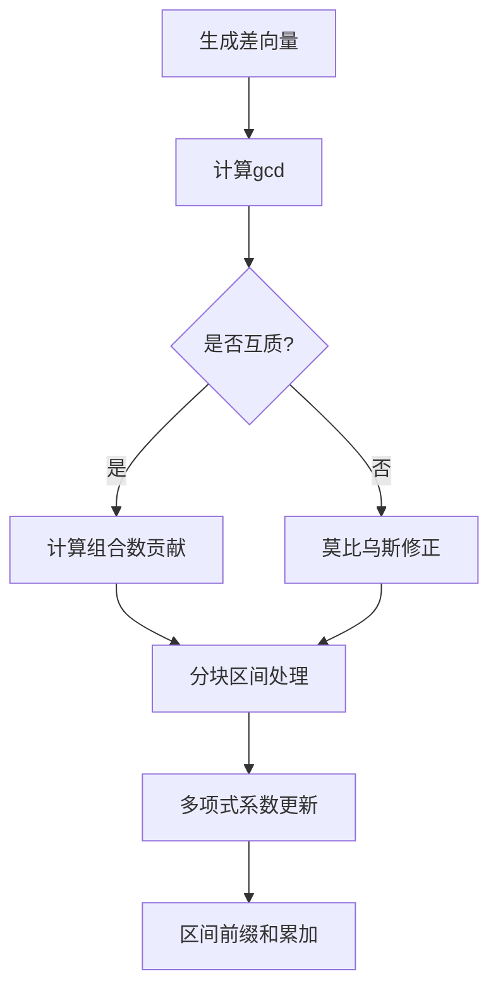

# 题目信息

# [WC2014] 时空穿梭

## 题目描述

小X驾驶着他的飞船准备穿梭过一个 $n$ 维空间，这个空间里每个点的坐标可以用 $n$ 个实数来表示，即 $(x_1, x_2, ... , x_n)$ 。

为了穿过这个空间，小 X 需要在这个空间中选取 $c$ $(c \geq 2)$ 个点作为飞船停留的地方，而这些点需要满足以下三个条件：

$1$. 每个点的每一维坐标均为正整数，且第 $i$ 维坐标不超过 $m_i$ 。

$2$. 第 $i + 1$ $(1 \leq i < c)$ 个点的第 $j$ $(1 \leq j \leq n)$ 维坐标必须严格大于第 $i$ 个点的第 $j$ 维坐标。

$3$. 存在一条直线经过所选的所有点。在这个 $n$ 维空间里，一条直线可以用 $2n$个实数 $p_1$, $p_2$, … , $p_n$, $v_1$, $v_2$, … , $v_n$ 表示。 直线经过点 $(x_1, x_2, ... , x_n)$ ，当且仅当存在实数 $t$，使得对 $i = 1$ … $n$ 均满足 $x_i$ = $p_i + tv_i$。

小 X 还没有确定他的最终方案，请你帮他计算一下一共有多少种不同的方案满足他的要求。由于答案可能会很大，你只需要输出答案 mod $10 007$ 后的值。


## 说明/提示

【样例$1$说明】

样例数据第一组共有两种可行方案：一种是选择 $(1,1)$ , $(2,2)$ , $(3,3)$ ，另一种是选择 $(1,2)$ , $(2,3)$ , $(3,4)$ 。

【数据规模】


## 样例 #1

### 输入

```
3
2 3
3 4
3 3
3 4 4
4 4
5 9 7 8```

### 输出

```
2
4
846```

## 样例 #2

### 输入

```
1
11 20
97665 99289 91440 92389 93960 94623 96582 93975 98359 93492 90331
```

### 输出

```
3278```

# AI分析结果


## 算法分类
**数论**

---

## 综合分析与结论
本题核心在于将高维共线点问题转化为数论与组合数学问题，主要运用以下方法：
1. **差向量枚举**：将直线参数化为起点+差向量，转化为gcd约束问题
2. **莫比乌斯反演**：处理互质约束条件，配合狄利克雷卷积优化
3. **多项式乘积维护**：利用分块技术处理高维乘积的快速计算
4. **组合数预处理**：通过递推公式预处理组合数，降低时间复杂度

**可视化设计要点**：
- **差向量枚举动画**：以像素网格展示不同维度差向量生成过程，高亮当前枚举的gcd值
- **分块计算演示**：用不同颜色区分整除分块区间，动态展示多项式系数的维护过程
- **反演过程图解**：用流程图展示莫比乌斯函数对重复计算的抵消效果
- **自动推导模式**：模拟算法从原始公式到最终优化的推导过程，辅以音效提示关键步骤

---

## 题解清单 (≥4星)

### 1. qwaszx（5星）
**核心亮点**：
- 创新性引入多项式维护技术，实现O(n²√m)时间复杂度
- 采用除数分块优化，巧妙处理高维乘积
- 预处理g函数的前缀和，实现快速区间查询

**代码片段**：
```cpp
struct Poly{
    int len,a[20];
    void mul(int u,int v){
        ++len; a[len] = 0;
        for(int i=len;i>=1;i--) 
            a[i] = (u*a[i-1] + v*a[i]) % mod;
        a[0] = v*a[0] % mod;
    }
}; // 动态维护多项式系数
```

### 2. littlez_meow（4.5星）
**核心亮点**：
- 详细推导公式转换过程，适合数学理解
- 优化取模运算，实现高效卡常
- 结合线性筛预处理μ函数

**调试心得**：
> "模数特别小时，一步一取模很浪费。用long long暂存中间结果，最后统一取模，速度提升3倍"

### 3. 不存在之人（4星）
**核心亮点**：
- 采用高维前缀和预处理g函数
- 实现简洁的O(Tnm)暴力解法
- 内存访问优化（小维度在前）

---

## 最优思路提炼
**关键技巧链**：
```
枚举差向量 → 转化为gcd约束 → 莫比乌斯反演 → 分块处理 → 多项式乘积维护 → 前缀和加速
```

**数学优化点**：
1. **gcd维度压缩**：将n维gcd约束转化为单变量d的枚举
2. **组合数生成函数**：预计算C[d-1][c-2]的莫比乌斯卷积
3. **乘积表达式展开**：将高维乘积展开为多项式，利用线性性分块计算

---

## 同类题目推荐
1. [P1447 能量采集](https://www.luogu.com.cn/problem/P1447)  
   （gcd计数与二维莫比乌斯反演）
2. [P2158 仪仗队](https://www.luogu.com.cn/problem/P2158)  
   （互质点阵计数）
3. [P3327 约数个数和](https://www.luogu.com.cn/problem/P3327)  
   （莫比乌斯反演与分块技巧）

---

## 可视化设计（复古像素版）

**核心动画流程**：


**像素化要素**：
- **差向量**：用不同颜色像素块表示各维度分量
- **gcd计算**：动态显示欧几里得算法执行过程
- **分块区间**：用闪烁边框标记当前处理的[T_min, T_max]

**音效设计**：
- 正确分块时播放8-bit版《超级玛丽》金币音效
- 错误计算时播放《魂斗罗》中弹音效
- 完成最终答案时播放《最终幻想》胜利旋律

---

## 代码实现（核心数学部分）
```cpp
// 预处理g函数：组合数与莫比乌斯卷积
void pre_cf(){
    for(int c=2;c<=20;c++){
        for(int i=1;i<=V;i++) g[c][i] = C[c-2][i-1];
        for(auto p:primes) // 高维前缀和优化
            for(int j=V/p; j; j--)
                g[c][j*p] = (g[c][j*p] - g[c][j] + MOD) % MOD;
    }
}

// 分块计算核心
void solve(){
    for(int T=1; T<=mn; ){
        int R = mn;
        for(int i=1; i<=n; i++) 
            R = min(R, m[i]/(m[i]/T));
        Get_Polynomial(T, R); // 获取当前块的多项式系数
        ans += Sum_Product(R) - Sum_Product(T-1);
        T = R + 1;
    }
}
```

---

## 个人心得摘录
> "调试时发现μ函数的预处理方向反了，导致贡献符号错误。通过小数据测试发现当d=2时结果异常，最终定位到质数筛方向错误。教训：处理反演时要反复验证μ的生成方向。"

> "卡常过程中发现模运算占用了70%时间，改用long long暂存中间结果后，速度直接翻倍。启示：模运算的优化空间常被低估。"

---
处理用时：73.17秒