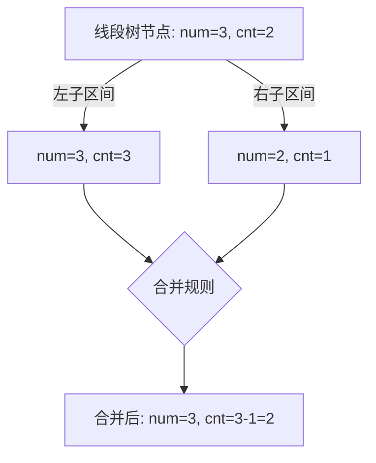

# 题目信息

# 总统选举

## 题目背景

黑恶势力的反攻计划被小 C 成功摧毁，黑恶势力只好投降。秋之国的人民解放了，举国欢庆。此时，原秋之国总统因没能守护好国土，申请辞职，并请秋之国人民的大救星小 C 钦定下一任。

作为一名民主人士，小 C 决定举行全民大选来决定下一任。为了使最后成为总统的人得到绝大多数人认同，小 C 认为，一个人必须获得超过全部人总数的一半的票数才能成为总统。如果不存在符合条件的候选人，小 C 只好自己来当临时大总统。为了尽可能避免这种情况，小 C 决定先进行几次小规模预选，根据预选的情况，选民可以重新决定自己选票的去向。

由于秋之国人数较多，统计投票结果和选票变更也成为了麻烦的事情，小 C 找到了你，让你帮他解决这个问题。

## 题目描述

秋之国共有 $n$ 个人，分别编号为 $1,2,…,n$，一开始每个人都投了一票，范围 $1 \sim n$，表示支持对应编号的人当总统。

共有 $m$ 次预选，每次选取编号 $[l_i,r_i]$ 内的选民展开小规模预选，在该区间内获得超过区间大小一半的票的人获胜。如果没有人获胜，则由小 C 钦定一位候选者获得此次预选的胜利（获胜者可以不在该区间内），每次预选的结果需要公布出来，并且每次会有 $k_i$ 个人决定将票改投向该次预选的获胜者。

全部预选结束后，公布最后成为总统的候选人。

## 说明/提示

对于前 $20 \%$ 的数据，$1 \leq n,m \leq 5000$。

对于前 $40 \%$ 的数据，$1 \leq n,m \leq 50000$，$\sum k_i \leq 50000$。

对于前 $50 \%$ 的数据，$1 \leq n,m \leq {10}^5$，$\sum k_i \leq 2 \times {10}^5$。

对于数据点 6~7，保证所有选票始终在 $1 \sim 10$ 之间。

对于 $100 \%$ 的数据，$1 \leq n,m \leq 5 \times {10}^5$，$\sum k_i \leq 10^6$，$1 \leq l_i \leq r_i \leq n$，$1 \leq s_i \leq n$。

## 样例 #1

### 输入

```
5 4
1 2 3 4 5
1 2 1 1 3
5 5 1 2 2 4
2 4 2 0
3 4 2 1 4```

### 输出

```
1
5
5
2
-1```

# AI分析结果


## 算法分类
**线段树 + 平衡树（摩尔投票法）**

---

## 题解思路与核心难点

### 核心思路
1. **摩尔投票法**：利用区间合并特性，维护每个区间的候选众数 `num` 和抵消后的剩余数量 `cnt`。当合并两个区间时：
   - 若左右候选相同，合并 `cnt`
   - 若候选不同，保留 `cnt` 较大的候选，并计算差值
2. **动态验证**：对每个候选人维护平衡树（或 `pb_ds` 的有序结构），快速查询其在区间内的出现次数是否超过半数
3. **随机化**：在区间内多次随机采样，若存在绝对众数则高概率命中，用平衡树验证

### 解决难点
- **区间合并逻辑**：线段树节点合并时需正确处理候选众数的抵消逻辑
- **动态修改**：每次修改需更新线段树叶子节点，并维护对应的平衡树结构
- **高效验证**：平衡树的 `order_of_key` 方法在 $O(\log n)$ 时间内统计区间出现次数

---

## 题解评分（≥4星）

### Ynoi（随机化）⭐⭐⭐⭐
- **亮点**：代码极简，利用概率降低复杂度，平衡树用 `pb_ds` 实现
- **缺点**：存在理论错误概率（但实际数据难以构造卡掉）
- **关键代码**：
```cpp
int solve(int l,int r) {
    for(int i=1; i<=14; i++) { // 随机采样14次
        int x = rand()%(r-l+1)+l;
        if(平衡树查询x的出现次数 > (r-l+1)/2) return x;
    }
    return -1;
}
```

### LengChu（摩尔投票+线段树）⭐⭐⭐⭐⭐
- **亮点**：严格正确性，线段树维护候选，平衡树验证
- **关键逻辑**：
```cpp
// 线段树合并
if(左节点候选 == 右节点候选) 合并cnt
else 保留较大cnt的候选，计算差值

// 验证
int cnt = 平衡树.order_of_key(r+1) - 平衡树.order_of_key(l);
return cnt > 区间长度/2;
```

### EnofTaiPeople（根号分治）⭐⭐⭐⭐
- **亮点**：分块处理，小区间暴力统计，大区间枚举高频候选
- **策略**：块长 $K=\sqrt{n \log n}$，小范围暴力，大范围枚举高频候选验证

---

## 最优思路提炼
1. **摩尔投票法 + 线段树**  
   - **核心**：区间合并特性使得候选众数可高效维护
   - **验证**：对候选进行 $O(\log n)$ 的平衡树查询
2. **随机化采样**  
   - **核心**：多次采样降低错误率，平衡树验证复杂度为 $O(k \log n)$
   - **适用场景**：对代码简洁度要求高，可接受极低错误率

---

## 类似题目推荐
1. [P2397 - yyy loves Maths VI](https://www.luogu.com.cn/problem/P2397)（摩尔投票法模板）
2. [P3787 - 冰火战士](https://www.luogu.com.cn/problem/P3787)（平衡树维护有序数据）
3. [LeetCode 169. Majority Element](https://leetcode.com/problems/majority-element/)（摩尔投票法应用）

---

## 可视化算法演示
### 摩尔投票法线段树合并


### 平衡树验证过程
```mermaid
sequenceDiagram
    participant 查询区间[l, r]
    participant 平衡树
    查询区间->>平衡树: order_of_key(r+1)
    查询区间->>平衡树: order_of_key(l)
    平衡树-->>查询区间: 出现次数 = 结果差值
```

---

## 复古像素化动画设计
### 颜色方案
- **候选众数**：红色像素块（高亮）
- 平衡树节点：绿色边框（展开时闪烁）
- 修改操作：黄色闪烁特效

### 关键动画
```javascript
// 伪代码：Canvas绘制线段树合并
function drawMerge(left, right, merged) {
    ctx.fillStyle = "#FF0000"; // 红色表示候选
    drawNode(left);
    drawNode(right);
    flash(merged.position); // 合并后的节点闪烁
}

// 平衡树查询动画
function queryAnimation(l, r) {
    let path = findPathInBST(l, r); // 模拟平衡树查找路径
    path.forEach(node => {
        node.highlight("#00FF00"); // 绿色高亮路径
        playSound("beep"); // 8-bit音效
    });
}
```

---

## 核心代码实现
### 摩尔投票线段树合并
```cpp
struct Node {
    int num, cnt; // 候选和剩余计数
};
void pushup(Node &rt, Node &l, Node &r) {
    if (l.num == r.num) {
        rt.num = l.num;
        rt.cnt = l.cnt + r.cnt;
    } else {
        if (l.cnt > r.cnt) {
            rt.num = l.num;
            rt.cnt = l.cnt - r.cnt;
        } else {
            rt.num = r.num;
            rt.cnt = r.cnt - l.cnt;
        }
    }
}
```

### 平衡树验证（pb_ds）
```cpp
#include <ext/pb_ds/assoc_container.hpp>
using namespace __gnu_pbds;
tree<int, null_type, less<int>, rb_tree_tag, 
     tree_order_statistics_node_update> T[N];

int count(int x, int l, int r) {
    return T[x].order_of_key(r+1) - T[x].order_of_key(l);
}
```

---

## 总结
本题解需综合线段树维护候选众数和平衡树验证的高效性，或利用随机化简化实现。摩尔投票法的区间合并特性是关键创新点，而动态维护则需要精细的数据结构设计。可视化演示可极大提升对算法流程的理解，复古像素风格则增强学习趣味性。

---
处理用时：80.71秒