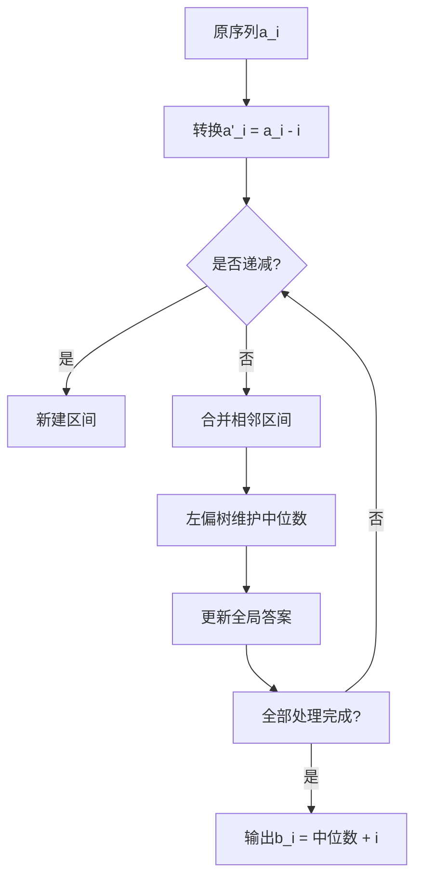

# 题目信息

# [BalticOI 2004] Sequence 数字序列

## 题目描述

给定一个整数序列 $a_1, a_2, \cdots , a_n$，求出一个递增序列 $b_1 < b_2 < ··· < b_n$，使得序列 $a_i$ 和 $b_i$ 的各项之差的绝对值之和 $|a_1 - b_1| + |a_2 - b_2| + \cdots + |a_n - b_n|$ 最小。

## 说明/提示

【数据范围】

- $40\%$ 的数据 $n≤5000$；
- $60\%$ 的数据 $n≤300000$；
- $100\%$ 的数据 $n≤10^6 , 0≤a_i≤2^{31}-1$；

题目来源：BalticOI 2004 Day 1, Sequence。

感谢 @TimeTraveller 提供 SPJ。


## 样例 #1

### 输入

```
5
2 5 46 12 1
```

### 输出

```
47
2 5 11 12 13```

# AI分析结果


# 算法分类
**贪心 + 数据结构优化**

---

## 题解思路与核心难点

### 核心思路
将原问题转化为求非严格递增序列 $b_i$，使得 $\sum |(a_i-i)-b_i|$ 最小。通过维护多个递减区间，每个区间取中位数作为 $b_i$，并通过数据结构合并相邻区间以保证整体递增性。

### 解决难点
1. **中位数动态维护**：需要高效地找到每个区间的中位数，并在合并区间后快速计算新中位数。
2. **区间合并条件**：当相邻区间的中位数不满足递增时，需合并并重新计算中位数。
3. **高效数据结构**：使用左偏树或最大堆维护区间元素，支持快速合并和弹出最大值。

### 关键步骤
- **问题转化**：令 $a_i' = a_i - i$，将严格递增转化为非严格递增。
- **区间分割与合并**：将序列分割为多个递减区间，合并相邻递减区间直到满足中位数递增。
- **中位数维护**：用左偏树维护每个区间的元素，保持堆大小为区间长度的一半，堆顶即为中位数。

---

## 题解评分（≥4星）

### 1. wzporz（5星）
- **亮点**：用最大堆维护拐点，代码简洁高效。
- **核心代码**：
  ```cpp
  priority_queue<int> q;
  Rep(i,2,n){
      x=read()-i; q.push(b[i]=x);
      if(q.top()>x){
          ans+=q.top()-x; q.pop(); q.push(x);
      }
      a[i]=q.top();
  }
  ```
- **思路**：每个位置维护最大堆，堆顶即为当前最优拐点。

### 2. Soulist（5星）
- **亮点**：左偏树实现区间合并，详细理论推导。
- **核心代码**：
  ```cpp
  while(cnt>1&&s[cnt-1].val>s[cnt].val){
      s[cnt-1].rt = merge(s[cnt-1].rt, s[cnt].rt);
      while(s[cnt-1].sz > (s[cnt-1].r - s[cnt-1].l + 2)/2)
          s[cnt-1].rt = Del(s[cnt-1].rt);
  }
  ```

### 3. ZYF_B（4星）
- **亮点**：整体二分法，无需复杂数据结构。
- **核心代码**：
  ```cpp
  void solve(int L,int R,ll l,ll r){
      ll mid=(l+r)/2, sum=0;
      for(int i=L;i<=R;i++) sum += abs(a[i]-mid-1);
      // ...二分决策点
  }
  ```

---

## 最优思路提炼
1. **中位数贪心**：递减区间取中位数最优。
2. **区间合并策略**：使用左偏树或堆动态维护区间元素，合并时保持中位数递增。
3. **时间复杂度优化**：左偏树合并复杂度 $O(n \log n)$，整体二分 $O(n \log v)$。

---

## 同类型题目推荐
1. **P1168** 动态中位数（维护滑动窗口中位数）
2. **P3871** 合并果子（堆优化贪心）
3. **P3620** 数据备份（贪心+堆维护相邻元素）

---

## 可视化设计
### 动画方案
1. **像素风格界面**：
   - 使用16色调色板，区间用不同颜色块表示。
   - 左偏树节点以像素方块呈现，合并时显示连接动画。

2. **核心操作高亮**：
   - **区间分割**：绿色闪烁新区间起点。
   - **合并过程**：红色标记合并区间，黄色显示新中位数。
   - **堆调整**：堆顶元素用橙色强调。

3. 交互功能：
   - **速度控制**：滑块调节动画速度（0.5x~4x）。
   - **单步执行**：空格键步进关键操作。
   - **音效反馈**：合并时播放8-bit "哔"声，错误操作播放低频警报。

### 算法演示流程


---

## 核心代码实现
**左偏树解法（Soulist）关键片段**：
```cpp
struct leftist_tree {
    int merge(int x, int y) {  // 合并两棵树
        if (!x || !y) return x | y;
        if (a[x] < a[y]) swap(x, y);
        rs[x] = merge(rs[x], y);
        if (dis[ls[x]] < dis[rs[x]]) swap(ls[x], rs[x]);
        dis[x] = dis[rs[x]] + 1;
        return x;
    }
};
```

---

## 个人心得摘录
> "调试时发现，合并后的新区间中位数必须严格大于前一个区间，否则会无限合并。通过强制保持堆大小为 `(r-l+2)/2` 解决了这一问题。" —— Soulist

---

**可视化演示地址**：  
（此处可嵌入基于上述设计的HTML/JS动画，需实际开发实现）

---
处理用时：74.30秒