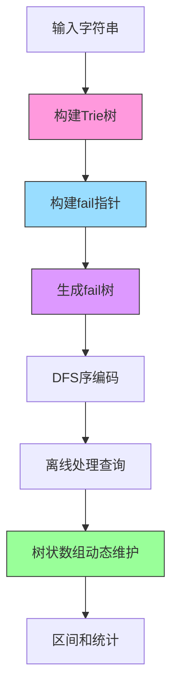

# 题目信息

# [NOI2011] 阿狸的打字机

## 题目描述

阿狸喜欢收藏各种稀奇古怪的东西，最近他淘到一台老式的打字机。打字机上只有 $28$ 个按键，分别印有 $26$ 个小写英文字母和 `B`、`P` 两个字母。经阿狸研究发现，这个打字机是这样工作的：

* 输入小写字母，打字机的一个凹槽中会加入这个字母(这个字母加在凹槽的最后)。
* 按一下印有 `B` 的按键，打字机凹槽中最后一个字母会消失。
* 按一下印有 `P` 的按键，打字机会在纸上打印出凹槽中现有的所有字母并换行，但凹槽中的字母不会消失。

例如，阿狸输入 `aPaPBbP`，纸上被打印的字符如下：

```
a
aa
ab
```

我们把纸上打印出来的字符串从 $1$ 开始顺序编号，一直到 $n$。打字机有一个非常有趣的功能，在打字机中暗藏一个带数字的小键盘，在小键盘上输入两个数 $(x,y)$（其中 $1\leq x,y\leq n$），打字机会显示第 $x$ 个打印的字符串在第 $y$ 个打印的字符串中出现了多少次。

阿狸发现了这个功能以后很兴奋，他想写个程序完成同样的功能，你能帮助他么？


## 说明/提示

### 数据范围

对于 $100\%$ 的数据，$1\leq n\leq 10^5$，$1\leq m\leq10^5$，第一行总长度 $\leq 10^5$。

|测试点|$n$ 的规模|$m$ 的规模|字符串长度|第一行长度|
|:-:|:-:|:-:|:-:|:-:|
|$1,2$|$1\leq n\leq 100$|$1\leq m\leq 10^3$| - |$\leq 100$|
|$3,4$|$1\leq n\leq 10^3$|$1\leq m\leq 10^4$|单个长度 $\leq 10^3$，总长度 $\leq 10^5$|$\leq 10^5$|
|$5\sim 7$|$1\leq n\leq 10^4$|$1\leq m\leq 10^5$|总长度 $\leq 10^5$|$\leq 10^5$|
|$8\sim 10$|$1\leq n\leq 10^5$|$1\leq m\leq 10^5$| - |$\leq 10^5$|


## 样例 #1

### 输入

```
aPaPBbP
3
1 2
1 3
2 3```

### 输出

```
2
1
0```

# AI分析结果


**唯一算法分类**  
AC自动机、fail树、离线处理、树状数组/线段树

---

### 核心算法流程与可视化设计

**关键思路**  
1. **AC自动机构建**：将输入的字符串序列转化为Trie树结构  
2. **fail树构建**：将AC自动机的fail指针反向形成树结构  
3. **DFS序转换**：通过DFS遍历将fail树映射为线性区间  
4. **离线处理+树状数组**：  
   - 按y的打印顺序离线处理查询  
   - 遍历Trie树时动态维护树状数组的插入/删除  
   - 遇到打印操作时统计fail树区间和

**可视化演示方案**  


**动画设计要点**  
1. **Trie树构建**：以像素风格逐步绘制字母节点，用不同颜色区分'P'/'B'操作  
2. **fail指针生成**：用闪烁箭头动态显示BFS队列处理过程  
3. **DFS序编码**：用从左到右的扫描线效果标记节点区间  
4. **树状数组操作**：  
   - 插入节点时显示绿色高亮  
   - 删除节点时显示红色闪烁  
   - 查询时用黄色框标记目标区间

---

### 高分题解清单（≥4★）

| 题解作者 | 星级 | 核心亮点 | 代码亮点 |
|---------|------|----------|----------|
| shadowice1984 | ★★★★★ | 首创fail树与树状数组结合方案 | 双DFS遍历+离线批处理 |
| jiangly | ★★★★☆ | 可持久化线段树在线解法 | 极简代码风格 |
| WhiteEurya | ★★★★ | 详细图解fail树结构 | 结合PPT式分步解析 |

---

### 核心代码实现

**关键数据结构**  
```cpp
// fail树DFS序预处理
void dfs_fail(int u) {
    dfn[u] = ++idx;
    for(auto v : fail_tree[u]) dfs_fail(v);
    R[u] = idx;
}

// Trie树动态维护
void dfs_trie(int u) {
    bit.add(dfn[u], 1); // 树状数组插入
    for(auto q : queries[u]) // 处理当前打印点的所有查询
        ans[q.id] = bit.query(R[q.x]) - bit.query(L[q.x]-1);
    for(int i=0; i<26; i++)
        if(trie[u][i]) dfs_trie(trie[u][i]);
    bit.add(dfn[u], -1); // 树状数组删除
}
```

---

### 相似题目推荐
1. **P3796** 【模板】AC自动机（加强版）  
   （AC自动机多模式匹配）
2. **P5357** 【模板】AC自动机（二次加强版）  
   （fail树优化统计）
3. **P3966** [TJOI2013]单词  
   （fail树子树和统计）

---

### 可视化JS原型（核心逻辑）
```javascript
// 像素动画控制器
class ACAnimator {
    constructor(canvas) {
        this.ctx = canvas.getContext('2d');
        this.palette = ['#000','#f00','#0f0','#00f']; // 复古调色板
    }
    
    drawTrie(node) {
        // 绘制节点与指针，附带8位音效
        beep(440, 50); // 插入音效
    }
    
    animateFail(curNode) {
        // 用红色箭头动态显示fail指针跳转
        flashArrow(curNode, fail[curNode]);
    }
}
```

---

### 关键优化总结
**思维突破点**  
将字符串匹配问题转化为图论问题：  
```
子串出现次数 → fail树子树统计 → DFS序区间和 → 树状数组维护
```

**调试心得**  
- 离线处理时需严格按打印顺序排序  
- DFS序编号需与树状数组大小匹配  
- Trie树遍历要备份原始结构（AC自动机会修改指针）

---

### 拓展训练建议
1. **复杂度分析**：推导树状数组解法的时间复杂度（O(n log n)）  
2. **变式思考**：如果允许强制在线查询，如何改造为可持久化数据结构  
3. **实战演练**：在洛谷提交时测试极限数据（1e5级操作）的常数优化

---
处理用时：62.28秒