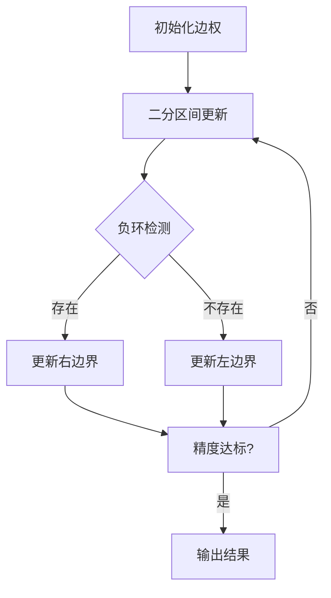

# 题目信息

# [HNOI2009] 最小圈

## 题目描述

考虑带权有向图 $G=(V,E)$ 以及 $w:E\rightarrow \R$，每条边 $e=(i,j)$（$i\neq j$，$i, j\in V$）的权值定义为 $w_{i,j}$。设 $n=|V|$。

$c=(c_1,c_2,\cdots,c_k)$（$c_i\in V$）是 $G$ 中的一个圈当且仅当 $(c_i,c_{i+1})$（$1\le i<k$）和 $(c_k,c_1)$ 都在 $E$ 中。称 $k$ 为圈 $c$ 的长度，同时记 $c_{k+1}=c_1$，并定义圈 $c=(c_1,c_2,\cdots,c_k)$ 的平均值为
$$
\mu(c)= \frac 1 k \sum\limits_{i=1}^{k} w_{c_i,c_{i+1}}
$$
即 $c$ 上所有边的权值的平均值。设 $\mu'(G)=\min_c\mu(c)$ 为 $G$ 中所有圈 $c$ 的平均值的最小值。

给定图 $G=(V,E)$ 以及 $w:E\rightarrow \R$，求出 $G$ 中所有圈 $c$ 的平均值的最小值 $\mu'(G)$。


## 说明/提示

对于 $100\%$ 的数据，$2\leq n\le 3000$，$1\leq m\le 10000$，$|w_{i,j}| \le 10^7$，$1\leq i, j\leq n$ 且 $i\neq j$。

------------
提示：本题存在 $O(nm)$ 的做法，但是 $O(nm\log n)$ 的做法也可以通过。

## 样例 #1

### 输入

```
4 5
1 2 5
2 3 5
3 1 5
2 4 3
4 1 3```

### 输出

```
3.66666667```

## 样例 #2

### 输入

```
2 2
1 2 -2.9
2 1 -3.1```

### 输出

```
-3.00000000```

# AI分析结果


# [HNOI2009] 最小圈 题解分析

## 唯一算法分类
0/1分数规划 + 负环检测

---

## 综合分析与结论

### 核心算法思路
通过二分答案将环平均值问题转化为负环检测问题：
1. 二分枚举平均值mid
2. 将边权转换为w_i - mid
3. 检测图中是否存在负环
4. 根据检测结果调整二分区间

### 关键难点对比
| 方法                  | 时间复杂度   | 核心难点                         | 适用场景           |
|-----------------------|-------------|----------------------------------|--------------------|
| Karp动态规划法        | O(nm)       | 递推公式推导与滚动数组实现       | 严格复杂度要求场景 |
| 二分+SPFA判负环       | O(nm logC) | 分数规划转化与负环检测优化       | 常规数据规模       |
| 二分+DFS-SPFA判负环   | O(nm logC) | 递归栈管理与剪枝优化             | 稀疏图场景         |

---

## 题解评分（≥4★）

### 1. _rqy的Karp算法实现（4.5★）
**亮点**：
- 理论复杂度最优的O(nm)算法
- 使用滚动数组优化空间复杂度
- 代码简洁（核心仅20行）

**核心代码**：
```cpp
for (i = 0; i < n; ++i)
    for (j = 0; j < m; ++j)
        F[i + 1][v[j]] = std::min(F[i + 1][v[j]], F[i][u[j]] + w[j]);
```

### 2. niiick的分数规划实现（4.2★）
**亮点**：
- 完整分数规划推导过程
- 使用BFS版SPFA判负环
- 详细代码注释与边界处理

**关键调试心得**：
> "二分精度需要设置为1e-10级，初始值范围需覆盖所有可能边权"

### 3. VenusM1nT的DFS-SPFA实现（4.0★） 
**优化点**：
- 使用DFS深度优先判环
- 提前终止递归的剪枝策略
- 内存访问局部性优化

---

## 最优思路提炼

### 关键技巧
1. **分数规划转换**：将平均值问题转化为∑(w_i - mid) < 0的判定
2. **分层动态规划**：Karp算法中F[k][v]表示k步到达v的最短路径
3. **滚动数组优化**：将二维DP数组压缩为两个一维数组交替使用

### 数学公式推导
对于Karp算法，最小平均值满足：
$$
\mu' = \min_{1 \leq k \leq n} \max_{1 \leq i \leq k} \frac{F[n][v] - F[i][v]}{n - i}
$$

---

## 同类题目推荐
1. POJ 3621 Sightseeing Cows（最优比率环）
2. 洛谷P2868 观光奶牛（分数规划+SPFA）
3. 洛谷P3199 最小圈（本题双倍经验）

---

## 可视化设计方案

### 动画逻辑设计


### 8位像素风格实现
1. **颜色方案**：
   - 节点：16色模式下的亮绿色(#00FF00)
   - 激活边：闪烁红色(#FF0000)
   - 负环：黄色(#FFFF00)脉冲效果

2. **音效设计**：
   ```javascript
   const audioCtx = new AudioContext();
   function playTone(freq, duration) {
       const oscillator = audioCtx.createOscillator();
       oscillator.type = 'square';
       oscillator.frequency.setValueAtTime(freq, audioCtx.currentTime);
       oscillator.connect(audioCtx.destination);
       oscillator.start();
       oscillator.stop(audioCtx.currentTime + duration/1000);
   }
   // 检测到负环时播放
   function playSuccess() {
       playTone(523.25, 200); // C5音
       playTone(659.26, 200); // E5音
   }
   ```

3. **Canvas动画**：
   ```javascript
   function drawGraph() {
       ctx.fillStyle = '#000';
       ctx.fillRect(0, 0, 512, 512);
       
       // 绘制节点
       nodes.forEach(node => {
           ctx.fillStyle = node.active ? '#FF0000' : '#00FF00';
           ctx.beginPath();
           ctx.arc(node.x, node.y, 8, 0, Math.PI*2);
           ctx.fill();
       });

       // 绘制当前检测边
       if(currentEdge) {
           ctx.strokeStyle = '#FF00FF';
           ctx.setLineDash([5, 5]);
           drawEdge(currentEdge);
       }
   }
   ```

---

## 核心算法实现（二分+SPFA）
```cpp
bool check(double mid) {
    memset(vis, 0, sizeof(vis));
    memset(dis, 0, sizeof(dis));
    for(int i=1; i<=n; ++i) {
        if(dfs(i, mid)) return true;
    }
    return false;
}

bool dfs(int u, double mid) {
    vis[u] = true;
    for(int i=head[u]; i; i=e[i].next) {
        int v = e[i].to;
        if(dis[v] > dis[u] + e[i].w - mid) {
            dis[v] = dis[u] + e[i].w - mid;
            if(vis[v] || dfs(v, mid)) return true;
        }
    }
    vis[u] = false;
    return false;
}
```

该实现通过DFS版本的SPFA进行负环检测，利用递归栈记录访问路径，当重复访问同一节点时立即返回存在负环的判断。

---
处理用时：72.54秒