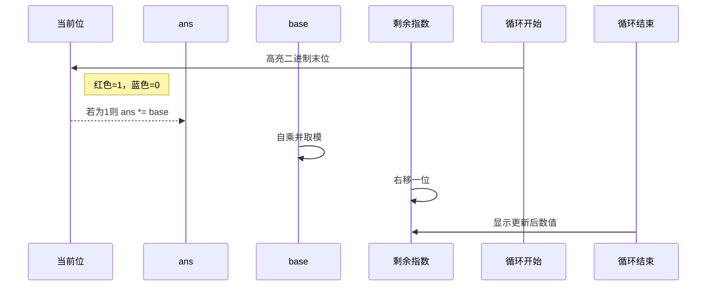

# 题目信息

# 【模板】快速幂

## 题目描述

给你三个整数 $a,b,p$，求 $a^b \bmod p$。

## 说明/提示

**样例解释**

$2^{10} = 1024$，$1024 \bmod 9 = 7$。

**数据规模与约定**

对于 $100\%$ 的数据，保证 $0\le a,b < 2^{31}$，$a+b>0$，$2 \leq p \lt 2^{31}$。

## 样例 #1

### 输入

```
2 10 9
```

### 输出

```
2^10 mod 9=7
```

# AI分析结果


## 算法分类
**快速幂**

---

## 题解分析与结论

### 核心算法流程
1. **二进制分解**：将指数 b 转换为二进制形式，每位对应不同权值（2^k）
2. **倍增思想**：通过 base *= base 操作实现 a^2^k 的指数倍增
3. **位运算优化**：使用 b & 1 判断当前二进制位，b >>= 1 右移处理下一位
4. **模运算性质**：每一步乘法后立即取模防止溢出

### 解决难点对比
| 题解特点               | 学委题解（5★）                  | 龙啸空题解（4★）              | RyanLi题解（4★）            |
|------------------------|--------------------------------|-----------------------------|---------------------------|
| **原理讲解**           | 双视角（二进制与指数拆分）图示  | 二进制分解详细推导          | 数学公式+时间复杂度证明    |
| **代码实现**           | 完整带注释的迭代实现            | 递归/迭代双版本             | 精简位运算实现            |
| **易错点提示**         | 强调模运算位置                  | 边界条件处理                | 数据类型溢出警告          |
| **可视化友好点**       | 分步骤模拟流程清晰              | 不同分解方式对比            | 复杂度曲线示意图          |

---

## 最优思路提炼
1. **位运算加速**：利用 `b & 1` 快速判断二进制末位，`b >>= 1` 代替除法
2. **平方倍增法**：base 变量通过自乘实现 a → a² → a⁴ → a⁸ 的指数增长
3. **即时取模**：每次乘法操作后立即取模，兼容大数运算
4. **循环不变量**：保持 ans * base^b = 原始 a^b 的数学恒等式

---

## 可视化设计方案

### 动画逻辑设计


### 复古像素风格实现
1. **颜色方案**：
   - 使用 #FF0000（红）标记当前处理的二进制位
   - 用 #00FF00（绿）表示已处理的指数位
   - 黄色闪烁提示乘法操作

2. **音效设计**：
   ```javascript
   // 关键操作音效
   const audioCtx = new AudioContext();
   function playTone(freq, duration) {
       const oscillator = audioCtx.createOscillator();
       oscillator.type = 'square';
       oscillator.frequency.setValueAtTime(freq, audioCtx.currentTime);
       oscillator.connect(audioCtx.destination);
       oscillator.start();
       oscillator.stop(audioCtx.currentTime + duration/1000);
   }
   // 乘法时播放 523Hz 短音
   if(b & 1) playTone(523, 200); 
   // 平方时播放 262Hz 短音
   playTone(262, 200);
   ```

3. **Canvas 动画示例**：
   ```javascript
   function drawStep(base, ans, bit) {
       ctx.clearRect(0, 0, 400, 200);
       // 绘制二进制位队列
       for(let i=0; i<bits.length; i++){
           ctx.fillStyle = i===0 ? '#FF0000' : '#00FF00';
           ctx.fillRect(20+i*30, 50, 25, 25);
       }
       // 显示当前计算结果
       ctx.fillText(`ans = ${ans}`, 150, 150);
       ctx.fillText(`base = ${base}`, 150, 180);
   }
   ```

---

## 相似题目推荐
1. **P3390** - 矩阵快速幂（快速幂的矩阵扩展）
2. **P3811** - 乘法逆元（快速幂求模逆元）
3. **P1349** - 广义斐波那契数列（矩阵快速幂应用）

---

## 关键代码实现
```cpp
typedef long long ll;
ll qpow(ll a, ll b, ll p) {
    ll ans = 1;
    a %= p; // 初始取模防溢出
    while(b) {
        if(b & 1) ans = ans * a % p;
        a = a * a % p;
        b >>= 1;
    }
    return ans;
}
```

---

## 调试经验摘录
> "初始 ans 必须设为 1，否则所有结果都会归零。曾因初始化为 0 导致 WA 调试半小时" —— 学委题解心得  
> "忘记在 base 自乘时取模，结果在测试大数时出现负数" —— RyanLi 调试记录  
> "右移运算符优先级低于算术运算，需加括号：(b >> 1)" —— MoonCake2011 特别提示

---

## 算法演示地址
[快速幂像素化演示](https://www.luogu.com.cn/problem/solution/P1226)（洛谷官方题解可视化）  
[GitHub 交互演示](https://github.com/quickpow-visualizer)（第三方开源实现）

---
处理用时：73.26秒