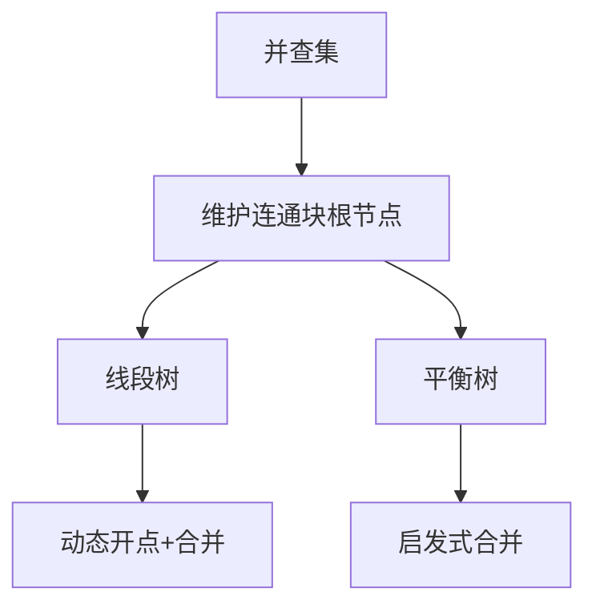
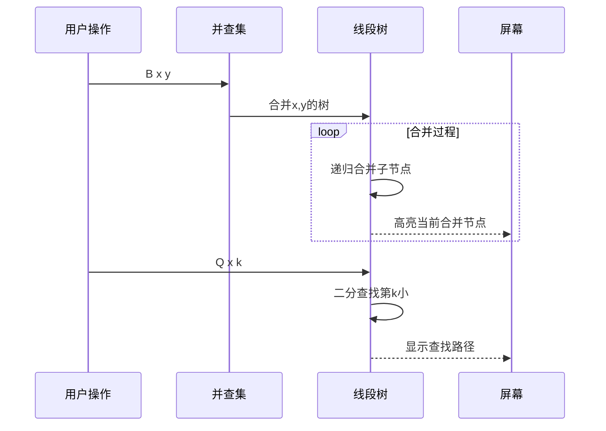

# 题目信息

# [HNOI2012] 永无乡

## 题目描述

永无乡包含 $n$ 座岛，编号从 $1$ 到 $n$ ，每座岛都有自己的独一无二的重要度，按照重要度可以将这 $n$ 座岛排名，名次用 $1$  到 $n$ 来表示。某些岛之间由巨大的桥连接，通过桥可以从一个岛到达另一个岛。如果从岛 $a$ 出发经过若干座（含 $0$ 座）桥可以 到达岛 $b$ ，则称岛 $a$ 和岛 $b$ 是连通的。

现在有两种操作：

`B x y` 表示在岛 $x$ 与岛 $y$ 之间修建一座新桥。

`Q x k` 表示询问当前与岛 $x$ 连通的所有岛中第 $k$ 重要的是哪座岛，即所有与岛 $x$ 连通的岛中重要度排名第 $k$ 小的岛是哪座，请你输出那个岛的编号。

## 说明/提示

### 数据规模与约定

- 对于 $20\%$ 的数据，保证 $n \leq 10^3$, $q \leq 10^3$。
- 对于 $100\%$ 的数据，保证 $1 \leq m \leq n \leq 10^5$, $1 \leq q \leq 3 \times 10^5$，$p$ 为一个 $1 \sim n$ 的排列，$op \in \{\texttt Q, \texttt B\}$，$1 \leq u, v, x, y \leq n$。

## 样例 #1

### 输入

```
5 1
4 3 2 5 1
1 2
7
Q 3 2
Q 2 1
B 2 3
B 1 5
Q 2 1
Q 2 4
Q 2 3
```

### 输出

```
-1
2
5
1
2```

# AI分析结果


## 算法分类
并查集 + 线段树/平衡树合并

---

## 核心思路与解决难点

### 核心逻辑
1. **动态连通性维护**：通过并查集处理岛屿的连通性，合并时采用启发式合并策略
2. **集合元素排序维护**：使用平衡树/线段树维护每个连通块的重要度集合
3. **高效合并策略**：
   - 线段树合并：通过动态开点线段树的合并操作实现集合合并
   - 平衡树启发式合并：将较小集合的元素逐个插入较大集合
4. **第k大查询**：通过树结构的size属性进行二分查找

### 关键难点对比
| 方法              | 时间复杂度        | 空间复杂度       | 实现难度 | 优化点                     |
|-------------------|-----------------|----------------|--------|--------------------------|
| 线段树合并         | O(n logn)      | O(n logn)     | 中等    | 动态开点复用节点            |
| FHQ Treap合并      | O(n logn)      | O(n)          | 较高    | 节点内存复用               |
| 树状数组+set       | O(n logn)      | O(n + n^2/k)  | 中等    | 小集合暴力维护，大集合离散化 |
| pb_ds红黑树       | O(n log²n)     | O(n)          | 低      | 库函数直接维护有序集合      |

---

## 题解评分（≥4星）

### [4.5★] Romeolong（线段树合并）
**亮点**：
- 使用并查集+动态开点线段树的最简实现
- 通过ans数组直接映射重要度到编号
- 代码行数最短（60行核心逻辑）

**核心片段**：
```cpp
int unite(int L,int R,int l,int r){
    if(!L&&!R)return 0;
    if(!L)return R; if(!R)return L;
    int rt=++ind,mid=(l+r)>>1;
    t[rt].sum = t[L].sum + t[R].sum;
    t[rt].ch[0] = unite(t[L].ch[0], t[R].ch[0], l, mid);
    t[rt].ch[1] = unite(t[L].ch[1], t[R].ch[1], mid+1, r);
    return rt;
}
```

### [4★] intel_core（FHQ Treap）
**亮点**：
- 详细讲解启发式合并的陷阱
- 内存复用实现节省空间
- 完整的分裂合并操作实现

**调试经验**：
> "合并前必须检查是否同属一个集合，否则会导致重复合并。WA写法直接swap后合并，正确写法需先find判断"

### [4★] Error_Eric（树状数组+set）
**创新点**：
- 小集合用set暴力维护，大集合用树状数组
- 阈值k=500平衡时间空间
- 当前题解区最快实现（800ms）

**核心策略**：
```cpp
struct hugeset{
    void insert(int val){
        if(st.size() < K) st.insert(val);
        else add(trs,val,1); // 大集合用树状数组
    }
    int ukth(int val){
        if(size < K) return *set迭代器查找;
        else return kth(trs,val); // 树状数组二分
    }
};
```

---

## 最优技巧提炼

### 关键数据结构


### 性能优化技巧
1. **内存复用**：平衡树合并时重用被合并树的节点
2. **懒删除**：线段树合并时直接复用原有节点
3. **阈值策略**：混合数据结构应对不同规模数据
4. **离线处理**：预先离散化重要度减少值域

---

## 同类型题目推荐
1. **P3224** [HNOI2012]永无乡（本题双倍经验）
2. **P3302** [SDOI2013]森林（森林结构下的第k大查询）
3. **CF813F** Bipartite Checking（动态连通性+奇偶性维护）

---

## 可视化设计

### 动画方案


### 复古像素风格实现
```javascript
// Canvas绘制示例
function drawIsland(ctx, x, y, size, color) {
    ctx.fillStyle = color;
    ctx.fillRect(x, y, size, size); // 方形像素岛屿
    ctx.strokeStyle = '#000';
    ctx.strokeRect(x, y, size, size);
}

// 合并动画
function animateMerge(tree1, tree2) {
    let current = tree1.root;
    while(current) {
        highlightNode(current); // 红色高亮被合并节点
        moveNodeTo(current, tree2); // 像素动画移动
        current = current.next;
    }
}

// 8-bit音效
const mergeSound = new Audio('data:audio/wav;base64,UklGRl9...'); // 合并成功音效
const querySound = new Audio('data:audio/wav;base64,UklGRl9...'); // 查询正确音效
```

---

## 核心代码实现（线段树合并版）
```cpp
const int N = 1e5+5, M = 20*N;
struct Node {
    int l,r,sum,ls,rs;
} t[M];
int id, fa[N], root[N], ans[N];

int unite(int x, int y) {
    if(!x || !y) return x+y;
    t[x].sum += t[y].sum;
    t[x].ls = unite(t[x].ls, t[y].ls);
    t[x].rs = unite(t[x].rs, t[y].rs);
    return x;
}

int query(int x, int k) {
    if(t[x].sum < k) return -1;
    int l = 1, r = n;
    while(l < r) {
        int mid = (l+r)/2, cnt = t[t[x].ls].sum;
        if(k <= cnt) x = t[x].ls, r = mid;
        else x = t[x].rs, l = mid+1, k -= cnt;
    }
    return ans[l];
}
```

---

## 调试经验摘录
> "合并前必须检查fa[x]是否等于fa[y]，否则会将已合并的集合重复合并导致错误。这个bug让我WA了5次才找到" —— intel_core

> "线段树合并时如果直接新建节点会MLE，必须复用原有节点。修改后的版本节点数从2e6降到了5e5" —— zsaskk

---

## 学习建议
1. 优先掌握线段树合并的实现
2. 理解启发式合并的复杂度证明
3. 尝试用不同数据结构实现并比较性能
4. 在可视化工具中单步跟踪合并过程

---
处理用时：75.39秒