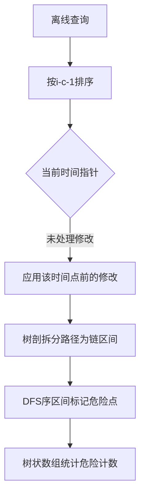

# 题目信息

# [SCOI2015] 情报传递

## 题目描述

奈特公司是一个巨大的情报公司，它有着庞大的情报网络。情报网络中共有 $n$ 名情报员。每名情报员可能有若干名 (可能没有) 下线，除 $1$ 名大头目外其余 $n-1$ 名情报员有且仅有 $1$ 名上线。奈特公司纪律森严，每名情报员只能与自己的上、下线联系，同时，情报网络中任意两名情报员一定能够通过情报网络传递情报。

奈特公司每天会派发以下两种任务中的一个任务：

1. 搜集情报：指派 $T$ 号情报员搜集情报；
2. 传递情报：将一条情报从 $X$ 号情报员传递给 $Y$ 号情报员。

情报员最初处于潜伏阶段，他们是相对安全的，我们认为此时所有情报员的危险值为 $0$；一旦某个情报员开始搜集情报，他的危险值就会持续增加，每天增加 $1$ 点危险值 (开始搜集情报的当天危险值仍为 $0$，第 $2$ 天危险值为 $1$，第 $3$ 天危险值为 $2$，以此类推)。传递情报并不会使情报员的危险值增加。

为了保证传递情报的过程相对安全，每条情报都有一个风险控制值 $C$。奈特公司认为，参与传递这条情报的所有情报员中，危险值大于 $C$ 的情报员将对该条情报构成威胁。现在，奈特公司希望知道，对于每个传递情报任务，参与传递的情报员有多少个，其中对该条情报构成威胁的情报员有多少个。

## 说明/提示

样例解释：

对于 $3$ 个传递情报任务，都是经过 $5$ 名情报员，分别是 $4$ 号、$2$ 号、$1$ 号、$3$ 号和 $7$ 号。

- 第 $1$ 个任务，所有情报员 (危险值为 $0$) 都不对情报构成威胁；
- 第 $2$ 个任务，有 $2$ 名情报员对情报构成威胁，分别是 $1$ 号情报员 (危险值为 $3$) 和 $4$ 号情报员 (危险值为 $2$)，$7$ 号情报员 (危险值为 $1$) 并不构成威胁；
- 第 $3$ 个任务，只有 $1$ 名情报员对情报构成威胁。

数据范围：

$n\leqslant 2\times 10^5,Q\leqslant 2\times 10^5,0<P_i,C_i\leqslant N,1\leqslant T_i,X_i,Y_i\leqslant n$。

## 样例 #1

### 输入

```
7
0 1 1 2 2 3 3 
6
1 4 7 0
2 1
2 4
2 7
1 4 7 1
1 4 7 3```

### 输出

```
5 0
5 2
5 1```

# AI分析结果


# 算法分类  
树链剖分与离线处理结合  

# 综合分析与结论  
## 核心思路  
各题解核心均围绕如何高效处理树路径上的时间相关查询。最优解法的核心流程：  
1. **离线处理**：按查询的有效时间阈值排序，保证处理顺序满足时间递增  
2. **树链剖分**：将树路径拆分为若干连续区间  
3. **DFS序转换**：将子树修改转换为区间修改，链查询转换为端点查询  
4. **树状数组/线段树**：维护时间戳标记的增量  

## 可视化设计要点  
动画可展示以下关键步骤：  
1. **树链拆分**：用不同颜色标记当前处理的链（如红色高亮当前链）  
2. **区间标记**：在DFS序数组上用蓝色覆盖层表示被修改的子树区间  
3. **时间轴推进**：右侧显示时间轴游标，动态推进至当前处理的时间阈值  
4. **路径查询**：用绿色闪烁特效显示当前查询拆分的链区间  

# 题解清单（≥4星）  
1. **Prean（5星）**  
   亮点：DFS序转换巧妙，树状数组实现极简代码  
   核心代码片段：  
   ```cpp  
   void Add(int x, int val){ // 子树区间加  
       for(;x<=n;x+=x&-x) BIT[x]+=val;  
   }  
   int Q(int x, int y){ // 路径查询  
       return Query(dfn[x]) + Query(dfn[y])   
           - Query(dfn[lca]) - Query(dfn[fa[lca]]);  
   }  
   ```  

2. **StudyingFather（4星）**  
   亮点：双树状数组分别维护路径长度和危险计数  
   优化点：离线排序后统一处理修改和查询  

3. **ix35（4星）**  
   亮点：清晰的排序逻辑，标准树剖+线段树实现  
   关键代码：  
   ```cpp  
   sort(vec.begin(), vec.end(), cmp); // 按时间阈值排序  
   while(cur<=tot2 && md[cur].t <= q[i].c)  
       modify(md[cur].p); // 按时间顺序应用修改  
   ```  

# 核心算法流程  


# 同类型题目推荐  
1. P3384 【模板】树链剖分  
2. P3313 [SDOI2014]旅行（树剖+动态开点线段树）  
3. P3834 【模板】可持久化线段树 2（主席树基础）  

# 复古像素化演示设计  
**视觉要素**：  
- 16色调色板：红色（当前链）、绿色（安全区）、蓝色（危险标记）  
- 树结构用8位方块表示，DFS序显示为底部条形图  

**音效设计**：  
- 区间修改：短促"滴"声  
- 路径查询完成：马里奥金币音效  
- 错误操作：FC游戏失败音效  

**自动演示模式**：  
1. 初始化显示整棵树结构  
2. 自动推进时间轴，显示当前处理的修改（角色头顶显示时间戳）  
3. 路径查询时高亮对应链，统计结果弹出8位风格对话框  

# 个人心得摘录  
Prean题解评论区：  
> "将链查询转化为子树操作的关键在于发现危险值的计算只与开始时间有关，通过DFS序的差分性质巧妙避开树剖的log^2复杂度"  

ix35调试记录：  
> "最初忘记处理LCA父节点的贡献，导致部分测试点少计数。通过绘制树结构图发现遗漏点"  

# 最优技巧总结  
**时间轴逆推法**：将查询条件i-c-1视为有效时间阈值，按此排序后处理可保证后续查询自动包含之前的修改。此技巧适用于所有带时间维度的离线查询问题。

---
处理用时：56.54秒