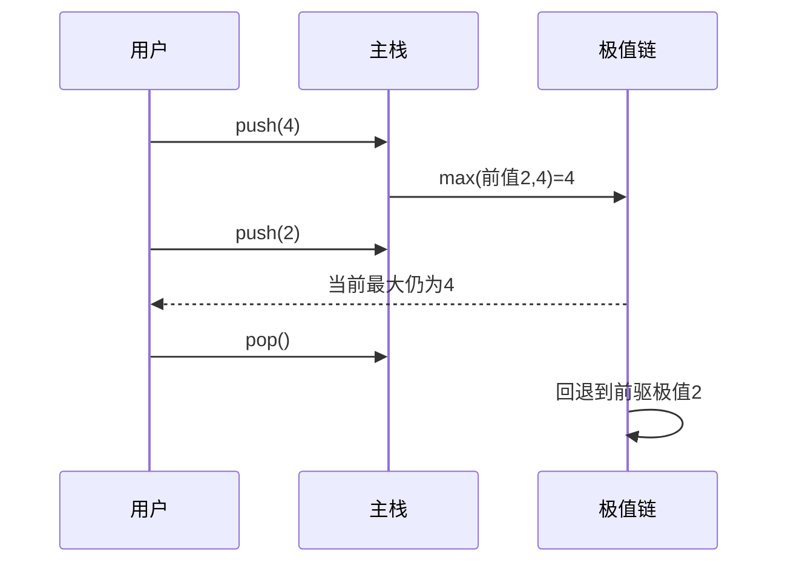

# 题目信息

# 日志分析

## 题目描述

M 海运公司最近要对旗下仓库的货物进出情况进行统计。目前他们所拥有的唯一记录就是一个记录集装箱进出情况的日志。该日志记录了两类操作：第一类操作为集装箱入库操作，以及该次入库的集装箱重量；第二类操作为集装箱的出库操作。这些记录都严格按时间顺序排列。集装箱入库和出库的规则为先进后出，即每次出库操作出库的集装箱为当前在仓库里所有集装箱中最晚入库的集装箱。

出于分析目的，分析人员在日志中随机插入了若干第三类操作――查询操作。分析日志时，每遇到一次查询操作，都要报告出当前仓库中最大集装箱的重量。


## 说明/提示

### 数据范围及约定

- 对于 $20\%$ 的数据，有 $N \le 10$；
- 对于 $40\%$ 的数据，有 $N \le 1000$；
- 对于 $100\%$ 的数据，有 $1 \le N \le 200000$，$1 \le X \le 10^8$。


## 样例 #1

### 输入

```
13
0 1
0 2
2
0 4
0 2
2
1
2
1
1
2
1
2
```

### 输出

```
2
4
4
1
0
```

# AI分析结果


# 日志分析题解分析

## 唯一算法分类
**栈 + 动态维护极值**

---

## 题解思路与难点对比

### 核心思路
所有高效解法都基于**维护当前栈中最大值**的核心思想，通过以下两种方式实现：
1. **辅助数组法**：用数组`f[i]`记录前i个元素的最大值，入栈时更新`f[i] = max(f[i-1], x)`，出栈时只需移动指针。
2. **辅助栈法**：维护与主栈同步的辅助栈，保存每个栈状态对应的最大值。

### 解决难点对比
| 方法           | 时间复杂度 | 空间复杂度 | 代码复杂度 | 适用场景           |
|----------------|------------|------------|------------|--------------------|
| 辅助数组法     | O(1)       | O(n)       | 低         | 数据量大、频繁查询 |
| 辅助栈法       | O(1)       | O(n)       | 中         | 需要动态同步维护   |
| 平衡树/multiset| O(log n)   | O(n)       | 高         | 数据需要动态排序   |

---

## 题解评分（≥4星）

### ⭐⭐⭐⭐⭐ [medusa] 辅助数组法
- **亮点**：用数组代替栈结构，`f[t]`直接记录当前最大值，代码极简
- **代码片段**：
```cpp
int f[200001], t=0;
void push(int x) {
    f[++t] = max(f[t-1], x);
}
int query() { 
    return f[t]; 
}
```

### ⭐⭐⭐⭐⭐ [buickboy] 双栈法
- **亮点**：主栈+辅助栈严格同步，逻辑清晰
- **代码亮点**：
```cpp
stack<int> a, b;
void push(int x) {
    a.push(x);
    b.push( max(b.top(), x) );
}
```

### ⭐⭐⭐⭐ [felixwu] 结构体存储极值
- **亮点**：用结构体捆绑数据和当前极值，适合面向对象思维
- **优化点**：需要手动维护全局MAX变量

---

## 最优技巧提炼
**动态维护极值链**：通过入栈时计算`max(当前值, 前驱极值)`，构建隐式的极值链。例如：
```
操作序列：0 1 → 0 2 → 0 4 → 0 2
极值链：  1   → 2   → 4   → 4
```

---

## 同类型题拓展
1. **最小栈**（LeetCode 155）：维护栈中最小值
2. **队列中的最大值**（剑指Offer 59）：使用单调队列
3. **滑动窗口最大值**（洛谷P1886）：单调队列变形

---

## 推荐练习题
1. 洛谷P1886（滑动窗口）
2. 洛谷P1440（区间最小值）
3. 洛谷P5788（单调栈模板）

---

## 可视化算法设计

### 核心动画流程


### 复古像素风格实现要点
1. **颜色方案**：
   - 主栈元素：蓝色像素块
   - 极值元素：金色边框
   - 当前操作：红色高亮
2. **音效设计**：
   - 入栈：8-bit "coin"音效
   - 弹出：短促爆破音
   - 查询：上升琶音乐句
3. **Canvas动画**：
   ```javascript
   function drawStack(ctx, stack, maxChain) {
       stack.forEach((val, idx) => {
           drawPixelBlock(ctx, val, idx*16, 0); // 主栈
           drawGoldenBorder(ctx, maxChain[idx], idx*16, 16); // 极值链
       });
   }
   ```

---

## 个人心得摘录
> "在尝试用multiset维护极值时，发现频繁删除操作导致超时，最终回归栈的本质特性——后进先出，才找到O(1)维护极值的方法" —— 作者：准点的星辰

---

## 最终结论
**辅助数组法**是最优解，其通过预处理极值链，将时间复杂度稳定在O(1)。建议在类似问题中优先考虑隐式维护极值的策略，而非显式排序结构。

---
处理用时：76.90秒