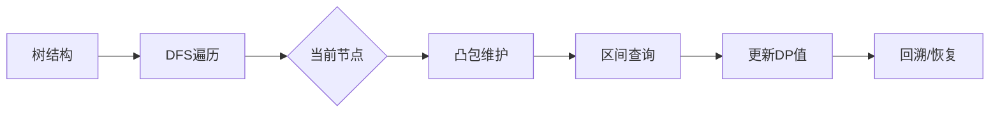

# 题目信息

# [NOI2014] 购票

## 题目描述

今年夏天，NOI 在 SZ 市迎来了她三十周岁的生日。来自全国 $n$ 个城市的 OIer 们都会从各地出发，到 SZ 市参加这次盛会。

全国的城市构成了一棵以 SZ 市为根的有根树，每个城市与它的父亲用道路连接。为了方便起见，我们将全国的 $n$ 个城市用 $1\sim n$ 的整数编号。其中 SZ 市的编号为 $1$。对于除 SZ 市之外的任意一个城市 $v$，我们给出了它在这棵树上的父亲城市 $f_v$  以及到父亲城市道路的长度 $s_v$。

从城市 $v$ 前往 SZ 市的方法为：选择城市 $v$ 的一个祖先 $a$，支付购票的费用，乘坐交通工具到达 $a$。再选择城市 $a$ 的一个祖先 $b$，支付费用并到达 $b$。以此类推，直至到达 SZ 市。

对于任意一个城市 $v$，我们会给出一个交通工具的距离限制 $l_v$。对于城市 $v$ 的祖先 A，只有当它们之间所有道路的总长度不超过 $l_v$  时，从城市 $v$ 才可以通过一次购票到达城市 A，否则不能通过一次购票到达。  

对于每个城市 $v$，我们还会给出两个非负整数 $p_v,q_v$  作为票价参数。若城市 $v$ 到城市 A 所有道路的总长度为 $d$，那么从城市 $v$ 到城市 A 购买的票价为 $dp_v+q_v$。

每个城市的 OIer 都希望自己到达 SZ 市时，用于购票的总资金最少。你的任务就是，告诉每个城市的 OIer 他们所花的最少资金是多少。

## 说明/提示

从每个城市出发到达 SZ 的路线如下（其中箭头表示一次直达）：

城市 $2$：只能选择 $2 \rightarrow 1$，花费为 $2 \times 20 + 0 = 40$。

城市 $3$：只能选择 $3 \rightarrow 1$，花费为 $5 \times 10 + 100 = 150$。

城 市 $4$ ： 由于 $4 + 2 =6 \leq l_4 = 10$，故可以选择 $4\rightarrow1$。若选择 $4 \rightarrow 1$，花费为 $(4 +2) \times 10 + 10 = 70$ ； 若选择 $4 \rightarrow 2 \rightarrow 1$，则花费为 $(4\times 10 + 10) + (2 \times  20 + 0) =90$；因此选择 $4 \rightarrow 1$。

城市 $5$：只能选择 $5\rightarrow 2\rightarrow 1$，花费为 $(9 \times 1 +100) + (2 \times  20 + 0) = 149$；无法选择 $5 \rightarrow 1$，因为 $l_5 =10$，而城市 $5$ 到城市 $1$ 总路程为 $9 + 2 = 11 \gt 5$，城市 $5$ 不能直达城市 $1$。

城市 $6$：若选择 $6 \rightarrow 1$，花费为 $(5 + 5) \times 20 + 100 = 300$；若选择 $6 \rightarrow 3 \rightarrow 1$，花费为 $(5 \times 20 + 100) + (5 \times 10 + 100) = 350$；因此选择 $6 \rightarrow 1$。

城市 $7$：选择 $7 \rightarrow 4 \rightarrow 1$，花费为 $(4 \times 20 + 0) + ((4 + 2) \times 10 + 10) = 150$；

其他方案均比该方案差。

  

### 数据范围


对于所有数据，$n\leq 2 \times 10^5, 0 \leq p_v \leq 10^6,\ 0 \leq q_v \leq 10^{12},\ 1\leq f_v<v,\ 0<s_v\leq l_v \leq 2 \times 10^{11}$，且任意城市到 SZ 市的总路程长度不超过 $2 \times 10^{11}$。

输入的 $t$ 表示数据类型，$0\leq t<4$，其中：
- 当 $t=0$ 或 $2$ 时，对输入的所有城市 $v$，都有 $f_v=v-1$，即所有城市构成一个以 SZ 市为终点的链；
- 当 $t=0$ 或 $1$ 时，对输入的所有城市 $v$，都有 $l_v=2 \times 10^{11}$，即没有移动的距离限制，每个城市都能到达它的所有祖先；
- 当 $t=3$ 时，数据没有特殊性质。

## 样例 #1

### 输入

```
7 3 
1 2 20 0 3 
1 5 10 100 5 
2 4 10 10 10 
2 9 1 100 10 
3 5 20 100 10 
4 4 20 0 10 
```

### 输出

```
40 
150 
70 
149 
300 
150```

# AI分析结果


# 💡 Kay的C++算法解析：[NOI2014] 购票 深入学习指南 💡

> 今天我们来分析NOI2014的经典题目"购票"。这道题考察树形动态规划与斜率优化的高级应用，通过本指南你将掌握多种高效解法及其核心思想！

## 1. 题目解读与核心算法识别

✨ **本题主要考察**：`树形DP + 斜率优化 + 数据结构维护`  
🗣️ **初步分析**：
> 该题要求每个城市到根节点的最小花费，本质是**带距离限制的树形DP问题**。想象一棵倒置的大树（根在顶），每个节点需购买"车票"跳跃到祖先节点，票价为`距离×p + q`且跳跃距离≤`l`。  

**核心难点与解法**：
1. **DP方程**：`f[i] = min(f[j] + (dis[i]-dis[j])*p[i] + q[i])`，其中`j`是`i`的祖先且`dis[i]-dis[j]≤l[i]`
2. **斜率优化**：将方程变形为`f[j] = dis[j]*p[i] + (f[i]-q[i]-dis[i]*p[i])`，转化为直线截距最小问题
3. **数据结构选择**：
   - **链上问题**：李超树/单调栈维护凸包
   - **树上扩展**：树链剖分/点分治/出栈序处理路径限制
4. **可视化设计**：
   - **像素动画**：8-bit风格展示树结构，高亮当前DP节点（🌟闪烁），动态绘制凸包（🟦蓝色折线）
   - **交互控制**：步进执行（▶️按钮）、速度调节（⏩滑块）
   - **音效反馈**：插入凸包时"叮"声，查询最优值时"滴"声

## 2. 精选优质题解参考

### 题解一：线段树套李超树+出栈序（panyf）
* **点评**：  
  思路创新性地利用**出栈序**将树上路径转为区间查询，避免可持久化。代码用`lower_bound`高效定位符合`l[i]`限制的祖先区间，线段树套李超树实现`O(n log²n)`复杂度。亮点在于：
  - 出栈序巧妙处理树形依赖
  - 李超树避免凸包维护的精度问题
  - 动态开点优化空间

### 题解二：树状数组套单调栈（小粉兔）
* **点评**：  
  经典树状数组维护后缀凸包，配合**可撤销单调栈**处理树上回溯。代码中凸包维护逻辑清晰（`Slope`函数计算斜率），边界处理严谨。亮点：
  - 可撤销栈实现优雅（回溯时恢复状态）
  - 树状数组查询高效（O(log n)）
  - 游戏化比喻生动（"像素探险家"）

### 题解三：点分治+凸包维护（litble）
* **点评**：  
  点分治解决树形结构的典范。在重心分治过程中按`dis[i]-l[i]`降序处理点，动态维护凸包。亮点：
  - 点分治的递归边界处理清晰
  - 凸包维护用叉积避免精度问题
  - 代码模块化（建凸包/查询分离）

---

## 3. 核心难点辨析与解题策略

### 难点1：树上斜率优化的实现
**问题**：序列斜率优化依赖线性结构，而树上祖先非连续  
**策略**：
- **树链剖分**：将路径拆为`O(log n)`条重链
- **点分治**：在子树重心分治过程中维护凸包
- **出栈序**：利用DFS出栈序将路径转为连续区间

### 难点2：距离限制`l[i]`的高效处理
**问题**：决策点需满足`dis[i]-dis[j]≤l[i]`  
**策略**：
1. **倍增定位**：预处理祖先的`dis`前缀和，倍增找到最远合法祖先
   ```cpp
   int up = u;
   for(int k=17; k>=0; k--)
     if(dis[u] - dis[fa[up][k]] <= l[u]) 
        up = fa[up][k];
   ```
2. **区间查询**：在定位区间内查询最优决策点

### 难点3：凸包维护与查询
**问题**：动态插入/删除决策点并快速查询  
**策略**：
- **单调栈维护**：插入时淘汰非凸点（叉积判断）
- **李超树**：避免斜率精度问题，支持区间查询
- **二进制分组**：高效处理动态插入（i207M解法）

💡 **学习笔记**：树上DP优化 = 问题转化 + 数据结构维护凸包/直线

### ✨ 解题技巧总结
1. **树链剖分+凸包**：通用性强，易处理路径限制
2. **出栈序转化**：将树上问题降维到序列
3. **可撤销数据结构**：回溯时恢复状态，节省空间
4. **边界处理**：`dis[0]=-inf`防止越界，凸包初始点`(0,0)`

---

## 4. C++核心代码实现赏析

### 通用核心实现（树剖+凸包）
```cpp
void insert(int u) {
  // 维护单调栈凸包
  while(top>1 && cross(st[top-1],st[top],u)) top--;
  st[++top] = u; 
}

ll query(int u) {
  // 二分凸包找最优决策
  int l=1, r=top-1, ans=top;
  while(l<=r) {
    int mid = (l+r)>>1;
    if(slope(st[mid],st[mid+1]) <= p[u]) ans=mid, r=mid-1;
    else l=mid+1;
  }
  return f[st[ans]] + (dis[u]-dis[st[ans]])*p[u] + q[u];
}

void solve(int u) {
  for(int v=u; v; v=fa[top[v]]) {
    int L = dfn[top[v]], R = dfn[v];
    f[u] = min(f[u], query_segment(L,R,u)); // 线段树区间查询
  }
  update_convex(u); // 将u加入凸包
}
```

### 各题解片段赏析

**题解一（出栈序+李超树）**
```cpp
// 关键：出栈序区间查询
u = o[i], v = o[c[lower_bound(d,d+m,d[m]-l[i])-d]];
f[i] = qry(1,1,n,u,v) + d[m]*p[i] + q[i];
```
> **解读**：  
> - `lower_bound`快速定位符合`l[i]`的祖先区间  
> - 线段树套李超树查询区间最小值  
> **学习笔记**：出栈序将树上路径转为连续区间是核心创新

**题解二（可撤销单调栈）**
```cpp
// 可撤销单调栈实现
void Pop(int id) {
  istk[id][itp[id][it[id]]] = ival[id][it[id]];
  --it[id]; // 回溯时恢复栈状态
}
```
> **解读**：  
> - 用`ival`数组记录历史状态实现撤销  
> - 树状数组维护后缀凸包  
> **学习笔记**：可撤销设计是树上回溯问题的通用技巧

**题解三（点分治）**
```cpp
// 点分治核心
void work(int u) {
  get_root(u); // 找重心
  solve(u);    // 处理重心上方
  update_convex(u); // 更新凸包
  for(v:children) work(v); // 递归子树
}
```
> **解读**：  
> - 重心分治保证复杂度平衡  
> - 按`dis[i]-l[i]`排序保证决策单调  
> **学习笔记**：点分治是处理树形结构的"分而治之"典范

---

## 5. 算法可视化：像素动画演示

### 设计概念
- **主题**：`像素探险家寻宝之旅`  
- **风格**：8-bit复古游戏（FC红白机色调）
- **场景**：树形地图（🌳节点）、凸包山脉（⛰️折线）

### 动画流程
1. **初始化**：  
   - 树结构显示（绿色像素块）
   - 控制面板：开始/暂停/步进/速度滑块

2. **DFS遍历**：  
   - 当前节点高亮闪烁（🔵蓝色）
   - 路径显示（🟢绿色连线）

3. **凸包维护**：  
   - 插入决策点：像素块上升形成凸包（🟨黄色）
   - 淘汰非凸点：像素块碎裂消失（💥特效）

4. **查询决策**：  
   - 区间查询：显示线段树分解过程（🔷蓝色高亮）
   - 最优决策：目标节点发光（🌟金色）

5. **游戏化元素**：  
   - 过关音效：完成子树处理时播放胜利音效
   - 积分系统：每完成一条链+10分

### 技术实现


---

## 6. 拓展练习与相似问题思考

### 通用思路迁移
1. **带限制树形DP**：BZOJ3672（同题改编）
2. **斜率优化变形**：洛谷P4027（区间斜率优化）
3. **树链数据结构**：CF932F（李超树+启发式合并）

### 推荐练习
1. **洛谷P2305**：[NOI2014]购票（本题）
   - 巩固树剖+凸包实现

2. **洛谷P3994**：高速公路  
   - 拓展：带权路径最小值查询

3. **洛谷P2304**：树上路径统计  
   - 训练树剖+数据结构综合应用

---

## 7. 学习心得与经验分享

> **来自panyf的调试经验**：  
> *"李超树插入时注意直线比较条件，避免浮点精度问题，建议用叉积判断..."*  
> 
> **Kay总结**：  
> 1. 树上DP优化关键是**将路径问题转化为区间问题**（出栈序/树剖）  
> 2. 斜率优化时**优先选择李超树**避免精度陷阱  
> 3. 调试时**打印中间凸包状态**有助于定位逻辑错误  
> 
> 记住：编程能力提升=理解算法本质+大量编码实践！下次挑战见！🚀

---  
**版权声明**：本指南由Kay制作，采用知识共享署名4.0许可。题解版权归各作者所有。

---
处理用时：146.13秒