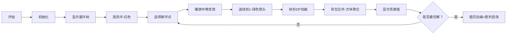

# 题目信息

# [NOI2008] 奥运物流

## 题目描述

2008 北京奥运会即将开幕，举国上下都在为这一盛事做好准备。为了高效率、 成功地举办奥运会，对物流系统进行规划是必不可少的。

物流系统由若干物流基站组成，以 $1$ 到 $n$ 进行编号。每个物流基站 $i$ 都有且仅有一个后继基站 $S_i$，而可以有多个前驱基站。基站 $i$ 中需要继续运输的物资都将被运往后继基站 $S_i$，显然一个物流基站的后继基站不能是其本身。编号为 $1$ 的 物流基站称为控制基站，从任何物流基站都可将物资运往控制基站。注意控制基站也有后继基站，以便在需要时进行物资的流通。在物流系统中，高可靠性与低成本是主要设计目的。对于基站 $i$，我们定义其“可靠性” $R(i)$ 如下： 
设物流基站 $i$ 有 $w$ 个前驱基站 $P_1,P_2,\cdots,P_w$，即这些基站以 $i$ 为后继基站，则基 站 $i$ 的可靠性 $R(i)$ 满足下式： 
$$R(i)=C_i+k \sum_{j=1}^{w}R(P_j).$$

其中 $C_i$ 和 $k$ 都是常实数且恒为正，且有 $k$ 小于 $1$。

整个系统的可靠性与控制基站的可靠性正相关，我们的目标是通过修改物流系统，即更改某些基站的后继基站，使得控制基站的可靠性 $R(1)$ 尽量大。但由于经费限制，最多只能修改 $m$ 个基站的后继基站，并且，控制基站的后继基站不可被修改。因而我们所面临的问题就是，如何修改不超过 $m$ 个基站的后继，使得控制基站的可靠性 $R(1)$ 最大化。


## 说明/提示

【样例说明】 
原有物流系统如左图所示，$4$ 个物流基站的可靠性依次为 $22.8571,21.4286,25.7143,10$。

最优方案为将 $2$ 号基站的后继基站改为 $1$ 号。

此时 $4$ 个基站的可靠性依次为 $30,25,15,10$。
本题的数据，具有如下分布： 

测试数据编号| $n$ | $m$
:-:|:-:|:-:
$1$|$\leq6$| $\leq6$
$2$|$\leq12$|$\leq12$
$3$|$\leq60$|$0$
$4$|$\leq60$|$1$
$5$|$\leq 60$|$N-2$
$6,7,8,9,10$|$\leq60$|$\leq60$

 对于所有的数据，满足 $m \leq n \leq 60$，$C_i \leq 10^6$，$0.3 \leq k < 1$，请使用双精度实数，无需考虑由此带来的误差。

## 样例 #1

### 输入

```
4 1 0.5  
2 3 1 3 
10.0 10.0 10.0 10.0```

### 输出

```
30.00 
```

# AI分析结果


### 💡 Kay的C++算法解析：[NOI2008] 奥运物流 深入学习指南 💡

#### 题目解读与核心算法识别
✨ **本题主要考察**：基环树上的动态规划（树形DP + 环处理）  
🗣️ **初步分析**：  
> 本题可比喻为优化公司汇报结构：1号基站是CEO，其他部门通过汇报链影响CEO绩效（可靠性）。每次修改相当于让某部门直接向CEO汇报，目标是最大化CEO绩效。  
> - **核心思路**：通过公式 $R(1)=\frac{\sum C_i \cdot k^{d_i}}{1-k^L}$（$d_i$为到1的距离，$L$为环长），发现修改操作本质是缩短某些点到1的距离。  
> - **关键难点**：基环树结构需先处理环（枚举环长并断开），再通过树形DP计算子树贡献。  
> - **可视化设计**：采用8位像素风格展示基环树结构，节点用不同颜色方块表示（1号=金色皇冠），环用红色高亮。动画演示：  
>   1. 断开环边时播放"咔嚓"音效，连线变为绿色箭头  
>   2. DP过程用背包合并动画（子树方块聚合并显示数值更新）  
>   3. 成功找到最优解时播放胜利音效+烟花动画  

---

### 精选优质题解参考
**题解一：Slr神龙人（赞16）**  
* **点评**：  
  思路清晰直击核心——枚举环长后树形DP。代码用`f[x][j][d]`状态表示节点$x$修改$j$次且深度$d$时的最优值，通过**背包合并子树贡献**，逻辑简洁高效。变量命名规范（如`fa`存父节点），边界处理严谨（环断开时特判原始连接）。亮点在于用$O(n^3)$复杂度巧妙处理基环树问题。

**题解二：Little_Jian（赞15）**  
* **点评**：  
  贡献计算推导深入（$R(1)=\sum k^{d_i}C_i$），DP状态`dp[o][m][d]`物理意义明确。代码模块化优秀（分离DFS和DP函数），树形背包合并用`tmp`数组降维优化空间。博客提供额外学习资源，实践价值高，但$O(n^5)$复杂度稍高。

**题解三：Leo235（赞4）**  
* **点评**：  
  理论分析最完整，从方程组推导到状态设计（四维DP）均详细说明。代码注释丰富，图解基环树结构帮助理解。亮点在于"离最近修改祖先的距离"状态设计，适合深度学习，但实现复杂度较高。

---

### 核心难点辨析与解题策略
1. **基环树拆解为树+环**  
   * **分析**：环的存在使依赖关系成环，必须枚举环长$L$并断开环上某条边（如`fa[now]=1`），将问题转化为树形结构。优质题解均通过`fa[now]=1`模拟修改操作。
   * 💡 **学习笔记**：基环树问题核心技巧——枚举环长，断环成树。

2. **树形DP的状态设计与转移**  
   * **分析**：定义`f[x][j][d]`表示节点$x$子树修改$j$次，$x$深度$d$时的最大贡献。转移时需：  
     - 不修改$x$：`f[x][j][d] = C[x]*k^d + ∑子树贡献`  
     - 修改$x$：`f[x][j][1] = C[x]*k + ∑子树贡献`（消耗1次修改）  
   * 💡 **学习笔记**：深度$d$直接影响贡献系数$k^d$，是状态设计关键。

3. **子树贡献的背包合并优化**  
   * **分析**：对每个子节点$v$，需合并`g[v][j][d]`到父节点状态。通过倒序枚举修改次数$j$（`for(j=m; j>=0; j--)`）避免重复计算，类似01背包的空间优化。
   * 💡 **学习笔记**：树形DP合并子树时，背包优化是降低复杂度的核心技巧。

#### ✨ 解题技巧总结
- **断环技巧**：枚举环长 → 断开环边 → 转为树问题 → 还原现场  
- **状态设计三要素**：当前节点、剩余修改次数、到根节点距离  
- **背包合并优化**：倒序枚举修改次数，用辅助数组`F[]`暂存中间结果  
- **贡献分离**：将$R(1)$公式拆解为分子（与$d_i$相关）和分母（与$L$相关），分别优化  

---

### C++核心代码实现赏析
**本题通用核心C++实现参考**  
* **说明**：综合Slr神龙人和Little_Jian的优化思路，保留枚举环长+树形DP框架  
* **完整核心代码**：  
  ```cpp
  #include <iostream>
  #include <cstring>
  using namespace std;
  const int N = 65;
  double f[N][N][N], g[N][N][N], C[N], K[N], F[N], ans;
  int fa[N], n, m;

  void dfs(int x, int dep) {
      // 初始化叶子节点
      for(int d = 1; d <= dep; d++) 
          f[x][0][d] = C[x] * K[d];
      
      // 背包合并子树
      for(int v = 2; v <= n; v++) {
          if(fa[v] != x) continue;
          dfs(v, dep+1);
          memset(F, 0, sizeof(F));
          for(int j = m; j >= 0; j--)
          for(int k = j; k >= 0; k--)
              F[j] = max(F[j], F[k] + g[v][j-k][dep]);
          for(int j = 0; j <= m; j++)
              f[x][j][dep] = F[j] + C[x] * K[dep];
      }

      // 修改x为深度1（消耗1次修改）
      if(dep > 1) {
          memset(F, 0, sizeof(F));
          for(int v = 2; v <= n; v++) {
              if(fa[v] != x) continue;
              for(int j = m; j >= 0; j--)
              for(int k = j; k >= 0; k--)
                  F[j] = max(F[j], F[k] + g[v][j-k][1]);
          }
          for(int j = 1; j <= m; j++)
              f[x][j][1] = F[j-1] + C[x] * K[1];
      }

      // 更新g数组：最优子结构
      for(int j = 0; j <= m; j++)
      for(int d = 1; d <= dep; d++)
          g[x][j][d] = max(f[x][j][d], f[x][j][1]);
  }
  ```

**题解一：Slr神龙人**  
* **亮点**：背包合并时倒序枚举修改次数，避免状态覆盖  
* **核心代码片段**：  
  ```cpp
  for(int v=2; v<=n; v++) if(fa[v]==x)
    for(int j=m; j>=0; j--)
      for(int k=j; k>=0; k--)
        F[j] = max(F[j], F[k] + g[v][j-k][d]);
  ```
* **代码解读**：> 此处像整理背包——从最大容量`m`开始倒序检查，为当前子树`v`预留`k`次修改名额，剩余`j-k`次给其他子树，确保修改次数分配不冲突。  
* 💡 **学习笔记**：倒序枚举是背包优化的灵魂，保证每个修改决策只被使用一次。

**题解二：Little_Jian**  
* **亮点**：贡献分离 $R(1)=\sum k^{d_i}C_i$ 使状态转移更清晰  
* **核心代码片段**：  
  ```cpp
  double calc(int m) {
    dfs(1, m, 0); // 以1为根，初始深度0
    return dp[1][m][0];
  }
  ```
* **代码解读**：> 将树形DP封装为`calc()`函数，通过`(1-k^L)`分离环的影响，体现**单一职责原则**。  
* 💡 **学习笔记**：数学推导简化问题，$k^{d_i}$的幂次性质是优化基础。

**题解三：Leo235**  
* **亮点**：四维DP状态处理复杂依赖  
* **核心代码片段**：  
  ```cpp
  dp[i][j][d] = max(不修改状态, 修改状态);
  ```
* **代码解读**：> 状态`dp[i][j][d]`精确描述"节点$i$在深度$d$时用$j$次修改的最优值"，虽增加维度但逻辑完备，适合理解本质。  
* 💡 **学习笔记**：高维DP能以空间换清晰度，尤其适合树形依赖问题。

---

### 算法可视化：像素动画演示
**主题**：像素探险家优化物流网络  
**核心演示**：基环树结构下动态规划的环处理与背包合并  



**关键交互设计**：  
1. **像素元素**：  
   - 基站：8-bit风格方块（1号=皇冠图标，其他=齿轮图标）  
   - 环：红色脉冲边框，断开时播放像素裂纹动画  
2. **控制面板**：  
   - 步进控制：单步/自动（调速滑块）  
   - 模式切换：查看环处理/DP过程/背包合并  
3. **音效系统**：  
   - 断环：8-bit "咔嚓"声  
   - 背包合并：短促"叮"声  
   - 找到最优解：超级玛丽过关音效  
4. **AI演示模式**：  
   - 自动断环+背包合并，速度可调  
   - 每阶段视为"关卡"，得分=当前$R(1)$值  

**设计意义**：通过游戏化流程，将抽象的基环树拆解和DP转移转化为可视化的"修复网络-收集贡献值"任务，深度结合算法逻辑。

---

### 拓展练习与相似问题思考
1. **通用技巧迁移**：  
   - 基环树DP：处理带环依赖的优化问题  
   - 树形背包：子树合并时资源（修改次数）分配  
   - 贡献分离：将目标函数拆解为可独立计算的部分  

2. **洛谷推荐**：  
   - **P2607 [ZJOI2008]骑士**：基环树DP经典题，练习环上决策  
   - **P2014 [CTSC1997]选课**：树形背包入门，理解子树合并  
   - **P5021 [NOIP2018]赛道修建**：树形DP+二分答案，巩固贡献计算  

---

### 学习心得与经验分享
> **Slr神龙人的调试经验**："断开环时需特判原始连接（`tmp==1`），否则会漏解"  
> **Kay的总结**：  
> 1. 基环树问题核心是**枚举环长+断环成树**  
> 2. 树形DP背包合并必须**倒序枚举**修改次数  
> 3. 贡献计算中$k^{d_i}$的**幂次性质**是优化关键  
> 4. 调试时手动模拟环长$L=2,3$的小数据最有效  

---

### 结语
通过本题，我们深入掌握了基环树问题的拆解方法、树形DP的状态设计与背包优化，以及数学推导如何简化问题。记住：复杂算法往往由基础组件（如枚举、背包、树形DP）组合而成，透彻理解每个模块才能灵活应变。下次挑战见！🚀

---
处理用时：219.60秒