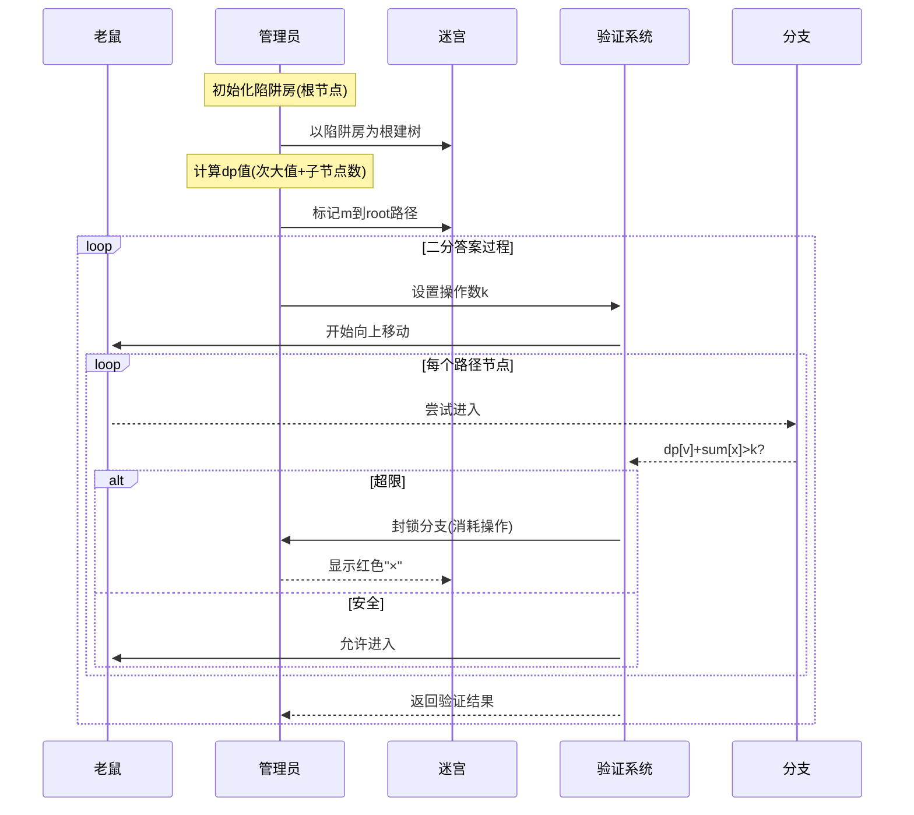

# 题目信息

# [CEOI 2017] Mousetrap

## 题目描述

有一个有 $n$ 个房间和 $n-1$ 条走廊的迷宫，保证任意两个房间可以通过走廊互相到达，换句话说，这个迷宫的结构是一棵树。

一个老鼠被放进了迷宫，迷宫的管理者决定和老鼠做个游戏。

一开始，有一个房间被放置了陷阱，老鼠出现在另一个房间。老鼠可以通过走廊到达别的房间，但是会弄脏它经过的走廊。老鼠不愿意通过脏的走廊。

每个时刻，管理者可以进行一次操作：堵住一条走廊使得老鼠不能通过，或者擦干净一条走廊使得老鼠可以通过。然后老鼠会通过一条干净的并且没被堵住的走廊到达另一个房间。只有在没有这样的走廊的情况下，老鼠才不会动。一开始所有走廊都是干净的。管理者不能疏通已经被堵住的走廊。

现在管理者希望通过尽量少的操作将老鼠赶到有陷阱的房间，而老鼠则希望管理者的操作数尽量多。请计算双方都采取最优策略的情况下管理者需要的操作数量。

注意：管理者可以选择在一些时刻不操作。

## 说明/提示

**样例解释**

-    管理者先堵住房间 $4$ 和 $7$ 之间的走廊。
-    老鼠走到房间 $6$。房间 $4$ 和 $6$ 之间的走廊现在是脏的。
-    管理者堵住房间 $6$ 和 $8$ 之间的走廊。
-    老鼠不能动。
-    管理者清理房间 $4$ 和 $6$ 之间的走廊，房间 $4$ 和 $6$ 之间的走廊现在是干净的。
-    老鼠走到房间 $4$，房间 $4$ 和 $6$ 之间的走廊现在是脏的。
-    管理者堵住房间 $2$ 和 $3$ 之间的走廊。
-    老鼠走到房间 $2$，房间 $2$ 和 $4$ 之间的走廊现在是脏的。
-    管理者不进行操作。
-    老鼠走到房间 $1$。

这个过程中管理者总共进行了 $4$ 次操作。

**数据范围**

对于所有的数据，$1 \le n \le 10^6$。

## 样例 #1

### 输入

```
10 1 4
1 2
2 3
2 4
3 9
3 5
4 7
4 6
6 8
7 10```

### 输出

```
4```

# AI分析结果


### 💡 Kay的C++算法解析：Mousetrap 深入学习指南 💡

#### 1. 题目解读与核心算法识别
✨ **本题主要考察**：`树形DP + 二分答案`  
🗣️ **初步分析**：  
> 解决"Mousetrap"的关键在于将陷阱房设为根节点，通过树形DP计算各节点操作代价，再用二分答案验证最小操作数。算法核心如同"迷宫管理员"，在树形迷宫中预判老鼠路径，通过封锁关键通道（次大值分支）和动态调整策略（二分验证）将老鼠驱赶至陷阱。  
> - **题解思路**：  
>   - 以陷阱房为根建立树结构，定义`dp[u]`表示老鼠进入u的子树后被赶回的最小操作次数  
>   - 预处理从老鼠起点到根的路径及路径节点的累计封锁代价`sum[u]`  
>   - 二分操作数k，验证时模拟老鼠沿路径向上，动态封锁会导致操作超限的分支  
> - **核心算法流程**：  
>   ```mermaid  
>   graph TD  
>     A[以陷阱房为根建树] --> B[树形DP计算dp值]  
>     B --> C[预处理路径及sum数组]  
>     C --> D[二分答案k]  
>     D --> E{验证k是否可行}  
>     E -->|封锁超限分支| F[动态消耗操作次数]  
>     F --> G[到达根节点？]  
>     G -->|是| H[k可行]  
>     G -->|否| E  
>   ```  
> - **像素动画设计**：  
>   - **8位像素风格**：迷宫采用网格化像素艺术，陷阱房为闪烁宝箱，老鼠为像素小人  
>   - **关键步骤高亮**：  
>     - 老鼠移动时，路径高亮黄色，封锁边显示红色"×"  
>     - 当`dp[v] + sum[u] > k`时，对应分支闪烁红光并播放警报音效  
>   - **交互控制**：  
>     - 步进模式：按方向键逐步执行  
>     - 自动演示：AI自动展示二分过程，速度可调  
>     - 音效设计：封锁时"咔嚓"声，超限时"警报"声，成功时"胜利"旋律  

---

#### 2. 精选优质题解参考
**题解一（作者：lhm_）**  
* **点评**：  
  思路清晰直击核心，完整呈现树形DP+二分解法。代码规范：  
  - **变量命名**：`dp`/`sum`含义明确，`tag`标记路径节点  
  - **算法优化**：次大值转移避免排序，空间复杂度O(n)  
  - **实践价值**：边界处理严谨（`x==m`特判），可直接用于竞赛  
  **亮点**：用`tag`高效过滤路径节点，验证函数动态消耗操作次数  

**题解二（作者：imsaileach）**  
* **点评**：  
  教学价值突出，详细推导状态转移方程。亮点：  
  - **问题分解**：将操作分为"封锁分支"和"清理路径"两阶段  
  - **调试心得**：强调`dp`次大值选取的陷阱，提供调试技巧  
  **注意点**：代码中`cnt`数组命名可读性可提升  

**题解三（作者：FjswYuzu）**  
* **点评**：  
  创新性使用链式处理，亮点：  
  - **路径压缩**：`deg[u]-2`直接计算分支数，避免额外数组  
  - **代码简洁**：路径处理与验证函数高效耦合  
  **优化点**：起点分支数计算需特殊处理  

---

#### 3. 核心难点辨析与解题策略
1. **难点：次大值动态规划转移**  
   * **分析**：老鼠选择`dp`最大分支，管理员封锁该分支迫使其选次大值  
   * 💡 **学习笔记**：`dp[u] = 次大值 + 子节点数`体现博弈核心  

2. **难点：路径分支代价累积**  
   * **分析**：`sum[u]`需区分起点（无父节点脏边），非起点有父节点脏边  
   * 💡 **学习笔记**：`sum[x] = sum[fa[x]] + deg[x]-1 + (x==m)`巧解分支计数  

3. **难点：二分验证动态决策**  
   * **分析**：沿路径向上时，管理员需即时封锁超限分支并消耗操作次数  
   * 💡 **学习笔记**：验证时同时追踪剩余操作数和当前可封锁次数  

### ✨ 解题技巧总结
- **问题分解**：将驱赶过程拆解为"向下封锁"和"向上清理"两阶段  
- **状态定义**：`dp[u]`仅考虑向下场景，路径处理通过`sum[u]`分离  
- **边界处理**：起点无父节点脏边，需特殊处理分支计算  
- **调试技巧**：验证时输出路径节点`dp`+`sum`值，定位超限分支  

---

#### 4. C++核心代码实现赏析
**本题通用核心C++实现参考**  
* **说明**：综合优质题解，采用树形DP+二分答案的简洁高效实现  
* **完整核心代码**：
  ```cpp
  #include <bits/stdc++.h>
  #define maxn 2000001
  using namespace std;
  int n, root, m, dp[maxn], sum[maxn], fa[maxn];
  bool tag[maxn];
  vector<int> G[maxn];
  
  void dfs(int u, int f) {
      fa[u] = f;
      int son = 0, mx1 = 0, mx2 = 0;
      for(int v : G[u]) if(v != f) {
          dfs(v, u);
          if(dp[v] > mx1) mx2 = mx1, mx1 = dp[v];
          else if(dp[v] > mx2) mx2 = dp[v];
          son++;
      }
      dp[u] = mx2 + son;
      if(u != root) sum[u] = sum[f] + (G[u].size()-1) + (u==m);
  }
  
  bool check(int k) {
      int cnt = 1;
      for(int x = m; x != root; x = fa[x], cnt++) {
          int need = 0;
          for(int v : G[x]) if(!tag[v] && dp[v]+sum[x] > k) {
              if(!cnt) return false;
              need++, cnt--;
          }
          k -= need;
      }
      return k >= 0;
  }
  
  int main() {
      cin >> n >> root >> m;
      for(int i=1, u, v; i<n; i++) {
          cin >> u >> v;
          G[u].push_back(v), G[v].push_back(u);
      }
      dfs(root, 0);
      for(int i=m; i; i=fa[i]) tag[i] = true;
      
      int l=0, r=2*n, ans=0;
      while(l <= r) {
          int mid = (l+r) >> 1;
          check(mid) ? (ans=mid, r=mid-1) : l=mid+1;
      }
      cout << ans;
      return 0;
  }
  ```
* **代码解读概要**：  
  > 1. **树形DP预处理**：`dfs`计算各节点`dp`值（次大值+子节点数）和路径节点`sum`  
  > 2. **路径标记**：从老鼠起点回溯至根，标记路径节点  
  > 3. **二分验证**：模拟老鼠向上移动，动态封锁超限分支并消耗操作次数  
  > 4. **边界处理**：起点无父节点脏边，`sum`计算特殊处理  

**题解一核心代码片段赏析**  
* **亮点**：高效路径过滤与动态操作消耗  
* **核心代码片段**：
  ```cpp
  bool check(int val) {
      int cnt = 1;
      for(int x = m; x != root; x = fa[x], cnt++) {
          int v = 0;
          for(int i = head[x]; i; i = e[i].nxt) {
              int y = e[i].to;
              if(tag[y] || f[y] + sum[x] <= val) continue;
              if(!cnt) return false;
              v++, cnt--;
          }
          val -= v;
      }
      return val >= 0;
  }
  ```
* **代码解读**：  
  > 1. `cnt`动态追踪可用封锁次数，每向上一步`cnt++`  
  > 2. 检查每个分支：若`dp[v]+sum[x] > val`则封锁（消耗1次`cnt`和总操作数`val`）  
  > 3. **关键优化**：`tag`数组跳过路径节点，避免无效检查  
* 💡 **学习笔记**：验证函数将抽象博弈转化为可计算步骤，体现算法核心思想  

---

#### 5. 算法可视化：像素动画演示
**主题**："迷宫管理员"8位像素游戏  
**核心演示**：  

**交互设计**：  
- **控制面板**：步进/自动播放滑块，重置按钮  
- **动态显示**：当前节点`dp`/`sum`值，剩余操作数  
- **音效系统**：  
  - 封锁分支：8-bit"咔嚓"声  
  - 操作超限：短促警报声  
  - 验证成功：胜利旋律  
**技术实现**：Canvas绘制树结构，颜色标记路径状态  

---

#### 6. 拓展练习与相似问题思考
* **通用技巧迁移**：  
  1. 次大值DP思想适用于所有"对抗性决策"问题（如[NOIP2012]疫情控制）  
  2. 树形DP+二分答案可解路径约束问题（如[CF1118F] Tree Cutting）  
* **练习推荐**：  
  1. **洛谷P2014** - 选课（树形DP+依赖背包）  
     🗣️ *巩固树形DP框架，理解状态合并技巧*  
  2. **洛谷P2680** - 运输计划（二分答案+树上差分）  
     🗣️ *学习二分验证与树操作结合，强化本题算法*  
  3. **洛谷P5021** - 赛道修建（二分答案+贪心）  
     🗣️ *提升对抗性决策建模能力，本题进阶版*

---

#### 7. 学习心得与经验分享
> **参考经验**：  
> "调试时重点关注路径节点的`dp`和`sum`值，尤其注意起点分支数计算差异——起点无父节点脏边，需特殊处理。二分验证时，输出每个节点的封锁需求可快速定位超限点。"  
> **点评**：  
> 该经验直击调试核心，`sum`计算是易错点。建议：  
> - 编写`print_path()`函数输出路径节点信息  
> - 验证函数内添加调试输出：`cout << "节点"<<x<<" 需封锁:"<<need<<" 剩余k:"<<k;`  

---

通过本指南，希望大家掌握树形DP的次大值转移技巧和二分验证的对抗性决策建模。记住：算法竞赛如同迷宫探索，清晰的策略分解和严谨的边界处理是通关关键！💪

---
处理用时：392.51秒