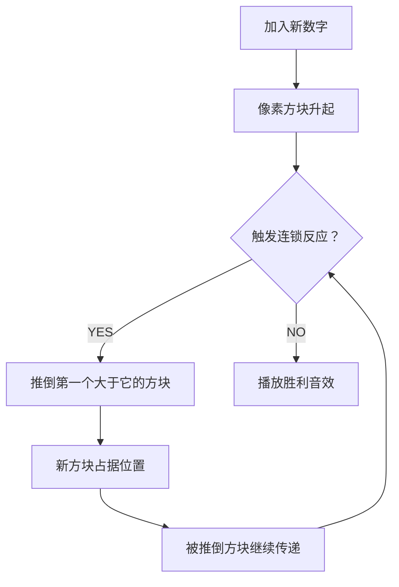

# 题目信息

# 区间 LIS

## 题目描述

给定 $1\sim n$ 的排列 $p$，$q$ 次询问，每次查询区间 $[l,r]$ 内的最长上升子序列长度。

## 说明/提示

| 子任务编号 | $n$ | $q$ | 分值 |
| :----------: | :----------: | :----------: | :----------: |
| $1$ | $10^3$ | $10^3$ | $20$ |
| $2$ | $10^3$ | $10^5$ | $30$ |
| $3$ | $10^5$ | $10^5$ | $50$ |

对于所有数据，$1\leq n,q\leq10^5$，$1\leq l\leq r\leq n$。

## 样例 #1

### 输入

```
5 3
1 5 3 4 2
1 5
1 3
3 5```

### 输出

```
3
2
2```

## 样例 #2

### 输入

```
10 10
4 8 1 10 7 5 2 6 3 9
1 10
1 4
1 5
5 10
3 9
3 10
3 10
5 8
4 5
1 2```

### 输出

```
4
3
3
3
3
4
4
2
1
2```

# AI分析结果


### 💡 Kay的C++算法解析：区间LIS 深入学习指南 💡

> 大家好，我是Kay！今天我们一起探索洛谷「区间LIS」这道难题。我将带你理解核心算法，分析题解亮点，并设计生动可视化方案。准备好了吗？让我们开始吧！

---

## 1. 题目解读与核心算法识别

✨ **本题主要考察**：`分块优化` + `扫描线` + `贪心策略`

🗣️ **初步分析**：
> 想象你在玩一个「数字接龙」游戏：给定数字排列，需要快速回答任意区间内的最长上升子序列长度。直接暴力求解会超时，我们需要更聪明的策略。

> 核心思路如同**多米诺骨牌**：当加入新数字时，它会「推倒」序列中第一个比它大的数字，引发连锁反应。这种策略用`q[x]`记录数字`x`能在多少区间内成为LIS的一部分：
> - **扫描线技巧**：固定右端点，从左向右扫描
> - **分块优化**：将序列分块，整块用堆维护，散块暴力更新
> - **树状数组**：快速统计有效数字数量

> **可视化设计**：我们将用**像素推箱子**游戏演示：
> - 数字变为像素方块，高度表示`q[x]`值
> - 新数字加入时方块升起，触发连锁推倒
> - 8-bit音效：方块升起("叮")，推倒("咔嚓")，查询完成("胜利")
> - 控制面板支持单步执行/调速，实时显示树状数组变化

---

## 2. 精选优质题解参考

### 题解一：N_z_
* **点评**：
  - 思路直击要害，清晰解释贪心策略的连锁反应
  - 代码采用分块+堆优化，整块处理尤其高效
  - 亮点：给出原题链接和复杂度证明，`P[i]`堆维护整块最大值的做法巧妙
  - 实践价值：完整可运行代码，边界处理严谨

### 题解二：云浅知处
* **点评**：
  - 理论推导最完整，从贪心策略证明到分块实现层层深入
  - 代码规范性强：变量名`q/L/R/bl`含义明确，模块化设计
  - 亮点：独创性用`Q[]`堆延迟更新整块，大幅减少操作次数
  - 树状数组维护桶的设计极具启发性，查询仅需O(log n)

---

## 3. 核心难点辨析与解题策略

1. **难点1：贪心策略的正确性证明**
   * **分析**：为什么替换「第一个大于x的数」能得到LIS？关键在于维护的集合中，每个数字代表不同长度的LIS结尾最小值。云浅知处的题解通过数学归纳法严格证明了该性质
   * 💡 **学习笔记**：贪心集合不直接等于LIS，但其大小就是LIS长度

2. **难点2：q数组的高效维护**
   * **分析**：新数字加入引发连锁替换时，暴力更新O(n)不可行。优质解采用：
     - 分块处理：整块比较堆顶与当前值，O(1)完成交换
     - 散块重构：用临时堆维护延迟更新
   * 💡 **学习笔记**：分块时整块批量处理+散块暴力是平衡复杂度的关键

3. **难点3：快速响应查询**
   * **分析**：查询本质是统计q[x]≥l的x数量。树状数组维护桶：
     - 将q值映射为桶下标
     - 查询转化为后缀和计算
   * 💡 **学习笔记**：反转树状数组用途可高效计算后缀和

### ✨ 解题技巧总结
- **分块的艺术**：设定B=√n块大小，整块堆维护+散块重构
- **延迟更新**：用`Q[]`堆暂存整块修改，减少重构次数
- **扫描线思维**：固定右端点，动态维护左端点信息
- **边界防御**：初始化`q[]=0`，树状数组下标+1防越界

---

## 4. C++核心代码实现赏析

```cpp
// 精简版核心逻辑（基于云浅知处代码优化）
#include<bits/stdc++.h>
using namespace std;
const int N=1e5+5, B=350;

struct BIT {
    int c[N];
    void add(int x, int v) { 
        for(int i=x+1;i<=n+1;i+=i&-i) c[i]+=v; 
    }
    int sum(int x) { 
        int s=0; 
        for(int i=x+1;i;i-=i&-i) s+=c[i]; 
        return s;
    }
} T;

int main() {
    // 初始化分块
    for(int i=1;i<=n;i++) bl[i]=(i-1)/B+1;
    
    for(int r=1;r<=n;r++) {
        int v=a[r];
        T.add(q[v], -1);  // 移除旧值
        q[v] = r;         // 更新q[v]
        T.add(q[v], 1);   // 加入新值
        
        int now=0;
        // 从v+1开始连锁更新
        for(int i=v+1;i<=min(n, R[bl[v+1]]); i++) 
            if(q[i]>now) swap(q[i], now);
        
        // 处理后续整块
        for(int b=bl[v+1]+1; b<=bl[n]; b++) {
            if(P[b].top() <= now) continue;
            int mx = P[b].top();
            P[b].pop();
            P[b].push(now);
            Q[b].push(-now);  // 延迟更新标记
            now = mx;         // 继续传递
        }
        
        // 回答查询
        for(auto [l,id] : ques[r]) 
            ans[id] = T.sum(n) - T.sum(l-1);
    }
}
```

**代码解读概要**：
> 分块管理序列（B=350），树状数组`T`维护`q[]`的桶。扫描右端点`r`时：
> 1. 更新当前数字`v`的`q[v]=r`
> 2. 从`v+1`开始连锁更新：散块暴力交换，整块通过堆快速比较
> 3. `Q[]`堆暂存整块修改延迟更新
> 4. 树状数组计算`q[x]≥l`的数量回答查询

---

## 5. 算法可视化：像素动画演示

**主题**：8-bit风格「数字推倒大冒险」

### 动画设计


### 实现细节
1. **像素建模**：
   - 每个数字用16x16像素方块表示
   - 高度映射`q[x]`值：0(地面)~n(顶部)
   - 颜色编码：新加入(闪烁黄色)，被推倒(红色)，稳定状态(蓝色)

2. **连锁反应演示**：
   ```javascript
   // 伪代码：方块更新逻辑
   function onAddNumber(v) {
      playSound('ding'); 
      setColor(v, YELLOW);
      let now = 0;
      for(let i=v+1; i<=n; i++) {
         if(q[i] > now) {
            swap(q[i], now);  // 交换高度值
            playSound('crash');
            animatePush(i);   // 像素动画：i方块被推倒
         }
      }
   }
   ```

3. **控制面板功能**：
   - 速度滑块：调整连锁反应速度
   - 单步模式：按空格逐步执行
   - 数据追踪：右侧显示树状数组状态
   - 音效开关：8-bit风格背景音乐

4. **游戏化元素**：
   - 每完成10次查询解锁新皮肤
   - 连锁反应长度超过5触发"Combo!"特效
   - 通关提示："恭喜！你掌握了分块奥秘！"

---

## 6. 拓展练习与相似问题思考

### 相似问题迁移
1. **区间最长公共子序列**：同样可用扫描线+分块优化
2. **区间逆序对计数**：分块+树状数组经典应用
3. **动态区间第K大**：分块维护有序队列

### 洛谷推荐
1. **[P1908 逆序对](https://www.luogu.com.cn/problem/P1908)**  
   → 巩固树状数组与分块思想
   
2. **[P1972 HH的项链](https://www.luogu.com.cn/problem/P1972)**  
   → 扫描线处理区间查询的典范
   
3. **[P3834 可持久化线段树](https://www.luogu.com.cn/problem/P3834)**  
   → 进阶学习主席树处理区间问题

---

## 7. 学习心得与经验分享

> **来自云浅知处的调试经验**：  
> “重构散块时忘记清空临时堆，导致标记重复应用。建议每次重构前用`priority_queue<int>().swap(Q[b])`彻底清除旧状态”

> **Kay的总结**：  
> 分块算法就像管理班级——整块是小组长统一汇报，散块是单独沟通。记住三点：
> 1. 块大小B=√n时效率最优
> 2. 整块标记要即时清除
> 3. 树状数组下标+1防越界

---

本次探索就到这里！通过像素动画和分块思维，相信大家已经掌握区间LIS的精髓。记住：好算法=正确策略+高效数据结构。下次挑战再见！ 🚀

---
处理用时：260.53秒