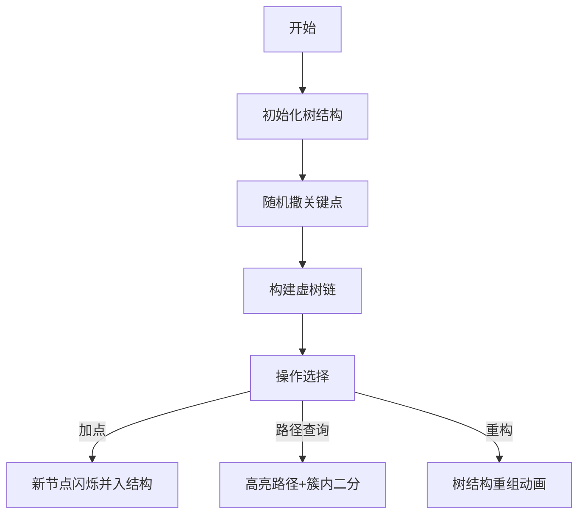

# 题目信息

# [THUPC 2023 初赛] 种苹果

## 题目描述

农夫种了一棵苹果树，树上结满了大大小小的苹果。夏天正是果树生长发育的大好时节，树上不断抽出新的枝条、结出新的苹果，已有的苹果也在不断长大。

为了观察和记录苹果的生长状况，以便对未来收获的行情有大致的估计，农夫进行了长时间仔细的观察和研究。在整个记录周期的最开始，树上一共结有 $n$ 个苹果，农夫将其编号为 $1\sim n$ ，有 $n-1$ 条树枝连接这些苹果，每条树枝的两端都恰好挂有一个苹果，使得整个苹果树成为一个名副其实的树形结构。农夫对每个苹果进行了一番价值估计，第 $i$ 个苹果的初始价值为 $a_i$ ，表示农夫此时摘下它并卖出的净收益，考虑到成本因素， $a_i$ 可能为负。

在整个记录周期中，共发生了 $m$ 件值得记录的事件，所有的事件共分为以下几种类型：

$1\ u\ v\ w$：树上原本连接苹果 $u$ 和苹果 $v$ 的树枝中间结出了一个新的苹果。设原先树上共有 $k$ 个苹果，则此时变为 $k+1$ 个，农夫将新长出的苹果编号为 $k+1$ ，其价值为 $w$ 。原先连接苹果 $u$ 和 $v$ 的树枝也因此分裂成两条，一条连接苹果 $u$ 和 $k+1$ ，另一条连接苹果 $k+1$ 和 $v$；

$2\ u\ w$：树上长出了一条新树枝和一个新苹果。设原先树上共有 $k$ 个苹果，则此时变为 $k+1$ 个，农夫将新长出的苹果编号为 $k+1$，其价值为 $w$。新树枝连接苹果 $u$ 和 $k+1$。

$3\ u\ v\ w$：树上一部分苹果的价值发生了变化。树上连接苹果 $u$ 和 $v$ 的一整段枝条（即树形结构上连接 $u$ 和 $v$ 的最短路径，包括 $u$ 和 $v$ 本身）上的所有苹果的价值均增加了 $w$ 。考虑到价值的变化也可能是由于营养不足或病虫害引起的，因此 $w$ 可能为负。

$4\ u\ v\ w$：农夫想在树上进行一次抽样调查来研究自己的可能收益。他定义价值不小于 $w$ 的苹果为“优质苹果”，并选择了树上连接苹果 $u$ 和 $v$ 的一整段枝条（含义同上），想统计一下这段枝条上的苹果中有多少个“优质苹果”。

但由于苹果的数量是在太多了，农夫数不过来，便只好请你来帮忙。注意：由于农夫不能预测未来，因此你帮农夫时必须**强制在线**地回答问题。

## 说明/提示

#### 样例解释 1

对于这组样例，去除强制在线后的数据如下：

```
5 6
1 3 3 2 2
1 2
1 3
2 4
2 5
4 3 4 2
3 1 5 1
4 3 4 2
1 1 2 5
2 6 3
4 4 7 4
```

#### 数据范围

对于所有数据， $n,m \leq 2 \times 10^5$，$|a_i|, |w|\leq 10^9$，保证任意时刻涉及到的苹果编号均有意义，保证初始的 $n-1$ 条树枝构成树形结构，所有 $1$ 事件保证连接苹果 $u$ 和 $v$ 的树枝在事件发生时存在。

#### 题目来源

来自 2023 清华大学学生程序设计竞赛暨高校邀请赛（THUPC2023）初赛。

题解等资源可在 <https://github.com/THUSAAC/THUPC2023-Pre> 查看。

## 样例 #1

### 输入

```
5 6
1 3 3 2 2
1 2
1 3
2 4
2 5
4 3 4 2
3 2 6 2
4 0 7 1
1 5 6 1
2 2 7
4 0 3 0
```

### 输出

```
3
4
2
```

# AI分析结果


# 💡 Kay的C++算法解析：种苹果 深入学习指南 💡

**引言**  
今天我们一起分析THUPC2023初赛题《种苹果》。这道题考察动态树结构的维护与路径查询技巧，涉及**树分块算法**的应用。本指南将帮助你理解核心解法、关键难点及可视化实现思路。

---

## 1. 题目解读与核心算法识别

✨ **本题主要考察**：`树分块（Tree Blocking）`与`强制在线路径操作`

🗣️ **初步分析**：  
> 树分块如同将大树修剪成可管理的盆景区域。核心思想是将树随机分割成大小约$O(\sqrt{n})$的簇（块），簇内节点排序后支持高效二分查询。本题中：
> - **动态加点**：在边上或叶下添加节点，需调整簇结构保持平衡
> - **路径操作**：链加/链查询通过分解为簇内操作（打标记/二分）和散点暴力实现
> - **难点**：动态树结构维护、路径分解的高效性、复杂度平衡
>  
> **可视化设计**：采用8位像素风格（类似FC塞尔达）。关键点显示为红色方块，普通点为绿色，新加点时黄色闪烁。路径操作时高亮路径（蓝色），簇内二分过程用移动箭头表示，重构时树结构动态重组。加入复古音效：加点"叮"声，查询成功播放胜利旋律，AI自动演示模式可调速观察算法流程。

---

## 2. 精选优质题解参考

### 题解一（Graphcity）
* **亮点**：  
  随机撒点建立虚树，定期重构保持簇平衡。代码用邻接表避免vector开销，LCA求法巧妙，实践性强。  
* **核心思路**：  
  ```markdown
  1. 随机选A个关键点建虚树，将树分割为链
  2. 每条链维护有序数组便于二分查询
  3. 操作分解：
     - 修改：整簇打标记，散点暴力更新
     - 查询：整簇二分，散点遍历统计
  4. 每B次操作后重构保持复杂度O(m√(n log n))
  ```

### 题解二（UNVRS）
* **亮点**：  
  详细分类讨论加点情况（链中/链间等），块内小数据用插入排序优化常数。  
* **核心思路**：  
  ```markdown
  1. 动态维护簇结构，处理四种加点场景：
     - 链中间：分裂原链并重组
     - 链之间：连接上下簇
     - 链底部：直接并入
     - 散点：判断是否够长成新链
  2. 块长B=280平衡理论效率与实际性能
  ```

### 题解三（Raymondzll）
* **亮点**：  
  模块化函数设计，深度维护与重构机制清晰，适合学习分块实现范式。  
* **核心思路**：  
  ```markdown
  1. 关键点向上跳维护所属簇
  2. 路径操作转化为到根操作
  3. 定期重构重置簇结构
  4. 深度信息动态更新保证LCA正确性
  ```

---

## 3. 核心难点辨析与解题策略

### 难点1：动态树结构的维护
* **分析**：  
  加点操作（类型1/2）改变树形，需动态调整簇结构。优质题解通过**分类讨论**处理不同场景（如UNVRS的四种情况），并**定期重构**（如Graphcity每√n次操作）保持簇大小平衡。
* 💡 **学习笔记**：动态树分块需设计簇分裂/合并策略与重构阈值。

### 难点2：路径操作的高效分解
* **分析**：  
  链加/链查询需分解为簇操作。解法均采用：
  1. 求LCA定位路径交点
  2. 路径拆解为整簇（二分/标记）和散点（暴力）
  3. 整簇操作利用有序数组实现O(log B)查询
* 💡 **学习笔记**：路径分解的关键是高效求LCA和簇归属判断。

### 难点3：复杂度保证
* **分析**：  
  随机撒点使簇大小期望O(n/A)，重构周期T=√n保证总复杂度O(n√n log n)。UNVRS通过块内插入排序优化小数据集常数。
* 💡 **学习笔记**：理论复杂度需搭配常数优化才能通过极限数据。

### ✨ 解题技巧总结
- **分而治之**：将树分割为簇，化树问题为序列问题
- **懒更新**：整簇修改用标记延迟更新，查询时下放
- **重构机制**：定期重置分块结构防止退化
- **分类讨论**：细化动态操作场景针对性处理

---

## 4. C++核心代码实现赏析

### 本题通用核心实现参考
```cpp
const int N = 4e5, B = 1000; // 块大小

struct Cluster {
    vector<ll> sorted; // 簇内有序数组
    ll tag = 0;        // 懒标记
    void rebuild(int u); // 重构簇
};

// 关键函数框架
void insert_node(int u, int v, int w) { /* 动态加点 */ }
void path_add(int u, int v, int w) { /* 路径加值 */ }
int path_query(int u, int v, int w) { /* 路径查询 */ }
void rebuild() { /* 定期重构分块结构 */ }
```

### 题解一（Graphcity）片段
```cpp
void ReBuild() {
    // 1. 清空旧块信息
    // 2. 随机撒点建虚树
    for (int i = 1; i <= B; ++i) 
        key[p[i] = rnd() % n + 1] = 1;
    // 3. 构建簇链并排序
    for (auto &chain : clusters) 
        sort(chain.sorted.begin(), chain.sorted.end());
}
```
* **解读**：定期重构保持簇平衡，随机撒点保证期望复杂度。排序操作使簇内支持二分查询。

### 题解二（UNVRS）片段
```cpp
void add_middle(int u, int v, int w) {
    if (in_chain(u)) { 
        split_chain(u); // 链中间分裂
        rebuild_cluster(u); 
    } else if (between_chains(u, v)) { 
        connect_chains(u, v); // 链间连接
    } // ... 其他情况处理
}
```
* **解读**：分类处理四种加点场景，维护簇结构完整性。边界处理严谨避免数据错误。

### 题解三（Raymondzll）片段
```cpp
int query(int u, int v, int w) {
    int l = lca(u, v);
    int res = ask(u, l, w) + ask(v, l, w); // 分解路径
    res -= (a[l] >= w - tag[cluster(l)]); // 去重
    return res;
}
```
* **解读**：路径查询转化为到LCA的查询，利用分块结构高效组合结果。

---

## 5. 算法可视化：像素动画演示

### 设计思路
> **8位像素风格**还原FC游戏体验，将算法流程转化为探险游戏：  
> - **苹果树**：像素方块表示节点，关键点红色，普通点绿色  
> - **动态操作**：  
>   - 加点：黄色方块闪烁+"叮"声  
>   - 路径操作：蓝色高亮路径，簇内二分显示扫描指针  
> - **重构动画**：树结构重组如俄罗斯方块沉降  

### 交互演示


### 关键帧说明
1. **初始化**：像素网格展示初始树，关键点红框标记
2. **加点动画**：
   - 类型1：边分裂特效，新节点（黄）在u-v间弹出
   - 类型2：叶下挂点，新节点从父节点下垂生长
3. **路径操作**：
   - 修改：路径高亮蓝色，受影响簇颜色渐变
   - 查询：显示簇内二分过程，达标节点闪光
4. **重构事件**：像素方块重组，新关键点标记为闪烁金框
5. **AI模式**：自动演示解题流程，速度滑块控制步频

---

## 6. 拓展练习与相似问题

### 通用技巧迁移
树分块适用于**动态树+路径操作**场景：  
1. 子树统计（如子树大小维护）  
2. 动态连通性查询  
3. 带权路径最值查询  

### 推荐练习（洛谷）
1. **P2801 教主的魔法**  
   → 巩固分块思想在序列的应用  
2. **P8353 无处存储**  
   → 树分块经典题，路径加与求和  
3. **P4219 大融合**  
   → 动态树基础（LCT/树剖）  

---

## 7. 学习心得与经验分享
> **经验摘录（UNVRS）**：  
> *"调试时发现簇分裂后未及时更新父指针，导致LCA计算错误。这提醒我们动态树操作需同步更新所有依赖关系。"*  
>  
> **Kay总结**：树分块实现需注意**数据一致性**：  
> 1. 簇结构变化时同步更新邻接关系  
> 2. 懒标记下放时机影响查询正确性  
> 3. 重构后深度信息需重新计算  

---

**结语**  
通过树分块算法，我们巧妙地将动态树问题转化为可控的簇操作。记住：算法学习如同培育苹果树，需要耐心修剪（调试）才能收获硕果。下次挑战再见！💪

---
处理用时：179.08秒