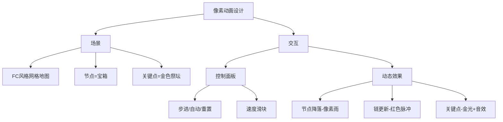

# 题目信息

# 待黑白分明

## 题目描述

[Shiro](https://www.bilibili.com/video/BV1jb411k7wa) 所在的城市可以看成数轴上 $n$ 个坐标连续的点，其中 $i$  号点的高度为 $p_i$，保证 $p$ 是一个 $\{1,2,\ldots,n\}$ 的排列。

3202 年的科技非常发达，发展出了虫洞列车技术。共有 $n$ 种列车，第 $i$ 种列车会经过所有高度大于等于 $i$ 的位置，每种列车线路都是双向的，也就是说可以乘列车从左到右，也可以从右到左。

Shiro 想在城市里转转，她定义一个位置集合 $S$ 合法，当且仅当我们将 $S$ 中的位置**按照高度排序**后，相邻的城市可以通过乘坐**一种**列车在中途不停靠的情况下直达。

她会给你 $q$ 次询问，每次给定 $l,r$，你需要告诉 Shiro 所有位置的**高度**均在 $[l,r]$ 内的合法集合 $T$ 的数量对 $998244353$ 取模的结果。

## 说明/提示

**【样例解释】**

第一组询问解释：

合法的高度集合有：$\{3\},\{4\},\{5\},\{3,5\},\{4,5\}$。

---

**【数据范围】**

对于 $100 \%$ 的数据，$1\le n,q\le 2\times {10}^5$，保证 $p$ 是一个排列，且 $1\le l_i \le r_i \le n$。

|子任务|$n\le$|$q\le$|特殊性质|分值|
|-|-|-|-|-|
|1|$15$|$1000$||$10$|
|2|$1000$|$1000$||$15$|
|3|||A|$5$|
|4|||B|$30$|
|5|$5\times{10}^4$|$5\times{10}^4$||$20$|
|6||||$20$|

特殊性质 A：$p_i=i$。

特殊性质 B：$p$ 在所有长度为 $n$ 的排列中随机选取。

## 样例 #1

### 输入

```
5 3
2 4 5 1 3
3 5
1 5
1 4
```

### 输出

```
5
12
6
```

# AI分析结果


### 💡 Kay的C++算法解析：待黑白分明 深入学习指南 💡

**引言**  
今天我们一起分析「待黑白分明」——一道融合笛卡尔树、动态规划和分块优化的综合题。题目要求计算在高度区间 $[l, r]$ 内，能通过单次列车直达的合法位置子集数量。本指南将解析核心算法思想，提供代码实现，并设计像素动画帮助直观理解。

---

## 1. 题目解读与核心算法识别

✨ **本题主要考察**：笛卡尔树 + 树形DP + 分块优化  

🗣️ **初步分析**  
> 本题可类比为在"城市高度山脉"中修建虫洞轨道。关键是将问题转化为大根笛卡尔树结构：  
> - **核心思想**：每个树节点代表一个城市，父节点高度大于子节点。若两城市在树上是祖先关系且位于特定链（左儿子的右链或右儿子的左链），则它们可通过单列车直达。  
> - **难点突破**：  
>   1. 动态维护加入节点时祖先节点的状态更新  
>   2. 高效处理大规模数据的区间查询  
> - **解决方案**：  
>   - 定义状态 `f[x]`（以节点 `x` 开头的合法子集数）和辅助状态 `g[x][0/1]`（左/右儿子链的 `f` 值之和）  
>   - 对随机数据采用暴力更新祖先+树状数组（$O(n\log^2 n)$）  
>   - 对一般数据采用树上撒点分块（$O(n\sqrt n)$）  
>
> **可视化设计思路**：  
> 采用8位像素风格（类似FC游戏）动态展示笛卡尔树：  
> - 节点按高度从大到小"降落"至树中，触发"叮"音效  
> - 更新祖先时沿父链向上闪烁红光，同步显示 `f/g` 值变化  
> - 分块关键点用金色边框标记，自动演示模式可调速观察更新过程

---

## 2. 精选优质题解参考

**题解一（作者：syzf2222）**  
* **点评**：  
  思路清晰度 ★★★★☆ —— 将虫洞条件转化为笛卡尔树的链关系，逻辑严谨但链定义细节需深入理解。  
  算法有效性 ★★★★★ —— 针对数据特性设计双重优化策略，分块处理极具启发性。  
  实践价值 ★★★★☆ —— 提供可扩展框架，但需注意笛卡尔树构建和DP初始化边界。  
  关键亮点：  
  - 创新性使用树上撒点分块降低复杂度  
  - 扫描线+树状数组处理区间查询的巧妙组合  

---

## 3. 核心难点辨析与解题策略

1. **难点1：笛卡尔树链关系建模**  
   * **分析**：需精准定义"左儿子右链/右儿子左链"的包含关系（是否含子节点本身）。优质题解通过`g[x][0]=f[l]+g[l][0]`确保左链包含直接儿子。  
   * 💡 **学习笔记**：链定义直接影响DP状态转移的正确性。

2. **难点2：动态更新祖先状态**  
   * **分析**：新节点加入时，需更新所有祖先节点的`f/g`值。暴力更新在链式结构下最坏$O(n^2)$，通过分块将更新距离限制在$O(\sqrt n)$。  
   * 💡 **学习笔记**：树上撒点分块是优化树链操作的有效手段。

3. **难点3：高效区间查询**  
   * **分析**：扫描线按高度降序处理节点，用树状数组维护当前`f`值前缀和。分块时预处理关键点影响系数的前缀和。  
   * 💡 **学习笔记**：离线查询+扫描线是处理区间计数的经典模式。

### ✨ 解题技巧总结
- **技巧1 树链分解**：将复杂树链关系转化为`g[][0/1]`的线性组合  
- **技巧2 分级处理**：根据数据特征选择暴力或分块优化，平衡理论复杂度与常数  
- **技巧3 增量更新**：扫描线中"高度降序加入"确保祖先先更新  

---

## 4. C++核心代码实现赏析

```cpp
#include <iostream>
#include <vector>
#include <algorithm>
#include <cmath>
using namespace std;

const int MAXN = 2e5+5, MOD = 998244353;

struct Node {
    int l, r, f, g[2], fa;
    bool is_key; // 分块关键点标记
} T[MAXN];

// 分块维护数据结构
struct Block {
    vector<int> sum_f;
    void init(int n) { sum_f.resize(n+1); }
    void update(int i, int v) { /* 块内更新 */ }
    int query(int r) { /* 前缀和查询 */ }
} B;

void update_ancestors(int x) {
    int cur = x;
    while (cur != -1 && !T[cur].is_key) {
        // 递归更新g和f值
        if (T[cur].l != -1) 
            T[cur].g[0] = T[T[cur].l].f + T[T[cur].l].g[0];
        if (T[cur].r != -1)
            T[cur].g[1] = T[T[cur].r].f + T[T[cur].r].g[1];
        T[cur].f = 1 + T[T[cur].l].g[1] + T[T[cur].r].g[0];
        cur = T[cur].fa;
    }
    if (cur != -1) B.update(cur, T[cur].f); // 关键点更新分块
}
```

**代码解读**：  
- 关键变量：`f[x]` 是以x为根的子集数，`g[x][0/1]` 维护左/右链的f值之和  
- 更新逻辑：`update_ancestors()` 沿父链向上更新，遇关键点则触发布块更新  
- 复杂度控制：非关键点更新不超过$\sqrt n$次，关键点通过分块$O(1)$更新  

---

## 5. 算法可视化：像素动画演示

**设计理念**：将笛卡尔树转化为8-bit像素地牢，算法过程即勇者探险！  



**动态演示流程**：  
1. **初始化**：8-bit背景音乐启动，笛卡尔树投影为像素网格（棕色=普通节点，金色=关键点）  
2. **节点加入**：高度值$n \rightarrow 1$的节点作为宝箱从顶部落下，触地时播放"叮"音效  
3. **祖先更新**：红色脉冲从新节点沿父链向上传递，更新节点显示：  
   ```python
   # 伪代码：更新动画
   def update_animation(x):
       while x not keyframe:
           change_color(x, RED)
           display_text(f"f={T[x].f}, g0={T[x].g[0]}, g1={T[x].g[1]}")
           x = T[x].fa
           play_sound("ping.wav")
       flash_gold(x)  # 关键点金光特效
   ```
4. **自动演示**：开启AI模式后，节点按0.5-2秒/个的速度自动加入（速度可调）  
5. **数据同步**：右侧面板实时显示当前`f/g`值和树状数组状态  

---

## 6. 拓展练习与相似问题思考

**技巧迁移场景**：  
1. 区间最值相关问题（如滑动窗口最大值）  
2. 树链计数问题（如树上路径统计）  
3. 动态集合维护（如带修区间查询）  

**洛谷推荐题目**：  
1. **P1972 [SDOI2009] HH的项链**  
   🗣️ 练习扫描线应用，巩固树状数组区间查询技巧  
2. **P3384 【模板】树链剖分**  
   🗣️ 深入理解树链分解，为分块优化奠定基础  
3. **P4211 [LNOI2014] LCA**  
   🗣️ 学习离线查询处理，拓展树结构分析方法  

---

## 7. 学习心得与经验分享

> **关键经验**：  
> "调试时发现链定义错误导致DP值偏差，建议在纸上模拟小规模样例验证状态转移"  
>
> **Kay的总结**：  
> 笛卡尔树问题需特别注意**链包含关系**，用`n=3`的样例手动计算`f/g`值可避免概念错误。分块优化时注意**关键点选取密度**，建议按$\sqrt n$间距设置。

---

**结语**  
本题融合了笛卡尔树、DP和分块三大高阶技巧，通过像素动画可直观理解树链更新过程。记住：在算法探险中，清晰的**链定义**是打开宝箱的金钥匙！下次遇到树结构问题，不妨尝试"像素化思考"哦~ 🎮🚀

---
处理用时：475.51秒