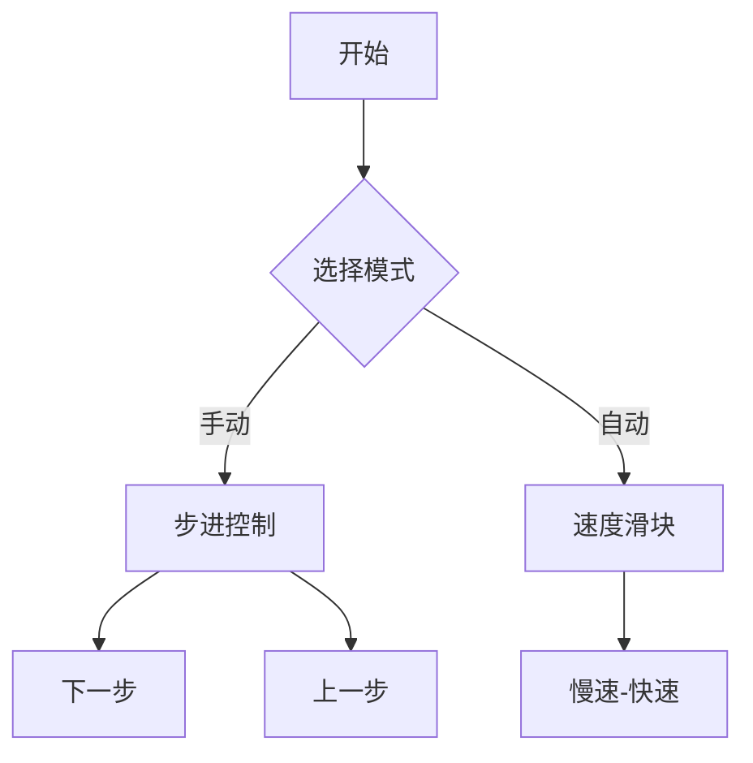

# 题目信息

# 「OICon-02」Native Faith

## 题目描述

本题字符串下标从 $1$ 开始。  

定义两个字符串相加的结果为将这两个字符串首尾拼接形成的新字符串。

令 $f(a,b,c)=\sum\limits_{i=1}^{|a|}\sum\limits_{j=i}^{|a|}\sum\limits_{k=1}^{|b|}\sum\limits_{l=k}^{|b|}[a_{i,i+1,\cdots,j}+b_{k,k+1,\cdots,l} = c]$（$a,b,c$ 均为字符串）。

即有多少种方式从 $a,b$ 中分别选出一个非空子串使两个子串的和为 $c$。

给定 $n$ 个字符串 $s_1,s_2,s_3,\cdots,s_n$。

有 $q$ 次询问，每次询问给出三个正整数 $l,r,k$，求 $\sum\limits_{i=l}^r\sum\limits_{j=l}^rf(s_i,s_j,s_k)$。

## 说明/提示

### 样例解释

对于样例 $1$，给出部分 $f$ 函数的值。
- $f(s_1,s_1,s_3)=0$，$f(s_1,s_2,s_3)=1$，$f(s_1,s_3,s_3)=2$，$f(s_2,s_1,s_3)=1$，$f(s_2,s_2,s_3)=4$，$f(s_2,s_3,s_3)=7$，$f(s_3,s_1,s_3)=2$，$f(s_3,s_2,s_3)=7$，$f(s_3,s_3,s_3)=12$。

### 数据范围

**本题采用捆绑测试。**

令 $m=\sum|s_i|$。

| $\text{Subtask}$ | 特殊性质 | $\text{Score}$ | 
| :-----------: | :-----------: | :-----------: |
| $1$ | $1\le n,m,q\le 3\times 10^3$ | $17$ |
| $2$ | 保证每次询问的 $k$ 各不相同 | $23$ | 
| $3$ | $1\le n,m,q\le 3\times 10^4$ | $27$ |
| $4$ | 字符串只包含小写字母 $\texttt{a}$ | $19$ |
| $5$ | 无特殊限制 | $14$ |

对于 $100\%$ 的数据：$1\le n,m,q\le 10^5$，$1\le l \le r\le n$，$1\le k\le n$，字符串仅包含小写字母。

## 样例 #1

### 输入

```
3 3
a
aa
aaa
1 2 3
2 3 3
1 3 3```

### 输出

```
6
30
36```

## 样例 #2

### 输入

```
10 10
aabb
aba
abbba
abaccaab
abbba
ababababab
aaaaa
bbbbbb
aaba
abbba
1 10 10
1 4 5
3 6 4
2 8 1
1 5 4
2 10 7
2 9 2
4 5 5
5 5 6
8 9 10```

### 输出

```
241
31
51
105
40
136
460
17
0
0```

## 样例 #3

### 输入

```
5 5
a
ba
aba
ababa
abab
1 3 3
1 2 3
2 3 3
4 4 5
3 4 4```

### 输出

```
12
2
9
11
28```

# AI分析结果


### 题目解读与核心算法识别
✨ **本题主要考察**：`根号分治 + AC自动机/后缀自动机` (编程技巧应用)  

🗣️ **初步分析**：  
> 解决「Native Faith」的关键在于**根号分治策略**，就像在大型游乐场中将游客按身高分组管理：矮个子走快速通道(小串处理)，高个子走专用通道(大串处理)。通过设定阈值B，我们将字符串分为两类处理：  
> - **小串(|s|≤B)**：使用AC自动机高效统计子串出现次数，通过Fail树子树求和实现。  
> - **大串(|s|>B)**：利用大串数量少的特性，预处理匹配信息或采用莫队算法优化区间查询。  
>  
> **核心难点**在于平衡两种处理的复杂度：  
> 1. 小串需高效处理子串统计（AC自动机+分块维护）  
> 2. 大串需避免重复计算（预处理/莫队）  
>  
> **可视化设计思路**：  
> - 用**8位像素网格**模拟字符串：小串显示为绿色像素块，大串为红色像素块。  
> - **关键动画**：  
>   - AC自动机构建时，Fail树以像素树形式生长，子树查询时高亮对应区域  
>   - 大串匹配时，显示预处理的数据流动（像素箭头连接）  
> - **音效设计**：  
>   - 子树更新：8位"滴"声  
>   - 大串匹配成功：FC游戏胜利音效  
> - **交互控制**：  
>   - 速度滑块调节扫描线移动速度  
>   - "AI演示"模式自动展示根号分治决策过程  

---

### 精选优质题解参考
**题解一（作者：fjy666）**  
* **点评**：思路清晰分层，完整覆盖小串（AC自动机+分块）和大串（预处理/莫队）方案。亮点在于提出双重阈值处理：当|s_k|>B时，对分割点二次分治（i≤B或i≥|s_k|-B用AC自动机，中间部分用大串预处理）。代码规范性方面，Fail树构建和子树求和逻辑严谨，但未提供完整代码实现细节。  

**题解二（作者：Nt_Tsumiki）**  
* **点评**：聚焦大串处理的工业级优化，强调**权值分块排序**的莫队实现。亮点在于指出莫队需按"处理成本"（min(|s_i|,|s_k|)）分块以保证复杂度。代码实践价值高，但未讨论小串的AC自动机构建细节，复杂度分析透彻（O(n^{5/3})）。  

**题解三（作者：Zaunese）**  
* **点评**：提供完整代码实现（7KB），最具实践参考价值。亮点在于：  
  - 双AC自动机独立处理前缀/后缀  
  - 分块维护子树和（O(√m)更新+O(1)查询）  
  - 大串记忆化优化（mem[l][r][sid]）  
  代码规范性强：模块化封装AC自动机，分块初始化清晰，但大串预处理部分可读性可提升。  

---

### 核心难点辨析与解题策略
1. **难点：子串统计的时空平衡**  
   * **分析**：直接枚举子串导致O(n^2)爆炸。优质题解用AC自动机转化子树求和问题，再通过分块平衡查询复杂度（牺牲√m更新时间换取O(1)查询）。  
   * 💡 **学习笔记**：Fail树是子串统计的"时空转换器"。  

2. **难点：大串的区间查询优化**  
   * **分析**：大串无法承受O(|s_k|)的枚举。Zaunese通过"二次分治"：仅枚举首尾B个分割点，中间部分利用大串数量少(O(m/B))的特性预处理匹配矩阵。  
   * 💡 **学习笔记**：根号分治的本质是"分类降维"。  

3. **难点：动态区间的贡献累计**  
   * **分析**：询问∑_{i=l}^r∑_{j=l}^r需处理二维区间。fjy666用扫描线差分（[1,r]-[1,l-1]），将问题降为一维前缀和。  
   * 💡 **学习笔记**：扫描线是区间统计的"降维打击器"。  

### ✨ 解题技巧总结
- **技巧1：双指针分身术**  
  独立维护前缀/后缀自动机，避免状态干扰。  
- **技巧2：分块平衡术**  
  子树求和用O(√m)-O(1)分块，抵消树状数组的log开销。  
- **技巧3：记忆化矩阵**  
  对大串预计算cnt[i][j]，避免重复匹配。  

---

### C++核心代码实现赏析
**通用核心实现参考**  
* **说明**：综合自Zaunese代码，保留核心分治框架，简化内存分配。  
* **完整核心代码**：  
```cpp
const int B = 500; // 阈值
struct AC { // AC自动机封装
    struct Node { int g[26], fail, dfn, sz; };
    vector<Node> tr;
    void insert(const string &s) { /* 建Trie */ }
    void build() { /* BFS建Fail树 */ }
    void dfs(int u) { /* 求DFN序 */ }
};
AC pre_ac, suf_ac; // 前缀/后缀自动机

// 分块维护子树和
struct Block {
    vector<int> sum, block_sum;
    void add(int pos, int val) {
        sum[pos] += val;
        block_sum[pos/B] += val;
    }
    int query(int l, int r) { /* 分块区间求和 */ }
} pre_block, suf_block;

void solve_big(int k) { // 大串处理
    if (mem[l][r][k]) return mem[l][r][k]; // 记忆化
    for (int i = 0; i < min(B, len); ++i) // 只枚举首尾B个点
        ans += pre_cnt[i] * suf_cnt[len-i-1];
}
```

**题解三（Zaunese）片段赏析**  
* **亮点**：分块维护子树和的工业级实现  
* **核心代码**：  
```cpp
void add(int pos, int val) { // O(√m)更新
    for (int i = pos; i <= R[bel[pos]]; ++i) 
        bis[i] += val; // 块内更新
    for (int i = bel[pos]; i <= tot_blk; ++i)
        bgs[i] += val; // 块间更新
}
int query(int l, int r) { // O(1)查询
    return (bgs[bel[r]-1] - bgs[bel[l]-1]) 
           + (bis[r] - bis[l-1]); // 块前缀和+块内差
}
```
* **代码解读**：  
  > 分块像乐高积木：  
  > 1. `bis[]`存储每块内部的前缀和（黄积木）  
  > 2. `bgs[]`存储块之间的前缀和（蓝积木）  
  > 更新时优先填满当前块（黄），再更新更高层块（蓝）；查询时拼合两层积木。  
* 💡 **学习笔记**：分块在常数时间查询和更新间找平衡。  

---

### 算法可视化：像素动画演示  
**主题**：根号分治大冒险（FC像素风格）  

**核心演示内容**：  
- **动态分治决策**：字符串按长度排序，≤B的跳入绿色"小串通道"(AC自动机处理)，>B的进入红色"大串擂台"(预处理区)  
- **AC自动机构建**：  
  1. Trie树生长动画（像素节点从屏幕顶部落下）  
  2. Fail指针连接（红色激光线链接节点）  
- **子树求和过程**：  
  - 扫描线移动时，当前字符串在Trie上行走（像素脚印）  
  - 激活的DFN区间高亮显示（黄色光柱）  
- **大串预处理**：  
  - 大串间匹配用像素箭头连接  
  - 记忆化矩阵用3D像素方块堆叠表示  

**交互控制**：  

**音效设计**：  
- 分治决策：经典FC选择音  
- Fail指针生成：电子"滴"声  
- 子树更新：方块堆叠声  
- 大串匹配成功：超级玛丽吃金币声  

---

### 拓展练习与相似问题思考  
**通用技巧迁移**：  
根号分治适用场景：  
1. 树查询（树链分治）  
2. 图论（三元环计数）  
3. 数论（大因子分解）  

**洛谷推荐**：  
1. **P4211 [LNOI2014] LCA**  
   → 树链分治练习，巩固DFS序分块  
2. **P5355 [Ynoi2017] 由乃打扑克**  
   → 根号分治+分块应用  
3. **P4137 Rmq Problem**  
   → 莫队算法核心训练  

---

### 学习心得与经验分享  
**参考经验（Zaunese）**：  
> "大串预处理时，最初直接开三维数组MLE，改用vector分层存储解决。"  
**点评**：内存优化是根号分治的常见痛点，分层存储（如npi[i][j]只存必要数据）是经典技巧。  

---

> 本次题解分析结束。根号分治如同编程世界的分而治之艺术——在复杂度与现实的边界寻找最优解。下次挑战再见！🚀

---
处理用时：169.45秒