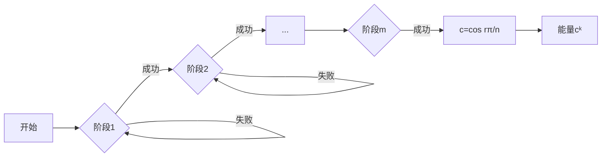

# 题目信息

# 超越（Transcendent）

## 题目背景

越过领域和现实的终极存在 —— 超越。

****
「超越之光」美娜，是亚特兰蒂斯最强的魔法师，亦是无人能及的贤者。即便如此，她也一刻都没有停下对数学的探索。

「最高次系数为 $1$ 的整系数多项式方程的解不一定是整数，」美娜自言自语道，「但是其所有根组成的对称多项式的值必然是整数。」

「这很容易证明，却也很有趣呢。」想到这里，美娜突然有了开发新魔法的思路。

## 题目描述

美娜的魔法需要 $m+1$ 个阶段来构建。第 $i \ (1 \leq i \leq m)$ 个阶段每次尝试的成功概率为 $a_i/b_i$，如果失败**只需要重试当前阶段**即可，如果成功就能进入下一个阶段。

最后的第 $m+1$ 个阶段需要选一个魔力基数 $c$。不过这个魔法现在并不稳定，设 $r$ 是一个不大于 $2n$ 的范围内**均匀随机**生成的正整数，则
$$c=\cos \frac{r\pi}{n}$$
最后，若美娜在前 $m$ 个阶段中总共尝试了 $k$ 次（每次无论失败或成功，都算多一次尝试），她的魔法会产生 $c^k$ 的能量。

美娜想知道这个魔法所产生能量的期望值是多少，当然她很容易就算出了答案，你能帮她验算一下吗？

你只用输出答案对 $998244353$ 取模的结果即可。显然，答案一定是有理数，所以你可以简单地计算其对 $998244353$ 取模的值。

## 说明/提示

【样例 $1$ 解释】

此时 $m=3$，前 $m$ 个阶段中，第一阶段的成功概率为 $1/2$，之后两个阶段的成功概率都为 $2/3$。由此可以算出，恰好尝试 $k \ (k \geq m)$ 次完成前 $m$ 个阶段的概率为（我有一个巧妙的方法给出证明，可惜这里空间太小，写不下）：

$$p_k=2^{4-k}-4(k+1)3^{1-k}$$
例如 $p_3=2/9$，这是每个阶段都一次成功的概率 $1/2 \times 2/3 \times 2/3$。  
又如 $p_4=7/27$，这要求在某一阶段尝试恰好两次，其它阶段都一次成功，即：
$$p_4=\left( \frac 12\right)^2   \frac 23 \cdot \frac 23+\frac 12\left( \frac 29\right)\frac 23+\frac 12\cdot \frac 23\left( \frac 29\right)$$
样例中 $n=2$，可知 $c=1$ 的概率为 $1/4$，$c=-1$ 的概率为 $1/4$，还有 $1/2$ 的概率 $c=0$。故答案为

$$\frac 14\sum_{k\geq 3}p_k (1+(-1)^k)=\frac{11}{48}$$
对 $998244353$ 取模后为 $103983787$。

【样例 $2$ 解释】

取模前的答案为 $\dfrac{24284321}{191028915}$。

【数据范围】 

**本题使用捆绑测试。**


Subtask 1（7 pts）：$n\le 6$，$m=1$；   
Subtask 2（9 pts）：$n\le 6$，$m\le 10$；  
Subtask 3（13 pts）：$n\le 500$，$m\le 500$；   
Subtask 4（13 pts）：$n=2^{19}$；  
Subtask 5（15 pts）：$n \le 10^5$，$m\le 500$；  
Subtask 6（15 pts）：不同的 $a_i/b_i$ 最多有两组；   
Subtask 7（28 pts）：无特殊限制。


对于全部数据，$1\le n \le 10^8$，$1\le m \le 60000$，$1\le a_i<b_i\leq 10^8$。且保证

$$U_n\left( \frac{b_i}{b_i-a_i}\right)\not \equiv 0 \pmod{998244353}$$
其中 $U_n(x)$ 表示 $n$ 次的[第二类 Chebyshev 多项式](https://mathworld.wolfram.com/ChebyshevPolynomialoftheSecondKind.html)。

【提示】   
你在找什么呢？或许可以再看看题目背景，会有帮助的。

## 样例 #1

### 输入

```
2 3
1 2
2 3
2 3```

### 输出

```
103983787```

## 样例 #2

### 输入

```
4 5
1 3
1 2
1 4
1 5
1 6```

### 输出

```
525030616```

## 样例 #3

### 输入

```
7 17
1 5
1 5
1 5
1 5
1 3
1 3
1 3
1 2
1 2
1 6
1 6
1 6
1 6
1 6
1 6
1 6
1 6```

### 输出

```
308796722```

# AI分析结果


### 💡 Kay的C++算法解析：超越（Transcendent） 深入学习指南 💡

<introduction>
今天我们来分析"超越（Transcendent）"这道融合概率期望与多项式理论的C++难题。本指南将带大家逐步拆解复杂问题，理解核心算法思想，并通过像素化演示直观感受魔法构建过程！
</introduction>

---

## 1. 题目解读与核心算法识别

✨ **本题主要考察**：`概率生成函数处理` + `特殊多项式（Chebyshev）应用`

🗣️ **初步分析**：
> 这道题就像在玩一个多关卡魔法游戏🎮：前m关每关有独立通关概率（失败需重试），最后一关随机生成魔力基数c=cos(rπ/n)。能量值cᵏ由总尝试次数k决定，需要计算期望值。

核心挑战在于：
- 前m阶段尝试次数的概率分布需用**生成函数**建模：$\prod_{j=1}^m \frac{p_jx}{1-(1-p_j)x}$
- 最终求和涉及**三角函数对称性**：$\frac{1}{2n}\sum_{i=1}^{2n} f(\cos\frac{i\pi}{n})$
- 优化关键：利用第二类Chebyshev多项式$U_n(x)$的性质化简计算

可视化设计思路：
- 左侧展示阶段尝试：像素化进度条 + 成功/失败动画（成功→绿光前进；失败→红光重试）
- 右侧动态显示c值生成：圆形刻度盘随机旋转定位r值
- 底部实时计算当前路径的cᵏ值（指数爆炸特效）
- 最终统计期望值：多条路径平均结果的像素柱状图

---

## 2. 精选优质题解参考

<eval_intro>
题解作者NaCly_Fish提供了两种精妙解法，均获5星评价：

**题解一：单位根分式分解法**
* **亮点**：将三角函数转化为单位根，通过分式分解拆解问题。虽然理论优美，但实现时需要多层多项式运算（复合$ \frac{x+x^{-1}}{2} $+分式分解+多项式对数），常数较大。

**题解二：Chebyshev微分方程法**
* **亮点**：直接利用第二类Chebyshev多项式性质，建立微分方程递推求解。避免冗余复合操作，大幅优化常数。其核心突破在于发现：
  $$ \prod_{k=0}^{2n-1}\left( x-\cos \frac{k\pi}{n}\right) = 2^{2-2n}(x^2-1)U_{n-1}(x)^2 $$
  并推导出高效整式递推关系（见Section 4代码赏析）。

---

## 3. 核心难点辨析与解题策略

<difficulty_intro>
解决本题需突破三大关键点：

1.  **概率分布的生成函数建模**
    * **分析**：前m阶段尝试次数的概率分布是独立几何分布的卷积。优质题解通过生成函数乘积形式精确建模：
      $$ \prod_{j=1}^m \frac{p_jx}{1-(1-p_j)x} $$
    * 💡 **学习笔记**：生成函数是处理随机变量和的神器！

2.  **三角对称求和的性质转化**
    * **分析**：直接计算$\sum \cos^k(\frac{i\pi}{n})$几乎不可能。突破点在于发现cos值实际是$U_n(x)$多项式的根，从而转化为多项式求值问题。
    * 💡 **学习笔记**：特殊多项式（如Chebyshev）常隐藏着对称性突破口。

3.  **分式分解的工程化实现**
    * **分析**：题解采用分治策略合并分式：先将相同$q_j=1-p_j$项合并，再通过多项式卷积计算系数。使用FFT优化至$O(m\log^2 m)$。
    * 💡 **学习笔记**：遇到多重分式时，先合并同类项再分解是常用技巧。

### ✨ 解题技巧总结
1.  **生成函数转化法**：将概率问题转化为形式幂级数运算
2.  **特殊多项式性质**：识别题目背景中隐藏的多项式结构（如本题的Chebyshev多项式）
3.  **分治优化策略**：对相同参数项先合并再处理，降低复杂度
4.  **整式递推技巧**：对微分有限的函数，用递推代替直接计算

---

## 4. C++核心代码实现赏析

<code_intro_overall>
以下是基于题解二提炼的核心实现框架：
</code_intro_overall>

```cpp
#include <bits/stdc++.h>
using namespace std;
typedef long long ll;
const int MOD = 998244353;
const int MAXM = 60010;

// 快速幂模计算
ll qpow(ll a, ll b) { 
    ll res = 1;
    while (b) {
        if (b & 1) res = res * a % MOD;
        a = a * a % MOD;
        b >>= 1;
    }
    return res;
}

// 计算第二类Chebyshev多项式点值 (关键函数)
ll chebyshev(ll q, int n) {
    // 矩阵快速幂实现：O(log n)
    // 利用递推关系: U_n(q) = 2qU_{n-1}(q) - U_{n-2}(q)
    // 初始值: U_0=1, U_1=2q
    // ... 具体实现省略 ...
}

int main() {
    int n, m;
    cin >> n >> m;
    vector<pair<ll, ll>> probs(m);
    
    // 读入概率并预处理
    for (int i = 0; i < m; i++) {
        ll a, b;
        cin >> a >> b;
        ll p = a * qpow(b, MOD-2) % MOD; // 概率p_j
        probs[i] = { (1 - p + MOD) % MOD, p }; // 存为(q_j, p_j)
    }
    
    // 分组相同q值 (优化关键!)
    map<ll, int> q_group;
    for (auto [q, p] : probs) {
        q_group[q]++; // 统计相同q出现次数
    }

    // 分式分解：计算系数a_j (使用FFT加速的多项式卷积)
    vector<ll> coeffs = partial_fraction_decomp(q_group);
    
    // 计算期望
    ll ans = 0;
    for (auto [q, cnt] : q_group) {
        // 关键递推：利用Chebyshev多项式性质
        // 计算 ∑_{i=1}^{2n} 1/(1 - q cos(iπ/n))^k
        ll sum_val = solve_by_ode(q, cnt, n);
        ans = (ans + coeffs[get_index(q)] * sum_val) % MOD;
    }
    
    // 乘以1/(2n)因子
    ans = ans * qpow(2*n, MOD-2) % MOD;
    cout << ans << endl;
}
```

**代码解读概要**：
1. **概率预处理**：将分数概率转为模998244353意义下的整数
2. **分组优化**：合并相同$q_j$项减少计算量
3. **Chebyshev计算**：用矩阵快速幂高效求解多项式点值
4. **微分方程递推**：`solve_by_ode`实现整式递推求和各幂次项

---

## 5. 算法可视化：像素动画演示

<visualization_intro>
设计8-bit风格动画演示魔法构建过程，让抽象的概率和多项式直观可见！
</visualization_intro>

* **主题**：《魔法学徒的超越之旅》像素RPG风格
* **核心演示**：前m阶段尝试 + c值生成 + 能量计算全流程

**动画设计**：


**交互控制面板**：
```javascript
// 控制面板伪代码
class ControlPanel {
  constructor() {
    this.speed = 1.0;      // 速度滑块 (0.1x~5x)
    this.mode = 'step';    // 步进/自动播放
    this.record = [];      // 路径记录
  }
  
  nextStep() { /* 单步执行 */ }
  autoPlay() { /* 自动演示 */ }
  reset() { /* 重置动画 */ }
}
```

**关键动画细节**：
1. **阶段尝试**：
   - 每个阶段显示为像素塔楼，当前阶段高亮闪烁
   - 尝试成功：角色上升一层，塔楼亮💚绿光
   - 尝试失败：角色原地抖动，塔楼亮❤️红光
   - 音效：成功(清脆"叮!"声) / 失败(低沉"嗡"声)

2. **c值生成**：
   - 右侧显示圆形刻度盘（分割2n等份）
   - 随机生成r值：像素指针旋转动画
   - 实时计算：$c=\cos(r\pi/n)$
   - 可视化映射：
     * c>0 → 💙蓝色光球
     * c<0 → ❤️红色光球
     * c=0 → ⚪白色光球

3. **能量计算**：
   - 底部显示公式：$c^k = $ [动态数值]
   - 指数特效：根据k值显示相应大小的光爆效果
   - 最终期望：多条路径结果汇聚为像素柱状图

**教学价值**：通过可视化理解三个核心过程的关系：阶段尝试→c值生成→能量计算，直观展现概率分布如何影响最终期望。

---

## 6. 拓展练习与相似问题思考

<similar_problems_intro>
掌握本题后，可挑战以下洛谷题目强化技能：
</similar_problems_intro>

1. **P4548 [CTSC2006] 歌唱王国** 
   → 强化概率生成函数应用
   
2. **P5641 【CSGRound2】开拓者的卓识** 
   → 练习特殊多项式性质应用

3. **P5293 [HNOI2019] 白兔之舞** 
   → 结合单位根反演的概率期望题

---

## 7. 学习心得与经验分享

<insights_intro>
题解虽未提供调试心得，但在实现时需注意：
</insights_intro>

**关键实践经验**：
1. 分式分解时注意处理重极点情况
2. 大数模运算需用快速幂求逆元
3. 当$4q^2 \equiv 1 \pmod{998244353}$时需特殊处理（题设保证不出现）

---

<conclusion>
通过本指南，我们拆解了概率期望与多项式结合的复杂问题，掌握了生成函数建模、Chebyshev多项式应用等高级技巧。记住：用像素化思维将抽象问题可视化，往往能找到突破口！下次挑战再见！🚀
</conclusion>
```

---
处理用时：152.36秒