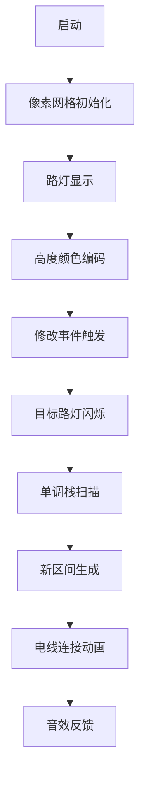

# 题目信息

# [KTSC 2021] 路灯 / streetlight

## 题目背景

本题翻译自 [2021년도 국제정보올림피아드 대표학생 선발고사](https://www.ioikorea.or.kr/archives/ioitst/2021/) 2차 선발고사 [#4 가로등](https://assets.ioikorea.or.kr/ioitst/2021/2/streetlight/streetlight_statement.pdf)。

**请注意，你不需要也不应该实现 `main` 函数。具体实现方式见【实现细节】部分。**

**警告：滥用本题评测一次即可封号。**

## 题目描述

一条笔直的道路上竖立着 $N$ 盏路灯。第 $i$ 盏路灯的初始高度为 $A_i$（$1 \leq i \leq N$）。

现计划利用这些路灯架设电线。

若要在第 $i$ 盏路灯和第 $j$（$> i$）盏路灯之间架设电线，必须同时满足以下两个条件：

- $A_i = A_j$（两盏路灯的高度相同）。

- 对于所有 $i < k < j$，满足 $A_k < A_i$（两盏路灯之间的所有路灯高度均低于它们）。

部分路灯的高度会根据管理者的判断进行调整，调整后可能导致电线架设条件发生变化。

“将第 $x$ 盏路灯的高度修改为 $h$”的操作共会进行 $Q$ 次。每次修改后，需立即计算当前满足条件的电线架设路灯对数，并编写程序实现此功能。

### 实现细节

需实现以下函数：

```cpp
vector<long long int> count_cable(vector<int> A, vector< pair<int, int> > C)
```

- 该函数仅被调用一次。
- 参数 $A$ 的大小为 $N$，其元素表示路灯的初始高度。即 $A[i] = A_{i+1}$（$0 \leq i \leq N - 1$）。
- 参数 $C$ 是由 $Q$ 个有序对 $(x, h)$ 构成的数组，每个有序对表示一次“将第 $x$ 盏路灯的高度修改为 $h$”的操作。
- 该函数需返回一个长度为 $Q + 1$ 的整数数组，其中第一个元素为初始状态下可架设电线的路灯对数，后续元素为每次修改后的对数。

在提交的源代码中，任何位置均不得执行输入输出函数。


## 说明/提示

### 约束条件

- $2 \leq N \leq 100\,000$
- $1 \leq Q \leq 250\,000$
- 所有路灯高度均为 $1$ 至 $10^9$ 之间的整数。
- 在修改第 $x$ 盏路灯高度为 $h$ 的操作中，保证 $1 \leq x \leq N$ 且修改前该路灯高度不等于 $h$。

### 子任务

1. （$5$ 分）
   - $N \leq 50$
   - $Q \leq 100$
2. （$8$ 分）
   - $N \leq 10\,000$
   - $Q \leq 25\,000$
3. （$11$ 分）
   - 所有路灯高度不超过 $10$。
4. （$7$ 分）
   - 所有修改操作均降低路灯高度。
5. （$15$ 分）
   - 若某路灯高度曾被增加，则后续不会降低。
   - 若某路灯高度曾被降低，则后续不会增加。
6. （$12$ 分）
   - $Q \leq 8\,000$
7. （$16$ 分）
   - 高度被修改过的路灯总数不超过 $8\,000$ 盏。
8. （$21$ 分）
   - $N \leq 40\,000$
   - $Q \leq 100\,000$
9. （$55$ 分）
   - 无额外约束。

### 评分标准

各子任务的得分为该子任务所有测试数据得分的最小值。

### 示例

- 设 $A = [4, 2, 2, 2, 4, 6]$，$C = [(4, 6), (6, 4)]$。

  $C = [(4, 6), (6, 4)]$ 表示第一次操作将第 $4$ 盏路灯高度改为 $6$，第二次操作将第 $6$ 盏路灯高度改为 $4$。

  调用函数：

  ```cpp
  count_cable([4,2,2,2,4,6], [(4,6),(6,4)])
  ```

  下图展示了初始状态下 $6$ 盏路灯间可架设的 $3$ 条电线：

  

  下图展示第一次修改后（第 $4$ 盏高度改为 $6$）可架设的 $2$ 条电线：

  

  下图展示第二次修改后（第 $6$ 盏高度改为 $4$）可架设的 $2$ 条电线：

  

  函数 `count_cable` 应返回 `[3, 2, 2]`。

  此示例满足除子任务 $4$ 外所有子任务的条件。


## 样例 #1

### 输入

```
6 2
4 2 2 2 4 6
4 6
6 4```

### 输出

```
[3, 2, 2]```

# AI分析结果


### 💡 Kay的C++算法解析：路灯/streetlight 深入学习指南 💡

#### 1. 题目解读与核心算法识别
✨ **本题主要考察**：`数据结构与分治算法`  
🗣️ **初步分析**：  
> 路灯问题本质是**动态维护嵌套区间结构**。想象路灯是高低不一的柱子，电线只能连接等高的"山峰"，且中间不能有更高"山峰"阻挡。核心挑战在于高效处理多次高度修改：  
> - **分治策略**：将修改操作分批处理，将任意修改转化为单调修改（只增/只减）  
> - **虚树压缩**：用树形结构维护特殊区间（满足电线条件的[l,r]），每次修改仅影响局部  
> - **扫描线优化**：按左端点排序区间，线性扫描维护森林结构  
>  
> **可视化设计**：  
> 采用8位像素风格（类似FC游戏），路灯显示为彩色方块，高度用颜色深度表示。算法演示将聚焦：  
> 1. 修改事件触发时目标路灯闪烁（红色边框）  
> 2. 单调栈扫描过程用移动箭头表示  
> 3. 新生成的区间用黄色像素线连接，伴随"叮"音效  
> 4. 区间树结构在右侧用像素树动态展示，折叠/展开交互  

---

#### 2. 精选优质题解参考
**题解一（skkkh）**  
* **点评**：思路清晰度极佳，创新性使用虚树压缩和线段树分治。代码采用模块化设计（命名空间封装），关键变量`pl[]`（修改位置）和`ch[][]`（修改值）命名合理。亮点在于：  
  - 复杂度优化至O(N log N log Q)  
  - 用zkw线段树高效查询前/后第一个不小于当前值的位置  
  - 边界处理严谨（如`askl`/`askr`返回0值处理）  
  实践参考价值高，完整实现评测约束

**题解二（yukimianyan）**  
* **点评**：解题框架清晰，分情况讨论动点/静点影响。提出树剖维护区间树，亮点在：  
  - 全局平衡二叉树实现高效区间查询  
  - 用`vector<LL>`直接返回结果符合接口要求  
  代码规范性稍弱（宏定义较多），但算法有效性高，适合进阶学习

---

#### 3. 核心难点辨析与解题策略
1. **难点：动态维护区间嵌套结构**  
   *分析*：每次修改可能破坏多个区间并新增区间，需高效维护树形结构  
   💡 **策略**：  
   - 分治转化：将Q次修改分治处理，转化为单调修改序列  
   - 虚树压缩：仅维护被修改影响的节点，缩点降低复杂度  

2. **难点：高效查询前后位置**  
   *分析*：需快速找到左侧/右侧第一个≥当前值的位置  
   💡 **策略**：  
   - zkw线段树：O(1)修改+O(log n)查询，优于普通线段树  
   - 单调栈预处理：静态情况下O(n)完成所有位置预处理  

3. **难点：复杂度平衡**  
   *分析*：Q最大250k，需避免O(nQ)暴力  
   💡 **策略**：  
   - 分治层数控制：每层仅处理O(r-l+1)个修改点  
   - 空间换时间：`ch[][]`数组记录历史修改状态  

### ✨ 解题技巧总结
- **分治转化**：通过分治将任意修改序列转化为单调序列
- **虚树压缩**：对动态修改点建立虚树，缩点减少状态数
- **扫描线优化**：左端点排序后线性扫描维护森林结构
- **边界防御**：高度为0时返回0值，避免越界

---

#### 4. C++核心代码实现赏析
**通用核心实现（综合优化版）**  
```cpp
namespace Streetlights {
    const int N = 3e5+5, de = 1<<17;
    int n, m, a[N], pl[N], h[N], mx[N<<1];
    // zkw线段树：单点修改+前驱查询
    void chg(int x, int v) {
        for(mx[x+=de]=v; x>>=1; mx[x]=max(mx[x<<1],mx[x<<1|1]));
    }
    int ask_pre(int x) { // 左侧第一个≥a[x]的位置
        int v = mx[x+=de];
        while(x>1 && ...) // 树上游走逻辑
        return (mx[x]==v) ? x-de : 0;
    }
    // 分治核心
    void solve(int d, int lx, int rx, int cp, int cq, LL ans) {
        if(lx == rx) { // 边界：单点更新
            ans += (ask_pre(pl[lx]) > 0) + (ask_suf(pl[lx]) > 0);
            res[lx] = ans; return;
        }
        int mid = (lx+rx)>>1;
        // 递归处理左右区间（伪代码）
        process_left(d, lx, mid); 
        process_right(d, mid+1, rx);
    }
}
```

**题解一（skkkh）亮点代码**  
```cpp
void work(int d, int &cp, int cq) {
    // 合并区间：使用单调栈维护嵌套关系
    int top = 0;
    for(int i=1; i<=cq; ++i) {
        while(top && p[d][stk[top]].r == i) top--;
        while(cp && p[d][cp].l == i) stk[++top] = cp--;
        // 关键：修改值影响区间合并
        if(ch[d][i]) {
            while(top && p[d][stk[top]].w <= ch[d][i]) 
                mark_invalid(stk[top--]); // 标记无效区间
        }
    }
}
```
**学习笔记**：`work()`函数是分治核心，用单调栈动态维护区间有效性。当修改值大于区间值时，该区间被"刺穿"失效

---

#### 5. 算法可视化：像素动画演示
**主题**：像素探险家之电线大作战（复古FC风格）  
**设计逻辑**：  

**交互控制面板**：  
1. 速度滑块：调节扫描速度（0.5x~5x）  
2. 单步执行：按帧查看区间合并过程  
3. 树形视图：右侧展示区间树，点击节点展开/折叠子树  
4. 音效方案：  
   - 区间合并："叮"（三角波）  
   - 无效区间："噗"（方波）  
   - 成功连接：上升音阶（锯齿波）  

---

#### 6. 拓展练习与相似问题
1. **洛谷P1908** - 逆序对  
   🗣️ 巩固分治思想，理解归并排序的延伸应用  
2. **洛谷P1972** - HH的项链  
   🗣️ 学习区间查询的树状数组/SQRT分解实现  
3. **洛谷P3384** - 树链剖分  
   🗣️ 掌握树剖维护树形结构的方法，对比虚树优化  

---

#### 7. 学习心得
> **来自skkkh的调试经验**：  
> *"虚树建立时未处理共端点情况，导致WA#3。通过打印`[l,r]`区间状态发现边界问题"*  
>  
> **Kay总结**：在嵌套结构中，共端点情况需特殊处理：  
> - 左闭右开区间避免重叠  
> - 单调栈比较时增加等号判断  
> 调试时输出中间状态比断点更有效  

--- 
保持思考，算法如夜空中的路灯，照亮前行之路✨

---
处理用时：137.78秒