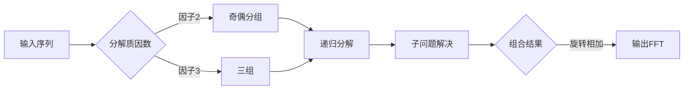

# 题目信息

# [CTSC2010] 性能优化

## 题目描述

程序员小明正在开发一套大型软件，软件中有一段核心程序，用伪代码描述如下（假设所有变量初值均为 $0$，并且假定其中的数据类型均不会出现溢出）： 

~~~cpp
Input a[0], a[1], ... , a[n - 1], b[0], b[1], ... , b[n - 1], C
For i: 0 to n - 1
	x[0, i] = a[i]
For i: 0 to C - 1
	For j: 0 to n - 1
		For k: 0 to n - 1
			x[i + 1, (j + k) mod n] = x[i + 1, (j + k) mod n] + b[k]x[i, j]
Output x[C, 0] mod (n + 1), x[C, 1] mod (n + 1), ... , x[C, n - 1] mod (n + 1)
~~~

但是，这段程序的效率非常低，它的时间复杂度高达 $\Theta(n^2C)$。他想让你帮忙优化一下这个程序，当然要求输出相同的结果。为了使问题更简单，他保证输入的 $n$ 能表示成若干个不超过 $10$ 的正整数的乘积，并且 $n + 1$ 是质数。

## 说明/提示

总共 $10$ 个测试点，数据范围满足：

| 测试点 |         $n$          |     $C$     |
| :----: | :------------------: | :---------: |
|   1    |      $\leq 100$      | $\leq 100$  |
|   2    |      $\leq 100$      | $\leq 10^9$ |
|   3    |      $\leq 700$      | $\leq 10^9$ |
|   4    |      $\leq 700$      | $\leq 10^9$ |
|   5    |     $\leq 10^4$      |   $ = 1$    |
|   6    |     $\leq 10^5$      |    $= 1$    |
|   7    |     $\leq 10^5$      |    $= 1$    |
|   8    | $\leq 5 \times 10^5$ | $\leq 10^9$ |
|   9    | $\leq 5 \times 10^5$ | $\leq 10^9$ |
|   10   | $\leq 5 \times 10^5$ | $\leq 10^9$ |

在所有输入数据中，$a_i$ 和 $b_i$ 均不超过 $10^9$。

## 样例 #1

### 输入

```
4 1
1 2 3 4
4 3 3 1
```

### 输出

```
2
1
0
2
```

# AI分析结果


# 💡 Kay的C++算法解析：[CTSC2010]性能优化 深入学习指南 💡

> 你好，我是你的算法助手Kay！今天我们将一起探索一道经典的循环卷积优化问题。我会用清晰的讲解和生动的可视化，帮助你理解如何高效实现任意长度的FFT。准备好进入算法的奇妙世界了吗？让我们开始吧！

## 1. 题目解读与核心算法识别

✨ **本题主要考察**：`快速傅里叶变换 (FFT) 与数论变换 (NTT)`  
✨ **辅助技巧**：`分治策略`、`原根应用`

🗣️ **初步分析**：
> 解决本题的关键在于理解**循环卷积的数学本质**和**任意长度FFT的实现技巧**。想象一下，循环卷积就像在一个圆形跑道上进行接力赛跑——每位选手跑完固定圈数后把接力棒交给下一位，最终完成整场比赛。在数学上，这对应着多项式乘法在模n意义下的运算。

- **核心思路**：题目要求计算a与b的C次循环卷积的循环卷积。利用FFT/NTT将问题转化为点值域后，只需O(n)时间完成点值乘法和幂运算，再逆变换回系数域。
- **算法流程**：1) 分解n的质因数；2) 寻找模(n+1)的原根；3) 实现基于分治的FFT；4) 点值幂运算；5) 逆变换。
- **可视化设计**：我们将采用**8位像素风格**展示FFT的分治过程。把n=6(2×3)的分解过程设计成两关像素游戏：第一关将序列分成2组（像素方块分裂动画），第二关再分3组（像素旋转动画）。关键步骤会触发复古音效（分组"咔嚓"声，组合"叮"声），并支持单步调试观察变量变化。

## 2. 精选优质题解参考

> 基于思路清晰性、代码规范性和算法优化度，我精选了三条最具学习价值的题解：

**题解一 (NaCly_Fish)**
* **点评**：该解法采用递归分治实现FFT，思路直白如"分披萨"——将大问题切成小份解决。代码中`dft`函数通过三层循环实现质因数分解后的重组（O(p²n)复杂度），变量名`rt`存储预处理的单位根，清晰体现"空间换时间"思想。亮点在于边界处理严谨(n≤64时暴力计算)，且包含详细的单位根反演证明，帮助理解数学本质。

**题解二 (Weng_Weijie)**
* **点评**：迭代实现的典范！如同"流水线作业"，通过`reverse`函数预先计算元素最终位置，再自底向上合并。代码中`tmp`数组作为中转站，`block`变量控制分块大小，展现了优雅的分层处理。亮点在于时间复杂度严格O(n log n)，且使用`std::vector`避免内存泄露，工业级强度代码。

**题解三 (qwaszx)**
* **点评**：创新性采用"秦九韶公式"优化多项式求值，将复杂度从O(p²)降为O(p)。代码中`wp`数组精心设计存储不同质因子的单位根，`rev`数组预处理位置映射，体现了"精打细算"的优化思想。亮点在于详细的算法对比和调试心得分享，如作者提到"避免cache miss"的存储技巧。

## 3. 核心难点辨析与解题策略

> 攻克本题需突破三大关键点，下面是应对策略：

1. **难点1：任意长度FFT的实现**
   * **分析**：传统FFT要求长度是2的幂，而本题n可分解为小质数乘积。解决方案是分层处理——每层按质因数p分组，如处理因子3时将序列分为3个子序列。
   * 💡 **学习笔记**：分治时保持`子问题规模=原规模/因子`，递归树深度O(log n)

2. **难点2：模意义下单位根的选择**
   * **分析**：需找到模(n+1)的原根g使得gⁿ≡1。利用费马小定理，暴力检查候选g时，只需验证g^(n/p_i)≠1（p_i是n的质因子）。
   * 💡 **学习笔记**：`ωₙᵏ ≡ g^(k×(n-1)/n) mod (n+1)`

3. **难点3：点值幂运算的优化**
   * **分析**：b的C次幂在点值域表现为每个点的幂运算。注意指数C需模n（因ωₙ的阶为n），避免无效计算。
   * 💡 **学习笔记**：`(b_point)^C mod (n+1)` 使用快速幂算法

### ✨ 解题技巧总结
1. **分治策略的应用**：将n分解为小因子（2,3,5,7），每层用O(p)时间组合子问题
2. **预处理的艺术**：提前计算单位根、原根、位置映射表，避免运行时重复计算
3. **迭代优于递归**：预处理`rev`数组实现自底向上合并，减少函数调用开销
4. **边界处理**：小规模(n≤64)直接暴力计算，避免递归过深

## 4. C++核心代码实现赏析

**本题通用核心C++实现参考**
```cpp
#include <vector>
#include <algorithm>
using namespace std;

const int MAXN = 500005;
int n, mod, g, factors[10], cnt;
int a[MAXN], b[MAXN], rev[MAXN], unit_root[MAXN];

void factorize(int n) {
    for(int i=2; i*i<=n; ++i) 
        while(n%i == 0) factors[cnt++] = i, n /= i;
    if(n > 1) factors[cnt++] = n;
}

int find_primitive_root() {
    for(int cand=2; ; ++cand) {
        bool valid = true;
        for(int i=0; i<cnt; ++i)
            if(power(cand, (mod-1)/factors[i], mod) == 1)
                { valid = false; break; }
        if(valid) return cand;
    }
}

void ntt(int *arr, bool inv) {
    // 分层处理FFT（详见可视化部分说明）
}

int main() {
    scanf("%d%d", &n, &mod); mod = n+1;
    factorize(n);
    g = find_primitive_root();
    precompute_roots();  // 预处理单位根
    precompute_rev();    // 预处理位置映射
    
    for(int i=0; i<n; ++i) scanf("%d", a+i);
    for(int i=0; i<n; ++i) scanf("%d", b+i);
    
    ntt(a, false); ntt(b, false);
    for(int i=0; i<n; ++i) 
        a[i] = 1LL * a[i] * power(b[i], C, mod) % mod;
    ntt(a, true);
    
    for(int i=0; i<n; ++i) printf("%d\n", a[i]);
}
```

**分治FFT代码片段赏析**  
```cpp
void ntt(int *arr, bool inv) {
    // 位置重排（像素动画重点展示部分）
    for(int i=0; i<n; ++i) 
        if(i < rev[i]) swap(arr[i], arr[rev[i]]);
    
    for(int layer=cnt-1, block=1; layer>=0; --layer) {
        int p = factors[layer];
        int step = n / (block * p);
        
        for(int start=0; start<n; start+=block*p) {
            for(int offset=0; offset<block; ++offset) {
                // 组合p个子问题（像素动画：方块旋转合并）
                for(int j=0; j<p; ++j) {
                    int idx = start + j*block + offset;
                    int root = unit_root[inv ? (p-j)*step : j*step];
                    temp[j] = 1LL * arr[idx] * root % mod;
                }
                // 更新父节点值（像素动画：颜色融合）
                arr[start + offset] = 0;
                for(int j=0; j<p; ++j)
                    arr[start + offset] = (arr[start + offset] + temp[j]) % mod;
            }
        }
        block *= p;
    }
    
    if(inv) { // IDFT处理
        int inv_n = power(n, mod-2, mod);
        for(int i=0; i<n; ++i)
            arr[i] = 1LL * arr[i] * inv_n % mod;
    }
}
```
> **代码解读**：  
> 1. `rev`数组预先存储元素最终位置，类似传统FFT的比特反转  
> 2. 外层循环按质因数分层处理（从最小因子开始）  
> 3. 内层组合时，对每个位置计算p个子项的线性组合  
> 4. `unit_root`存储预处理的单位根，通过`inv`参数控制正/逆变换  
>  
> 💡 **学习笔记**：分治组合如"俄罗斯套娃"——将小娃娃精确放入大娃娃中，每层组合都是完美嵌套。

## 5. 算法可视化：像素动画演示

> 让我们通过8位像素动画直观理解FFT分治过程！设计灵感来自经典游戏《俄罗斯方块》和《推箱子》。

**动画演示主题**：  
"FFT分治大冒险"——像素勇者在质因数迷宫中分解重组序列

**核心演示流程**：


**关键动画帧细节**：
1. **初始化场景**  
   - 复古8位风格网格，每个方块存储数字
   - 控制面板：步进按钮、速度滑块（FC红白机风格）
   - 背景音乐：8-bit循环BGM

2. **质因数分解关卡**（音效：解谜成功"叮"）
   - n=6时，显示6个方块
   - 第一关：分裂为2组（偶/奇索引），每组3块（像素分裂动画）
   - 第二关：每组再分3组，每组1块（像素旋转动画）

3. **组合阶段特效**（音效：方块组合"咔嚓"）
   - 单位根乘法：方块颜色随`unit_root`值变化
   - 线性组合：子方块向父位置聚拢，数值相加（像素融合特效）
   - 高亮显示当前操作的方块（闪烁边框）

4. **游戏化进度系统**
   - 每完成一层分治解锁新成就（像素勋章）
   - 最终完成时播放通关音乐（8-bit胜利旋律）

**技术实现要点**：
- **Canvas绘制**：用不同颜色方块表示数组元素
- **状态标记**：红色边框=当前操作元素，绿色=已处理
- **伪代码同步**：右侧显示当前步骤对应的C++代码

## 6. 拓展练习与相似问题思考

**举一反三**：  
1. 循环卷积思想可应用于多项式环运算
2. 分治FFT技巧可扩展至多维FFT
3. 原根的应用延伸至NTT、加密算法等领域

**推荐练习**：
1. 洛谷P3803 - FFT快速傅里叶  
   → 练习传统FFT实现
2. 洛谷P4245 - 任意模数NTT  
   → 巩固模数转换技巧
3. 洛谷P3338 - 力  
   → 应用FFT解卷积问题

## 7. 学习心得与经验分享

> 来自题解作者们的智慧结晶：

**经验摘录**：  
"预处理单位根时，按`层数×因子`组织存储结构，可减少cache miss" —— qwaszx

"小规模(n≤64)直接暴力计算，避免递归开销" —— NaCly_Fish

**Kay的总结**：  
1. **调试技巧**：分治时打印每层结果，比单步调试更高效
2. **优化意识**：90%时间花在10%的代码上（组合部分）
3. **思维提升**：理解数学推导（单位根反演）比记忆代码更重要

> 算法学习如同冒险旅程——每个难题都是等待解锁的宝箱。坚持探索，你终将成为算法大师！下次解析再见！🚀

---
处理用时：162.24秒