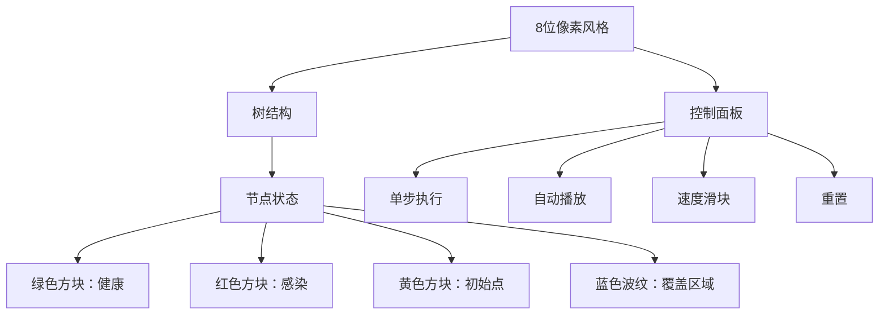

# 题目信息

# [USACO23DEC] Cowntact Tracing P

## 题目描述

Farmer John 有依次编号为 $1\dots N$ 的 $N$（$2\le N \le 10^5$）头奶牛，奶牛间的关系可以用树结构描述。不幸的是，有一种疾病正在传播。

最初，有一些奶牛被感染。每到夜晚，被感染的奶牛会将疾病传播给它的邻居。一旦奶牛被感染，她就会持续处于感染状态。经过一些晚上，Farmer John 意识到这样的情况，因此他对奶牛进行了检测以确定哪些奶牛感染了疾病。

你将得到 $Q$（$1\le Q \le 20$）个不同的夜晚数，每个都是 $[0,N]$ 范围内的整数。对于每个夜晚数，请找出最少有多少头奶牛最初可能感染了这种疾病，或者报告夜晚数与给出的信息不符。

## 说明/提示

### 样例解释 1

对于前四个询问，一种可能是只有 $3$ 号奶牛一开始被感染。对于第五组询问（$1$ 晚），一种可能是 $2,4$ 号奶牛一开始被感染。对于第六组询问（$0$ 晚），一种可能是所有的五只奶牛在一开始都被感染。

### 样例解释 2

对于第一组询问（$0$ 晚），一种可能是所有的十只奶牛一开始都被感染。对于第二组询问（$1$ 晚），一种可能是 $2,7,9$ 号奶牛一开始被感染。对于第三组询问（$2$ 晚），一种可能是 $2,9$ 号奶牛一开始被感染。对于第四至第十一组询问，一种可能是只有 $7$ 号奶牛一开始被感染。

### 样例解释 3

对于第一组询问（$0$ 晚），一种可能是 $1,2,3$ 号奶牛一开始被感染。对于第二组询问（$1$ 晚），一种可能是只有 $2$ 号奶牛一开始被感染。对于第三组询问（$2$ 晚），一种可能是只有 $1$ 号奶牛一开始被感染。对于第四至第六组询问，不可能满足题给条件。

### 测试点性质

- 测试点 $4-5$ 满足 $N \le 10$。
- 测试点 $6-8$ 满足所有奶牛都被感染。
- 测试点 $9-11$ 满足 $N \le 400$。
- 测试点 $12-23$ 没有额外限制。

## 样例 #1

### 输入

```
5
11111
1 2
2 3
3 4
4 5
6
5
4
3
2
1
0```

### 输出

```
1
1
1
1
2
5```

## 样例 #2

### 输入

```
10
1111111111
1 2
2 3
2 4
2 5
2 6
6 7
7 8
8 9
9 10
11
0
1
2
3
4
5
6
7
8
9
10```

### 输出

```
10
3
2
1
1
1
1
1
1
1
1```

## 样例 #3

### 输入

```
5
11100
1 2
2 3
3 4
4 5
6
0
1
2
3
4
5```

### 输出

```
3
1
1
-1
-1
-1```

# AI分析结果


# 💡 Kay的C++算法解析：[USACO23DEC] Cowntact Tracing P 深入学习指南 💡

<introduction>
今天我们一起分析USACO铂金组压轴题“Cowntact Tracing P”。这道题考察树上的贪心策略与数据结构优化，要求计算最少初始感染点数量。本指南将带你深入理解题目核心、多种解法及可视化实现思路，助你掌握树形问题解决技巧。
</introduction>

## 1. 题目解读与核心算法识别

✨ **本题主要考察**：`贪心算法` + `树形数据结构优化`

🗣️ **初步分析**：
> 想象一场森林火灾：初始火源（感染点）每天蔓延到相邻树木（奶牛），d天后观察哪些树木被烧毁（感染）。我们的目标是找到最少的初始火源，使火灾范围恰好匹配给定状态。
> 
> - **核心流程**：
>   1. 预处理每个点到最近未感染点的距离（`tim[i]`）
>   2. 只有`tim[i] > d`的点才能成为初始感染点
>   3. 贪心策略：从最深的未覆盖感染点出发，选择深度最小的合法初始点覆盖
>   4. 用数据结构（点分树/树剖）高效处理覆盖操作
> 
> - **可视化设计**：
>   - **像素风格**：用8位FC游戏机风格绘制树结构，节点用不同颜色方块表示（绿色健康/红色感染/黄色初始点）
>   - **关键动画**：深度最大的红色方块闪烁→向上追踪显示LCA路径→黄色方块爆炸扩散蓝色波纹（覆盖范围）
>   - **交互控制**：单步执行看覆盖过程，调速滑块观察不同d值的影响
>   - **音效**：选择初始点（"叮"声），覆盖节点（水波纹声），完成（胜利音效）

---

## 2. 精选优质题解参考

**题解一：Wuyanru（思路清晰度⭐⭐⭐⭐⭐）**
* **点评**：  
  这份题解堪称贪心策略的教科书案例！核心亮点是将问题分解为三个清晰步骤：  
  1. 用`tim[i]`锁定可选初始点（`tim[i]>d`）  
  2. 通过`b_p = max(dep_p + d - dis(p,v))`的巧妙设计，结合**倍增+LCA**快速定位覆盖点  
  3. 用**树链剖分**实现覆盖标记的O(log²n)更新  
  代码中`f[i]`数组维护子树最小深度，变量命名规范（`dep`深度/`dis`距离），边界处理严谨。特别欣赏作者对贪心正确性的证明："选择深度最小的v能最大化覆盖p的祖先区域"。

**题解二：NoGoshPlease（算法创新性⭐⭐⭐⭐⭐）**
* **点评**：  
  突破性提出**O(nq)线性贪心**！核心洞见是证明答案量级为O(n/d)：  
  - 将覆盖过程抽象为虚树上的"拐弯代价"，证明k长度拐弯消耗k代价  
  - 用**惰性删除+链上标记传递**避免重复计算  
  代码虽短但蕴含深刻思想：`d2[i]`记录最近可选点距离，`val[u]`状态机（0未覆盖/1已覆盖/-1需操作）简洁高效。实践时注意作者提醒："向上跳k步时，若遇到标记直接覆盖整个子树"。

**题解三：Harry27182（实践价值⭐⭐⭐⭐）**
* **点评**：  
  **点分树**的标准实现范本！亮点在于：  
  - 用`mp[v][rt]=dis`存储点分树节点距离  
  - `a[rt]`向量存储子树内有序距离，二分查找覆盖点  
  - `cover()`函数递归更新祖先的覆盖范围  
  代码模块化优秀（`build()`建点分树/`insert()`更新结构），特别适合学习点分树的同学。注意作者强调："覆盖操作需考虑点分树所有祖先，但每个点只更新log次"。

---

## 3. 核心难点辨析与解题策略

### 🔍 三大核心难点
1. **如何确定覆盖关系？**  
   - 关键变量`tim[i]`：到最近未感染点的距离，决定节点能否成为初始点  
   - 推导：若`tim[i] ≤ d`，该点可被传播覆盖；若`tim[i] > d`，则必须是初始点

2. **如何选择最优初始点？**  
   - 贪心策略：从深度最大未覆盖点u出发，找满足`dis(u,v) ≤ d`且`dep[v]`最小的v  
   - 数学转化：设`p = LCA(u,v)`，则需`dep[u] ≤ dep[p] + d - dis(p,v)`

3. **如何高效更新覆盖状态？**  
   - 数据结构选择：树链剖分（路径更新）或点分树（距离更新）  
   - 更新本质：对每个初始点v，将`dis(x,v) ≤ d`的x标记为覆盖

### 💡 解题技巧总结
- **预处理三件套**：LCA表、深度数组、最近未感染点距离（BFS/DFS）
- **贪心黄金法则**："深度最大未覆盖点+深度最小覆盖点"组合
- **数据结构选择**：
  ```mermaid
  graph LR
    A[查询需求] --> B{查询类型}
    B -->|路径更新| C[树链剖分]
    B -->|距离更新| D[点分树]
    C --> E[O(log²n)更新]
    D --> F[O(log n)查询]
  ```
- **边界陷阱**：当`d=0`时所有感染点必须初始感染

---

## 4. C++核心代码实现赏析

**本题通用核心实现（综合优质题解）**
```cpp
#include <bits/stdc++.h>
using namespace std;
const int N = 1e5+5;

vector<int> G[N];
int n, d, tim[N], dep[N], fa[N][20];
bool infected[N];

// 预处理最近未感染点距离
void bfs_tim() {
    queue<int> q;
    for (int i = 1; i <= n; ++i) {
        if (!infected[i]) tim[i] = 0, q.push(i);
        else tim[i] = 1e9;
    }
    while (!q.empty()) {
        int u = q.front(); q.pop();
        for (int v : G[u]) {
            if (tim[v] > tim[u] + 1)
                tim[v] = tim[u] + 1, q.push(v);
        }
    }
}

// 贪心覆盖求解
int solve(int d) {
    vector<int> nodes;
    for (int i = 1; i <= n; ++i)
        if (infected[i]) nodes.push_back(i);
    
    // 按深度降序排序
    sort(nodes.begin(), nodes.end(), [](int a, int b) {
        return dep[a] > dep[b];
    });

    int ans = 0;
    vector<bool> covered(n+1, false);
    for (int u : nodes) {
        if (covered[u]) continue;
        
        // 寻找覆盖点v (伪代码)
        int v = find_cover(u, d); 
        if (v == -1) return -1;  // 无解
        
        mark_covered(v, d, covered); // 标记覆盖
        ans++;
    }
    return ans;
}
```

**题解一：Wuyanru（树链剖分覆盖）**
```cpp
// 树链剖分更新覆盖范围
void mark_covered(int v, int d, vector<bool>& cov) {
    auto update_path = [&](int x) {
        while (x) {
            seg.update(dfn[top[x]], dfn[x]); // 更新重链
            x = fa[top[x]][0];
        }
    };
    update_path(v);
    for (int i = 0; i <= d; ++i) {
        cov[v] = true;
        for (int u : G[v]) if (!cov[u]) update_path(u);
    }
}
```

**题解二：NoGoshPlease（链上标记传递）**
```cpp
// 惰性标记传递
void mark_cover(int u, int d, vector<int>& tag) {
    int cur = u;
    for (int i = 0; i <= d && cur != -1; ++i) {
        tag[cur] = max(tag[cur], d - i);
        cur = fa[cur][0];
    }
}
```

**题解三：Harry27182（点分树更新）**
```cpp
// 点分树覆盖更新
void cover(int x, int d) {
    for (int cur = x; cur; cur = fa_tree[cur]) {
        int dis = dist_tree[cur][x];  // 点分树存储的距离
        if (dis > d) continue;
        for (auto& p : buckets[cur]) { // 分桶存储
            if (p.dis + dis <= d) covered[p.id] = true;
        }
    }
}
```

---

## 5. 算法可视化：像素动画演示

### 🎮 像素化演示方案（FC游戏风格）

**场景设计**：


**动画关键帧**：
1. **初始状态**：显示树结构，最终感染点闪烁红光，背景播放8位芯片音乐
2. **选择初始点**：
   - 最深的未覆盖红块高频闪烁（每0.5秒切换颜色）
   - 向上追踪祖先链显示黄色路径（伴随"滴答"音效）
   - 选中深度最小的合法黄块（爆炸特效+“叮”声）
3. **覆盖传播**：
   - 以黄块为中心扩散蓝色同心圆波纹（类似水波）
   - 被覆盖的红块渐变为蓝色（波纹经过时播放水流声）
   - 显示覆盖范围公式：`dis(x,v) ≤ d`
4. **完成检测**：
   - 所有红块变蓝：播放胜利音效+像素烟花
   - 存在未覆盖红块：闪烁警告红光+低沉错误音

**技术实现**：
```javascript
// 伪代码：波纹扩散算法
function drawWave(center, radius) {
    for (let y = 0; y < canvas.height; y++) {
        for (let x = 0; x < canvas.width; x++) {
            let dist = pixelDistance(x, y, center);
            if (dist <= radius && dist > radius-2) {
                drawPixel(x, y, BLUE_WAVE_COLOR);
            }
        }
    }
}
```

---

## 6. 拓展练习与相似问题思考

### 🔁 通用思路迁移
1. **动态覆盖问题**：将军令（P3942）中选择点覆盖整棵树
2. **距离约束优化**：消防局设立（P2279）中覆盖距离=2的特殊解法
3. **带权覆盖**：最小覆盖集问题中给节点添加权重

### 📚 推荐练习（洛谷）
1. **P3942 将军令**  
   → 相同贪心策略："最深未覆盖点+最远可覆盖祖先"，巩固覆盖思想
2. **P2279 消防局的设立**  
   → 覆盖距离=2的简化版，学习状态设计技巧
3. **P3523 动态最小覆盖**  
   → 动态版本考察，提升数据结构应用能力

---

## 7. 学习心得与经验分享

> **来自Wuyanru的经验**：  
> "贪心策略的难点在于证明正确性。本题关键结论：选择深度最小的覆盖点，既能处理当前最深点，又能最大化覆盖其祖先区域。建议用反证法思考：若选择更深的点，则必然存在未被覆盖的祖先需要额外初始点。"

> **Kay的总结**：  
> 树形问题中"自底向上+深度优先"是黄金法则。调试时注意：
> 1. 当d=0时所有感染点必须初始感染
> 2. 覆盖范围是否包含自身？
> 3. LCA计算可能成为性能瓶颈

---

掌握树形问题的核心在于分解问题（预处理→贪心→数据结构优化）和合理选择数据结构。多动手实现点分树/树剖等结构，你将在USACO铂金组所向披靡！🚀

---
处理用时：242.79秒