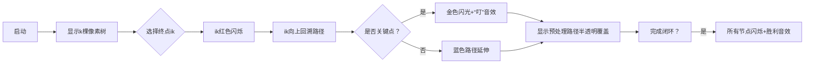

# 题目信息

# 【MX-X13-T7】「KDOI-12」No one can be anything without comparison.

## 题目描述

**请注意本题对 $\bm{n,k}$ 的特殊限制。**

$n$ 名选手参加了 $k$ 场 Tetris Tournament。每一场 Tetris Tournament 包含 $n-1$ 轮，每轮会选出两个目前还未淘汰的选手 $x,y$ 并让他们参加一场比赛，输的人淘汰。最后会有唯一胜者。你现在得知第 $j$ 个人在第 $i$ 场 Tetris Tournament 中被 $a_{i,j}$ 淘汰了。$j$ 是第 $i$ 场 Tetris Tournament 的胜者当且仅当 $a_{i,j}=0$。

选手们喜欢比较。他们都希望自己在某种意义上能够胜过别人，或至少跟别人水平差不多。

定义第 $i$ 场 Tetris Tournament 中 $x$ 严格吊打 $y$ 当且仅当存在 $x=p_1,p_2,\dots,p_m=y$（$m\ge 2$，也就是说 $x\neq y$），使得对于任意 $1\leq j<m$，$a_{i,p_{j+1}}=p_j$。

定义一个有序的选手 $k$ 元组 $(i_1,i_2,\dots,i_k)$ 是水平相似的当且仅当对于 $1\leq j<k$，$i_j$ 在第 $j$ 场比赛中严格吊打 $i_{j+1}$ 且 $i_k$ 在第 $k$ 场比赛中严格吊打 $i_1$。

求水平相似的 $k$ 元组数量，对 $998244353$ 取模。

## 说明/提示

**【样例解释 \#1】**

符合要求的三元组 $(i_1,i_2,i_3)$ 有：$(1,2,3)$，$(2,3,1)$。

**【数据范围】**

**本题使用捆绑测试。**

| 子任务编号 | 分值 | $n\leq$ | $k=$ | 特殊性质 |
|:--:|:--:|:--:|:--:|:--:|
| $1$ | $7$ | $100$ | $3$ | 无 |
| $2$ | $8$ | $500$ | $3$ | 无 |
| $3$ | $13$ | $3\times10^3$ | $3$ | 无 |
| $4$ | $14$ | $2.5\times10^5$ | $3$ | A |
| $5$ | $15$ | $10^5$ | $3$ | B |
| $6$ | $7$ | $10^5$ | $3$ | 无 |
| $7$ | $14$ | $2.5\times10^5$ | $3$ | 无 |
| $8$ | $7$ | $5\times10^4$ | $4$ | 无 |
| $9$ | $6$ | $7.5\times10^4$ | $4$ | 无 |
| $10$ | $9$ | $4\times10^4$ | $5$ | 无 |

* 特殊性质 A：对于 $1\leq i\leq n$，$a_{1,i}=a_{2,i}$；
* 特殊性质 B：对于 $1\leq i\leq k$，不存在 $1\leq j_1<j_2\leq n$ 使得 $a_{i,j_1}=a_{i,j_2}$。

对于所有数据：$1\leq n\leq2.5\times10^5$，$\bm{3\leq k\leq 5}$，保证 $a$ 数组符合题意，且：

* $k=3$ 时，$n\leq2.5\times10^5$；
* $k=4$ 时：$n\leq7.5\times10^4$；
* $k=5$ 时：$n\leq4\times10^4$。

## 样例 #1

### 输入

```
3 3
0 1 2
3 0 2
3 1 0```

### 输出

```
2```

## 样例 #2

### 输入

```
6 5
0 1 1 2 3 4
3 3 0 6 6 1
2 4 1 0 1 1
3 0 2 6 6 2
5 3 6 1 0 4```

### 输出

```
18```

# AI分析结果


### Kay的C++算法解析：「KDOI-12」No one can be anything without comparison 深入学习指南

---

#### **1. 题目解读与核心算法识别**
✨ **本题主要考察**：**图论（树结构处理）** 与 **分块优化技巧**  
🗣️ **初步分析**：
> 想象每场锦标赛是一棵“淘汰树”，选手是节点，淘汰关系构成边（从被淘汰者指向淘汰者）。严格吊打关系即树上从x到y的路径。问题转化为在k棵树上寻找环，使相邻节点在对应树上有祖先→后代路径（不包含自身）。  
> - **核心难点**：k元环需同时满足k棵树上的路径约束，直接枚举复杂度指数级  
> - **解决方案**：  
>   - **树分块法**（xuanxuan001）：将中间树分块，关键点预处理路径信息，非关键点暴力枚举  
>   - **DFS序分块法**（王熙文）：将树结构转为DFS序区间问题，分块处理区间操作  
> - **可视化设计**：  
>   - 用8位像素风展示k棵树（每棵树为独立网格）  
>   - 当前操作节点高亮闪烁，路径用连续像素块显示  
>   - 关键点触发金色闪光与“叮”音效，闭环成功播放胜利旋律  

---

#### **2. 精选优质题解参考**
**题解一（xuanxuan001）**  
* **点评**：  
  - **思路创新性**⭐⭐⭐⭐⭐：首创树分块处理多树环约束，将路径分为关键点/非关键点两类，大幅降低状态数  
  - **代码优化**⭐⭐⭐⭐：块长动态调整（k=3取400，k=5取30），预处理整块信息实现O(1)查询  
  - **拓展性**⭐⭐⭐⭐⭐：通过调整块长B平衡复杂度，通用公式 $O(nB^{k-2} + \frac{n^2k^2}{B})$  
  - **实践提示**：注意树分块需维护每个点到关键点的路径信息  

**题解二（王熙文）**  
* **点评**：  
  - **模型转化**⭐⭐⭐⭐：将祖先关系转化为DFS序区间包含问题，$id_{i,a_{i+1}} \in [l_{i,a_i}, r_{i,a_i}]$  
  - **分块技巧**⭐⭐⭐：多级块长优化（如k=3用1000/80/30），整块压缩信息+散块暴力  
  - **调试技巧**：建议离线处理整块查询优化缓存命中率  
  - **局限**：空间消耗较大，需存储多级分块信息  

---

#### **3. 核心难点辨析与解题策略**
1. **难点一：多树路径约束的环检测**  
   * **分析**：k棵树的祖先路径构成闭环，需保证 $ \forall i,\ a_{i} \rightsquigarrow a_{i+1}$  
   * 💡 **策略**：固定终点$i_k$，逆向推导路径（如xuanxuan001法）或枚举起点+DP（王熙文法）  

2. **难点二：指数级枚举优化**  
   * **分析**：朴素枚举复杂度$O(n^k)$，需分治降维  
   * 💡 **策略**：  
     - **树分块**：路径经关键点时用预处理信息，否则$O(B^{k-2})$暴力  
     - **DFS序分块**：将树映射到线性区间，分块处理区间操作  

3. **难点三：跨树信息整合**  
   * **分析**：不同树的节点关系需统一处理  
   * 💡 **策略**：  
     - **第一棵树**：用树状数组/分块维护到根路径  
     - **中间树**：树分块预处理祖先关系  
     - **最后一棵树**：DFS序区间查询  

✨ **解题技巧总结**：
- **分而治之**：将k层环分解为关键点/非关键点路径  
- **空间换时间**：预处理关键点到各点方案数  
- **块长玄学**：根据k动态调整块长（k=3取$\sqrt n$，k=5取$n^{1/3}$）  

---

#### **4. C++核心代码实现赏析**
**通用核心实现（树分块法）**  
```cpp
const int K=5, N=250000, BLOCK[6]={0,0,400,80,30}; // 块长配置

struct Solver {
    vector<int> trees[K]; // 存储k棵树
    vector<int> key_points; // 树分块的关键点

    void precompute() {
        // 对第2~k-1棵树分块并预处理关键点路径信息
        for(int i=1; i<k-1; i++) 
            tree_blocking(trees[i], BLOCK[k]);
    }

    int solve() {
        int ans=0;
        for(int ik=1; ik<=n; ik++) {
            // 情况1：路径不经过关键点（暴力DFS）
            vector<pair<int,int>> paths;
            dfs_non_key(ik, 1, paths); 

            // 情况2：路径经过关键点（查预处理信息）
            for(int key : key_points) 
                if(is_ancestor(trees[k-1], key, ik)) 
                    ans += precomputed[key][*]; // *代表i1位置
        }
        return ans;
    }
};
```

**题解一代码片段（树分块核心）**  
```cpp
void dfs_non_key(int u, int depth, vector<pair<int,int>>& paths) {
    if(depth == k-1) { // 到达第一棵树
        paths.push_back({u, start_point});
        return;
    }
    for(int ancestor : get_ancestors(trees[depth], u)) 
        if(!is_key_point(ancestor)) // 只遍历非关键点
            dfs_non_key(ancestor, depth+1, paths);
}
```
* **代码解读**：  
  - `depth`表示当前处理第几棵树（从第k棵树开始）  
  - 仅当路径未触达关键点时继续递归，避免重复计算  
  - 递归到第一棵树时记录路径端点`(i2, i_k)`  

---

#### **5. 算法可视化：像素动画演示**
**主题**：像素探险家在淘汰树迷宫中寻找闭环  
**核心设计**：  

**交互细节**：  
- **像素树结构**：每棵树占16×16网格，节点用不同颜色方块表示  
- **路径追踪**：当前路径用串联的发光像素块显示，移动时伴随"滴答"音效  
- **关键点特效**：触达关键点时方块旋转放大，播放8-bit"叮"声  
- **控制面板**：  
  - 速度滑块：调整路径回溯速度  
  - 单步模式：空格键触发下一步  
  - 关卡提示：右下角显示当前完成度（如3/5棵树）  

---

#### **6. 拓展练习与相似问题**
1. **洛谷 P3379**（最近公共祖先）  
   → **推荐理由**：巩固树上游走基本操作，理解祖先关系判断  
2. **洛谷 P4211**（树链剖分应用）  
   → **推荐理由**：掌握树路径分块技巧的最佳练习题  
3. **洛谷 P1352**（树上DP）  
   → **推荐理由**：学习树结构状态转移的经典模型  

---

#### **7. 学习心得与经验分享**
> **来自xuanxuan001的调试经验**：  
> *“树分块时未正确标记关键点导致路径遗漏，通过打印树上前缀和数组定位错误区块”_  
>  
> **Kay的总结**：  
> 多树路径问题需建立**三维校验思维**：  
> 1. **纵向校验**：单棵树内祖先关系（LCA/DFS序）  
> 2. **横向校验**：跨树节点映射（分块预处理）  
> 3. **闭环校验**：环的首尾衔接（终点→起点的路径）  
> 调试时可用小数据（n=5,k=3）手工模拟分块过程！

--- 

> 通过本次分析，我们掌握了处理多树环约束的核心技巧——分块降维。记住：**“化环为链，化链为块”** 是优化复杂路径问题的金钥匙！下次遇到N皇后或骑士周游问题，不妨回想今天的树分块思想哦~ 🗝️

---
处理用时：152.64秒