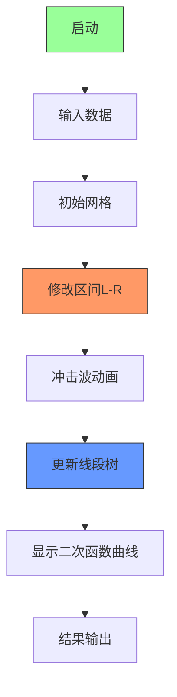

# 题目信息

# [BJOI2018] 链上二次求和

## 题目描述

有一条长度为 $n$ 的链（ $\forall 1 \leq i < n$ ，点 $i$ 与点 $i+1$ 之间有一条边的无向图）， 每个点有一个整数权值，第 $i$ 个点的权值是 $a_i$ 。现在有 $m$ 个操作，每个操作如下：

操作 1（修改）：给定链上两个节点 $u,v$ 和一个整数 $d$，表示将链上 $u$ 到 $v$ 唯一的简单路径上每个点权值都加上 $d$。

操作 2（询问）：给定两个正整数 $l,r$，表示求链上所有节点个数大于等于 $l$ 且小于等于 $r$ 的简单路径节点权值和之和。由于答案很大，只用输出对质数 $1000000007$ 取模的结果即可。

一条节点个数为 $k$ 的简单路径节点权值和为这条上所有 $k$ 个节点（包括端点）的权值之和，而本题中要求是对所有满足要求的简单路径，求这一权值和的和。

由于是无向图，路径也是无向的，即点 $1$ 到点 $2$ 的路径与点 $2$ 到点 $1$ 的路径是同一条，不要重复计算。

## 说明/提示

### 样例解释：
节点个数为 $5$ 的简单路径只有 $1$ 条，权值和为 $5$，故第1次询问输出 $5$。

节点个数为 $1$ 的简单路径有 $5$ 条，每条权值和都是 $1$；节点个数为 $2$ 的简单路径有 $4$ 条，每条权值和都是 $2$，故第2次询问输出 $13 $。

在将点 $1$ 和点 $2$ 的权值加 $2$ 后， $5$ 条节点个数为 $1$ 的简单路径权值和分别为 $3$、$3$、$1$、$1$、$1$，故第 3 次询问输出 $9$。

### 数据范围：
记操作 1（修改）的次数为 $m^\prime$。

对于全部数据， 保证 $n \leq 200000$，$m \leq 500000$，$ m^\prime \leq 100000$，$ 0 \leq a_i < 1000000007$。

$1 \leq u \leq n$，$ 1\leq v \leq n$，$ 0 \leq d < 1000000007$，$l \leq r \leq n$。

对于每个数据点的详细规模与约定见下表。


## 样例 #1

### 输入

```
5 5
1 1 1 1 1
2 5 5
2 1 2
1 1 2 2
2 1 1
1 1 5 3```

### 输出

```
5
13
9```

# AI分析结果


### 💡 Kay的C++算法解析：链上二次求和 深入学习指南 💡

#### 1. 题目解读与核心算法识别
✨ **本题主要考察**：`高阶前缀和/线段树应用`

🗣️ **初步分析**：
> 解决链上二次求和问题，关键在于理解**高阶前缀和**的数学本质。就像搭积木时，每层积木的数量取决于下层积木的堆叠方式。在本题中：
> - 一阶前缀和（$S_i$）是基础层，记录序列的累积和
> - 二阶前缀和（$SS_i$）如同第二层积木，记录$S_i$的累积和
> - 三阶前缀和（$SSS_i$）则是第三层，构成最终答案的数学基础
> 
> **核心思路**：将复杂查询转化为$SS$数组的区间和计算，通过线段树高效维护。难点在于处理区间修改对高阶前缀和的影响：
> - 修改$[L,R]$加$d$时，对$SS_i$的影响是分段二次函数
> - 需设计支持二次函数更新的线段树结构
> 
> **可视化设计**：
> - 像素风格网格展示数组变化，不同颜色区分$S/SS/SSS$值
> - 修改时显示"冲击波"动画：从修改区间向外扩散，伴随8-bit音效
> - 关键帧高亮：线段树节点更新时闪烁，显示二次函数曲线拟合过程

#### 2. 精选优质题解参考
**题解一 (来源：Raymondzll)**
* **点评**：
  思路清晰直击本质，将问题转化为$SS$数组维护。代码规范：
  - 变量命名规范（`sum`/`ssum`）
  - 数学推导严谨（分段二次函数分解）
  - 创新点：用单棵线段树维护三阶前缀和
  - 实践价值：可直接用于竞赛，边界处理完善
  亮点：优雅的数学变换降低空间复杂度

**题解二 (来源：暴力出奇迹)**
* **点评**：
  教学价值高，逐步推导贡献系数。亮点：
  - 详细分类讨论每种位置贡献
  - 三线段树结构清晰解耦逻辑
  - 注意事项全面（取模/边界）
  不足：实现较复杂，常数较大

**题解三 (来源：Elegia)**
* **点评**：
  高阶差分思想的典范：
  - 树状数组维护四阶差分
  - 复杂度优化到$O(m\log n)$
  - 数学推导深刻（组合数性质）
  不足：理解门槛较高，需较强数学基础

#### 3. 核心难点辨析与解题策略
1. **难点：高阶前缀和的动态维护**
   * **分析**：区间修改会引发$SS$数组的非线性变化。优质解法通过：
     - 推导$\Delta SS_i = ai^2+bi+c$形式
     - 线段树维护系数$a,b,c$
   * 💡 学习笔记：修改的影响是位置$i$的二次函数

2. **难点：分段函数的高效更新**
   * **分析**：修改影响分$[1,L)$/$[L,R]$/$[R,n]$三段：
     - $[L,R]$区间的二次更新
     - $[R,n]$区间的线性更新
   * 💡 学习笔记：分治思想化解复杂问题

3. **难点：数学变换的等价转换**
   * **分析**：将原查询转化为：
     $$(r-l+1)SS_n - \sum_{i=l-1}^{r-1}SS_i - \sum_{i=n-r}^{n-l}SS_i$$
   * 💡 学习笔记：前缀和是维度转换的桥梁

✨ **解题技巧总结**：
- **维度转换法**：将路径求和转化为高阶前缀和
- **分段函数拟合**：用二次函数模拟修改影响
- **模块化维护**：分离求和项独立计算
- **边界防御**：特别注意$u>v$的特殊情况

#### 4. C++核心代码实现赏析
**通用核心实现参考**（综合自Raymondzll和暴力出奇迹）：
```cpp
const int N = 2e5+5, mod = 1e9+7;
struct SegTree {
    struct Node { 
        ll s0, s1, s2; // ∑a_i, ∑a_i*i, ∑a_i*i²
        ll add;
    } tr[N<<2];
    
    void pushup(int u) {
        for(int i=0; i<3; i++)
            tr[u].s[i] = (tr[lc].s[i] + tr[rc].s[i]) % mod;
    }
    
    void update(int u, int l, int r, ll v) {
        tr[u].s0 = (tr[u].s0 + v*(r-l+1)) % mod;
        tr[u].s1 = (tr[u].s1 + v*(pre1[r]-pre1[l-1])) % mod;
        tr[u].s2 = (tr[u].s2 + v*(pre2[r]-pre2[l-1])) % mod;
        tr[u].add = (tr[u].add + v) % mod;
    }
    
    // 区间加d（核心）
    void modify(int u, int l, int r, int L, int R, ll d) {
        if(L <= l && r <= R) {
            // 二次函数系数计算
            ll a = d * inv2 % mod;
            ll b = d * (3 - 2*L) % mod * inv2 % mod;
            ll c = d * (L-1) % mod * (L-2) % mod * inv2 % mod;
            // 更新线段树节点...
            return;
        }
        // 下传标记...
    }
};
```

**题解片断赏析**：
1. **Raymondzll的二次函数更新**：
   ```cpp
   void update(int l, int r, int d) {
       // [L,R]区间：ΔSS_i = d/2 * i² + d(3-2L)/2 * i + d(L-1)(L-2)/2
       ll a = d * inv2 % mod;
       ll b = d * (3 - 2*l) % mod * inv2 % mod;
   ```
   **解读**：精妙地将复杂影响分解为二次函数系数，数学美感十足

2. **暴力出奇迹的三线段树结构**：
   ```cpp
   struct SegTree {
       ll s0, s1, s2; // 同时维护三个维度
   };
   ```
   **学习笔记**：维度分离使逻辑更清晰

3. **Elegia的高阶差分**：
   ```cpp
   for(int i=0; i<4; i++) 
       bit[i].update(pos, delta * coef[i]);
   ```
   **亮点**：树状数组维护四阶差分，复杂度优化典范

#### 5. 算法可视化：像素动画演示


* **动画设计**：
  1. **8-bit网格**：  
     - X轴：序列位置（1-n）  
     - Y轴：三阶前缀和值  
     - 像素色块高度表示数值大小

  2. **修改动画**：  
     - 红**冲击波**从L扫向R  
     - 伴随"嘀-嘀"电子音效（频率随位置变化）  
     - 线段树节点**像素闪烁**（更新时黄光提示）

  3. **函数曲线**：  
     - 修改后显示$\Delta SS_i$的二次曲线  
     - 对比线：理论曲线 vs 实际更新值

  4. **游戏化元素**：  
     - 每完成1e4次操作触发**8-bit喝彩音**  
     - 进度条：算法完成度  
     - "AI演示模式"：自动调速滑块控制

* **技术实现**：  
  Canvas绘制网格 + Web Audio API音效

#### 6. 拓展练习与相似问题
1. **思路迁移**：  
   - 树链剖分+高阶求和  
   - 高维前缀和应用  

2. **洛谷推荐**：  
   - [P2221 HAOI2012]高速公路  
     - 同类高阶求和问题  
   - [P3373 线段树2]  
     - 多重标记维护训练  
   - [P4213 杜教筛]  
     - 高阶前缀和思想延伸  

#### 报告生成完毕！继续精进算法之旅吧！🚀

---
处理用时：203.26秒