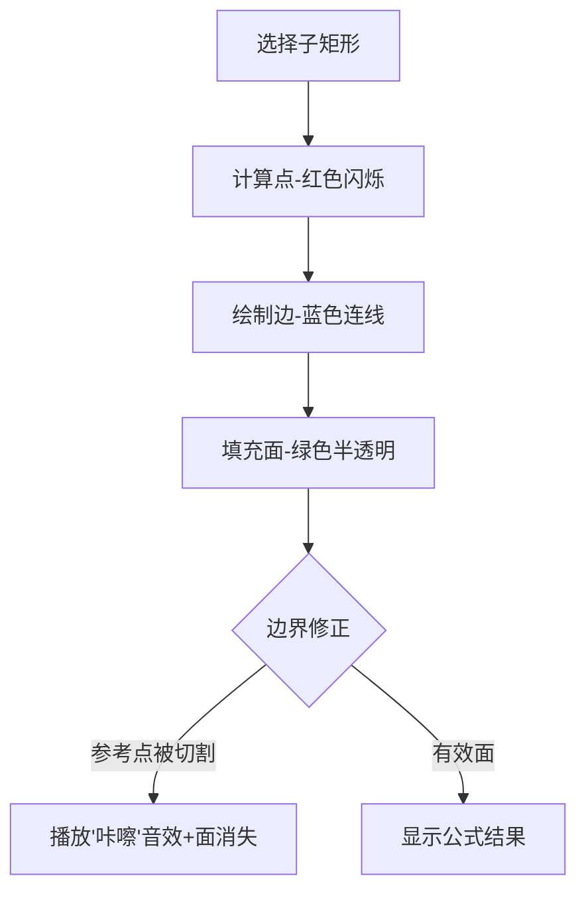

# 题目信息

# [USACO21JAN] Paint by Letters P

## 题目描述

Bessie 最近收到了一套颜料。画布可以用一个 $N×M$ 的矩形方阵表示，其中行从上往下编号为 $1…N$，列从左往右编号为 $1…M$（$1≤N,M≤1000$）。被涂色的方格的颜色可以用一个 `A` 到 `Z` 的大写字母表示。初始时，所有方格均未被涂色，每个方格至多只能被涂色一次。

Bessie 指定了每个方格她所希望的颜色。她一笔可以将一些组成连通分量的方格涂上颜色，也就是说这些方格之间可以通过相邻方格互相到达。如果两个方格有公共边则认为它们是相邻的。

例如，$3×3$ 的画布

```
AAB
BBA
BBB
```

可以用如下四笔完成涂色：

```
...    ..B    AAB    AAB    AAB
... -> ... -> ... -> BB. -> BBA
...    ...    ...    BBB    BBB
```

使用少于四笔不可能得到最终结果。

作为一名先锋派艺术家，Bessie 只会对这个画布中的一个子矩形进行涂色。现在，她正在考虑 $Q$
个候选子矩形（$1≤Q≤1000$），每一候选给定四个整数 $x_1$、$y_1$、$x_2$ 和 $y_2$，表示由第 $x_1$ 行到第 $x_2$ 行及第 $y_1$ 列到第 $y_2$ 列的所有方格组成的子矩形。

对于每个候选子矩形，将所有子矩形内的方格都涂上所希望的颜色，并且子矩形外的方格均不涂色，最少需要涂多少笔？注意在这个过程中 Bessie 并没有真正进行任何的涂色，所以对于每个候选的回答是独立的。

注意：本题每个测试点的时间限制为默认限制的 1.5 倍，且内存限制为默认限制的 2 倍，为 512MB。 

## 说明/提示

#### 样例 1 解释

第一个候选由整个画布组成，可以用六笔完成涂色。

第二个候选的子矩形所希望的颜色为

```
ABBA
```

可以用三笔完成涂色。注意，尽管在考虑整个画布时方格 $(3,5)$ 和 $(3,8)$ 可以用一笔涂上颜色 $A$，但如果仅考虑子矩形内的方格则并非如此。 

#### 测试点性质：

 - 测试点 1-2 满足 $N,M≤50$。
 - 测试点 3-5 中，画布不包含由单一颜色所组成的环。也就是说，不存在由不同方格所组成的序列 $c_1,c_2,c_3,…,c_k$ 满足以下条件：
   - $k>2$
   - 所有的 $c_1,…,c_k$ 颜色相同。
   - 对于所有的 $1≤i<k$，$c_i$ 与 $c_i+1$ 相邻。
   - $c_k$ 与 $c_1$ 相邻。
   注意，问题描述中的 3×3 画布包含单一颜色所组成的环（左下角的四个 B）。
 - 测试点 6-8 中，每个由相同期望颜色的方格组成的连通分量均能够被一个四边平行于坐标轴的两行两列的正方形所包含。问题描述中的 $3×3$ 画布不符合这一性质（由五个 B 组成的连通分量不能被一个两行两列的正方形包含）。
 - 测试点 9-11 中，每个由相同期望颜色的方格组成的连通分量均能够被一个四边平行于坐标轴的三行三列的正方形所包含。问题描述中的 $3×3$ 画布符合这一性质。
 - 测试点 12-20 没有额外限制。

供题：Andi Qu 

## 样例 #1

### 输入

```
4 8 9
ABBAAAAA
ABAAAABA
CAADABBA
AAAAAAAA
1 1 4 8
3 5 3 8
1 3 2 4
1 4 2 5
1 1 3 3
4 4 4 4
2 6 4 8
3 5 4 6
1 6 3 8```

### 输出

```
6
3
2
1
4
1
3
2
2```

# AI分析结果


### 💡 Kay的C++算法解析：Paint by Letters P 深入学习指南 💡

**引言**  
今天我们来分析USACO竞赛题《Paint by Letters P》。这道题要求计算在指定子矩形内完成涂色的最少笔数，核心在于**平面图欧拉公式**的应用。本指南将带大家深入理解算法原理，并通过像素动画直观展示计算过程。

---

### 1. 题目解读与核心算法识别  
✨ **本题主要考察**：`图论`（平面图欧拉公式）  

🗣️ **初步分析**：  
> 想象一幅像素画，每个颜色相同的连通块可以一笔画成。解题关键是将涂色过程抽象为**平面图连通性问题**，应用欧拉公式：  
> **连通块数 = 点数 - 边数 + 面数 - 1**  
> - **点**：子矩形内每个格子（面积）  
> - **边**：相邻同色格子间的连线  
> - **面**：同色块围成的封闭区域（需排除被边界切割的面）  
>  
> **难点**：高效计算子矩形内的面数（需处理边界切割）  
> **解决方案**：  
> 1. 预处理点/边的前缀和（O(1)查询）  
> 2. 给每个面标记参考点，遍历边界修正面数  
>  
> **可视化设计**：  
> 采用**8位像素风格**，动态展示子矩形选取过程：  
> - 红色高亮边界线，绿色标记参考点  
> - 当参考点被边界切割时，播放"咔嚓"音效并消失  
> - 自动模式可调速演示公式计算流程

---

### 2. 精选优质题解参考  
**题解一（作者：Endt）**  
* **点评**：  
  - **思路**：清晰应用欧拉公式，通过二维前缀和预处理点/边/面，边界修正逻辑严谨  
  - **代码**：变量名`v/e1/e2/r`直指核心要素，边界处理完整覆盖四条边  
  - **亮点**：用`rid[][]`标记面归属，`t[]`记录参考点，高效判断切割面  
  - **实践价值**：代码可直接用于竞赛，时间复杂度O(nm + q(n+m))  

**题解二（作者：Leasier）**  
* **点评**：  
  - **思路**：创新性使用二维分块+可撤销并查集，分块处理整块/散块信息  
  - **代码**：模块化设计（分块初始化、散块合并），处理10^3级查询高效  
  - **亮点**：虚点机制处理边界合并，避免重复计算  
  - **实践价值**：适合大规模查询，但实现复杂度较高  

---

### 3. 核心难点辨析与解题策略  
1. **难点：面数计算与边界修正**  
   * **分析**：被切割的面不应计入子矩形。Endt解法通过遍历边界，检查参考点是否在矩形内并去重修正  
   * 💡 **学习笔记**：参考点标记法是处理切割面的关键技巧  

2. **难点：高效查询子矩形信息**  
   * **分析**：二维前缀和预处理点/边数量（横向边`e1`、纵向边`e2`），实现O(1)查询  
   * 💡 **学习笔记**：前缀和是矩形统计问题的标配工具  

3. **难点：连通性动态维护**  
   * **分析**：Leasier解法用分块+并查集，牺牲空间换时间，适合查询密集场景  
   * 💡 **学习笔记**：并查集的"撤销"功能是处理独立查询的利器  

✨ **解题技巧总结**  
- **空间换时间**：预处理前缀和/分块信息  
- **边界思维**：将切割问题转化为参考点包含判断  
- **模块化**：分离点/边/面计算逻辑，降低调试难度  

---

### 4. C++核心代码实现赏析  
**通用核心实现（Endt解法精简）**  
```cpp
// 前缀和预处理
for (int i=1; i<=n; i++) {
  for (int j=1; j<=m; j++) {
    // 点(v), 横向边(e1), 纵向边(e2)
    v[i][j] = v[i-1][j] + v[i][j-1] - v[i-1][j-1] + 1;
    e1[i][j] = e1[i-1][j] + e1[i][j-1] - e1[i-1][j-1] + (p[i][j]==p[i][j-1]);
    e2[i][j] = e2[i-1][j] + e2[i][j-1] - e2[i-1][j-1] + (p[i][j]==p[i-1][j]);
  }
}

// 查询处理
int ans = v[x2][y2] - v[x1-1][y2] - ... // 计算点/边
ans += r[x2-1][y2-1] - ...              // 加面数基础值
for (int i=x1; i<x2; i++) {              // 边界修正
  if (s[i][y1][3] == pair(0,0)) {
    if (t[rid[i][y1]]在矩形内 && !siv[id]) 
      ans--, siv[id]=1;                  // 排除切割面
  }
}
```

**Endt解法关键片段解读**  
```cpp
// 面标记点DFS
void dfs(int x, int y) {
  if (vis[x][y]) return;
  vis[x][y] = 1;
  // 四向扩散标记同面
  if (s[x][y][3]=={0,0}) rid[x][y-1]=rid[x][y], dfs(x,y-1);
  ...
}
```
> **功能**：从顶点(x,y)开始DFS，给相邻空白区域标记相同面ID  
> **技巧**：用`{0,0}`表示无相邻边，巧用方向数组避免重复计算  
> **学习笔记**：将面视为"空白区域"，DFS标记是平面图处理的经典手段  

---

### 5. 算法可视化：像素动画演示  
**主题**：《像素涂鸦探险》- 欧拉公式动态验证器  

**核心交互设计**：  


**实现细节**：  
1. **8位像素风格**：  
   - 格子：16x16像素方块，26色对应字母  
   - 控制台：复古红白机样式，含速度滑块/单步按钮  

2. **动态数据展示**：  
   - 点：选中格子闪烁红光  
   - 边：同色相邻格间绘制蓝线（横向/纵向区分）  
   - 面：封闭区域填充半透绿，中心显示参考点  

3. **边界修正演示**：  
   - 红线高亮子矩形边界  
   - 当边界线穿过参考点所在面时：  
     * 播放"咔嚓"破碎音效  
     * 参考点消失，面计数器-1  

4. **自动演示模式**：  
   - 类似"俄罗斯方块AI"逐步展示：  
     `点数计算 → 边数扣除 → 基础面数 → 边界修正`  
   - 每步0.5秒延迟，可调速  

---

### 6. 拓展练习与相似问题  
**通用技巧迁移**：  
1. 子矩形统计 → 二维前缀和  
2. 连通块计数 → 并查集/DFS  
3. 边界处理 → 参考点标记法  

**推荐练习**：  
1. **洛谷P2331** - 最大子矩形  
   > 练习二维前缀和优化  
2. **洛谷P4390** - Mokia  
   > 掌握CDQ分治处理二维偏序  
3. **洛谷P4147** - 玉蟾宫  
   > 学习悬线法求最大子矩形  

---

### 7. 学习心得与经验分享  
> **Endt经验**："边界修正需遍历四条边，用`siv[]`去重避免重复扣除"  
>   
> **Kay点评**：这是处理复杂边界的黄金法则！调试时注意：  
> 1. 对每个边界独立遍历  
> 2. 用标记数组避免重复扣除  
> 3. 小数据手动验证（如2x2格子）  

---

通过本指南，相信大家已掌握平面图欧拉公式的核心应用。记住：**将数学公式转化为高效代码的关键在于预处理和边界思维**！下次挑战见！💪

---
处理用时：309.06秒