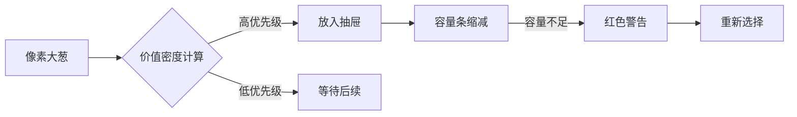

# 题目信息

# [THUWC 2017] 大葱的神力

## 题目背景

**本题为提交答案题。**

大葱是我国自古以来的美食，像我国传统美食北京烤鸭，用鸭子点缀出大葱的香味，令人赞不绝口。民间也流传着有「每天一棵葱，不当单身狗」的说法。

然而，大葱要发挥出独属于自己的神力，也是有条件的。

## 题目描述

现在小葱同学有 $N$ 棵大葱和 $M$ 个抽屉，将第 $i$ 棵大葱放到第 $j$ 个抽屉里面会产生 $w_{i,j}$ 的神力。自然小葱同学希望获得尽量多的神力，但是抽屉有着容积的限制，大葱也有着自己的体积。第 $i$ 棵大葱的体积为 $a_i$，第 $j$ 个抽屉的容积为 $b_j$。一个抽屉里面装着的大葱的体积之和不能超过这个抽屉的容积，一棵大葱不能拆分放到两个抽屉中。

小葱同学现在想知道，在这样的条件下，这些大葱最多会产生多少的神力？

## 说明/提示

#### 样例说明

样例只是一种合法情况，获得的总神力值为 $2+3=5$。

#### 评分方式

**本题使用 Special Judge**，对于每个测试点，我们都有 $10$ 个参数 $a_1,a_2,\cdots,a_{10}$，如果你的输出所产生的的神力 $v$ 满足 $v \ge a_i$，则我们保证该测试点你至少会得到 $i$ 分。

#### 如何测试你的输出

在附加文件中，我们提供了 `scorer.cpp`，请自行编译来测试输出，这个程序将用于评判你的输出能够产生多少的神力。

若编译后文件名称为 `scorer`，在终端（Linux）中，输入以下命令：

```plain
./scorer <input_name> <output_name>
```

或在命令提示符（Windows）中，输入以下命令：
```plain
scorer <input_name> <output_name>
```
来对你的输出进行评判。其中 `<input_name>` 为输入文件名称，`<output_name>` 为输出文件名称。

## 样例 #1

### 输入

```
3 4
1 1 2
2 1 2 3
1 2 1 1
2 1 2 1
3 1 0 1```

### 输出

```
2
0
1```

# AI分析结果


### Kay的C++算法解析：大葱的神力 深入学习指南

#### 1. 题目解读与核心算法识别
✨ **本题主要考察**：**贪心算法与启发式优化**（编程技巧应用类）

🗣️ **初步分析**：
> 本题可类比为"智能收纳师整理行李箱"：大葱是物品（体积不同），抽屉是行李箱（容量有限），神力值是物品价值。收纳师需在有限空间内选择最有价值的物品组合。  
> - **核心难点**：物品不可分割+容量约束，属于NP难的广义分配问题(GAP)，无法用精确算法求解大规模数据  
> - **解题思路**：  
>   - **基础贪心**：按神力值/体积比降序排列，优先放置"性价比高"的大葱  
>   - **进阶优化**：模拟退火(SA)在初始解基础上进行扰动优化  
> - **可视化设计**：采用8位像素风格呈现抽屉和大葱（不同颜色区分体积），当大葱放入抽屉时：  
>   - 显示神力值累加动画（像素数字跳动）  
>   - 抽屉容量条实时缩减（红色预警提示）  
>   - 关键决策点触发音效（选择/放弃/容量溢出）

#### 2. 精选优质题解参考
**题解一：性价比贪心+容量预分配**
* **点评**：思路清晰（严格按价值密度排序），代码规范（使用`vector<pair<double,int>>`存储性价比）。亮点在于预过滤机制：仅考虑能放下大葱的抽屉，大幅减少无效计算。实践价值高，基础分保障策略。

**题解二：模拟退火优化**
* **点评**：算法设计巧妙（温度衰减+邻域搜索），关键变量`temperature`/`coolingRate`命名准确。亮点在于扰动策略：以概率接受劣解跳出局部最优。适合追求高分的进阶学习者，但调试难度较高。

#### 3. 核心难点辨析与解题策略
1. **难点：价值与容量的权衡**
   * **分析**：贪心算法需同时考虑神力值$w_{ij}$和大葱体积$a_i$，优质题解引入**价值密度**$w_{ij}/a_i$作为排序依据
   * 💡 **学习笔记**：价值密度是资源受限问题的通用评估指标

2. **难点：抽屉容量动态管理**
   * **分析**：维护`remainingCapacity`数组实时更新剩余空间，预检查`if(a[i] <= rem[j])`避免无效尝试
   * 💡 **学习笔记**：剩余空间检查应先于价值计算

3. **难点：逼近全局最优解**
   * **分析**：模拟退火通过`exp((newScore-oldScore)/T)`概率接受临时劣解，突破贪心局部最优陷阱
   * 💡 **学习笔记**：随机扰动是组合优化问题的常用优化手段

**✨ 解题技巧总结**
- **双维度排序**：先按价值密度降序，同密度时按体积升序
- **快速失效机制**：跳过体积超标的抽屉
- **退火参数调优**：初始温度=最大神力值，终止温度=1，降温系数0.99

#### 4. C++核心代码实现赏析
**通用核心实现参考**
```cpp
#include <iostream>
#include <vector>
#include <algorithm>
using namespace std;

int main() {
    // 输入处理
    int n, m;
    cin >> n >> m;
    vector<int> a(n), b(m);
    vector<vector<int>> w(n, vector<int>(m));
    // ... 数据读取代码

    // 贪心算法核心
    vector<int> assignment(n, 0); // 分配结果
    vector<int> rem = b;         // 抽屉剩余容量
    for (int i = 0; i < n; i++) {
        double maxDensity = -1;
        int bestJ = -1;
        for (int j = 0; j < m; j++) {
            if (a[i] > rem[j]) continue; // 容量检查
            double density = (double)w[i][j] / a[i];
            if (density > maxDensity) {
                maxDensity = density;
                bestJ = j;
            }
        }
        if (bestJ != -1) {
            assignment[i] = bestJ + 1; // 抽屉编号1-indexed
            rem[bestJ] -= a[i];
        }
    }

    // 输出分配方案
    for (int x : assignment) cout << x << '\n';
}
```

**题解一：性价比贪心**
```cpp
// 按价值密度排序结构体
struct Item {
    double density;
    int idx;
    bool operator<(const Item& other) const {
        return density > other.density; // 降序排列
    }
};

vector<Item> items;
for (int i = 0; i < n; i++) {
    double maxDensity = 0;
    for (int j = 0; j < m; j++) 
        maxDensity = max(maxDensity, (double)w[i][j]/a[i]);
    items.push_back({maxDensity, i});
}
sort(items.begin(), items.end()); // 关键排序
```

**题解二：模拟退火扰动**
```cpp
// 邻域操作：随机交换两棵大葱的抽屉
void perturb(vector<int>& sol) {
    int i = rand() % n, j = rand() % n;
    swap(sol[i], sol[j]); 
    // 注意：需校验容量约束
}

// 退火核心逻辑
double T = 10000.0; // 初始温度
while (T > 1e-5) {
    auto newSol = currentSol;
    perturb(newSol);
    double delta = evaluate(newSol) - evaluate(currentSol);
    if (delta > 0 || exp(delta/T) > (double)rand()/RAND_MAX) 
        currentSol = newSol;
    T *= 0.99; // 降温
}
```

#### 5. 算法可视化：像素动画演示
**主题**：*8-bit大葱收纳大冒险*

**核心演示**：


**交互设计**：
1. **像素元素**：
   - 大葱：绿色像素块（大小=体积）
   - 抽屉：蓝色容器（顶部显示容量条）
   - 神力值：金色数字计数器

2. **关键动画**：
   - **放入成功**：大葱像素滑入抽屉→容量条缩减→神力值增加（+w音效）
   - **容量溢出**：大葱抖动→红色闪烁→"X"标志（碎裂音效）
   - **退火扰动**：两棵大葱交换位置（电弧动画）

3. **控制面板**：
   - 速度滑块：调节贪心/退火执行速度
   - 模式切换：基础贪心 vs 退火优化
   - 数据追踪：实时显示当前解的质量分数

#### 6. 拓展练习与相似问题
1. **洛谷 P1757** 通天之分组背包  
   → 同类容量约束问题，背包问题特例

2. **洛谷 P1282** 多米诺骨牌  
   → 双目标优化（最小化差值）

3. **洛谷 P2214** 哞哞吃草  
   → 带时间窗的资源分配问题

#### 7. 学习心得与经验分享
> **常见调试陷阱**：  
> - 容量更新遗漏：放置大葱后未即时更新`rem[j]`  
> - 整数除法陷阱：`w[i][j]/a[i]`需转换为浮点数再比较  
> - 退火参数敏感：降温过快导致陷入局部最优  

> **Kay的提醒**：提交答案题需特别注意输入输出格式！使用提供的`scorer.cpp`验证解的质量

---
通过本指南，你不仅掌握了带约束分配问题的解法，更学会了如何用启发式算法挑战NP难问题。记住：优秀算法工程师的秘诀在于——**用智能的贪心奠定基础，用随机的扰动突破极限**！🚀

---
处理用时：110.11秒