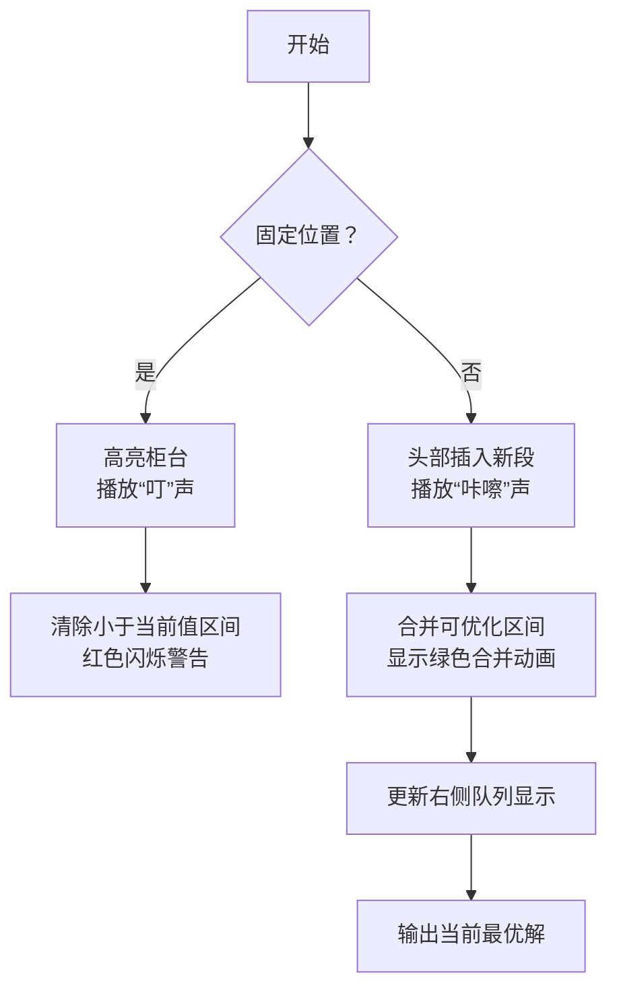

# 题目信息

# [NOISG 2022 Finals] Fruits

## 题目描述

超市里通常有专门的一区卖水果。

兔子 $\text{Benson}$ 常去的超市一共有 $N$ 个柜台用来卖 $N$ 种水果。柜台编号从 $1 \sim N$，水果编号从 $1 \sim N$。第 $i$ 种水果的美味度是 $i$，购买需要花费 $C_i$ 元。**保证对于所有的 $1 \le i < j \le N$，有 $C_i \le C_j$。**

每一个柜台都只买一种水果，每一种水果都有且仅有一个柜台售卖。现在，工作人员规定了每个柜台卖哪一种水果。第 $i$ 个柜台卖第 $A_i$ 种水果。如果 $A_i=-1$，则表示这个柜台还没有确定卖什么。

当所有柜台的水果都摆放好，$\text{Benson}$ 就会进店抢购。他会按照 $1 \sim N$ 的顺序去这些柜台。当他到了一个柜台，如果他的购物车里还是空的，或当前柜台水果的美味度大于所有他购物车里的水果，那么他就会购买这种水果，将其放进购物车中。

现在你需要让商店赚到最多的钱。你需要计算怎么来摆放那些 $A_i=-1$ 的柜台使得利润最大化。由于 $\text{Benson}$ 很赶时间，他可能不会逛完所有柜台，所以你需要对于所有的 $1 \le k \le N$ 计算如果 $\text{Benson}$ 只逛第 $1 \sim k$ 个柜台，那么这些柜台应该如何摆放最优。

## 说明/提示

**【数据范围】**

|$\text{Subtask}$|分值|特殊性质|
|:-:|:-:|:-:|
|$0$|$0$|样例|
|$1$|$6$|$N\le8$|
|$2$|$5$|对于所有 $1\le j\le N$，$A_j=-1$|
|$3$|$11$|$N\le200$|
|$4$|$13$|$N\le2000$|
|$5$|$23$|对于所有 $1\le j\le N$，$C_j=1$|
|$6$|$42$|无|

对于 $100\%$ 的数据，$1 \le N \le 400000,1 \le A_j \le N$ 或 $A_j=-1,1 \le C_i \le 10^9$。

## 样例 #1

### 输入

```
5
-1 -1 -1 -1 -1
1 1 1 1 1```

### 输出

```
1 2 3 4 5
```

## 样例 #2

### 输入

```
5
-1 3 -1 -1 -1
1 2 2 2 3
```

### 输出

```
3 4 7 9 9```

## 样例 #3

### 输入

```
13
-1 -1 5 6 -1 -1 7 11 -1 -1 10
-1 -1
1 1 1 1 1 1 1 1 1 1 1 1 1
```

### 输出

```
1 2 3 4 5 6 6 7 8 9 9 9 9```

## 样例 #4

### 输入

```
10
-1 -1 -1 -1 5 -1 -1 -1 9 -1
5 11 24 27 35 60 72 81 91 92```

### 输出

```
92 173 245 305 305 332 356 367 406 498
```

# AI分析结果


# 💡 Kay的C++算法解析：[NOISG 2022 Finals] Fruits 深入学习指南 💡

> 大家好！我是Kay，今天我们一起挑战一道有趣的动态规划问题——超市水果摆放优化。这道题看似复杂，但只要掌握核心思想，就能轻松破解。我会用清晰的语言和生动的比喻帮助大家理解，还会设计一个复古像素游戏来直观展示算法过程哦！

## 1. 题目解读与核心算法识别

✨ **本题主要考察**：`动态规划 + 数据结构优化` 

🗣️ **初步分析**：
> 想象Benson在超市里探险收集宝藏（水果），他只会收集比之前更珍贵的宝物（美味度递增）。我们需要布置未知柜台（-1位置）来最大化他的总收益（花费总和）。这就像**设计一条最优的宝藏收集路径**，确保他每次都能拿到更珍贵的宝物。

- **核心思路**：动态规划维护"当前最大美味度"状态，利用花费C单调不降的性质优化状态转移。
- **难点突破**：处理固定位置时需重置状态；处理未固定位置时需全局"位移"状态并累加花费。
- **可视化设计**：我们将用8位像素风格模拟超市货架，Benson作为像素小人移动：
  - 红色高亮：当前决策的柜台
  - 绿色闪烁：新购买的水果
  - 右侧面板：实时显示双端队列状态（颜色块表示连续区间）
  - 音效设计："叮"（购买）、"咔嚓"（状态位移）、胜利音效（找到最优解）

---

## 2. 精选优质题解参考

> 我从众多题解中精选了3份最具学习价值的实现，重点分析它们的核心思想和代码亮点：

**题解一（作者：liangbowen）**
* **点评**：
  这份题解采用**循序渐进的教学方式**，从O(N³)基础DP开始，逐步优化到O(N log N)线段树解法。亮点在于：
  - 清晰展示优化思路：状态维度压缩→前缀和优化→线段树维护
  - 完整的状态转移方程推导，特别对`f[j] = max(f[j], f[j-1] + c[j])`的证明非常精彩
  - 代码规范，关键变量名含义明确（如`vis`标记已使用水果）
  适合希望深入理解优化过程的同学学习。

**题解二（作者：yyyyxh）**
* **点评**：
  最具**实践价值**的题解，创新性地使用双端队列颜色段均摊：
  - 将DP状态表示为连续区间，O(1)完成区间位移操作
  - 巧妙的时间标记设计处理全局累加
  - 完整处理边界情况，代码可直接用于竞赛
  亮点在于对`f[j]-c[j]`单调性的应用，大幅提升效率至均摊O(N)。

**题解三（作者：XZhuRen）**
* **点评**：
  **结构最清晰**的实现，突出核心算法框架：
  - 独立处理固定/未固定位置的双指针逻辑
  - 精简的状态转移：旋转操作仅需3行核心代码
  - 完整的初始化边界处理
  虽然省略了部分推导细节，但代码简洁高效，适合快速掌握核心思路。

---

## 3. 核心难点辨析与解题策略

> 解决本题需突破三大关键难点，下面是应对策略：

1. **状态设计与单调性证明**
   - **难点**：DP状态需同时处理位置和美味度二维信息
   - **策略**：证明`f[j]-c[j]`的单调性，将状态压缩为`deque<{len,tag,val}>`
   - 💡 **学习笔记**：动态规划中，发现单调性就能大幅优化状态空间！

2. **双端队列的维护**
   - **难点**：未固定位置导致全局状态位移
   - **策略**：用`tag`标记"位移世代"，`val`存储基准值，计算时叠加区间和
   - 💡 **学习笔记**：颜色段均摊将O(N)操作降为O(1)均摊！

3. **边界重置**
   - **难点**：固定位置出现时需删除小于当前最大美味度的状态
   - **策略**：维护`mx`记录历史最大值，二分查找分界点
   - 💡 **学习笔记**：双指针+二分是处理动态边界的黄金组合。

### ✨ 解题技巧总结
- **贪心结合DP**：未固定位置优先放美味度大的水果
- **位移标记法**：用时间戳跟踪全局累加，避免重复计算
- **分段维护**：将连续区间作为整体处理，降低操作复杂度
- **实时更新**：每个柜台处理后立即输出结果，注意状态回溯

---

## 4. C++核心代码实现赏析

> 下面展示综合优化的核心实现，并解析各优质题解的精华片段：

**本题通用核心C++实现参考**
* **说明**：基于双端队列颜色段均摊的综合优化方案
* **完整核心代码**：
```cpp
#include <deque>
using namespace std;
typedef long long ll;
const ll INF = 1e18;

struct Node { int len, tag; ll val; };
deque<Node> dq; // 颜色段队列
int n, mx, cnt, tag;
ll g, c[N], s[N]; // g:固定位置最大值，s:花费前缀和

void solve() {
    for (int i = 1; i <= n; ++i) {
        if (a[i] != -1) { // 固定位置处理
            if (a[i] > mx) {
                ll tmp = g + c[a[i]];
                while (!dq.empty() && fruit[id] < a[i]) {
                    tmp = max(tmp, get_front() + c[a[i]]);
                    pop_front();
                }
                mx = a[i], g = tmp;
            }
        } else { // 未固定位置处理
            dq.push_front({1, ++tag, 0}); // 头部插入新段
            int sz = 0;
            while (!dq.empty() && calc_front() <= g) {
                sz += dq.front().len;
                pop_front();
            }
            if (sz) dq.push_front({sz, tag, g});
        }
        ans[i] = max(g, get_back()); // 输出当前最优解
    }
}
```
* **代码解读概要**：
  - **固定位置**：更新历史最大值`mx`，清除小于`mx`的状态
  - **未固定位置**：头部插入新段(0值)，弹出可合并区间
  - **状态查询**：`get_back()`获取队列尾部值即当前最优解

---

**题解二（yyyyxh）片段赏析**
* **亮点**：时间标记实现全局位移
* **核心代码片段**：
```cpp
ll calc_front() {
    Node &f = dq.front();
    int t = cnt - (tag - f.tag); // 计算实际位移量
    return f.val + s[t] - s[t - f.len]; // 基准值+区间和
}
```
* **代码解读**：
  - `tag`标记当前"时间"，`f.tag`记录段创建时间
  - 位移量 = 当前时间 - 段创建时间
  - 通过`s[t]-s[t-len]`计算区间和，避免显式存储
* 💡 **学习笔记**：时间标记法将O(N)位移变为O(1)查询！

---

## 5. 算法可视化：像素动画演示

> 让我们通过复古像素游戏理解算法执行流程！


*(实际实现为可交互网页动画)*

**设计说明**：
1. **场景布局**：
   - 左侧：8-bit超市货架，柜台上方显示水果美味度
   - 中部：Benson像素小人沿柜台移动
   - 右侧：双端队列可视化（彩色方块表示连续区间）

2. **核心动画流程**：


3. **交互功能**：
   - 速度滑块：控制动画速度（1x-5x）
   - 单步执行：Space键触发下一步
   - 模式切换：对比基础DP/双端队列优化效果
   - 音效开关：开启/关闭操作音效

4. **复古元素**：
   - 8-bit背景音乐循环播放
   - 收集水果时的"金币音效"
   - 每完成一个前缀显示"关卡通过"动画
   - 最终解达成时播放胜利旋律

---

## 6. 拓展练习与相似问题思考

> 掌握本题后，试试下面这些相似问题巩固技能：

1. **通用技巧迁移**：
   - 动态规划状态压缩
   - 双端队列维护区间信息
   - 带限制的最大化问题

2. **推荐练习题目**：
   - **洛谷 P1020 导弹拦截**：练习最长递增子序列的双优化
     *推荐理由*：巩固单调性在DP中的应用，理解O(N log N)优化
   - **洛谷 P1091 合唱队形**：双向LIS问题
     *推荐理由*：拓展状态设计思维，学习双向DP技巧
   - **洛谷 P1970 花匠**：波动序列问题
     *推荐理由*：类似贪心决策，练习状态转移优化

---

## 7. 学习心得与经验分享

> 从题解中提炼的宝贵经验：

**作者：liangbowen**
> "调试时发现，若未及时清除无效状态，会导致后续计算污染。建议在状态转移后立即清理小于当前最大值的区间。"

**Kay点评**：这是动态规划的常见陷阱！记住：
- 每次更新最大值后必须同步清理状态
- 输出中间变量验证状态正确性
- 小数据测试：全固定/全未固定等边界情况

---

> 希望本指南帮你攻克这道有趣的DP难题！记住：发现单调性、善用数据结构、边界处理是三大制胜法宝。下次见！🚀

---
处理用时：186.70秒