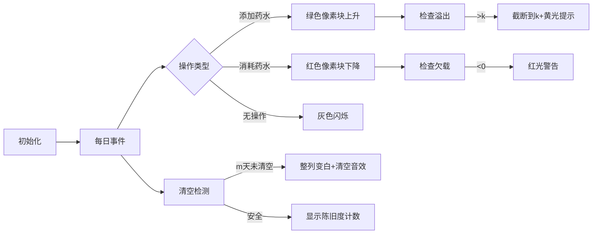

# 题目信息

# [集训队互测 2024] 药水

## 题目描述

你是一位远近闻名的大法师，你拥有一个药水店，店里有一个容量为 $k$ 单位的炼药锅。

药水店一共经营了 $n$ 天，每天会发生以下的事件恰好一次：

**有个初始给定的概率序列 $a_l,a_{l+1}\dots a_r$，表示 $l\sim r$ 被随机选中的概率，保证 $\sum a_i=1$，然后每天会按照 $a$ 带权随机一个整数 $i$。**

**如果 $i=0$，则什么也不干；**

**如果 $i<0$，则有一位顾客买走了 $-i$ 单位的药水，你的锅中药水量始终不能小于 $0$；**

**如果 $i>0$，则大法师向锅内加入了 $i$ 单位的药水，如果超过了锅的容量则加到满为止。**

同时你还可以在每天结束时决定是否清空炼药锅。（第一天开始前视作清空过炼药锅）。

药水店的顾客很挑剔，如果他们买到的药水的陈旧度超过 $m$ 天，那么他们就会生气。

药水的陈旧度定义为该日炼药锅距离上一次清空过了多少天，例如，昨天结束时刚清空完炼药锅则今日药水的陈旧度为 $1$（当然，这种情况下今天开始时锅里也没有药水）。

**为了维持你的名声，即使某天没有顾客来，你也要保证当天清空前锅里的药水的陈旧度不超过 $m$。**

作为一位大法师，你自然不希望有顾客生气。因此对于接下来 $n$ 天的每一种情况，如果你能在预知每天发生的事件的基础下合理清空炼药锅，使得没有人生气，你就认为这种情况是好的。

即，对于一个确定的事件序列 $b_1,b_2,\dots,b_n$（$b_i$ 为第 $i$ 天随机到的整数），你认为他发生的概率是 $\prod_{i=1}^n a_{b_i}$，且你认为他是好的当且仅当存在一种清空炼药锅的方案，使得每天锅里的药水的陈旧度都不超过 $m$，且所有顾客都买到了他需要的药水量。

现在你想知道这 $n$ 天的情况有多大概率是好的，因为你不喜欢实数，所以你只想知道答案对 $998244353$ 取模的结果。

**形式化题意：**

给定概率序列 $a_l,a_{l+1},\dots,a_r$，保证 $\sum a_i=1$。

考虑所有长为 $n$ 的整数序列 $b_1,b_2,\dots,b_n$，满足 $b_i\in [l,r]$，定义其出现概率为 $\prod_i a_{b_i}$。

定义序列 $b$ 是好的，当且仅当存在 $c_1,c_2\dots,c_n$，满足 $c_i\in \{0,k\}$，使得数列 $s_i=\min(s_{i-1}+b_i,c_i)$ 所有元素 $\geq 0$，且任意连续 $m$ 项都有一项为 $0$，其中 $s_0=0$。

求所有好的 $b$ 序列的出现概率之和对 $998244353$ 取模的结果。

## 说明/提示


| subtask |          $n$           | $r-l+1$  |       特殊性质        | 分值 |
| :-----: | :--------------------: | :------: | :-------------------: | :--: |
|   $1$   |       $\leq 10$        | $\leq 7$ |          无           | $10$ |
|   $2$   |       $\leq 100$       | $\leq 7$ |          无           | $10$ |
|   $3$   |      $\leq 10^4$       | $\leq 7$ |          无           | $20$ |
|   $4$   | $\leq 1.2\times 10^5$  | $\leq 3$ | $a'_{-1}=a'_1,a'_0=0$ | $15$ |
|   $5$   | $\leq 1.2\times 10^5$  | $\leq 3$ |          无           | $10$ |
|   $6$   |  $\leq 6\times 10^4$   | $\leq 5$ |          无           | $15$ |
|   $7$   | $\leq 1.2 \times 10^5$ | $\leq 7$ |          无           | $20$ |

对于所有数据：$1\leq m\leq n \leq 1.2\times10^5$，$1\leq k \leq 10^6$，$-3\leq l < 0 < r \leq 3$，$a'_i \in [0,998244353)$，$a'_l,a'_r>0$，$\sum a'_i\equiv 1 \pmod{998244353}$。

## 样例 #1

### 输入

```
3 2 1 -1 1
499122177 0 499122177```

### 输出

```
623902721```

## 样例 #2

### 输入

```
10 7 7 -2 2
1 2 3 4 998244344```

### 输出

```
5347454```

## 样例 #3

### 输入

```
10000 6000 11451 -3 3
1 9 1 998244325 9 8 1```

### 输出

```
45917006```

## 样例 #4

### 输入

```
120000 100000 114514 -3 3
875253823 187452905 284279374 460346727 51435610 206896725 929067896```

### 输出

```
206445697```

# AI分析结果


## 💡 Kay的C++算法解析：「药水」题解报告 💡

### 1. 题目解读与核心算法识别
✨ **本题主要考察**：`动态规划` + `生成函数` + `整式递推优化`

🗣️ **初步分析**：
> 这道题可以想象成在一条有护栏（药水量≥0且≤k）的路径上行走，每天随机发生添加/消耗药水的事件（概率由a序列决定）。解题关键在于：
> 1. 将"连续m天必须清空"转化为**极长安全段（长度≤m）的组合问题**（类似将项链拆分为珍珠串）
> 2. 用生成函数建立安全段长度与总方案数的关系：$F(x) = \frac{1}{1-G(x)}$
> 3. 核心难点在于高效计算无m限制时的基础概率$\hat F(x)$
> 
> **可视化设计思路**：
> - 用像素网格纵向表示药水量（0→k），横向表示天数
> - 添加药水→绿色像素块上升，消耗→红色块下降
> - 清空操作时整列变白闪烁+音效提示
> - 连续段超过m天时触发警告红光和警报音

---

### 2. 精选优质题解参考
**题解（作者：NaCly_Fish）**
* **亮点**：
  - 创新性使用**生成函数组合学**化解m限制
  - 发现$G_j(x)$满足**整式递推**特性（关键突破）
  - 提出两种优化方案：ODE自动机/高斯消元+插值
  - 复杂度优化到$\Theta(D^7 + nD^2\log n)$（D=r-l+1≤7）

---

### 3. 核心难点辨析与解题策略

1.  **关键点：状态空间压缩**
    * **分析**：直接DP需存药水量（0~k）导致状态爆炸（k≤1e6）。题解通过发现$G_j(x)$的**线性递推特性**，将状态维度从O(k)降至O(D²)
    * 💡 **学习笔记**：大范围递推问题常存在代数结构

2.  **关键点：时间约束转化**
    * **分析**：将"每m天清空"转化为**极长安全段的生成函数组合**（$F(x)=1/(1-G(x))$），利用多项式求逆处理分段组合
    * 💡 **学习笔记**：限制性条件可转化为组合对象的分割

3.  **关键点：高效求解生成函数**
    * **分析**：利用$G_j(x)$的**微分有限性**，通过：
      1) ODE自动机求系数递推式
      2) 高斯消元+多项式插值
      降低计算复杂度
    * 💡 **学习笔记**：特殊函数性质是优化关键

#### ✨ 解题技巧总结
- **生成函数转化**：将序列约束→生成函数关系→多项式运算
- **维度压缩**：发现隐含代数结构降维（整式递推）
- **模块化处理**：先解决无限制子问题再组合约束条件

---

### 4. C++核心代码实现赏析

**通用核心实现框架**：
```cpp
#include <vector>
#include <cmath>
using namespace std;
const int MOD = 998244353;

vector<int> calcFhat(int n, int k, int l, int r, vector<int> a) {
    // 1. 建立G_j(x)的递推关系（省略整式递推推导）
    vector<vector<int>> A(k+1), B(k+1); 
    
    // 2. 解线性方程组（简化版示意）
    for(int j=0; j<=k; j++) {
        if(j == 0) A[j] = {1}, B[j] = {0};
        else {
            // 实际需用整式递推或ODE自动机填充系数
            for(int d=l; d<=r; d++) 
                if(j-d >= 0) 
                    A[j] = polyAdd(A[j], polyMul(a[d-l], A[j-d]));
        }
    }
    
    // 3. 解终点方程得G_0(x)（关键步骤）
    vector<int> G0 = solveEndpointEq(A, B, k);
    
    // 4. 计算F_hat = ΣG_j
    vector<int> F_hat(n+1, 0);
    for(int j=0; j<=k; j++)
        F_hat = polyAdd(F_hat, polyMul(A[j], G0));
    return F_hat;
}

int main() {
    // 输入n,m,k,l,r,a[]
    auto F_hat = calcFhat(m, k, l, r, a); // 计算mod x^{m+1}
    
    // 多项式求逆得G(x)=1-1/F_hat
    auto G = polyInv(F_hat, m+1); 
    for(auto &x : G) x = (MOD - x) % MOD;
    G[0] = (G[0] + 1) % MOD;
    
    // 最终答案F = 1/(1-G)
    auto F = polyInv(G, n+1);
    cout << F[n]; // 输出总概率
}
```

**关键技巧解析**：
1. `polyAdd/polyMul`：多项式加减乘（需NTT优化）
2. `solveEndpointEq`：解线性方程组求G₀(x)
3. `polyInv`：多项式求逆（标准模板）
4. **维度压缩**：A[j]/B[j]存储系数而非具体值

---

### 5. 算法可视化：像素动画演示

**主题**：《炼金学徒日记》像素模拟  
**核心设计**：


**交互功能**：
1. **控制面板**：步进/自动播放/调速滑块
2. **可视化层**：
   - 纵轴：药水量（像素高度=当前药水/k * 屏幕高）
   - 横轴：天数（1像素=1天）
   - 颜色编码：绿↑/红↓/灰∅/白（清空）
3. **音效系统**：
   - 添加药水："叮~"（8bit上升音阶）
   - 消耗药水："啵~"（下降音阶）
   - 清空操作："刷！"（像素擦除音）
   - 违规警告：持续蜂鸣音
4. **数据追踪**：
   - 左上角显示：当前天数/药水量/陈旧度
   - 左下角同步高亮代码执行位置

---

### 6. 拓展练习与相似问题
1. **洛谷P4548**（P4548）  
   **推荐理由**：概率生成函数经典应用，巩固递推关系建立

2. **洛谷P4723**（P4723）  
   **推荐理由**：整式递推优化实战，强化多项式技巧

3. **洛谷P5179**（P5179）  
   **推荐理由**：带限制的路径计数问题，训练组合转化能力

---

### 7. 学习心得
> **关键经验**：  
> "处理大范围递推时，先观察系数的代数特征比直接优化DP更重要"  
>   
> **Kay的总结**：  
> 本题启示我们：当状态空间巨大时，应尝试：
> 1. 寻找数学结构（如本题的微分有限性）
> 2. 用生成函数建立整体关系
> 3. 将工具复杂度（多项式技巧）转化为维度优势

---
处理用时：137.08秒