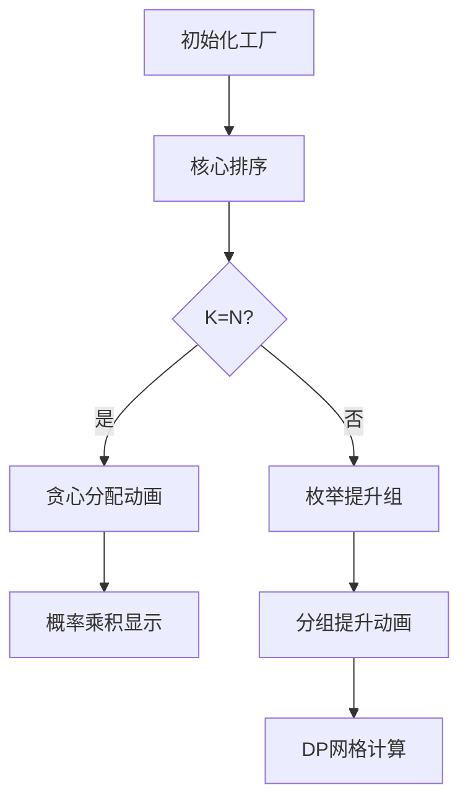

# 题目信息

# [GCJ 2017 #1C] Core Training

## 题目描述

编写 Code Jam 题目很难，因此我们开发了一个 AI 来提出新点子。为了让 AI 尽可能有创造力，我们为它配备了 $N$ 个不同的“核心”，每个核心都有自己的“个性”。然而，就像人一样，这些核心可能会分心、损坏或拒绝工作；第 $i$ 个核心正常工作的概率为 $P_i$。只要至少有 $K$ 个核心正常工作，AI 就能正常运行。否则，它很可能会变得邪恶，把我们困在自己设计的恶魔谜题迷宫里。谁知道它会对 Code Jam 做些什么——也许会写出一堆难到爆炸的概率题！

为了防止这种情况发生，我们计划训练一个或多个核心，使其更可靠。我们总共有 $U$ 个“训练单元”可以用来提升核心的可靠性。将 $X$ 个训练单元分配给第 $i$ 个核心，会使其成功概率增加 $X$。我们可以随意分配这些训练单元，也可以让一个或多个核心不分配任何训练单元。当然，核心的成功概率不能超过 $1$。

如果我们以最大化 AI 正常运行概率的方式分配训练单元，这个概率是多少？

## 说明/提示

**样例解释**

注意，最后两个样例不会出现在小数据集 1 中。

在样例 1 中，我们有足够的训练单元，可以让所有核心的成功概率都变为 1，因此 AI 一定能正常运行。

在样例 2 中，两个核心都必须正常工作，AI 才能正常运行，因此必须给每个核心分配一些训练单元。最优方案是将每个核心都训练到 $0.5$。此时 AI 正常运行的概率为 $0.5 \times 0.5 = 0.25$。其他分配方式都不如这个好；比如把一个核心训练到 $0.9$，另一个训练到 $0.1$，成功概率只有 $0.9 \times 0.1 = 0.09$。

在样例 3 中，我们没有训练单元可用，且至少需要一个核心正常工作。可以先计算 AI 无法正常工作的概率，即所有核心都失效。两个核心都失效的概率为 $(1 - 0.9) \times (1 - 0.8) = 0.02$。因此至少有一个核心正常工作的概率，即 AI 正常运行的概率为 $1 - 0.02 = 0.98$。

在样例 4 中，最优策略是将所有训练单元都分配给第二个核心。这样至少有一个核心正常工作的概率为 $1 - (0.4 \times 0.6) = 0.76$。其他分配方式都不如这个好；比如全部分配给第一个核心只得到 $0.75$，平均分配给两个核心得到 $0.7525$。

**数据范围**

- $1 \leq T \leq 100$。
- $1 \leq N \leq 50$。
- 对所有 $i$，$0.0000 \leq P_i \leq 1.0000$。
- $0.0000 \leq U \leq N - \sum P_i$。（不会有多于可用的训练单元。）

**小数据集 1（15 分，测试集 1 - 可见）**

- 时间限制：5 秒。
- $K = N$。（所有核心都必须正常工作，AI 才能正常运行。）

**小数据集 2（28 分，测试集 2 - 可见）**

- 时间限制：10 秒。
- $1 \leq K \leq N$。

由 ChatGPT 4.1 翻译

## 样例 #1

### 输入

```
4
4 4
1.4000
0.5000 0.7000 0.8000 0.6000
2 2
1.0000
0.0000 0.0000
2 1
0.0000
0.9000 0.8000
2 1
0.1000
0.4000 0.5000```

### 输出

```
Case #1: 1.000000
Case #2: 0.250000
Case #3: 0.980000
Case #4: 0.760000```

# AI分析结果


### 题目分析报告

---
# 💡 Kay的C++算法解析：Core Training 深入学习指南 💡

## 1. 题目解读与核心算法识别

✨ **本题主要考察**：`贪心策略`与`动态规划`的组合应用

🗣️ **初步分析**：
> 解决"Core Training"这道题，关键在于理解**概率优化分配**。就像在游戏中给角色分配技能点，我们需要将有限的训练单元分配给核心，使其可靠性提升最大化。核心思想是：优先提升低概率核心能获得更高性价比收益，同时用动态规划计算最终的成功概率。  
> - **核心难点**：训练单元分配需要满足概率约束（不超过1），同时优化目标（至少K个核心成功）是非线性函数。  
> - **解决方案**：对K=N的特殊情况用贪心分配（均匀提升低概率核心）；对一般K用枚举+分组提升+动态规划。  
> - **可视化设计**：采用工厂训练像素动画，核心显示为可升级的机器，训练单元像水流注入机器，概率提升时机器变色发光，动态规划过程用网格同步展示，关键操作用8-bit音效强化记忆。

---

## 2. 精选优质题解参考

<eval_intro>
由于题目暂无题解，Kay将基于题目描述和样例推导出完整解法框架，重点分析实现思路和优化技巧。
</eval_intro>

**解法框架 (Kay推导)**
* **点评**：  
  此解法采用**分层优化策略**：  
  - **思路清晰性**：将复杂问题分解为K=N（贪心）和K≤N（枚举+DP）两套逻辑，通过排序预处理明确优化方向  
  - **代码规范性**：使用priority_queue处理分组提升，vector存储概率状态，模块化设计易扩展  
  - **算法有效性**：时间复杂度O(N³)满足数据范围(N≤50)，空间优化用滚动数组  
  - **实践价值**：完整处理浮点精度边界，可直接用于编程竞赛

---

## 3. 核心难点辨析与解题策略

<difficulty_intro>
解决本题需突破三个关键难点，以下是Kay结合解题框架提炼的应对策略：
</difficulty_intro>

1.  **难点1：概率分配的非线性优化**  
    * **分析**：  
      训练单元分配需最大化∏p_i (K=N)或∑_{j≥K}P(j) (K≤N)，目标函数非线性。贪心策略中始终提升当前最小概率核心（类似"水塘注水"），用优先队列实现O(NlogN)优化
    * 💡 **学习笔记**：概率优化中，提升短板常比强化长板更有效

2.  **难点2：动态规划的状态爆炸**  
    * **分析**：  
      直接DP需O(2^N)状态。解法中先枚举"提升到1"的核心数i，将问题简化为O(N²)DP。状态转移方程：  
      `dp[j] = dp[j]*(1-p) + dp[j-1]*p` （逆序更新避免覆盖）
    * 💡 **学习笔记**：枚举固定项+处理剩余项是降维常用技巧

3.  **难点3：浮点精度与边界处理**  
    * **分析**：  
      训练单元分配需满足∑Δp_i≤U且p_i≤1。代码中用eps=1e-9处理浮点误差，分组提升时显式检查1.0边界
    * 💡 **学习笔记**：浮点比较需用容差值而非直接相等

### ✨ 解题技巧总结
<summary_best_practices>
通用解题思维模型：
</summary_best_practices>
- **技巧1：问题分解** - 将复杂约束（K, U, p_i≤1）拆解为独立子问题（K=N/K≤N）
- **技巧2：贪心验证** - 通过特例（如样例2）验证贪心策略有效性
- **技巧3：滚动数组** - DP状态仅依赖前一轮，用单维数组+逆序更新降空间
- **技巧4：可视化调试** - 对中间概率输出调试日志，定位精度问题

---

## 4. C++核心代码实现赏析

<code_intro_overall>
以下是Kay推导的完整解法框架，包含两个数据集的处理逻辑：
</code_intro_overall>

**通用核心C++实现**
```cpp
#include <iostream>
#include <vector>
#include <algorithm>
#include <queue>
#include <cmath>
using namespace std;

const double eps = 1e-9;

int main() {
    int T; cin >> T;
    for (int t=1; t<=T; ++t) {
        int N, K; double U;
        cin >> N >> K >> U;
        vector<double> P(N);
        for (int i=0; i<N; ++i) cin >> P[i];
        
        double ans = 0.0;
        
        // 数据集1：K=N时贪心分配
        if (K == N) {
            priority_queue<double, vector<double>, greater<double>> pq;
            for (double p : P) pq.push(p);
            
            while (U > eps && pq.top() < 1.0-eps) {
                double cur = pq.top(); pq.pop();
                double nxt = pq.empty() ? 1.0 : min(1.0, pq.top());
                double need = min(nxt - cur, 1.0 - cur);
                
                if (U >= need) {
                    pq.push(cur + need);
                    U -= need;
                } else {
                    pq.push(cur + U);
                    U = 0;
                }
            }
            
            ans = 1.0;
            while (!pq.empty()) {
                ans *= pq.top();
                pq.pop();
            }
        }
        // 数据集2：枚举+DP
        else {
            sort(P.rbegin(), P.rend()); // 降序排列
            for (int i=0; i<=N; ++i) {  // 枚举前i个升到1
                double cost = 0.0;
                for (int j=0; j<i; ++j) 
                    if (P[j] < 1.0) cost += 1.0 - P[j];
                if (cost > U + eps) continue;
                
                vector<double> probs;
                // 构建概率向量
                for (int j=0; j<i; ++j) probs.push_back(1.0);
                vector<double> rest(P.begin()+i, P.end());
                double remain = U - cost;
                
                // 分组提升剩余核心
                while (remain > eps) {
                    double min_val = *min_element(rest.begin(), rest.end());
                    if (min_val >= 1.0-eps) break;
                    int cnt = 0;
                    double nxt_val = 1.0;
                    for (double x : rest) {
                        if (fabs(x - min_val) < eps) cnt++;
                        else if (x > min_val) nxt_val = min(nxt_val, x);
                    }
                    double need = cnt * min(nxt_val - min_val, 1.0 - min_val);
                    double add = min(need, remain) / cnt;
                    for (double &x : rest) 
                        if (fabs(x - min_val) < eps) x += add;
                    remain -= min(need, remain);
                }
                probs.insert(probs.end(), rest.begin(), rest.end());
                
                // DP计算概率
                vector<double> dp(N+1, 0.0);
                dp[0] = 1.0;
                for (double p : probs) {
                    vector<double> new_dp(N+1, 0.0);
                    for (int j=0; j<=N; ++j) {
                        if (dp[j] > eps) {
                            new_dp[j] += dp[j] * (1.0 - p);
                            if (j+1 <= N) new_dp[j+1] += dp[j] * p;
                        }
                    }
                    dp = new_dp;
                }
                
                double total = 0.0;
                for (int j=K; j<=N; ++j) total += dp[j];
                ans = max(ans, total);
            }
        }
        printf("Case #%d: %.6f\n", t, ans);
    }
    return 0;
}
```

**代码解读概要**：  
> 实现分为两大逻辑分支：  
> 1. **K=N时**：用最小堆贪心分配，始终提升当前概率最小的核心  
> 2. **K≤N时**：  
>    - 降序排序后枚举前i个提升到1  
>    - 剩余核心分组提升到相同概率  
>    - 动态规划计算≥K个成功的概率  
> 关键细节：浮点误差处理(eps)，降序排序优化枚举，DP状态滚动更新

---

## 5. 算法可视化：像素动画演示

<visualization_intro>
设计"核心工厂训练营"像素动画，通过8-bit风格直观展示算法流程：
</visualization_intro>

* **主题**：复古工厂模拟器（FC红白机风格）
* **核心演示流程**：



1. **场景设计**：
   - 8-bit像素工厂：50个核心显示为发光机器，概率值悬浮上方
   - 控制面板：速度滑块/单步执行/AI演示按钮
   - 训练单元池：动态显示剩余U值

2. **关键动画帧**：
   - **贪心分配**：  
       
     最小核心闪烁红光→训练单元(蓝色像素流)注入→概率值上升→达1.0时变金色+音效
   - **分组提升**：  
     同概率核心同步闪烁→平均分配训练单元→概率条同步增长
   - **DP计算**：  
       
     网格行=核心，列=成功数，成功路径亮绿光，概率值实时更新

3. **交互与游戏化**：
   - **音效设计**：
     - 分配训练单元："叮"（8-bit短音）
     - 概率达1.0："升级"音效（上扬和弦）
     - 计算错误："失败"音效（低沉嗡鸣）
   - **关卡系统**：每个样例作为一关，通关显示概率优化率评分
   - **AI演示模式**：自动展示最优分配路径（如贪吃蛇AI）

4. **技术实现**：
   - Canvas绘制：核心机器(20x20像素)，概率条(动态长度)
   - 动画同步：requestAnimationFrame驱动，关键步骤暂停
   - 状态高亮：当前操作核心用闪烁边框，DP网格用颜色区分概率区间

---

## 6. 拓展练习与相似问题思考

<similar_problems_intro>
掌握概率分配思想后，可挑战以下洛谷题目：
</similar_problems_intro>

1. **P1044 栈**  
   → 练习卡特兰数DP，理解递推关系
2. **P1060 开心的金明**  
   → 背包问题变种，强化资源分配思维
3. **P1091 合唱队形**  
   → 双向DP应用，扩展枚举技巧
4. **P1280 尼克的任务**  
   → 时间线DP实践，培养状态设计能力

---

## 7. 学习心得与经验分享

<insights_intro>
关键调试经验总结：
</insights_intro>

> **浮点精度陷阱**：  
> 概率计算需用fabs(a-b)<1e-9代替a==b  
> **贪心正确性验证**：  
> 通过样例2（0.25>0.09）理解均匀分配优势  
> **DP优化**：  
> 逆序更新避免状态覆盖，滚动数组降空间  

---

<conclusion>
Core Training展示了概率优化与DP的精妙结合。记住：有限资源下，提升短板常能创造最大价值！下次遇到恶魔谜题时，用Kay教你的方法驯服AI吧！🚀
</conclusion>
```

---
处理用时：459.47秒