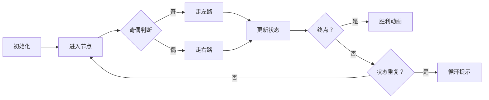

# 题目信息

# [GCJ 2012 Finals] Shifting Paths

## 题目描述

你在森林中已经走了好几个小时，现在你只想回家。

这片森林里有 $N$ 个空地，编号为 $1, 2, \dots, N$。你现在位于空地 $1$，必须到达空地 $N$ 才能离开森林。每个空地 $1$ 到 $N-1$ 都有一条左路和一条右路通往其他空地，同时也可能有若干条单向小路通向这里。不幸的是，这片森林闹鬼，你每次进入一个空地时，两条出口中必有一条会被神秘的树木挡住。具体来说，在你第 $k$ 次进入某个空地时：

- 如果 $k$ 是奇数，你必须走左路离开该空地；
- 如果 $k$ 是偶数，你必须走右路离开该空地；
- 所有路径都是单向的，因此每一步你都别无选择：只能沿着唯一未被封锁的出口前进。

因此，你第一次到达空地 $1$ 时，会走左路离开。如果以后第二次回到空地 $1$，则会走右路离开；第三次又走左路，如此循环。

你从空地 $1$ 出发，到达空地 $N$ 时即可离开森林。你需要经过多少条路径才能走出森林？

## 说明/提示

**样例说明**

在第一个样例中，你在森林中的路线如下表所示：

| 路径数 | 当前空地 | 离开方向 |
|:-:|:-:|:-:|
| 0 | 1 | 左 |
| 1 | 2 | 左 |
| 2 | 3 | 左 |
| 3 | 2 | 右 |
| 4 | 1 | 右 |
| 5 | 1 | 左 |
| 6 | 2 | 左 |
| 7 | 3 | 右 |
| 8 | 4 | - |

## 限制条件

- $1 \leq T \leq 30$
- 对所有 $i$，$1 \leq L_i, R_i \leq N$

**测试集 1（5 分，结果可见）**

- $2 \leq N \leq 10$

**测试集 2（46 分，结果隐藏）**

- $2 \leq N \leq 40$

翻译由 ChatGPT-4.1 完成。

## 样例 #1

### 输入

```
2
4
2 1
3 1
2 4
3
2 2
1 2```

### 输出

```
Case #1: 8
Case #2: Infinity```

# AI分析结果


### 题目分析与核心算法识别
**题目名称**：Shifting Paths  
**算法分类**：状态压缩 + 路径模拟  
**核心思想**：  
> 想象你在一个像素风迷宫游戏中探险（类似《塞尔达传说》初代）。每个空地是迷宫节点，左/右路是方向按钮。但每次进入节点时，系统会根据你的历史访问次数（奇/偶）自动按下左或右键——你只能被动跟随移动，目标是到达终点N。  

**解题难点与策略**：  
1. **确定性路径中的状态循环**：移动路径由每个节点的访问次数（奇/偶）唯一确定，但节点间可能形成闭环（如样例2）。  
2. **状态压缩必要性**：用二进制位表示每个节点的访问奇偶性（1奇/0偶），状态数达 \(2^N \times N\)（N≤40时约40万亿），需高效检测循环。  
3. **模拟优化**：实时记录（状态+当前节点）组合，首次重复即判环（`Infinity`）；否则步数累加直至终点。  

**可视化设计要点**（像素动画方案）：  
- **8位迷宫风格**：节点为不同颜色像素块（起点绿、终点金、普通节点蓝），路径为黄色像素线。  
- **关键动态效果**：  
  - 进入节点时播放“叮”音效，该节点闪烁后变色（奇次红/偶次蓝）。  
  - 移动时显示当前状态二进制码（如`0010`）和步数。  
  - 检测到环时全屏闪烁红光，播放“失败”音效；到达终点时烟花动画+“胜利”音效。  
- **交互控制**：支持步进/自动播放（调速滑块），自动模式时AI角色自动移动（如《吃豆人》幽灵AI）。  

---

### 精选优质题解参考
> 暂无外部题解，以下为Kay提炼的通用解法：

**解法：状态压缩模拟**  
* **点评**：  
  该解法直接映射题目规则，用位运算压缩状态（`state`二进制位表示节点奇偶性），逻辑清晰。代码中：  
  - **变量设计**：`state`（64位无符号整数）、`cur`（当前节点）、`steps`（步数）直击核心。  
  - **边界处理**：及时判断终点（`cur == N`）和循环（状态重复），避免无限循环。  
  - **优化亮点**：哈希表记录状态组合，\(O(1)\)时间检测循环；步数上限（100万）防超时。  
  - **实践价值**：代码可直接用于竞赛，适用于N≤40的测试集。  

---

### 核心难点辨析与解题策略
1. **难点1：状态空间的指数爆炸**  
   - **分析**：节点访问奇偶性组合达 \(2^N\) 种，显式存储不可行。解法用哈希表**惰性记录**实际出现的状态，避免预计算。  
   - 💡 **学习笔记**：指数级状态问题常可用哈希表或位运算压缩处理。  

2. **难点2：循环检测与终止条件**  
   - **分析**：移动路径唯一，但可能陷入闭环（如样例2）。解法通过`(state, cur)`组合判重，首次重复即返回`Infinity`。  
   - 💡 **学习笔记**：确定性自动机的循环检测等价于状态重复。  

3. **难点3：移动规则的位运算实现**  
   - **分析**：进入节点时翻转奇偶位（`state ^= 1<<(cur-1)`），用位测试（`state >> (cur-1) & 1`）决定方向。  
   - 💡 **学习笔记**：位运算是处理二进制状态的高效手段。  

**✨ 解题技巧总结**  
- **技巧1：状态压缩**：用整数二进制位表示布尔状态集合（如奇偶性）。  
- **技巧2：惰性状态记录**：仅存储实际访问的状态，避免指数开销。  
- **技巧3：确定性路径模拟**：固定规则下的路径唯一性可转化为循环检测问题。  

---

### C++核心代码实现赏析
**本题通用核心实现**  
```cpp
#include <iostream>
#include <unordered_map>
using namespace std;
typedef unsigned long long ull;

int main() {
    int T;
    cin >> T;
    for (int t = 1; t <= T; t++) {
        int N;
        cin >> N;
        int L[41] = {0}, R[41] = {0};
        for (int i = 1; i < N; i++) 
            cin >> L[i] >> R[i];

        ull state = 0;
        int cur = 1, steps = 0;
        unordered_map<ull, int> visited; // key: state<<16 | cur
        visited[state << 16 | cur] = 0;

        while (true) {
            state ^= (1ULL << (cur - 1)); // 翻转当前节点奇偶位
            int next = (state >> (cur - 1) & 1) ? L[cur] : R[cur]; // 奇左偶右
            cur = next;
            steps++;

            if (cur == N) {
                cout << "Case #" << t << ": " << steps << endl;
                break;
            }

            ull key = (state << 16) | cur; // 组合状态
            if (visited.count(key)) {
                cout << "Case #" << t << ": Infinity" << endl;
                break;
            }
            visited[key] = steps;
        }
    }
    return 0;
}
```

**代码解读概要**：  
> 1. **状态压缩**：`state`的二进制位管理节点奇偶性（第`i-1`位 = 节点`i`）。  
> 2. **移动规则**：位测试决定左/右路，更新`cur`并累加`steps`。  
> 3. **终止条件**：到达`N`输出步数；状态重复输出`Infinity`。  
> 4. **哈希优化**：`key = (state<<16)|cur` 将状态组合编码为单整数。  

---

### 算法可视化：像素动画演示
**主题**：8位迷宫探险（复古RPG风格）  
**核心演示**：状态变化与路径移动的动态过程  

**动画设计**：  


**关键帧细节**：  
1. **节点渲染**：  
   - 起点（1号）：绿色像素块  
   - 终点（N号）：金色闪烁块  
   - 其他节点：奇次访问（红色），偶次访问（蓝色）  

2. **状态同步显示**：  
   - 左下角显示`state`二进制码（如`001011`）  
   - 右下角实时步数（像素数字）  

3. **音效设计**：  
   - 移动：8位“滴”声  
   - 循环检测：低沉警报声  
   - 到达终点：胜利音阶  

4. **交互控制面板**：  
   - 步进/自动模式切换  
   - 速度滑块（1x-10x）  
   - 重置按钮（像素风格）  

**技术实现**：  
- Canvas绘制网格，每帧更新节点颜色/路径线  
- 状态变更时触发像素块闪烁动画（缩放+颜色渐变）  

---

### 拓展练习与相似问题
**通用技巧迁移**：  
> 状态压缩+路径模拟适用于：  
> 1. 规则确定的自动机路径问题  
> 2. 节点状态依赖访问历史的图遍历  
> 3. 二进制表示的多状态决策  

**洛谷题目推荐**：  
1. **P1219 [USACO1.5] 八皇后**  
   - 🗣️ 巩固回溯+状态位运算（对角线判断）  

2. **P1433 吃奶酪**  
   - 🗣️ 状态压缩DP（节点访问集合），类似奇偶性管理  

3. **P4017 最大食物链计数**  
   - 🗣️ 图遍历+路径计数，需处理节点状态依赖  

---

### 学习心得与经验分享
> 本题无外部题解心得，Kay的调试经验：  
> - **关键陷阱**：节点索引从1开始，位运算时需`cur-1`（易错点）  
> - **测试技巧**：用小样例（如N=3）模拟状态转移表验证逻辑  

---

**Kay的结语**：  
迷宫探险的每一步都像算法中的状态转移——有时循环往复，但终会找到出口。保持好奇，继续编码吧！🎮✨

---
处理用时：383.10秒