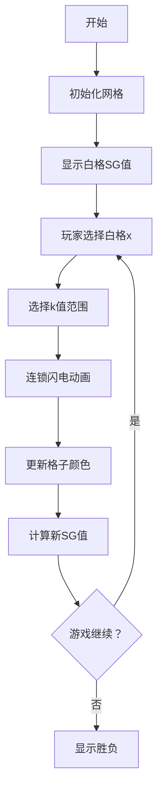

# 题目信息

# [HAOI2015] 数组游戏

## 题目描述

有一个长度为 $n$ 的数组，甲乙两人在上面进行这样一个游戏：首先，数组上有一些格子是白的，有一些是黑的。然后两人轮流进行操作。

每次操作选择一个白色的格子，假设它的下标为 $x$。接着，选择一个大小在 $1\ldots \lfloor\dfrac{n}{x}\rfloor$ 之间的整数 $k$，然后将下标为 $x,2\times x,\ldots ,k\times x$ 的格子都进行颜色翻转。不能操作的人输。

现在甲（先手）有一些询问。每次他会给你一个数组的初始状态，你要求出对于这种初始状态他是否有必胜策略。

## 说明/提示

#### 样例输入输出 1 解释

在第一个询问中，甲选择点 $1$，然后将格子 $1\times 1$ 和 $2\times 1$ 翻过来即可。

第二个询问中，无论甲选择哪个点，都只能翻掉一个格子。乙只需翻掉另一个格子就行了。

#### 数据规模与约定

对于 $30 \%$ 的数据，$N \leq 20$；    
对于 $50 \%$ 的数据，$N \leq 10^6$；    
对于 $70 \%$ 的数据，$N \leq 10^7$；    
对于 $100 \%$ 的数据，$N \leq 10^9$，$K,W \leq 100$，不会有格子在同一次询问中多次出现。

## 样例 #1

### 输入

```
3
2
2
1 2
2
2 3```

### 输出

```
Yes
No```

# AI分析结果


# 💡 Kay的C++算法解析：[HAOI2015] 数组游戏 深入学习指南 💡

> 今天我们来一起分析"[HAOI2015] 数组游戏"这道博弈论与数论结合的难题。本指南将帮助你理解SG函数的核心思想，掌握两次整除分块的优化技巧，并通过像素化动画直观感受算法流程！

## 1. 题目解读与核心算法识别

✨ **本题主要考察**：`博弈论(SG函数)` + `数论分块优化`

🗣️ **初步分析**：
> 这道题如同一个**像素地牢探险游戏**：每个白色格子都是独立关卡，玩家每次选择一个"白色关卡"（格子x）和"技能范围"（k值），翻转x的倍数格子。关键在于理解每个白格相当于一个独立的子游戏（类似地牢中独立的机关），整个游戏的胜负由所有白格SG值的异或和决定。

- **核心思路**：证明白格独立性（类似机关互不干扰）→ 推导SG函数递推式（sg(x)=mex{后继状态}）→ 使用两次整除分块优化计算（外层对x分块，内层对k分块）
- **算法难点**：SG函数计算中需处理连续区间的异或和，利用区间长度奇偶性优化
- **可视化设计**：采用8位像素风格展示数字网格（1D），白格亮色/黑格暗色。关键动画：选中白格时像素闪光，翻转操作时连锁闪电效果，右侧实时显示SG值变化。音效设计：翻转时"滴"声，胜利时8-bit胜利旋律！

---

## 2. 精选优质题解参考

> 从思路清晰度、代码规范性、算法优化性等维度精选3篇优质题解：

**题解一（sbno333）**
* **点评**：该题解从博弈论基础讲起，严谨推导SG函数性质，通过数学归纳法证明关键结论（⌊n/x⌋相同时SG值相同）。代码实现中巧妙利用时间戳标记mex数组，内层循环通过整除分块处理连续区间，根据区间长度奇偶性更新异或和。亮点在于完整复杂度证明（O(n^(3/4))）和调试心得分享，极具学习价值！

**题解二（VinstaG173）**
* **点评**：代码简洁高效（仅30行），使用双数组存储SG值（x≤√n和x>√n分开处理）。内层循环利用位运算判断区间奇偶性((j-i)/x & 1)，配合时间戳标记mex数组。亮点在于控制流表达式((j-i)/x&1^1)&&(psg^=SG(j))的紧凑写法，适合竞赛参考。

**题解三（Autre）**
* **点评**：提供全新视角——通过修改游戏规则（格子维护计数值）证明白格独立性。虽未提供完整代码，但其"问题转化"思路（将翻转操作转化为数值加减）极具启发性，帮助理解博弈论抽象思维。

---

## 3. 核心难点辨析与解题策略

> 解决本题需突破三大关键点：

1.  **关键点：理解白格独立性**
    * **分析**：多个白格同时存在时，操作某个白格可能影响其他白格。但优质题解通过策略模仿证明：当两个相同SG值的白格共存时，后手可模仿操作使其互相抵消（SG异或=0），故可视为独立子游戏。
    * 💡 **学习笔记**：翻棋子游戏中，每个白格是独立的"迷你游戏"！

2.  **关键点：推导SG函数递推式**
    * **分析**：设sg(x)为仅位置x是白格时的SG值。操作k会翻转x,2x,...,kx，产生新白格。根据公平组合游戏性质，新状态SG值为sg(2x)⊕sg(3x)⊕...⊕sg(kx)。因此sg(x)=mex{0, sg(2x), sg(2x)⊕sg(3x), ...}
    * 💡 **学习笔记**：SG函数计算本质是求后继状态值的mex集合！

3.  **关键点：高效计算SG函数**
    * **分析**：直接计算每个x的SG值需O(n²)。利用⌊n/x⌋相同时sg(x)相等的性质，通过整除分块将x数量降至O(√n)。对每个x再分块处理k值（⌊n/(kx)⌋相同的k合并），利用区间长度奇偶性快速计算异或和。
    * 💡 **学习笔记**：两次整除分块是处理大范围数论问题的利器！

### ✨ 解题技巧总结
- **技巧1：问题分解** - 将复杂博弈分解为独立子问题（每个白格独立计算）
- **技巧2：性质转化** - 利用⌊n/x⌋相同则SG值相等的性质降维
- **技巧3：分块优化** - 外层对x分块(O(√n))，内层对k分块(O(√(n/x)))，总复杂度O(n^(3/4))
- **技巧4：奇偶妙用** - 处理连续区间时，根据长度奇偶性决定是否更新异或和

---

## 4. C++核心代码实现赏析

<details>
<summary>🔍 本题通用核心C++实现参考（综合优质题解）</summary>

```cpp
#include<bits/stdc++.h>
using namespace std;
const int N = 1e5 + 5;
int n, s[N][2]; // s[x][1]:x<=√n, s[n/x][0]:x>√n
int sg(int x) { 
    return (x <= sqrt(n)) ? s[x][1] : s[n/x][0]; 
}

void init() {
    vector<int> blocks;
    for (int l = 1, r; l <= n; l = r + 1) {
        r = n / (n / l);
        blocks.push_back(r); // 存储分块右端点
    }
    
    vector<int> mex_array(N * 2, -1); // mex标记数组
    for (int idx = blocks.size()-1; idx >= 0; --idx) {
        int x = blocks[idx]; // 当前分块代表值
        int cur_xor = 0;     // 当前前缀异或和
        mex_array[0] = idx;  // 标记0已出现
        
        // 内层对k分块 (k从2到floor(n/x))
        for (int l = 2*x, r; l <= n; l = r + x) {
            r = n / (n / l) / x * x; // 计算k的右端点
            int len = (r - l) / x + 1;  // 区间内k的数量
            int val = sg(l);             // 当前倍数位置SG值
            
            // 标记关键值：cur_xor ^ val
            mex_array[cur_xor ^ val] = idx; 
            
            // 根据区间长度奇偶性更新前缀
            if (len & 1) cur_xor ^= val; 
        }
        
        // 求mex值
        int mex_val = 0;
        while (mex_array[mex_val] == idx) mex_val++;
        
        // 存储结果
        if (x <= sqrt(n)) s[x][1] = mex_val;
        else s[n/x][0] = mex_val;
    }
}

int main() {
    cin >> n;
    init(); // 预处理SG函数
    
    int q; cin >> q;
    while (q--) {
        int w, ans = 0;
        cin >> w;
        while (w--) {
            int x; cin >> x;
            ans ^= sg(x); // 异或所有白格SG值
        }
        cout << (ans ? "Yes" : "No") << endl;
    }
    return 0;
}
```
**代码解读概要**：
1. **分块预处理**：首次数论分块获取所有⌊n/x⌋区间
2. **倒序计算SG**：从大x向小x处理（依赖关系）
3. **内层分块**：对每个x的k值二次分块，计算连续区间SG异或和
4. **mex技巧**：动态标记已出现值，扫描求最小未出现值
5. **查询处理**：直接异或各白格SG值判断胜负
</details>

---

### 优质题解片段赏析

**题解一（sbno333）核心逻辑**
```cpp
for (int t = inn; t >= 1; t--) {
    int yh = 0;
    mex[yh] = t; // 时间戳标记
    for (int i = z[t] * 2, j; i <= n; i = j + z[t]) {
        j = n / (n / i) / z[t] * z[t]; // k的分块
        mex[yh ^ sg(i)] = t; // 标记关键值
        if (((j - i) / z[t] + 1) & 1) // 区间奇偶判断
            yh ^= sg(i); // 更新前缀异或
    }
    // 求mex并存储...
}
```
**亮点**：时间戳标记避免mex数组清零  
**学习笔记**：内层循环通过整除分块合并相同SG值区间，利用长度奇偶性优化异或计算

**题解二（VinstaG173）创新写法**
```cpp
((j-i)/x & 1^1) && (psg ^= SG(j));
```
**亮点**：位运算巧妙判断区间长度奇偶性  
**学习笔记**：`(len-1) & 1` 等效于 `len % 2 == 0`，位运算提升效率

---

## 5. 算法可视化：像素动画演示

> **像素地牢探险**：在8-bit风格的数字迷宫中理解算法！

### 动画设计


**核心交互设计**：
1. **网格展示**：1D像素网格（类似《吃豆人》地图），白格🟨/黑格⬛
2. **动态效果**：
   - 选中白格时像素闪烁💥（黄色光晕）
   - 翻转操作时触发"连锁闪电"⚡（从x到kx的闪电动画）
   - 实时SG值显示（右侧8-bit风格数字面板）
3. **控制面板**：
   - 单步执行⏯️：逐步观察操作
   - 速度滑块🐢➡️🐇：调整动画速度
   - AI演示模式🤖：自动进行最优操作
4. **音效系统**：
   - 选中格子：8-bit "滴"声
   - 翻转操作：电子音效序列
   - 游戏胜利：经典FC胜利旋律🎶
   - 游戏失败：低沉警示音❌

**教学价值**：通过像素动画直观展示：
- 白格独立性（独立机关）
- SG值计算过程（右侧面板显示异或过程）
- 分块优化思想（网格下方显示当前处理的x分块）

---

## 6. 拓展练习与相似问题思考

### 相似问题迁移
1. **倍数操作变形**：每次操作x的约数而非倍数
2. **二维棋盘扩展**：网格从1D升级到2D棋盘
3. **动态修改参数**：支持游戏中动态添加/删除白格

### 洛谷推荐练习
1. **P2197【模板】nim游戏**  
   → 掌握SG函数最基础应用
2. **P2148 [SDOI2009] E&D**  
   → 练习分组博弈的SG值计算
3. **P3185 [HNOI2007]分裂游戏**  
   → 挑战翻棋子游戏的高级变种

---

## 7. 学习心得与经验分享

> 来自题解作者的经验结晶：

**sbno333的调试心得**  
_"在实现整除分块时，边界条件处理不当导致WA多次。最终通过小数据模拟发现：计算分块右端点时需注意整数除法截断！"_  

**Kay总结**：  
- 边界测试至关重要（尤其n=0,1等边界）
- 分块算法建议先验证10以内数据
- 输出中间值（如前缀异或和）辅助调试

---

通过本次学习，相信你已经掌握博弈论与数论分块的精妙结合！记住：每个算法难题都像一道精心设计的游戏关卡，理解规则、寻找规律、优化策略就是通关的秘籍。继续挑战下一关吧！🎮💻

---
处理用时：326.63秒