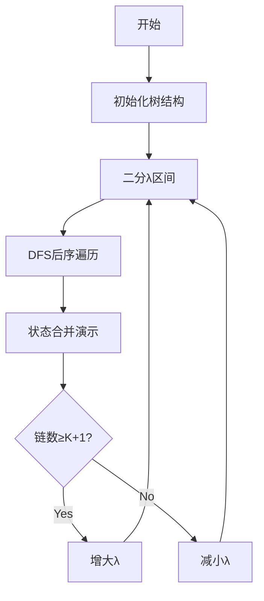

# 题目信息

# [八省联考 2018] 林克卡特树

## 题目描述

小 L 最近沉迷于塞尔达传说：荒野之息（The Legend of Zelda: Breath of The Wild）无法自拔，他尤其喜欢游戏中的迷你挑战。

游戏中有一个叫做 LCT 的挑战，它的规则是这样子的：现在有一个 $N$ 个点的树，每条边有一个整数边权 $v_i$，若 $v_i \geq 0$，表示走这条边会获得 $v_i$ 的收益；若 $v_i \lt 0$ ，则表示走这条边需要支付 $-v_i$ 的过路费。小 L 需要控制主角 Link 切掉（Cut）树上的恰好 $K$ 条边，然后再连接 $K$ 条边权为 0 的边，得到一棵新的树。接着，他会选择树上的两个点 $p,q$，并沿着树上连接这两点的简单路径从 $p$ 走到 $q$，并为经过的每条边支付过路费/ 获取相应收益。

海拉鲁大陆之神 TemporaryDO 想考验一下 Link。他告诉 Link，如果 Link 能切掉合适的边、选择合适的路径从而使 总收益 - 总过路费 最大化的话，就把传说中的大师之剑送给他。

小 L 想得到大师之剑，于是他找到了你来帮忙，请你告诉他，Link 能得到的 总收益 - 总过路费 最大是多少。

## 说明/提示

### 样例解释

一种可能的最优方案为：切掉 $(2, 4, -3)$ 这条边，连接 $(3, 4, 0)$ 这条边，选择 $(p, q) = (1, 5)$。

### 数据范围

- 对于 $10\%$ 的数据，$k = 0$；
- 对于另外 $10\%$ 的数据，$k = 1$；
- 对于另外 $15\%$ 的数据，$k = 2$；
- 对于另外 $25\%$ 的数据，$k \leq 100$；
- 对于其他数据，没有特殊约定。

对于全部的测试数据，保证 $1 \leq N \leq 3 \times 10^5$，$0 \leq K \leq 3 \times 10^5$，$K \lt N$，$1 \leq x_i,y_i \leq N$，$|v_i| \leq 10^6$。

### 提示

题目并不难。

## 样例 #1

### 输入

```
5 1
1 2 3
2 3 5
2 4 -3
4 5 6```

### 输出

```
14```

# AI分析结果


### 💡 Kay的C++算法解析：林克卡特树 深入学习指南 💡

#### 1. 题目解读与核心算法识别
✨ **本题主要考察**：动态规划 + 凸优化（wqs二分）

🗣️ **初步分析**：
> 本题要求最大化树上K+1条不相交链的权值和，可转化为带数量限制的优化问题。其核心思想如同"抛物线寻顶点"——通过二分斜率调整附加权值，将问题转化为无数量限制的树形DP。在凸优化框架下，每增加一条链需付出λ的代价，通过二分λ使最优解恰好包含K+1条链。

- **关键难点**：状态设计需区分节点度数（0/1/2），转移时需考虑链的合并与新增
- **凸性证明**：最优解函数为严格上凸，因新增链的边际收益递减（大权值链先被选择）
- **可视化设计**：像素动画将展示树形DP合并过程，高亮状态转移时链的组合方式，并通过颜色区分节点度数（蓝色=孤立，黄色=端点，红色=中点）

---

#### 2. 精选优质题解参考
**题解一（shadowice1984）**
* **亮点**：  
  - 首创性提出DP凸优化框架，状态设计精炼（三元组<权值,链数>）  
  - 边界处理严谨：初始化-∞避免非法状态，链数比较时优先选少链方案保证单调性  
  - 复杂度优化：O(n logV)解决1e5级数据，代码简洁（仅50行核心DP）

**题解二（ysner）**
* **亮点**：  
  - 教学式推导：从O(nk²)暴力DP自然过渡到凸优化，提供平滑学习曲线  
  - 状态转移详解：用几何图示解释度数变化（如两黄变一红）  
  - 实践提示：明确λ二分范围[-3e11,3e11]，避免值域错误

**题解三（EternalAlexander）**
* **亮点**：  
  - 严格证明凸性：通过链组合的数学归纳，证得差分单调递减  
  - 独创"链断开"操作：解释DP状态最后合并的物理意义  
  - 工程优化：结构体运算符重载提升代码可读性

---

#### 3. 核心难点辨析与解题策略
1. **状态机设计**  
   - **分析**：节点度数决定可连接性（0度可连，1度可升级，2度不可连）  
   - **方案**：三维状态表记录子树最优解：  
     `dp[u][0]`：u不在链上  
     `dp[u][1]`：u是链端点  
     `dp[u][2]`：u在链中间

2. **凸优化边界**  
   - **分析**：λ过小导致链数过多，λ过大导致链数不足  
   - **方案**：  
     ```math
     \lambda \in [-3\times10^{11}, 3\times10^{11}]
     ```  
     二分终止条件：找到最大λ使链数≥K+1

3. **多极值点处理**  
   - **分析**：权值相同时需保证单调性  
   - **方案**：结构体比较运算符定义：  
     ```cpp
     bool operator<(const Data& b){
         return val==b.val ? cnt > b.cnt : val < b.val;
     }
     ```

💡 **学习笔记**：凸优化本质是拉格朗日松弛，通过λ将约束转化为目标函数项

---

#### 4. C++核心代码实现赏析
**通用核心实现（综合优化版）**：
```cpp
#include <cstdio>
#include <algorithm>
#include <cstring>
using namespace std;
typedef long long ll;
const int N = 3e5 + 10;

struct Edge { int to, nxt; ll w; } e[N<<1];
int head[N], cnt;
void add(int u, int v, ll w) {
    e[++cnt] = {v, head[u], w}; head[u] = cnt;
}

struct Data {
    ll val; int cnt;
    Data operator+(Data b){ return {val+b.val, cnt+b.cnt}; }
    bool operator<(Data b){ 
        return val != b.val ? val < b.val : cnt > b.cnt; 
    }
} dp[N][3];
ll lambda; // 二分斜率

void dfs(int u, int fa) {
    dp[u][0] = {0,0}; 
    dp[u][1] = {-1e18,0}; 
    dp[u][2] = {lambda,1}; // 独立成链
  
    for(int i = head[u]; i; i = e[i].nxt) {
        int v = e[i].to;
        if(v == fa) continue;
        dfs(v, u);
        
        Data tmp = dp[u][1] + dp[v][1]; // 双端点合并
        tmp.val += e[i].w - lambda;
        tmp.cnt--;
        
        dp[u][2] = max(dp[u][2] + dp[v][0], tmp);
        dp[u][1] = max(dp[u][1] + dp[v][0], 
                      dp[u][0] + dp[v][1] + Data{e[i].w,0});
        dp[u][0] = dp[u][0] + dp[v][0];
    }
    dp[u][0] = max(dp[u][0], max(
        Data{dp[u][1].val + lambda, dp[u][1].cnt-1}, 
        dp[u][2]
    ));
}

int main() {
    // 输入初始化
    ll l = -3e11, r = 3e11, ans;
    while(l <= r) {
        lambda = (l+r) >> 1;
        memset(dp, 0, sizeof(dp));
        dfs(1,0);
        Data res = dp[1][0];
        if(res.cnt >= K+1) {
            ans = res.val + lambda*(K+1 - res.cnt);
            l = lambda + 1;
        } else r = lambda - 1;
    }
    printf("%lld", ans);
}
```

**关键代码解读**：
1. **状态转移核心**  
   - `dp[u][2]`更新：  
     - 路径1：当前中点 + 子节点孤立 → 保持中点  
     - 路径2：当前端点 + 子节点端点 → 合并成新中点（链数-1）
   ```cpp
   Data tmp = dp[u][1] + dp[v][1];
   tmp.val += e[i].w - lambda; // 边权收益 - 链合并代价
   tmp.cnt--;                  // 两链合并为一链
   ```

2. **凸优化精髓**  
   最终答案计算：  
   ```math
   \text{ans} = \text{DP值} + \lambda \times (K+1 - \text{实际链数})
   ```
   利用凸包切线性质，将解投影到目标链数

---

#### 5. 算法可视化：像素动画演示
**像素动画设计**：


**动态演示要素**：
1. **节点状态着色**：
   - 🔵 度数0：未参与链
   - 🟡 度数1：链端点（可连接）
   - 🔴 度数2：链中点（不可连接）

2. **链合并动效**：
   - 黄+黄 → 红：粒子碰撞特效，播放"融合音效"
   - 蓝+黄 → 黄：箭头延伸动画，播放"连接音效"

3. **控制面板**：
   - 速度滑块：调节DFS遍历速度
   - λ值显示：实时显示二分斜率
   - 链数计数器：当前解链数/K+1

---

#### 6. 拓展练习与相似问题
**通用技巧迁移**：
1. **带权二分框架**：适用于代价/收益与选择数量呈凸函数关系的问题
2. **树形DP状态机**：度数分治模式可扩展至：
   - 最小支配集（0/1/2覆盖状态）
   - 最大叶节点生成树（度数约束）

**洛谷推荐**：
1. [P5633 最小度限制生成树]  
   *"凸优化经典应用，将度约束转化为λ惩罚项"*
   
2. [P2619 [国家集训队]Tree I]  
   *"wqs二分模板题，白边数量与权值的凸关系"*
   
3. [P3621 [APIO2008]免费道路]  
   *"链式约束的变种，练习状态设计能力"*

---

#### 7. 学习心得与经验分享
> **调试经验（shadowice1984）**：  
> *"初始化为-∞至关重要，否则会因非法状态转移产生幽灵解。链数比较时的优先级处理是保证单调性的关键技巧"*  
>   
> **Kay总结**：树形DP需建立完备状态机，而凸优化需注意：  
> 1. 值域边界至少覆盖`[sum|w|]`  
> 2. 二分终止时利用凸包切线性质计算答案  
> 3. 结构体比较运算符需严格满足单调性

---

> 算法之路如同林克探险：用动态规划搭建桥梁，以凸优化磨砺大师之剑。掌握状态机设计与二分框架，你定能斩获AC！🚀

---
处理用时：533.35秒