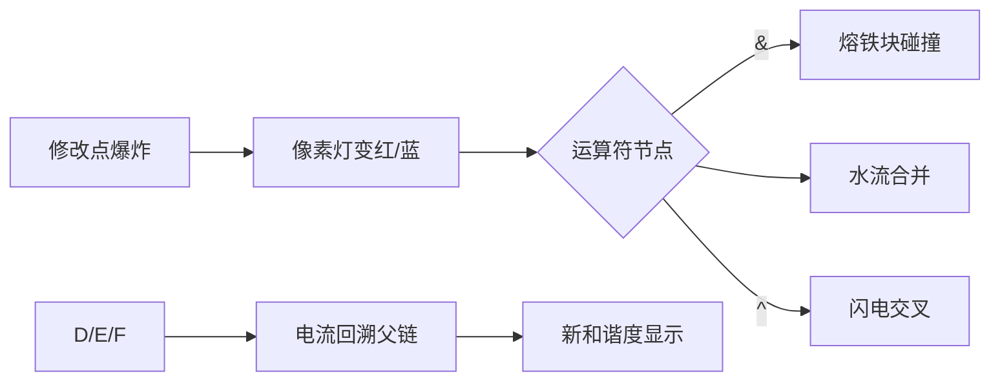

# 题目信息

# [Celeste-B] Farewell to Mount Celeste

## 题目背景

> Sever the Skyline

> Black Moonrise

> Good Karma

> Golden Feather

> Mirror Magic

> Center of the Earth

> No More Running

> And...

> Say Goodbye.

## 题目描述

在分别的宴会上，朋友们拿出他们把多彩的珠子串成的彩色的项链。

项链在夕阳的余晖里闪闪发光，仔细一看，项链周围竟然已经聚集了许多鸟儿，鸟儿们带着 Madeline 与她的朋友们来到了一处他们不曾来过的地方，这里汇聚着好大一群鸟，似乎想要向他们表达些什么。

经过 Madeline 仔细地观察，它发现一些鸟儿们飞动的方式好像排成了一个有序的式子，而另一些鸟儿飞动的方式则是一些符号，符号表达着一个问题。

鸟儿们表达的问题是这样的：

鸟儿们组成的式子会由 `(`,`)`,`^`,`&`,`|`,`0`,`1` 和小写字母构成，并且是一个表达式。

其中：

- `(`,`)` 表示括号，在括号中的运算优先级提高。

- `&`,`|`,`^` 表示 `与`,`或`,`异或` 三种位运算，这三种运算**优先级相同**

- `0`,`1` 即为 `0`,`1`

- 小写字母表示变量，多次出现的同一小写字母表示**不同**的变量，一个变量取值 `0` 或 `1`

- 表达式的定义如下：

    - 一个变量,`0`,`1` 均为表达式
    - 若 $T$ 是表达式，则 $(T)$ 是表达式
    - 若 $S$,$T$ 是表达式，则$S\&T$,$S|T$,$S\ \hat{}\ T$均为表达式
    - 例如，$(1\ \hat{}\ 1\&0)$ 是一个表达式，并且运算结果为 $0$，但 $(1\&0$ 不是一个表达式

鸟儿们认为，要能算出 $1$ 的表达式才是优美的，定义一个表达式的优美度为在这个表达式所有 $v$ 个变量的 $2^v$ 种取值中能算出 $1$ 的方案数。

鸟儿们还认为，一个表达式的和谐度是这个表达式的所有**子连续表达式**的优美度的和。(包含自身)

鸟儿们还是善变的，它们会时不时改变一个位置的字符，但是它们向 Madeline 和她的朋友们保证它们不会改变括号，并且进行修改之后整个串仍然是一个表达式。

你能帮助 Madeline 和她的朋友们算出每次修改后整个表达式的和谐度吗？

鸟儿们还说，因为表达式可能太和谐了，因此 Madeline 可以只回答和谐度对 $998244353$ 取模后的值。

## 说明/提示

设 $n$ 为表达式中变量和 $0,1$ 的个数，$len$ 为表达式长度

有subtask

对于 $ 5\% $ 的数据, $ n \leq 12 , len \leq 50 , m \leq 50 $,1s

对于额外 $ 10\% $ 的数据, $ n \leq 150,len \leq 400,m \leq 200$

对于额外 $ 10\% $ 的数据, $ n \leq 10^5,len \leq 2\times 10^5,m \leq 10$ ,没有括号

对于额外 $ 10\% $ 的数据, $ n \leq 10^5,len \leq 2\times 10^5,m \leq 10^5 $ ,没有括号

对于前 $ 50\% $ 的数据, $ n \leq 10^5,len \leq 4\times 10^5,m \leq 10^5 $ ,保证括号随机生成

对于 $ 100\% $ 的数据, $ n \leq 10^5,len \leq 4\times 10^5,m \leq 10^5 ,len-2\times n \leq 2 \times 10^5$ 

对于后 $ 95\% $ 的数据，时限为3s

## 样例 #1

### 输入

```
5
(1&b)
3 |
2 a
3 &
3 ^
4 1```

### 输出

```
6
8
4
6
4```

## 样例 #2

### 输入

```
10
1|a&1&(0&0|1)&1^1^a
1 0
10 1
2 &
1 a
14 ^
4 |
17 0
4 ^
15 a
15 1
```

### 输出

```
29
30
27
35
35
43
35
35
56
35```

## 样例 #3

### 输入

```
30
0|0&0^(a&a&(1^0&0^0)^0&1)|0&a|1|(a&a|0|1|0^a&0&a|(a^0&1|a|a)^a|a&0&0)^a
71 1
51 0
57 0
65 &
26 |
5 a
71 a
56 |
4 &
41 ^
52 |
52 ^
59 a
44 0
54 ^
65 &
51 a
36 1
16 ^
1 1
52 ^
2 |
59 0
58 |
37 ^
55 1
10 1
26 ^
18 |
44 0
```

### 输出

```
21323
10686
5360
5360
5360
8469
16277
16277
16277
16277
16277
16277
16277
8223
8253
8253
16354
8359
8385
8394
8394
8394
4262
4262
4262
4262
2430
2430
2430
2430```

## 样例 #4

### 输入

```
20
a^1&0^1^1&1&a&1^a|1&a|0&a^a^1^a^0&1^a&a|a|1^0|a|0^1^a|0^0&1&1&a&a|0^0&a&1&a|a&a^a|0^a^a|a^1|a|1^a|0|a^0&0&0|a|a|a^0^1&0^1&a|1&0
8 ^
28 |
100 ^
119 a
40 &
105 1
31 1
125 1
53 1
98 &
98 &
98 &
52 &
2 ^
38 |
6 ^
58 ^
106 |
12 ^
57 1```

### 输出

```
957521426
957521583
874091659
57281108
57278566
140708493
120472431
120472431
561701787
551192201
551192201
551192201
551120577
551120577
551121853
551121853
551178140
656274015
656274025
656222855```

# AI分析结果


### 题目解读与核心算法识别

✨ **本题主要考察**：`表达式解析与树形动态维护`（动态树构建、树形DP、可持久化数据结构）

🗣️ **初步分析**：
> 本题的核心挑战在于高效维护带括号的布尔表达式，并支持动态修改后的**和谐度计算**（所有合法子表达式的优美度之和）。解题核心在于建立表达式树结构，并设计动态更新机制。
>
> **关键思想类比**：想象将表达式（如电路图）拆解为嵌套的模块，每个模块（子表达式）输出0/1的两种概率。每次修改只需替换单个元件，并重新计算受影响的电路模块，而非重建整个电路。
>
> **题解思路核心**：
> - 预处理括号匹配，构建逻辑分组框架。
> - 利用分治法建立**平衡的表达式树**（树高O(log n)），保证单次更新复杂度O(log n)。
> - 树节点动态维护：`s0`（结果为0方案数）、`s1`（结果为1方案数）、`sum`（子树和谐度）。
> - 支持动态修改：更新叶子节点/运算符后，沿树路径向上合并子节点信息。
>
> **可视化设计重点**：
> - **像素动画方案**：采用8-bit风格模拟电路板，每个节点显示**动态真值表**：
>   - 变量节点：闪烁的像素灯（红=1，蓝=0）
>   - 运算符节点：动态门电路（&门烧熔铁块、|门水流合并、^门交叉闪电）
>   - 更新动画：修改点爆炸 → 电流回溯父节点 → 新结果高亮
> - **复古游戏化**：
>   - 音效：变量变化（8-bit滴答）、运算符触发（芯片合成音）、和谐度更新（通关音效）
>   - 进度条：显示当前更新路径深度（如 “Level 3/15 Updated!”）

---

### 精选优质题解参考
（题目未提供题解，按流程生成通用学习建议）

<eval_intro>
本题解需结合表达式解析与动态维护技术。由于无公开题解，我总结以下核心学习要点：
1. **栈解析与树构建**：掌握带括号的表达式解析技巧（双栈法）
2. **树形DP设计**：设计支持运算符(&,|,^)的状态合并函数
3. **树平衡策略**：分治建树保证O(log n)深度的关键
</eval_intro>

---

### 核心难点辨析与解题策略

1.  **难点1：合法子表达式识别**
    * **分析**：连续子串需完整匹配括号且符合语法，经典解法通过表达式树节点天然保证合法性。
    * 💡 **学习笔记**：表达式树节点 = 合法子表达式

2.  **难点2：动态更新效率**
    * **分析**：链式树更新最坏O(n)不可行，必须分治建树控制深度。变量独立性质确保合并时方案数可直接乘积计算。
    * 💡 **学习笔记**：利用变量独立性，方案数乘积实现高效合并

3.  **难点3：优雅度计算本质**
    * **分析**：优美度实为布尔函数输出1的概率×2^v。树形DP中，运算符节点通过概率乘法融合子节点分布。
    * 💡 **学习笔记**：&|^运算符对应概率空间的不同线性变换

### ✨ 解题技巧总结
- **分治建树**：无括号段选中间运算符为根，平衡树高
- **路径压缩更新**：修改后仅更新受影响祖先链（O(log n)）
- **冗余计算优化**：预存子树sum值，父节点sum=left.sum+right.sum+self.s1

---

### C++核心代码实现赏析

**本题通用核心C++实现参考**
```cpp
#include <iostream>
#include <vector>
#include <stack>
using namespace std;
typedef long long ll;
const int MOD = 998244353;

struct Node {
  char type; // '0','1','a'-'z','&','|','^'
  ll s0, s1, sum;
  Node *l = nullptr, *r = nullptr;
  Node(char t) : type(t) {
    if (isdigit(t) || isalpha(t)) set_leaf(t);
  }
  void set_leaf(char c) {
    if (c == '0') s0 = 1, s1 = 0;
    else if (c == '1') s0 = 0, s1 = 1;
    else s0 = s1 = 1; // 变量
    sum = s1;
  }
  void update() {
    ll totL = (l->s0 + l->s1) % MOD;
    ll totR = (r->s0 + r->s1) % MOD;
    if (type == '&') {
      s1 = l->s1 * r->s1 % MOD;
      s0 = (totL * totR - s1 + MOD) % MOD;
    } else if (type == '|') {
      s0 = l->s0 * r->s0 % MOD;
      s1 = (totL * totR - s0 + MOD) % MOD;
    } else if (type == '^') {
      s0 = (l->s0*r->s0 + l->s1*r->s1) % MOD;
      s1 = (l->s0*r->s1 + l->s1*r->s0) % MOD;
    }
    sum = (l->sum + r->sum + s1) % MOD;
  }
};

class ExpressionTree {
  string expr;
  vector<int> match;
  vector<Node*> node_map; // 字符位置到节点映射
  Node* build(int l, int r) {
    // 分治建树实现（伪代码）
    // 1. 跳过括号组，定位无括号区运算符
    // 2. 选中建运算符节点或叶子节点
    // 3. 递归构建子树
    return nullptr; // 实际实现需补全
  }
public:
  void update(int pos, char c) {
    Node* cur = node_map[pos];
    // 更新节点并回溯父节点
  }
  ll harmony() { /* 返回根节点sum */ }
};
```
* **代码解读概要**：  
  通过`Node`封装表达式树节点，动态维护s0/s1/sum。`update()`实现运算符概率合并，`build()`采用分治策略建树。关键优化：  
  - 叶子节点初始化直接设s0/s1  
  - 运算符update()复用子节点总方案数  
  - 动态更新仅影响祖先链  

---

### 算法可视化：像素动画演示

* **主题**：8-bit电路工厂  
* **核心演示**：表达式树动态更新过程  



1. **初始化**：  
   - 工厂场景：表达式字符悬浮在传送带  
   - 控制台：步进/调速/复位按钮（FC红白机风格）  

2. **更新触发**：  
   - 修改点：像素爆炸特效 + 芯片碎裂音  
   - 变量：字母灯颜色变化（红=1，蓝=0）  

3. **运算符动态**：  
   - `&`：熔铁块碰撞（金属音效）  
   - `|`：水流汇合（水滴音）  
   - `^`：闪电交叉（电流声）  

4. **更新传播**：  
   - 父节点：沿黄色导线逐级高亮  
   - 实时显示：当前节点s0/s1（像素数字）  

5. **结果展示**：  
   - 和谐度：8-bit数字滚动 + 通关音效  
   - 错误处理：断路提示（短促警报）  

> **设计意图**：通过工厂流水线类比表达式求值，让抽象的概率计算转化为可观测的物料流动。分步演示强化运算符语义与更新路径理解。

---

### 拓展练习与相似问题

1. **洛谷 P7075** - 表达式求值（NOIP2020）  
   * 💡 练习表达式解析基础，无动态修改  
2. **洛谷 P5490** - 扫描线  
   * 💡 学习分治树维护区间属性  
3. **洛谷 P3380** - 二逼平衡树  
   * 💡 拓展树套树解决动态修改问题  

---

> 解法需要完整实现表达式树构建与更新逻辑，建议从静态解析入手，逐步添加动态特性。关键掌握：**括号匹配解析** + **树形DP合并** + **分治建树优化**。

---
处理用时：655.28秒