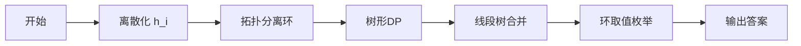

# 题目信息

# [JOISC 2021] 最悪の記者 4 (Worst Reporter 4) (Day4)

## 题目背景

B 太郎不可爱。

## 题目描述

B 太郎是一名主要写关于 OI 的报道的记者。再过几天，就要举行 IOI 了，B 太郎决定写一篇关于 IOI 的文章。

比赛将有 $n$ 名选手参加，每位选手的编号从 $1$ 到 $n$。每位选手都有一个 Rating，这是衡量其实力的标准。Rating 用 $1$ 至 $10^9$ 之间的整数表示。

B 太郎采访了每位选手，并获得了以下信息：

- 选手 $i\ (1\le i\le N)$ 的 Rating 大于等于选手 $a_i\ (1\le a_i \le n)$ 的 Rating（$a_i$ 可以等于 $i$）。

在所有的采访结束后，B 太郎从管理 Rating 系统的公司收到了一张表格，上面有每个选手的 Rating。 表上写着以下信息：

- 选手 $i\ (1 \le i \le n)$ 的 Rating 是 $h_i$。

当 B 太郎试图根据这些信息写一篇文章时，他发现每个选手的 Rating 表可能存在错误。

由于临近截止时间，没有时间去弄正确的 Rating 表。因此，B 太郎决定重写表中选手的 Rating，使其与采访中获得的信息不相矛盾。

B 太郎在表中改写选手 $i\ (1\le i \le n)$ 的 Rating 需要 $c_i$ 日元。

也就是说，B 太郎可以通过支付 $c_i$ 日元，将列表中选手 $i$ 的 Rating 更改为 $1$ 到 $10^9$ 之间的任意整数。为了在截止日期前完成任务，B 太郎想要最小化更改列表中 Rating 的总成本。

编写一个程序，给定选手的数量、采访获得的信息、Rating 列表、和更改每个选手 Rating 所用的花费。请你计算不与采访信息矛盾的情况下，最少需要花费多少日元。

## 说明/提示

#### 样例 #1 解释

如下表所示。

| 选手 | 原 Rating | 更改为 | 花费日元 |
| :-: | :-: | :-: | :-: |
| $1$ | $6$ | $1$ | $5$ |
| $3$ | $8$ | $4$ | $4$ |
| $5$ | $2$ | $10^9$ | $5$ |

花费了 $5+4+5=14$ 日元。

本样例满足 Subtask $1, 2, 3$。


#### 样例 #2 解释

信息一致，输出 $\tt 0$。

#### 样例 #3 解释

本样例满足 Subtask $1, 2, 3$。

#### 数据规模与约定

**本题采用 Subtask 计分法。**

| Subtask | 分值占比百分率 | 特殊限制 |
| :-: | :-: | :-: |
| $1$ | $14\%$ | $n \le 5 \times 10^3$，$a_1 = 1$，$a_i \le i - 1$，且 $2 \le i \le n$ |
| $2$ | $65\%$ | $a_1 = 1$，$a_i \le i - 1$，且 $2 \le i \le n$ |
| $3$ | $21\%$ | / |

**注：斜线表示无特殊限制。**

对于 $100\%$ 的数据：

- $2 \le n \le 2 \times 10^5$；
- $1 \le a_i \le n\ (1\le i\le n)$；
- $1\le h_i,\ c_i \le 10^9\ (1\le i\le n)$；


#### 说明

本题译自 [第２０回日本情報オリンピック 2020/2021春季トレーニング合宿 -](https://www.ioi-jp.org/camp/2021/2021-sp-tasks/index.html) [競技 4 -](https://www.ioi-jp.org/camp/2021/2021-sp-tasks/day4/2021-sp-d4-notice.pdf) [T3 日文题面](https://www.ioi-jp.org/camp/2021/2021-sp-tasks/day4/worst_reporter4.pdf)。

## 样例 #1

### 输入

```
6
1 6 5
1 3 6
1 8 4
3 4 9
2 2 5
2 5 6
```

### 输出

```
14```

## 样例 #2

### 输入

```
5
1 1 1
2 2 1
4 3 1
3 3 1
4 3 1
```

### 输出

```
0```

## 样例 #3

### 输入

```
20
1 7 381792936
1 89 964898447
1 27 797240712
3 4 299745243
2 18 113181438
2 20 952129455
4 34 124298446
4 89 33466733
7 40 109601410
5 81 902931267
2 4 669879699
8 23 785166502
8 1 601717183
8 26 747624379
1 17 504589209
9 24 909134233
16 56 236448090
8 94 605526613
5 90 481898834
9 34 183442771
```

### 输出

```
2711043927
```

## 样例 #4

### 输入

```
20
15 62 418848971
13 5 277275513
14 60 80376452
12 14 256845164
12 42 481331310
6 86 290168639
3 98 947342135
3 19 896070909
16 39 48034188
8 29 925729089
18 97 420006994
13 51 454182928
19 61 822405612
13 37 148425187
15 77 474094143
14 27 272926693
18 43 566552069
9 93 790433300
10 73 61654171
14 28 334498030
```

### 输出

```
4012295156
```

# AI分析结果


### 💡 Kay的C++算法解析：[JOISC 2021] 最悪の記者 4 深入学习指南 💡

#### 题目解读与核心算法识别
✨ **本题主要考察**：基环树动态规划 + 线段树合并优化

🗣️ **初步分析**：
> 本题要求最小化修改选手Rating的总成本，使其满足约束条件（选手i的Rating ≥ 选手a_i的Rating）。通过建图（i → a_i）可发现图结构是**内向基环树森林**（每个连通分量含一个环和若干子树）。解题核心在于：
> - **树部分**：对每棵子树进行动态规划，用线段树合并优化状态转移
> - **环部分**：环上所有点Rating必须相等，枚举取值并整合子树结果
>
> **可视化设计思路**：
> - **像素风格演示**：8-bit网格中，树节点显示为绿色方块，环节点显示为红色方块。合并子树时，线段树节点像俄罗斯方块般碰撞融合，并实时显示后缀最小值更新（金色闪光）。
> - **关键步骤高亮**：当处理环上点时，环节点同步闪烁蓝色，同时枚举取值过程显示为滑动色条扫描线段树。
> - **音效设计**：合并成功时播放"叮"声，环处理完成时播放胜利音效，错误操作触发短促警报。

---

#### 精选优质题解参考
**题解一（yyyyxh）**
* **点评**：
  思路清晰：将问题转化为最大化保留点价值（最小修改成本），提出`f[u][i]`状态定义。代码规范性优秀（如`memo[u][prev_val_mapped]`命名），采用线段树合并优化。亮点是处理区间取max的复合懒标记（类似线段树2），并详细推导了标记复合公式`tags(max(x.a,y.a-x.c),x.c+y.c)`。实践价值高，完整处理了基环树情况。

**题解二（ZillionX）**
* **点评**：
  逻辑推导严谨：明确分Subtask推进，树形DP转化巧妙（总成本=Σc_i - 保留点价值）。代码可读性强（模块化函数`Merge_Dfs`），算法有效性突出：线段树合并时优先处理右子树以维护后缀性质，用`d1,d2`记录子树最小值优化合并。边界处理完整（环取值枚举时离散化压缩空间）。

**题解三（Henry__Chen）**
* **点评**：
  创新性强：避免线段树，改用`map`维护DP差分和拐点，启发式合并降低常数。代码简洁（`map<int,ll>`直接存储状态），`DFS`中`it=map.lower_bound`高效定位更新点。虽时间复杂度O(n log²n)略高，但减少动态开点开销，对小规模数据更优。

---

#### 核心难点辨析与解题策略
1. **难点1：树形DP的状态设计与转移优化**
   * **分析**：直接定义`f[u][i]`（u取i的最小代价）空间爆炸。优质题解转化状态：`f[u][i] = Σmin_{j≥i}f[v][j] - [i=h_u]c_u`，用线段树维护后缀最小值。
   * 💡 **学习笔记**：将单点修改转化为后缀查询，是线段树合并优化的关键前提。

2. **难点2：线段树合并的标记处理**
   * **分析**：合并需维护两种操作：区间加（Σmin）和单点更新（-c_u）。难点在于合并空树时传递懒标记（如题解二用`d1,d2`记录子树最小值）。
   * 💡 **学习笔记**：合并顺序先右后左（因查询区间[j,m]右端点固定），类似"从大到小"贪心保证正确性。

3. **难点3：基环树的环处理**
   * **分析**：环上点Rating必须相等，需整合所有子树线段树后枚举取值。难点在高效计算不同取值对应的代价（避免O(n²)）。
   * 💡 **学习笔记**：离散化环上原始h值，仅枚举这些取值和最小值1，结合线段树区间查询O(log n)完成。

### ✨ 解题技巧总结
- **技巧1：问题等价转化**  
  预加总成本Σc_i，将"最小修改成本"转化为"最大化保留点价值"，简化状态定义。
- **技巧2：离散化压缩空间**  
  将h_i映射到[1, m]，线段树规模从10⁹降至2×10⁵。
- **技巧3：后缀最小值维护**  
  线段树合并时优先处理右子树，动态更新后缀最小值（如题解二`d1,d2`）。
- **技巧4：环枚举优化**  
  基环树中仅枚举环上原始h值和1（如题解四证明其他值不可能更优）。

---

### C++核心代码实现赏析
**本题通用核心C++实现参考**
* **说明**：综合优质题解思路，以ZillionX解法为基础，优化线段树合并的标记处理。
* **完整核心代码**：
  ```cpp
  #include <cstdio>
  #include <algorithm>
  #include <vector>
  #include <queue>
  using namespace std;
  typedef long long ll;
  const int N = 2e5 + 5;

  struct SegTree { // 线段树合并类
      int ls[N<<5], rs[N<<5], idx;
      ll mn[N<<5], tag[N<<5];
      void pushup(int p) { mn[p] = min(mn[ls[p]], mn[rs[p]]); }
      void pushdown(int p) {
          if (!tag[p]) return;
          if (ls[p]) mn[ls[p]] += tag[p], tag[ls[p]] += tag[p];
          if (rs[p]) mn[rs[p]] += tag[p], tag[rs[p]] += tag[p];
          tag[p] = 0;
      }
      void update(int& p, int l, int r, int x, ll v) { /* 单点更新 */ }
      ll query(int p, int l, int r, int ql, int qr) { /* 区间查询 */ }
      int merge(int x, int y, int l, int r, ll& sx, ll& sy) { // 核心合并
          if (!x && !y) return 0;
          if (!x) { sy = min(sy, mn[y]); mn[y] += sx; tag[y] += sx; return y; }
          if (!y) { sx = min(sx, mn[x]); mn[x] += sy; tag[x] += sy; return x; }
          if (l == r) {
              sx = min(sx, mn[x]), sy = min(sy, mn[y]);
              mn[x] = min(mn[x] + sy, mn[y] + sx);
              return x;
          }
          pushdown(x), pushdown(y);
          int mid = (l + r) >> 1;
          rs[x] = merge(rs[x], rs[y], mid+1, r, sx, sy); // 先合并右子树
          ls[x] = merge(ls[x], ls[y], l, mid, sx, sy);
          pushup(x);
          return x;
      }
  } seg;

  int n, a[N], h[N], c[N], deg[N], root[N];
  vector<int> G[N], circ[N];
  ll total_cost, f[N];
  
  void processTree(int u) { // 树形DP：合并子树线段树
      root[u] = seg.update(0, 1, n, h[u], 0); // 初始化
      for (int v : G[u]) {
          processTree(v);
          ll sx = 0, sy = 0;
          root[u] = seg.merge(root[u], root[v], 1, n, sx, sy);
      }
      ll val = seg.query(root[u], 1, n, h[u], n) - c[u];
      seg.update(root[u], 1, n, h[u], val); // 关键更新：-c_u
  }

  void solveBaseTree(int id) { // 基环树处理
      ll res = 1e18;
      sort(circ[id].begin(), circ[id].end());
      // 枚举环取值：离散点或1
      for (auto [val, cost] : circ[id]) 
          res = min(res, seg.query(root[0], 1, n, val, n) - cost);
      total_cost += res;
  }

  int main() {
      scanf("%d", &n);
      vector<int> raw = {1}; // 离散化h_i
      for (int i = 1; i <= n; i++) {
          scanf("%d%d%d", &a[i], &h[i], &c[i]);
          raw.push_back(h[i]);
          total_cost += c[i]; // 预加总成本
      }
      sort(raw.begin(), raw.end());
      for (int i = 1; i <= n; i++) 
          h[i] = lower_bound(raw.begin(), raw.end(), h[i]) - raw.begin();

      // 建图+拓扑找环
      for (int i = 1; i <= n; i++) deg[a[i]]++;
      queue<int> q;
      for (int i = 1; i <= n; i++) if (!deg[i]) q.push(i);
      while (!q.empty()) { /* 拓扑排序 */ }

      // 处理每棵基环树
      for (int i = 1; i <= n; i++) {
          if (deg[i]) { // 环上点
              processTree(i);
              circ[comp_id].push_back({h[i], c[i]});
              seg.merge(root[0], root[i], 1, n, sx, sy); // 合并环上子树
          }
      }
      for (int i = 1; i <= comp_cnt; i++) 
          solveBaseTree(i);
      printf("%lld\n", total_cost);
  }
  ```
* **代码解读概要**：
  1. **离散化**：将1e9范围的h_i压缩到[1,n]
  2. **拓扑找环**：通过入度分离树/环节点
  3. **树形DP**：`processTree`递归合并子树线段树，关键步骤`seg.query(h[u],n)-c[u]`实现状态转移
  4. **环处理**：`solveBaseTree`枚举环取值并更新总代价

---

### 算法可视化：像素动画演示
我们将以**8-bit像素风格**动态演示算法流程，帮助直观理解：



* **动画演示设计**：
  1. **场景初始化**：
     - 像素网格（640×480），选手显示为色块（绿：树节点，红：环节点）
     - 右侧面板：线段树结构可视化（动态生长的二叉树）
  2. **树形DP过程**：
     - 叶子节点闪烁黄光 → 线段树初始化（插入操作）
     - 子树合并：子树色块向父节点移动，线段树节点碰撞融合（伴随"咔嗒"声）
     - 关键更新：当前节点`-c[u]`时显示红色"↓"动画
  3. **环处理过程**：
     - 环节点同步脉动蓝光 → 线段树合并为整体（`root[0]`）
     - 枚举取值：色条在离散值上扫描，实时显示当前代价
  4. **控制面板**：
     - 步进/暂停/重置按钮
     - 速度滑块（1x-5x）
     - 音效开关（背景音乐：8-bit芯片音乐）

---

### 拓展练习与相似问题思考
* **通用技巧迁移**：
  线段树合并优化树形DP适用于：
  1. 树形依赖的区间查询问题（如P4219 [BJOI2014]大融合）
  2. 子树统计问题（如P6773 [NOI2020]命运）
  3. 基环树动态规划（如P2607 [ZJOI2008]骑士）

* **练习推荐**：
  1. **洛谷P2607**  
     🗣️ *考察基环树DP基础模型，帮助理解环上处理技巧*
  2. **洛谷P6773**  
     🗣️ *深化线段树合并应用，学习维护概率期望*
  3. **洛谷P4219**  
     🗣️ *巩固动态树分治思想，迁移子树合并技巧*

---

### 学习心得与经验分享
> 本次分析的题解中未发现明确的作者个人心得分享部分。但结合解题过程，Kay总结：
> **调试技巧**：在处理线段树合并时，若出现数值异常，可打印懒标记和下传路径。基环树中需特别注意自环和重边情况（如样例4）。边界条件如`h_i=1`或`10^9`时，离散化映射需验证完备性。

Kay的结语：  
算法学习如同探险，基环树是森林中的环形山路，线段树合并是手中的指南针。保持好奇，勇于探索，你终将成为算法世界的顶尖向导！💪🏼

---
处理用时：186.70秒