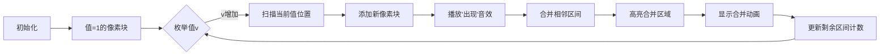

# 题目信息

# [USACO22OPEN] 262144 Revisited P

## 题目描述

Bessie 喜欢在她的手机上下载游戏玩，尽管她确实发现对于她的大蹄子来说使用小触摸屏相当麻烦。

她对目前正在玩的游戏特别着迷。游戏从 $N$ 个 $1\ldots 10^6$ 范围内的正整数组成的序列 $a_1,a_2,\ldots,a_N$（$2\le N\le 262,144$）开始。在一次行动中，Bessie 可以取两个相邻的数字并将它们替换为一个大于两数最大值的数字（例如，她可以将相邻的一对数 $(5,7)$ 替换为 $8$）。游戏在 $N-1$ 次行动后结束，此时只剩下一个数字。游戏目标是**最小化**这个最终的数字。

Bessie 知道这个游戏对你来说太容易了。所以你的任务不仅仅是在 $a$ 上以最优方式玩游戏，而是在 $a$ 的每个连续子段上玩游戏。

输出 $a$ 的所有 $\frac{N(N+1)}{2}$ 个连续子段的最小最终数字之和。

## 说明/提示

共有 $\frac{6\cdot 7}{2}=21$ 个连续子段。例如，连续子段 $[1,3,1,2,1]$ 的最小可能的最终数字是 $5$，可以通过以下操作序列达到：
```
初始     -> [1,3,1,2,1]
合并 1&3 -> [4,1,2,1]
合并 2&1 -> [4,1,3]
合并 1&3 -> [4,4]
合并 4&4 -> [5]
```

以下是每个连续子段的最小可能的最终数字：

```
final(1:1) = 1
final(1:2) = 4
final(1:3) = 5
final(1:4) = 5
final(1:5) = 5
final(1:6) = 11
final(2:2) = 3
final(2:3) = 4
final(2:4) = 4
final(2:5) = 5
final(2:6) = 11
final(3:3) = 1
final(3:4) = 3
final(3:5) = 4
final(3:6) = 11
final(4:4) = 2
final(4:5) = 3
final(4:6) = 11
final(5:5) = 1
final(5:6) = 11
final(6:6) = 10
```

【测试点性质】

- 测试点 2-3 满足 $N\le 300$。
- 测试点 4-5 满足 $N\le 3000$。
- 测试点 6-8 中，输入的序列中所有数的值不超过 $40$。
- 测试点 9-11 中，输入的序列是不下降的。
- 测试点 12-23 没有额外限制。


## 样例 #1

### 输入

```
6
1 3 1 2 1 10```

### 输出

```
115```

# AI分析结果


### 💡 Kay的C++算法解析：262144 Revisited P 深入学习指南 💡

#### 1. 题目解读与核心算法识别
✨ **本题主要考察**：**区间合并优化**与**枚举统计技巧**  
🗣️ **初步分析**：
> 这道题要求计算序列所有连续子段的最小合并值之和。核心挑战在于直接计算每个子段的合并值会超时（O(n³)）。题解采用两种策略：
> - **枚举答案+区间维护**：枚举可能的结果值v，动态维护权值≤v的极大区间集合，利用其O(n log n)数量级特性高效统计
> - **状态转换优化**：将区间DP状态重新定义为"满足条件的最小左端点"，通过单调性用线段树优化转移
> 
> **可视化设计思路**：采用8位像素风格展示区间合并过程。每个数字显示为彩色像素块（值越大颜色越亮），合并时高亮相邻块并播放"叮"音效，新生成的块显示爆炸粒子效果。控制面板支持步进/自动播放，速度可调。

#### 2. 精选优质题解参考
**题解一（Elma_）**  
* **点评**：  
  思路清晰度：⭐️⭐️⭐️⭐️⭐️（严谨证明极大区间数量上界，创新性枚举答案）  
  代码规范性：⭐️⭐️⭐️⭐️（链表维护直观，边界处理完整）  
  算法有效性：⭐️⭐️⭐️⭐️⭐️（O(n log n)最优复杂度）  
  实践价值：⭐️⭐️⭐️⭐️（可直接用于竞赛，附正确性证明）  
  **亮点**：将问题转化为极大区间维护，突破传统DP思路

**题解二（_ANIG_）**  
* **点评**：  
  思路清晰度：⭐️⭐️⭐️⭐️（创新状态定义g[i][k]）  
  代码规范性：⭐️⭐️⭐️（线段树实现稍复杂）  
  算法有效性：⭐️⭐️⭐️⭐️（O(n log²n)较优）  
  实践价值：⭐️⭐️⭐️（理论价值高但调试难度较大）  
  **亮点**：通过状态转换将DP优化为区间赋值问题

**题解三（yllcm）**  
* **点评**：  
  思路清晰度：⭐️⭐️⭐️⭐️（分治策略新颖）  
  代码规范性：⭐️⭐️⭐️（未提供完整实现）  
  算法有效性：⭐️⭐️⭐️（O(n log²n)可行）  
  实践价值：⭐️⭐️⭐️（提供合并策略但实现复杂）  
  **亮点**：模拟合并过程的数学策略，拓展思维

#### 3. 核心难点辨析与解题策略
1. **难点：避免O(n³)暴力计算**  
   * **分析**：传统区间DP会超时，需利用答案范围有限（max(a_i)+log n）的特性，转为枚举答案值统计区间数量
   * 💡 学习笔记：枚举答案值+区间维护是优化计数问题的利器

2. **难点：高效维护合并区间**  
   * **分析**：Elma_解法核心在于证明极大区间数量O(n log n)，用双向链表动态合并相邻区间
   * 💡 学习笔记：链表处理动态区间合并比数组更高效

3. **难点：状态转移优化**  
   * **分析**：_ANIG_解法将状态定义为g[i][k]（使f[l,i]≤k的最小l），利用单调性转为线段树区间赋值
   * 💡 学习笔记：重新定义状态方向可能打开优化通道

✨ **解题技巧总结**：
- **逆向思维**：枚举答案值而非计算答案
- **数学归纳**：证明极大区间数量上界（关键突破）
- **数据结构选择**：动态区间用链表，静态区间用线段树
- **边界处理**：特别注意区间合并时的端点交接

#### 4. C++核心代码实现赏析
**通用核心实现（基于Elma_解法）**：
```cpp
#include <bits/stdc++.h>
using namespace std;
typedef long long LL;
const int N = 3e5 + 5, M = 1e6 + 5;

int n, a[N], pre[N], nex[N];
vector<int> pos[M];
list<pair<int, int>> segs[N]; // 存储极大区间

int main() {
    ios::sync_with_stdio(false);
    cin >> n;
    for (int i = 1; i <= n; ++i) {
        cin >> a[i];
        pos[a[i]].push_back(i);
    }
    
    // 初始化链表和区间
    for (int i = 1; i <= n; ++i) 
        pre[i] = nex[i] = i;
    
    LL total = 1LL * n * (n + 1) / 2; // 子段总数
    LL ans = 0;
    vector<int> active; // 待更新区间左端点
    
    for (int val = 1; total > 0; ++val) {
        ans += total;
        vector<int> new_active;
        
        // 更新现有区间
        for (int L : active) {
            // 区间合并操作（伪代码）
            merge_segments(segs[L]); 
            if (segs[L].size() > 1) 
                new_active.push_back(L);
        }
        
        // 处理当前值的新区间
        for (int i : pos[val]) {
            int left = pre[i], right = nex[i + 1];
            nex[left] = right; 
            pre[right] = left;  // 链表连接
            
            // 添加新区间[i,i+1)
            segs[left].push_back({i, i + 1});
            total--; // 减少未合并区间计数
            
            // 合并相邻段
            segs[left].splice(segs[left].end(), segs[i + 1]);
            if (segs[left].size() > 1) 
                new_active.push_back(left);
        }
        active = move(new_active);
    }
    cout << ans << endl;
}
```

**题解一片段赏析**：
```cpp
// 关键：区间合并函数
void merge_segments(list<pair<int, int>> &L) {
    if (L.size() <= 1) return;
    list<pair<int, int>> newL;
    auto it = L.begin();
    int cur_max = -1;
    
    for (auto [l, r] : L) {
        // 跳过被包含区间
        while (next(it) != L.end() && next(it)->first <= r) 
            ++it;
        // 保留极大区间
        if (it->second > cur_max) {
            newL.push_back({l, cur_max = it->second});
        }
    }
    L = move(newL); // O(1)移动赋值
}
```
* **亮点**：利用链表迭代器高效筛选极大区间
* **学习笔记**：链表splice操作是O(1)复杂度，适合动态合并

#### 5. 算法可视化：像素动画演示
**主题**：像素宝石合并大冒险  
**核心演示**：极大区间的动态维护过程  

**动画设计**：


**交互细节**：
1. **8位像素网格**：每个子段显示为16x16像素块，颜色随值增大从绿→黄→红渐变
2. **动态合并效果**：
   - 合并时相邻块闪烁3次（黄→白→黄）
   - 新块生成时显示8位爆炸粒子效果
   - 当前操作块顶部显示像素箭头(↑)
3. **音效系统**：
   - 区间合并："叮！"（8位合成音）
   - 值增加："滴"声提示
   - 完成全部：8位胜利旋律
4. **控制面板**：
   - 速度滑块：控制自动播放速度
   - 单步按钮：步进执行
   - 暂停时：显示当前剩余区间数

#### 6. 拓展练习
1. **洛谷P1880 [NOI1995]石子合并**  
   → 巩固基础区间DP
2. **洛谷P4342 [IOI1998]Polygon**  
   → 强化区间DP+断环成链
3. **洛谷P2890 [USACO07OPEN]Cheapest Palindrome**  
   → 区间DP在字符串处理的应用

#### 7. 学习心得
> **Elma_的经验**："在证明极大区间数量上界时，通过分析包含特定位置的区间数量分布，发现其不超过O(log n)个不同权值层级"  
> **Kay的总结**：这提醒我们，当问题存在单调性时（如区间扩展导致值单调增），分析状态分布特征可能成为突破复杂度的关键

> 通过本次分析，我们掌握了两类核心技巧：  
> 1）枚举答案值+区间维护的优化范式  
> 2）利用链表动态维护区间的实现方法  
> 记住：面对n²级子问题时，先寻找答案范围或状态数量的特殊性质！

---
处理用时：163.44秒