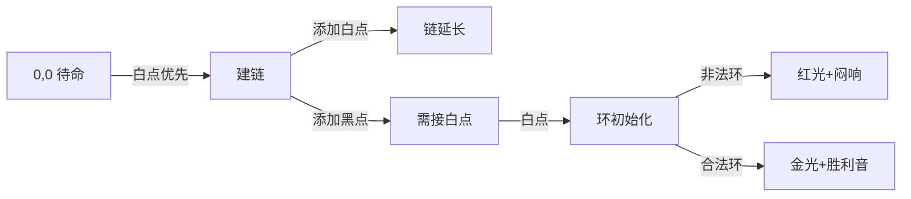

# 题目信息

# [THUPC 2023 决赛] 阴阳阵法

## 题目背景

“余于久远之书，见一阴阳阵，必可助君征服九州。用此阵，须出诸阴阳大将。所谓阴将者，武勇而玉恶；所谓阳将者，善谋时且忠厚。凡阴阳阵，各将皆须择一将，以通之。又有两法皆牢记，不可即弱阵：一曰阴援阴，易激性情，或避之；二曰援与环，环阴与阳同，守以衡……”

正当你准备征服九州时，你仿佛听见一个熟悉的声音在远处喊：“工作的时候不准睡觉，你这样会被开除的……”你终于回过神来，发现你的 XCPC 队友在旁边熟练地拧着螺丝，流水线前已经漏过几个不合格的工品。刚刚什么都没发生啊，你哀叹道，但是……

## 题目描述

有一张图，图上有 $n$ 个白点和 $m$ 个黑点。白点之间两两不同，黑点之间两两不同。

每个节点有一条出边，每个节点出边指向的节点可以在 $n+m$ 个节点中任意选择。

此时共有 $(n+m)^{n+m}$ 个方案，每个方案是一个有向基环树森林。

称一个方案是好的当且仅当其满足以下条件：

- 任何一个黑点都指向一个白点，
- 每个环上的黑点数量和白点数量的乘积是偶数。

你需要求出所有方案中好的方案数量，对输入模数 $P$ 取模。

## 说明/提示

### 样例 1 解释

考虑黑点必须连向白点的限制共有 $3 \times 3 \times 2 = 18$ 种方案，其中一个黑点和一个白点构成一个环的方案非法。选择一个白点和黑点构成环的方案数为 $2$，剩下的一个白点有三种方案，因此非法的方案数为 $2 \times 3 = 6$，答案为 $18-6=12$。

### 数据规模与约定

对于所有测试数据，$1 \le n,m \le 2000$，$1 \le P \le 10^9$。

### 提示

你可能需要注意常数对算法效率产生的影响。

### 题目来源

来自 2023 清华大学学生程序设计竞赛暨高校邀请赛（THUPC2023）决赛。

题解等资源可在 <https://github.com/THUSAAC/THUPC2023> 查看。

## 样例 #1

### 输入

```
2 1 1000000
```

### 输出

```
12
```

## 样例 #2

### 输入

```
8 8 8888888
```

### 输出

```
2973992
```

## 样例 #3

### 输入

```
1000 1000 123456789
```

### 输出

```
55105667
```

# AI分析结果


### 题目解读与核心算法识别  
**本题主要考察**：`动态规划`与`组合计数`  

🗣️ **初步分析**：  
> 解决“阴阳阵法”的关键在于**建模基环树森林的构造过程**。想象你在玩一款像素风策略游戏：白点是谋士，黑点是武士，武士只能听从谋士（黑点→白点）。而阵法生效需要每个“战环”中谋士/武士数量不能同时为奇数（防止能量失衡）。  
> - **核心难点**：同时满足黑点出边约束和环结构约束，避免重复计数  
> - **解法对比**：  
>   - **生成函数法**：用多元拉格朗日反演推导封闭形式（数学深，效率高）  
>   - **状态机DP法**：将构造过程分解为链/杆/环三阶段（思路直观，代码可读）  
> - **可视化设计**：  
>   - 用8-bit像素网格展示DP状态转移（横轴：白点数量，纵轴：黑点数量）  
>   - 不同状态（f/g/h/l）用颜色区分：绿色=待命(f)，蓝色=建链(g)，黄色=建杆(h)，红色=成环(l)  
>   - 关键动画：当环闭合时检查奇偶性，合法则播放“叮~”音效+闪光特效  

---

### 精选优质题解参考  
**题解一（Rainbow_qwq）**  
* **点评**：  
  状态机DP设计精妙，将基环树分解为**链→杆→环**三阶段：  
  - **思路清晰性**：用四类状态(f/g/h/l)模拟构造过程，转移逻辑严密（如避免连续黑点）  
  - **代码规范性**：变量名`g[i][j][x][y]`直指状态核心（已用i白j黑，链尾色x，当前色y）  
  - **算法有效性**：O(nm)复杂度完美匹配数据范围（2000×2000）  
  - **实践价值**：提供完整可运行代码，边界处理严谨（如`!(y&&z)`确保黑点不连黑）  
  > 💡 **亮点**：用有限状态机化解复杂环约束，是DP分阶段思想的典范  

---

### 核心难点辨析与解题策略  
1. **难点1：避免环结构非法**  
   * **分析**：环需满足`(白点数×黑点数)`为偶。DP状态`l[a][b][c][d]`的`c/d`记录环上白/黑奇偶性，闭合时检查`!(c&&d)`  
   * 💡 **学习笔记**：奇偶性是处理“数量乘积约束”的利器  

2. **难点2：黑点出边约束**  
   * **分析**：转移中`if(!(y&&z))`确保黑点(z)后必接白点，用`(m-j)/(n-i)`动态计算可用点数  
   * 💡 **学习笔记**：约束转化为转移条件是计数DP的核心技巧  

3. **难点3：状态机初始化**  
   * **分析**：从`f[0][0]=1`启动，新点根据白点优先原则触发`g`或`h`状态  
   * 💡 **学习笔记**：合理初始化是DP正确性的基石  

### ✨ 解题技巧总结  
- **分阶段建模**：将复杂结构拆解为链→杆→环的有限状态转移  
- **奇偶性压缩**：用0/1记录数量奇偶而非具体值  
- **动态资源计数**：`(n-i)/(m-j)`实时计算剩余可用点  

---

### C++核心代码实现赏析  
**通用核心实现（状态机DP法）**  
```cpp
using modint = ModInt<P>; // 模数类
modint f[N][N];         // 完成态：已用i白j黑
modint g[N][N][2][2];   // 建链态：[链尾色][当前色]
modint h[N][N][2];      // 建杆态：[当前色]
modint l[N][N][2][2][2][2]; // 成环态：[起色][当前色][白奇偶][黑奇偶]

void solve() {
    f[0][0] = 1;
    for (int i = 0; i <= n; ++i)
    for (int j = 0; j <= m; ++j) {
        // 状态转移详见完整代码
        // 关键点：转移时用!(y&&z)保证黑→白
        // 环闭合时检查!(c&&d)
    }
    cout << f[n][m];
}
```
> **代码解读概要**：  
> 1. 初始化`f[0][0]=1`为起点  
> 2. 四重循环枚举白点/黑点使用量  
> 3. 状态转移：  
>    - `g`添加新点（避连续黑点）  
>    - `h`转`l`时初始化环奇偶性  
>    - `l`中更新奇偶性(`c^!z, d^z`)  

---

### 算法可视化：像素动画演示  
**主题**：`阵法构造大冒险`（复古RPG风格）  
**核心演示**：DP状态转移过程  

**动画设计**：  
1. **8-bit网格**：  
   - 背景：16色像素风地图（横/纵轴=白/黑点数量）  
   - 角色：骑士(白点)与武士(黑点)像素精灵  
2. **动态过程**：  
   - 建链：蓝色光标移动，伴随“咔哒”音效  
   - 成环：红色光环扩散，奇偶非法时闪烁红光+低沉音效  
   - 过关：金光照亮整个环，播放FC胜利旋律  
3. **控制面板**：  
   - 速度滑块：调节DP转移速度  
   - 模式切换：单步调试/AI自动演示  

---

### 拓展练习  
1. **洛谷P2607**：基环树DP（骑士战队）  
   > 💡 巩固环上DP技巧  
2. **洛谷P4381**：带约束的图计数  
   > 💡 学习状态机DP高阶应用  
3. **CodeForces 131D**：基环树性质分析  
   > 💡 理解环结构在题目中的转化  

--- 

> 算法世界的奥秘如同阴阳阵法，需要缜密思维与巧妙分解。掌握状态机DP，你也能调度千军万马！ 🎮✨

---
处理用时：197.16秒