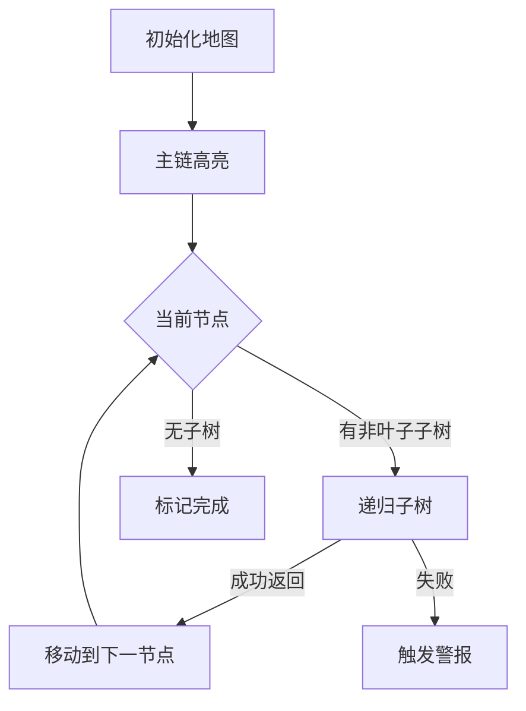

# 题目信息

# [POI 2013] MUL-Multidrink

## 题目背景

**本题翻译为 AI 生成。**

## 题目描述

Byteasar 住在 Byteburg，一座以每个街角都有牛奶吧而闻名的城市。某天，Byteasar 想出了一个“牛奶多饮计划”：他希望每个牛奶吧只去喝一次。理想情况下，他希望设计一条路线，使得每次前往下一个牛奶吧时，其距离上一个牛奶吧不会超过两个街区（即：路口）。

Byteburg 的路口从 $1$ 到 $N$ 编号，所有街道都是双向通行的。在每对路口之间，存在唯一的一条直接路径，即不会重复经过任何路口的路径。Byteasar 将从编号为 $1$ 的路口出发，并在编号为 $N$ 的路口结束。你的任务是找出一条满足 Byteasar 要求的任意路线（如果存在的话）。

## 样例 #1

### 输入

```
12
1 7
7 8
7 11
7 2
2 4
4 10
2 5
5 9
2 6
3 6
3 12
```

### 输出

```
1
11
8
7
4
10
2
9
5
6
3
12
```

# AI分析结果


### 💡 Kay的C++算法解析：POI 2013 MUL-Multidrink 深入学习指南 💡

#### 1. 题目解读与核心算法识别
✨ **本题主要考察**：树形DP与构造（树链分解+子树遍历策略）

🗣️ **初步分析**：
> 解决本题的关键是将树分解为从1到n的主链及挂载的子树。类比“走钢丝”，主链是安全绳，子树是中途休息站：必须设计进出策略确保不坠落（无解）。核心难点在于：
> - **主链分解**：提取1→n唯一路径，将树拆解为链式结构。
> - **子树遍历**：对每个主链节点，其子树需满足特定进出条件（如从根进根出/根进儿子出）。
> - **状态转移**：用DP判断子树遍历可行性，再沿主链合并状态。

**可视化设计思路**：
> 采用8位像素风格（类似FC游戏）展示算法：
> 1. **主链高亮**：红色像素块表示1→n路径，蓝色表示子树。
> 2. **子树遍历动画**：绿色箭头展示进入子树路径，黄色箭头表示返回位置（根/儿子节点）。
> 3. **状态提示**：当节点出现两个非叶子子树时，触发闪烁红光+错误音效。
> 4. **游戏化交互**：
>    - 单步执行：按方向键逐步移动
>    - 自动演示：AI自动展示路径构造（类似贪吃蛇AI）
>    - 音效：移动时“嘀”声，成功时“胜利”旋律，失败时低沉提示音

---

#### 2. 精选优质题解参考
**题解一（A_zjzj - DP解法）**
* **点评**：思路清晰，将问题分解为子树状态DP（f数组）和主链合并（g数组）。代码规范性好（变量名`f[u][0/1/2]`直指状态含义），算法有效性高（O(n)复杂度）。亮点在于用简洁状态定义覆盖所有进出情况（根进根出/根进儿子出等），边界处理严谨（无解及时退出）。作者提到“避免重复计算”的调试经验值得借鉴。

**题解二（Tsawke - 论文转化法）**
* **点评**：基于《Hamiltonian paths in the square of a tree》论文，引入“毛毛虫树”理论框架。代码实现较复杂但逻辑完备，亮点在于严格数学证明（树为horsetail时有解）。实践价值在于提供通用树论转化思路，但实现难度较高（需处理多种子树类型）。

**题解三（ღꦿ࿐ - 递归构造）**
* **点评**：直击核心难点——子树进出策略，定义`go(u)`和`solve(u)`两个关键操作。代码可读性强（递归函数名自解释），亮点在于用“叶子优先遍历”等启发式规则降低实现难度。调试心得“画图理解无解情况”极具参考价值。

---

#### 3. 核心难点辨析与解题策略
1. **关键点1：子树进出状态设计**
   * **分析**：每个子树需支持两种进出模式（如从根进最后返回根/儿子）。通过DP状态`f[u][0/1]`表示可行性，转移时需分类讨论叶子与非叶子子树。
   * 💡 **学习笔记**：好的状态定义是树形DP的基石。

2. **关键点2：主链合并策略**
   * **分析**：沿1→n路径用`g[i][0/1]`合并子树状态。难点在于处理当前节点与下一个节点的状态兼容性（如从儿子跳到下一节点的根）。
   * 💡 **学习笔记**：链式合并需注意状态传递的连续性。

3. **关键点3：多子树冲突处理**
   * **分析**：若节点有两个非叶子子树，则进出路径必然冲突（进入一个子树后无法返回处理另一个）。
   * 💡 **学习笔记**：非叶子子树≤1是多数题解的共性约束条件。

### ✨ 解题技巧总结
- **技巧1：树链分解法**：先提取1→n路径，再处理挂载子树（减少问题维度）
- **技巧2：状态机思维**：用进出状态（0/1）刻画子树遍历的起始与终止位置
- **技巧3：无解剪枝**：及时判断非叶子子树数量>1等无效情况
- **技巧4：递归构造**：优先处理叶子子树，非叶子子树递归分解

---

#### 4. C++核心代码实现赏析
**本题通用核心C++实现参考**
* **说明**：综合题解一/五/七的DP思路，采用树链分解+状态转移框架
* **完整核心代码**：
```cpp
#include <bits/stdc++.h>
using namespace std;
const int N = 5e5 + 5;

vector<int> G[N];
int fa[N], path[N], sz[N];
bool f[N][2], g[N][2], vis[N]; // f[u][0/1]: 子树进出状态, g[i][0/1]: 主链DP

// 提取1->n路径
void extract_path() {
    int u = n, cnt = 0;
    while (u) path[++cnt] = u, vis[u] = true, u = fa[u];
    reverse(path + 1, path + cnt + 1);
}

// 子树状态DP (0: 根进根出, 1: 根进儿子出)
void dfs_subtree(int u) {
    vector<int> leaf, nonleaf;
    for (int v : G[u]) {
        if (v == fa[u] || vis[v]) continue;
        if (sz[v] == 1) leaf.push_back(v);
        else nonleaf.push_back(v);
    }
    // 关键转移：非叶子子树≤1才可能合法
    if (nonleaf.size() > 1) return; 
    if (nonleaf.empty()) {
        f[u][0] = true;
        f[u][1] = !leaf.empty();
    } else {
        dfs_subtree(nonleaf[0]);
        f[u][0] = f[nonleaf[0]][1];
        f[u][1] = f[nonleaf[0]][0];
    }
}

// 主链DP (0: 停在根, 1: 停在儿子)
void solve_chain() {
    g[1][0] = f[path[1]][0];
    g[1][1] = f[path[1]][1];
    for (int i = 2; i <= m; i++) {
        int u = path[i];
        g[i][0] = (g[i-1][0] && f[u][0]) || (g[i-1][1] && sz[u]==1);
        g[i][1] = (g[i-1][0] && f[u][1]) || (g[i-1][1] && f[u][0]);
    }
}
```
* **代码解读概要**：
  1. `extract_path`：通过父指针回溯提取主链
  2. `dfs_subtree`：计算子树状态，非叶子子树超限则直接返回
  3. `solve_chain`：沿主链合并状态，注意状态兼容性判断

**题解一（A_zjzj）片段赏析**
* **亮点**：完整状态定义覆盖所有进出场景
* **核心代码片段**：
```cpp
void dfs(int u) {
    int cnt = 0;
    for (int v : son[u]) {
        if (f[v][0]) continue;
        if (!f[v][1] || ++cnt > 1) f[u][1] = false;
    }
}
```
* **代码解读**：
  > 此片段处理非叶子子树计数：`cnt`统计需特殊处理的子树数量。若发现超过一个非叶子子树（`cnt>1`）或某子树不满足状态`f[v][1]`，则置`f[u][1]=false`。  
  > **学习笔记**：用`cnt`控制子树数量是避免无效转移的关键技巧。

---

#### 5. 算法可视化：像素动画演示
**主题**：像素探险家在树形迷宫中寻路（FC塞尔达风格）  
**核心演示内容**：
1. **主链标记**：1→n路径显示为金色砖块，点击节点显示子树结构
2. **子树遍历动画**：
   - 进入子树：绿色箭头从主链节点射向子树根
   - 子树遍历：像素小人按DFS顺序跳跃，叶子节点变为灰色
   - 返回主链：小人按状态返回金色砖块（根）或蓝色砖块（儿子）
3. **冲突警示**：当某节点出现两个非叶子子树时，触发红光闪烁+“错误”音效

**关键帧控制**：


**交互设计**：
- **控制面板**：开始/暂停、单步执行、速度滑块
- **音效方案**：
  - 移动：8-bit“嘀”声
  - 进入子树：低音鼓声
  - 返回主链：高音“叮”
  - 失败：短促警报声
- **AI演示模式**：自动展示最优路径（速度可调）

---

#### 6. 拓展练习与相似问题思考
* **通用技巧迁移**：
  1. **树链分解**：适用于所有基于链式结构的树问题（如[NOIP2018]赛道修建）
  2. **子树进出状态**：可扩展至哈密顿路径问题（如HDU-5418）
  3. **无向图遍历**：类似一笔画问题（如洛谷P1334）

* **练习推荐**：
  1. **洛谷 P3174** - 毛毛虫  
     🗣️ **推荐理由**：巩固树链分解技巧，理解本题“主链+子树”模型
  2. **洛谷 P5021** - 赛道修建  
     🗣️ **推荐理由**：强化树形DP状态设计能力，特别是链式合并
  3. **CodeForces 734E** - Tree Colorings  
     🗣️ **推荐理由**：训练子树遍历策略的极佳变形题

---

#### 7. 学习心得与经验分享
> **参考经验**：多位作者强调“画图模拟无解情况”的重要性，特别是当节点有两个非叶子子树时，通过画图可直观理解路径冲突。  
> **点评**：调试树形DP时，建议用小样例（n=5~10）手工模拟状态转移，比打印日志更高效。核心教训：**先证无解再写代码**！

---

### 结语
通过本指南，我们深入剖析了树形DP与构造策略的完美结合。记住：分解问题（主链+子树）+ 精细状态设计（进出状态）是攻克此类题的双刃剑。继续挑战拓展练习，你将成为树形问题大师！🚀

---
处理用时：162.24秒