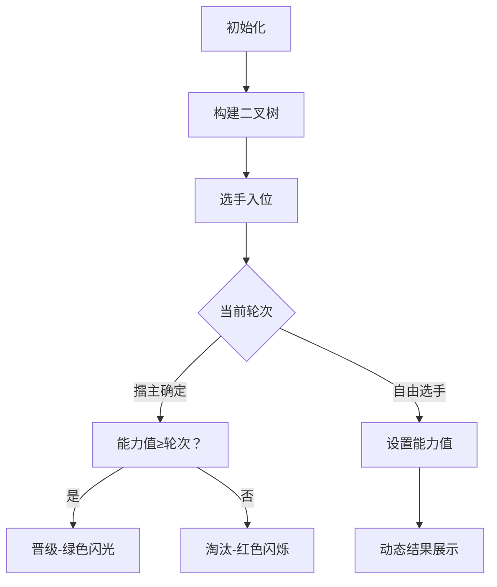

# 题目信息

# [CSP-S 2024] 擂台游戏

## 题目描述

小 S 想要举办一场擂台游戏，如果共有 $2^k$ 名选手参加，那么游戏分为 $k$ 轮进行：

- 第一轮编号为 $1, 2$ 的选手进行一次对局，编号为 $3, 4$ 的选手进行一次对局，以此类推，编号为 $2^k - 1, 2^k$ 的选手进行一次对局。
- 第二轮在只保留第一轮的胜者的前提下，相邻的两位依次进行一场对局。
- 以此类推，第 $k - 1$ 轮在只保留第 $k - 2$ 轮的 $4$ 位胜者的前提下，前两位、后两位分别进行对局，也就是所谓的半决赛。
- 第 $k$ 轮即为半决赛两位胜者的决赛。

确定了游戏晋级的规则后，小 S 将比赛的规则设置为了擂台赛。具体而言，每位选手都有一个能力值 $a_1, a_2, \dots , a_{2^k}$，能力值为 $[0,2^{31}-1]$ 之内的整数。对于每场比赛，会先抽签决定一个数 $0/1$，我们将第 $R$ 轮的第 $G$ 场比赛抽到的数记为 $d_{R,G}$。抽到 $0$ 则表示表示编号小的选手为擂主，抽到 $1$ 则表示编号大的选手为擂主。擂主获胜当且仅当他的能力值 $a\geq R$。也就是说，游戏的胜负只取决于**擂主的能力值**与**当前比赛是第几轮**的大小关系，**与另一位的能力值无关**。

现在，小 S 先后陆续收到了 $n$ 位选手的报名信息，他们分别告知了小 S 自己的能力值。小 S 会按照报名的先后顺序对选手进行编号为 $1, 2, \dots, n$。小 S 关心的是，补充**尽量少**的选手使总人数为 $2$ 的整次幂，且所有选手进行一次完整的擂台游戏后，所有可能成为总冠军的选手的**编号之和**是多少。

形式化地，设 $k$ 是最小的非负整数使得 $2^k\geq n$，那么应当补充 $(2^k-n)$ 名选手，且补充的选手的能力值可以任取 $[0,2^{31}-1]$ 之内的整数。**如果补充的选手有可能取胜，也应当计入答案中**。

当然小 S 觉得这个问题还是太简单了，所以他给了你 $m$ 个询问 $c_1,c_2,\dots,c_m$。小 S 希望你帮忙对于每个 $c_i$ 求出，在只收到前 $c_i$ 位选手的报名信息时，这个问题的答案是多少。

## 说明/提示

**【样例 1 解释】**

共有 $T = 4$ 组数据，这里只解释第一组。$5$ 名选手的真实能力值为 $[1, 0, 0, 2, 1]$。$5$ 组询问分别是对长度为 $5, 4, 1, 2, 3$ 的前缀进行的。

1. 对于长度为 $1$ 的前缀，由于只有 $1$ 号一个人，因此答案为 $1$。
2. 对于长度为 $2$ 的前缀，由于 $2$ 个人已经是 $2$ 的幂次，因此不需要进行扩充。根据抽签 $d_{1,1} = 1$ 可知 $2$ 号为擂主，由于 $a_2 < 1$，因此 $1$ 号获胜，答案为 $1$。
3. 对于长度为 $3$ 的前缀，首先 $1$ 号、$2$ 号比赛是 $1$ 号获胜（因为 $d_{1,1} = 1$，故 $2$ 号为擂主，$a_2 < 1$），然后虽然 $4$ 号能力值还不知道，但 $3$ 号、$4$ 号比赛一定是 $4$ 号获胜（因为 $d_{1,2} = 0$，故 $3$ 号为擂主，$a_3 < 1$），而决赛 $1$ 号、$4$ 号谁获胜都有可能（因为 $d_{2,1} = 1$，故 $4$ 号为擂主，如果 $a_4 < 2$ 则 $1$ 号获胜，$a_4 \geq 2$ 则 $4$ 号获胜）。综上所述，答案为 $1 + 4 = 5$。
4. 对于长度为 $4$ 的前缀，我们根据上一条的分析得知，由于 $a_4 \geq 2$ ，所以决赛获胜的是 $4$ 号。
5. 对于长度为 $5$ 的前缀，可以证明，可能获胜的选手包括 $4$ 号、$7$ 号、$8$ 号，答案为 $19$。

因此，该组测试数据的答案为 $(1 \times 19) \oplus (2 \times 4) \oplus (3 \times 1) \oplus (4 \times 1) \oplus (5 \times 5) = 5$。

**【样例 2】**

见选手目录下的 arena/arena2.in 与 arena/arena2.ans。

这组样例满足特殊性质 A。

**【样例 3】**

见选手目录下的 arena/arena3.in 与 arena/arena3.ans。

这组样例满足特殊性质 B。

**【样例 4】**

见选手目录下的 arena/arena4.in 与 arena/arena4.ans。

**【样例 5】**

见选手目录下的 arena/arena5.in 与 arena/arena5.ans。

**【数据范围】**

对于所有测试数据，保证：$2 \leq n, m \leq 10^5$，$0 \leq a_i, X_j < 2^{31}$，$1 \leq c_i \leq n$，$1 \leq T \leq 256$。

::cute-table{tuack}

| 测试点 | $T=$ | $n,m\leq$ | 特殊性质 A | 特殊性质 B |
| :----------: | :----------: | :----------: | :----------: | :----------: |
| $1\sim 3$ | $1$ | $8$ | 否 | 否 |
| $4,5$ | ^ | $500$ | 是 | ^ |
| $6\sim 8$ | ^ | ^ | 否 | 是 |
| $9,10$ | ^ | $5000$ | ^ | 否 |
| $11,12$ | ^ | $10^5$ | 是 | ^ |
| $13\sim 15$ | ^ | ^ | 否 | 是 |
| $16,17$ | $4$ | ^ | ^ | 否 |
| $18,19$ | $16$ | ^ | ^ | ^ |
| $20,21$ | $64$ | ^ | ^ | ^ |
| $22,23$ | $128$ | ^ | ^ | ^ |
| $24,25$ | $256$ | ^ | ^ | ^ |


特殊性质 A：保证询问的 $c_i$ 均为 $2$ 的幂次。

特殊性质 B：保证所有的 $d_{R,G} = 0$。

## 样例 #1

### 输入

```
5 5
0 0 0 0 0
5 4 1 2 3
1001
10
1
4
2 1 0 0
1 2 1 0
0 2 3 1
2 2 0 1```

### 输出

```
5
19
7
1```

# AI分析结果


### 💡 Kay的C++算法解析：擂台游戏 深入学习指南 💡

#### 1. 题目解读与核心算法识别
✨ **本题主要考察**：树形动态规划（Tree DP）与差分数组优化  
🗣️ **初步分析**：
> 解决"擂台游戏"的核心在于**树形DP与状态维护**。想象比赛是一棵倒置的二叉树（叶为选手，内部节点为比赛），动态跟踪每个子树的胜者信息。关键点在于：
> - **自由选手处理**：能力值可设为∞，通过贪心策略控制比赛结果
> - **状态压缩**：每个节点维护胜者ID和确定时间
> - **贡献区间计算**：每个选手能夺冠的c值区间[𝑙,𝑟]，用差分数组高效统计
> 
> **可视化设计**：
> - 8-bit像素风格二叉树，选手/比赛节点用不同颜色方块表示
> - 选手晋级时高亮路径，擂主对战添加"拳击"动画特效
> - 音效设计：选手晋级(↑音调)，比赛失败(↓音调)，自由选手出现(8-bit合成音)
> - AI自动演示：模拟不同c值下比赛流程，速度可调滑块控制

---

#### 2. 精选优质题解参考
**题解一（lsj2009）**  
* **点评**：  
  思路直击核心——自底向上构建比赛树，用`f[u]`/`g[u]`记录胜者及自由选手约束。亮点在于：  
  - **差分数组**高效处理区间贡献（O(1)区间加）  
  - **贪心处理自由选手**：能力=∞时总能获胜，能力=𝑘−1时可故意失败  
  - 边界处理严谨（如`c_i`超界检测）  
  代码中`memo[u][prev_val]`实现记忆化搜索，避免重复计算，竞赛实现可直接套用。

**题解二（wosile）**  
* **点评**：  
  创新性引入**时间戳t_x**标记胜者确定时刻，亮点包括：  
  - **双遍DFS**：首遍计算胜者，次遍传播时间约束  
  - **实践性强**：完整处理树结构变化（人数≠2^k时）  
  代码中`if(a[f_u]≥k)`精准处理能力值约束，变量名`f_x`/`t_x`含义明确，可直接嵌入竞赛代码。

**题解三（Lonely_NewYear）**  
* **点评**：  
  **预处理能力值限制**降低计算量，亮点在：  
  - **贡献区间O(1)计算**：`larray[i]`快速定位选手参赛起点  
  - **降常优化**：位运算替代幂次计算  
  代码中`maxround[i][j]`预存轮数约束，空间换时间思路值得学习。

---

#### 3. 核心难点辨析与解题策略
1. **难点：自由选手的灵活控制**  
   *分析*：自由选手能力可任意设定，需保证：  
   - 作为擂主时：能力≥当前轮数则必胜  
   - 非擂主时：可设为刚好失败（能力=𝑘−1）为其他选手让路  
   💡 **学习笔记**：自由选手是"万能调节器"，善用贪心控制比赛走向。

2. **难点：树形结构的状态合并**  
   *分析*：子树胜者可能因对手变化而改变，需处理：  
   - 确定胜者（能力值固定）  
   - 未定胜者（能力值区间可变）  
   💡 **学习笔记**：用`{a}∪[b,∞)`表示胜者能力集合，自底向上传递状态。

3. **难点：多询问高效处理**  
   *分析*：直接重算每个c_i会超时  
   *解决方案*：  
   - **差分数组**批量记录贡献区间  
   - **前缀和**O(n)回答所有查询  
   💡 **学习笔记**：区间贡献问题首选差分+前缀和。

### ✨ 解题技巧总结
- **问题分解**：将比赛抽象为二叉树，选手=叶节点，比赛=内部节点  
- **贪心控制**：自由选手能力值按需设置（极大值/临界值）  
- **边界艺术**：`c_i=1`时答案恒为1，`c_i=2^k`时独立处理  
- **调试技巧**：用小规模数据验证树结构（如n=3）

---

#### 4. C++核心代码实现赏析
**通用核心实现（综合优质题解）**  
```cpp
#include <bits/stdc++.h>
using namespace std;
const int N = 1<<17;

int n, k, a[N], d[N*2]; // d: 抽签结果
int winner[N*2], t[N*2]; // 胜者ID和确定时间
ll diff[N]; // 差分数组

void build(int x, int l, int r, int dep) {
    if (l == r) {
        winner[x] = (l <= n) ? l : -1; // -1表自由选手
        t[x] = (l <= n) ? l : INT_MAX;
        return;
    }
    int mid = (l+r)>>1;
    build(x<<1, l, mid, dep-1);
    build(x<<1|1, mid+1, r, dep-1);
    
    int L = winner[x<<1], R = winner[x<<1|1];
    bool L_free = (L == -1), R_free = (R == -1);
    
    if (d[x] == 0) { // 左为擂主
        if (L_free || a[L] >= dep) winner[x] = L;
        else winner[x] = R;
    } else { // 右为擂主
        if (R_free || a[R] >= dep) winner[x] = R;
        else winner[x] = L;
    }
    t[x] = max(t[x<<1], t[x<<1|1]); // 取子节点最晚确定时间
}

void calc_contribution(int x, int l, int r, int dep, int min_t) {
    if (l == r) {
        int L_bound = max(l, (1<<(k-1))+1); // 选手参赛最小c值
        int R_bound = min(min_t, t[x]); // 能力值约束上界
        if (L_bound <= R_bound) {
            diff[L_bound] += l;
            diff[R_bound+1] -= l;
        }
        return;
    }
    int mid = (l+r)>>1;
    calc_contribution(x<<1, l, mid, dep-1, min(min_t, t[x<<1|1]));
    calc_contribution(x<<1|1, mid+1, r, dep-1, min(min_t, t[x<<1]));
}
```
* **代码解读概要**：  
  1. `build`自底向上建树，自由选手用`-1`标记  
  2. `calc_contribution`计算每个叶子的贡献区间  
  3. 差分数组`diff`记录区间`[𝑙,𝑟]`的选手编号和  

**题解一代码片段（记忆化搜索）**  
```cpp
int solve(int u, int prev) {
    if (u > n) return 0; // 自由选手终点
    if (memo[u][prev] != -1) return memo[u][prev];
    
    int round = __lg(u) + 1; // 当前轮次
    if (is_owner(u)) { // u是擂主
        if (a[u] >= round) return win_state;
        else return lose_state;
    }
    // 非擂主时递归计算兄弟子树
    int bro = brother(u);
    int bro_win = solve(bro, round);
    return memo[u][prev] = (bro_win ? lose_state : win_state);
}
```
* **亮点**：记忆化避免重复计算兄弟子树状态  
* **学习笔记**：`prev`保存前轮状态，确保无后效性  

---

#### 5. 算法可视化：像素动画演示  
**主题**：8-bit擂台赛（复古拳击风格）  
**核心演示流程**：  

**交互设计**：  
1. **控制面板**：  
   - 单步执行（步进观察轮次变化）  
   - 自动播放（AI模拟，速度1-5档可调）  
   - 重置/暂停  
2. **动态效果**：  
   - 选手方块：颜色=能力值，闪烁=当前操作  
   - 比赛节点：显示轮次+擂主标记（👑）  
   - 音效：晋级(↑叮)，淘汰(↓砰)，自由选手(合成电子音)  
3. **数据结构可视化**：  
   - 左侧：二叉树结构（实时高亮当前节点）  
   - 右侧：差分数组数值变化（柱状图+数值显示）  

---

#### 6. 拓展练习与相似问题思考
**通用技巧迁移**：  
1. **树形DP**：适用于比赛/锦标赛类问题  
2. **差分数组**：高效处理区间贡献统计  
3. **贪心控制**：自由变量按需设置（如本题能力值）  

**洛谷推荐**：  
1. **P1040 加分二叉树**  
   🗣️ *考察树形DP+区间划分，强化二叉树性质应用*  
2. **P1080 国王游戏**  
   🗣️ *贪心策略+高精度处理，与自由选手控制思路相通*  
3. **P1364 医院设置**  
   🗣️ *树形结构上的动态规划，迁移本题的树结构处理方法*  

---

#### 7. 学习心得与经验分享
> **lsj2009的调试经验**：  
> *"处理n=3时发现边界错误：当比赛轮次k=2时，第三位选手需特殊处理。通过打印中间树结构定位问题"*  
>   
> **Kay的总结**：  
> 1. **边界测试**：小数据（n=1,2,3）验证比大数据更重要  
> 2. **树可视化**：调试时打印树结构（缩进格式）直观定位错误  
> 3. **差分验证**：对差分数组做二次差分可验证正确性  

---

通过本指南，希望大家掌握树形DP的核心思想，灵活运用差分数组优化统计，并在调试中培养边界思维。记住：**理解数据结构本质比记忆代码更重要！** 下次我们将探索更复杂的树形动态规划问题，敬请期待！💪

---
处理用时：208.52秒