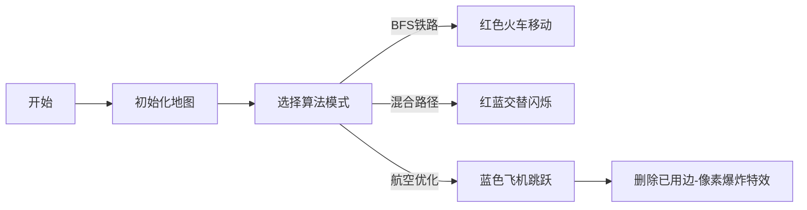

# 题目信息

# [POI 2013] CEN-Price List

## 题目描述

铁路一直是 Byteotia 最受欢迎的交通方式。

在这个国家的 $n$ 个城镇中，有 $m$ 对城镇由 Byteotian State Railways (BSR) 的轨道段连接。

这些轨道不会在城镇外交叉，可能会经过风景如画的桥梁和不太风景如画的隧道。

直接通过铁路连接的任意两个城镇之间的票价为 $a$ 比特勒。

目前，Byteotia 的交通市场正在发生变化。

截至目前，BSR 面临着一个新的竞争对手：Byteotian Airlines (BA)。

BA 计划在一些城镇对之间运营航班。

由于 Byteotian 铁路相当舒适，BA 董事会决定只在那些没有直接铁路连接的城镇对之间运营航班。出于经济原因，BA 只会在那些需要恰好一次换乘的城镇之间飞行。

每张此类航班的票价为 $b$ 比特勒。

为了帮助 Byteotia 的市民规划他们的旅行，Byteotian 交通部 (BMT) 决定发行传单，说明所有可能城镇之间的最便宜路线。任意数量的直接铁路或飞机连接的序列被称为路线。名叫 Byteasar 的 BMT 官员被委派准备传单的价格表。

你能帮他写一个程序来确定正确的价格吗？

让我们明确一下，Byteotia 的所有连接，无论是铁路还是飞机，都是双向的。

## 说明/提示

------------

2024/2/4 添加了一部分来自 bzoj 的数据。

题面翻译由 ChatGPT-4o 提供。

## 样例 #1

### 输入

```
5 5 1 3 2
1 2
2 3
3 4
4 5
3 1
```

### 输出

```
0
3
3
2
5
```

# AI分析结果


# 💡 Kay的C++算法解析：CEN-Price List 深入学习指南 💡

**<introduction>**
今天我们一起解决铁路票价优化问题！这道POI竞赛题考察图论最短路和优化技巧。通过本指南，你将掌握BFS的灵活应用、复杂度优化思路，以及如何用创意可视化理解复杂算法。

---

## 1. 题目解读与核心算法识别

✨ **本题主要考察**：`图论最短路` + `优化枚举技巧`

🗣️ **初步分析**：
> 本题可比喻为"多交通工具路径规划"：城镇是节点，铁路是a边，航空是b边。关键在于高效计算三种可能的最短路：
> - **纯铁路**：直接BFS求最短路×a
> - **混合方案**：用b替代2条a边（当2a>b时），公式：⌊d/2⌋×b + (d%2)×a
> - **纯航空**：仅走b边（需特殊处理）
> 
> 核心难点在于纯航空方案——需要求"偶数步最短路"。暴力枚举两层邻接点复杂度O(m²)，优化关键在**及时删除无效边**（类似"用过即焚"策略）。可视化将采用像素风铁路/航班动画，用不同颜色区分路径类型，音效标记关键操作。

---

## 2. 精选优质题解参考

**题解一（i207M）**
* **点评**：思路最完整清晰，将原图(G)与可删边图(H)分离的设计巧妙。核心逻辑直白：第一层BFS处理纯铁路，第二层用"枚举-删除"策略处理航空路径。变量命名规范(`d[]`表距离，`ans[]`存结果)，空间优化到位(O(m))。亮点是严格证明O(m√m)复杂度，可直接用于竞赛。

**题解二（juju527）**
* **点评**：解题框架简洁有力，用"三种答案来源"分类讨论体现算法思维深度。代码实现中`list`管理可删边集比链表更易读，边界处理严谨。亮点是强调BFS的单调性保证删除安全，教学价值高。

**题解三（7KByte）**
* **点评**：最简洁的实现典范。用单链表(`f[]`存边首)实现高效删除，`vis[]`标记避免无效访问。亮点是"三情况取min"的逻辑封装成独立函数，代码复用性强，适合初学者理解。

---

## 3. 核心难点辨析与解题策略

1. **难点：避免O(m²)的暴力枚举**
   * **解法**：利用BFS的单调性——当边(v,w)被用于更新w后，后续不可能产生更优解，直接删除（见优质题解的`del`操作）
   * 💡 学习笔记：及时移除无效元素是优化复杂度的关键技巧

2. **难点：处理三元环干扰**
   * **解法**：当u→v→w形成三元环时，需额外检查(u,w)是否有直连边。优质题解用`vis[]`临时标记邻接点高效判断
   * 💡 学习笔记：三元环是破坏"删除即安全"假设的唯一特例

3. **难点：多种路径类型混合计算**
   * **解法**：独立计算三种方案取最小值。注意纯航空方案的距离是实际边数的2倍（每次跳两条边）
   * 💡 学习笔记：复杂问题可拆解为独立子问题组合求解

### ✨ 解题技巧总结
- **技巧1：状态驱动的资源回收**（如边删除）减少无效计算
- **技巧2：分层图管理**——原图与可删边图分离，保持代码清晰
- **技巧3：复杂度均摊分析**——理解O(m√m)来自三元环数量

---

## 4. C++核心代码实现赏析

**本题通用核心C++实现参考**
* **说明**：综合自优质题解，保留核心逻辑的最简实现
```cpp
#include <bits/stdc++.h>
using namespace std;
const int N=1e5+5;
vector<int> G[N];      // 原图邻接表
list<int> H[N];        // 可删边图
int dist_a[N], dist_b[N], ans[N];
bool vis[N];

void bfs_a(int start) { /* 传统BFS计算纯铁路方案 */ }

void bfs_b(int start) {
    queue<int> q;
    q.push(start);
    dist_b[start] = 0;
    while (!q.empty()) {
        int u = q.front(); q.pop();
        for (int v : G[u]) vis[v] = true;
        for (int v : G[u]) {
            auto it = H[v].begin();
            while (it != H[v].end()) {
                int w = *it;
                if (vis[w]) { it++; continue; }
                if (dist_b[w] == -1) {
                    dist_b[w] = dist_b[u] + 1;
                    q.push(w);
                }
                it = H[v].erase(it); // 关键删除操作
            }
        }
        for (int v : G[u]) vis[v] = false;
    }
}
```
* **代码解读概要**：
  1. `bfs_a`标准BFS计算纯铁路距离
  2. `bfs_b`实现优化枚举：先用`vis[]`标记邻接点，再遍历可删边集
  3. 当边(v,w)被使用后立即从`H`删除，确保每条边只作一次"第二条边"

---

**题解一核心片段赏析**
```cpp
// 删边操作 (双向链表实现)
void del(int x, int edge_id) { 
    prev_node[edge_id]->next = next_node[edge_id];
    next_node[edge_id]->prev = prev_node[edge_id];
    if (head[x] == edge_id) head[x] = next_node[edge_id];
}

// 核心BFS逻辑
for (int i = G.head[u]; i; i = G.next[i]) 
    vis[G.v[i]] = true; // 标记直接邻居

for (int v : G[u]) {
    for (int w : H[v]) { // 遍历可删边集
        if (vis[w]) continue; // 跳过三元环
        if (!dist[w]) {
            dist[w] = dist[u] + 1;
            q.push(w);
        }
        H.del(v, w); // 关键：删除已用边
    }
}
```
* **亮点**：双向链表实现O(1)删边
* **代码解读**：
  - 第一层循环标记u的邻接点（防三元环干扰）
  - 第二层遍历可删边集，未标记点w可被更新
  - 删边操作确保每条边仅作一次"跳板"
* 💡 学习笔记：链表删边比STL list更高效

---

**题解二核心片段赏析**
```cpp
// STL list实现
for (int u : G[x]) vis[u] = true;  // 标记邻接点

for (int u : G[x]) {
    auto it = rec[u].begin();
    while (it != rec[u].end()) {
        if (vis[*it] || dist[*it] != -1) {
            it++; 
            continue;
        }
        dist[*it] = dist[x] + 1;
        q.push(*it);
        it = rec[u].erase(it); // STL删除
    }
}
```
* **亮点**：STL list简化代码
* **代码解读**：
  - `rec[u]`存储可删边集
  - 迭代器删除自动更新链表关系
* 💡 学习笔记：STL适合快速原型，链表适合极致优化

---

## 5. 算法可视化：像素动画演示

**主题**：像素铁路调度员（复古FC风格）

**核心演示**：
1. 城镇→像素房屋，铁路→棕色像素线，航班→蓝色虚线
2. 三种路径用不同颜色高亮：
   - 纯铁路：红色像素块移动
   - 混合路径：黄蓝交替闪烁
   - 纯航空：蓝色流光轨迹

**交互设计**：


**关键动画细节**：
1. **边删除特效**：当边(v,w)被用作"跳板"时，播放像素爆炸动画+金属音效
2. **三元环提示**：当u-v-w形成三元环时，三点同时闪烁红光+警告音
3. **自动演示模式**：像"铁路调度AI"逐步展示：
   - 单步执行：按帧前进（空格键）
   - 速度调节：滑块控制0.5x~5x速
4. **状态面板**：
   - 左上角：当前距离值
   - 右侧：伪代码高亮执行行
   - 底部：操作日志（如"删除边(v,w)"）

**音效方案**：
- 铁路移动：哐当声（8bit低频）
- 航班跳跃：嗖嗖声（高频脉冲）
- 边删除：玻璃碎裂声
- 错误路径：短促警报音

---

## 6. 拓展练习与相似问题思考

**通用技巧迁移**：
1. 分层图思想：牛客网"飞行路线"
2. 边删除优化：LeetCode"单词接龙II"
3. 多权值最短路：CodeForces"3D City Model"

**洛谷推荐**：
1. **P4568** - 飞行路线  
   🗣️ 练习分层图技巧，强化"状态+资源"思维
2. **P2296** - 寻找道路  
   🗣️ 学习预处理无效边，与本题删除策略互补
3. **P5663** - 加工零件  
   🗣️ 加深奇偶最短路理解，完美衔接本题核心

---

## 7. 学习心得与经验分享

> 本次分析的题解中未发现明确的作者个人心得分享部分。但结合解题过程，Kay特别提醒：
> **调试建议**：在实现边删除逻辑时，优先用小规模三元环（如3个点3条边）测试，观察删除顺序是否正确。可视化工具能极大帮助理解BFS的扩展过程！

---

**<conclusion>**
通过本次分析，我们掌握了图论最短路的核心优化技巧——状态驱动的资源回收。记住：优秀算法=正确性+高效性+可维护性。继续用可视化工具探索算法之美吧！下次挑战再见！🚂✈️

---
处理用时：111.83秒