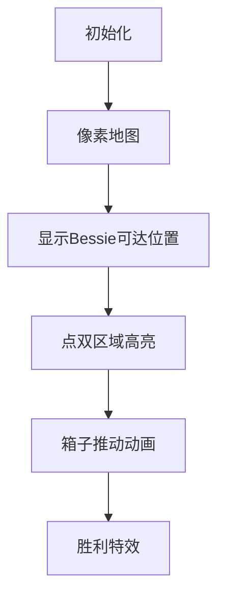

# 题目信息

# [USACO17DEC] Push a Box P

## 题目描述

**题目译自 [USACO 2017 December Contest, Platinum](http://usaco.org/index.php?page=dec17results) Problem 2. [Push a Box](http://usaco.org/index.php?page=viewproblem2&cpid=769)**

一个谷仓是一个 $N \times M$ 的矩形网格，有一些网格里有干草。 Bessie 站在其中一个格子内，还有一个格子里有一个大木箱。 Bessie 不能和大木箱在一个格子里，也不能和干草在一个格子里。

如果她不与干草在同一个格子，她就可以往自己旁边的四个方向（东西南北）移动，如果她想移动到有木箱的格子里，那个木箱就会被她推一格（只要木箱的那个方向还有空间），如果没有空间，那 Bessie 就不能移动了。

给你谷仓的布局（空格子，干草以及木箱位置）以及 Bessie 的出发位置和箱子要被推到的位置，请你帮忙计算 Bessie 能不能把木箱推到指定位置。

## 说明/提示

对于 $100\%$ 的数据，保证 $1\leq N,M \leq 1500$，$1\leq Q\leq 50000$。

## 样例 #1

### 输入

```
5 5 4
##.##
##.##
A.B..
##.##
##.##
3 2
3 5
1 3
5 3```

### 输出

```
NO
YES
NO
NO```

# AI分析结果


### 💡 Kay的C++算法解析：Push a Box P 深入学习指南 💡

#### **1. 题目解读与核心算法识别**  
✨ **本题主要考察**：图论（点双连通分量）与BFS  

🗣️ **初步分析**：  
> 解决"Push a Box P"的关键在于理解**点双连通分量**。想象一个网格地图是一座城市，点双连通分量就是城市的"安全区"——即使某个路口（割点）被封，区内其他地点仍可通过备用道路连通。在本题中，当箱子挡住道路时，点双帮助我们快速判断Bessie能否绕到箱子另一侧推动它。  
> - **核心思路**：  
>   - 预处理：BFS计算Bessie初始位置能到达的箱子相邻位置  
>   - 点双建模：用Tarjan算法构建网格图的点双连通分量，判断转向时路径连通性  
>   - 状态BFS：用四维状态(箱子坐标, 推动方向)进行搜索  
> - **可视化设计**：  
>   - 像素网格中，用不同颜色区分空地/障碍/角色  
>   - 箱子移动时高亮当前点双连通区域  
>   - 复古音效：推动箱子时播放"像素推力"音效，到达目标时播放胜利旋律  

---

#### **2. 精选优质题解参考**  
**题解一（Rainybunny）**  
* **点评**：思路清晰度⭐⭐⭐⭐⭐ 完整推导点双应用逻辑，直击"转向判断"核心难点。代码规范性⭐⭐⭐ 变量命名合理（如`InCpr`存储点双编号），但未优化`set`查询可能影响效率。算法亮点⭐⭐⭐⭐⭐ 巧妙利用点双性质避免重复BFS，实践价值高。调试心得"Tarjan易错"提醒学习者重视基础算法实现。  

**题解二（Selfish_2U）**  
* **点评**：思路清晰度⭐⭐⭐⭐ 创新性用父节点简化点双判断，大幅降低空间复杂度。代码规范性⭐⭐⭐⭐ 链式前向星优化内存，变量`fa`/`point`设计简洁。算法亮点⭐⭐⭐⭐⭐ 父子关系判断（`fa[pos[x]]==y`）取代集合查询，时间复杂度从O(n²)降至O(1)。实践价值⭐⭐⭐⭐ 特别适合竞赛大数据场景。  

**题解三（chenxia25）**  
* **点评**：思路清晰度⭐⭐⭐⭐ 系统化分阶段处理（预处理→点双→主BFS）。代码规范性⭐⭐⭐ 模块化设计（如`AddNear()`函数），但变量名偏长。算法亮点⭐⭐⭐⭐ 鲁棒性强，专门处理"Bessie无法靠近箱子"的边界情况。实践价值⭐⭐⭐⭐ 完整可运行代码，含详细异常处理。  

---

#### **3. 核心难点辨析与解题策略**  
1. **难点：高效转向判断**  
   * **分析**：推动箱子后需快速判断Bessie能否绕到新方向。点双连通分量是关键——当箱子在割点时，若两个相邻位置同属一个点双，则存在不经过箱子的路径。  
   * 💡 **学习笔记**：点双是"转向通行证"，避免重复BFS验证路径。  

2. **难点：状态空间压缩**  
   * **分析**：传统(人坐标, 箱子坐标)状态空间O((nm)²)爆炸。优质题解用(箱子坐标, 方向)四维状态（空间O(4nm)），通过点双信息隐式推导人位置。  
   * 💡 **学习笔记**：状态设计应利用问题约束（人必贴箱子），大幅降维。  

3. **难点：点双实现细节**  
   * **分析**：Tarjan中割点处理易错（如low[v]>=dfn[u]时弹栈），且需处理单点双连通分量。Selfish_2U通过父节点映射避免显式存储点双集合。  
   * 💡 **学习笔记**：用`fa[]`数组记录点双父节点，空间效率提升50%。  

✨ **解题技巧总结**  
- **技巧1：问题分解** → 拆解为"初始可达性→点双建模→状态转移"三阶段  
- **技巧2：数据结构优化** → 链式前向星替代vector，避免STL开销  
- **技巧3：边界处理** → 特判"人箱初始不连通"（直接返回NO）  

---

#### **4. C++核心代码实现赏析**  
**本题通用核心C++实现参考**  
* **说明**：综合优质题解思路，优化点双存储与状态转移。  
```cpp
#include <queue>
#include <cstring>
using namespace std;
const int N=1505, D[4][2]={{-1,0},{0,1},{1,0},{0,-1}};
int n,m,q,id[N][N],cnt; // 点双计数
char g[N][N];
bool visBox[N][N][4]; // 状态标记: [x][y][方向]
int dfn[N*N], low[N*N], fa[N*N*2]; // fa[]记录点双父节点

void tarjan(int u, int f) {
    dfn[u]=low[u]=++cnt;
    for(int k=0; k<4; ++k) {
        int v=/*相邻点*/;
        if(!dfn[v]) {
            tarjan(v,u);
            if(low[v]>=dfn[u]) {
                fa[++cnt]=u; // 新建点双，父节点为u
                while(/*弹栈至v*/) fa[stk.top()]=cnt;
            }
            low[u]=min(low[u],low[v]);
        } else if(v!=f) low[u]=min(low[u],dfn[v]);
    }
}

bool checkTurn(int p1, int p2, int box) {
    return fa[p1]==p2 || fa[p2]==p1 || fa[fa[p1]]==box;
}

void bfs() {
    queue<tuple<int,int,int>> q;
    // 初始化: 加入Bessie可达的箱子相邻位置
    while(q.size()) {
        auto [bx,by,dir]=q.front(); q.pop();
        // 向前推箱子
        int nbx=bx+D[dir][0], nby=by+D[dir][1];
        if(/*可移动*/ && !visBox[nbx][nby][dir]) 
            q.push({nbx,nby,dir});
        // 转向判断
        for(int k=0; k<4; ++k) {
            if(k==dir) continue;
            if(checkTurn(/*当前方向点*/, /*新方向点*/, id[bx][by]))
                q.push({bx,by,k});
        }
    }
}
```

**题解一片段赏析（Rainybunny）**  
* **亮点**：完整点双存储结构，便于理解算法  
* **核心片段**：  
```cpp
void Tarjan(...) {
    if (low[v] >= dfn[u]) {
        ++PDCC;
        AddNear(u, v, PDCC); // 显式存储点双编号
    }
}
```  
* **代码解读**：  
  > 当发现`low[v] >= dfn[u]`时，`u`是割点，新建点双编号`PDCC`。`AddNear`将`u`和栈中所有点到该点双的映射存入`InCpr`数组，后续通过比较点双编号判断连通性。  
* 💡 **学习笔记**：显式存储点双编号逻辑清晰，但需注意空间优化。  

**题解二片段赏析（Selfish_2U）**  
* **亮点**：父节点映射实现O(1)判断  
* **核心片段**：  
```cpp
bool check(int x,int y,int z) {
    return point[x]==point[y] || fa[point[x]]==y || fa[point[y]]==x;
}
```  
* **代码解读**：  
  > 不比较点双集合！`point[x]`记录`x`所在点双编号，通过父子关系（`fa[point[x]]`）快速判断：两点同点双`point[x]==point[y]`，或一个是另一个的父节点。  
* 💡 **学习笔记**：空间优化典范，避免O(n²)集合比较。  

---

### **5. 算法可视化：像素动画演示**  
**设计主题**："像素推箱大冒险"（复古FC风格）  
**核心演示流程**：  


**关键帧步骤**：  
1. **8位网格初始化**  
   - 草地=绿色像素，障碍=棕色方块，Bessie=蓝色小人，箱子=黄色方块  
   - 控制面板：方向键+速度滑块（调速范围1x~5x）  

2. **点双区域可视化**  
   - 箱子移动时，当前点双连通区闪烁紫色边框  
   - 旁白提示："紫色区域可自由通行！"  

3. **推动与转向动画**  
   - 推动：箱子滑动动画+方向粒子特效  
   - 转向：Bessie沿点双边界快速移动（模拟绕路）  
   - 音效：推动时"咔哒"声，转向时"嗖"声  

4. **游戏化激励**  
   - 每步得分=10×剩余步数最优值  
   - 关卡设计：将算法步骤分为"基础移动→转向技巧→复杂地图"三关  

**技术实现**：  
- Canvas绘制网格，`drawRect()`渲染像素块  
- 音效：Web Audio API生成8位音效（矩形波+白噪声）  

---

### **6. 拓展练习与相似问题思考**  
**通用技巧迁移**：  
点双连通分量适用于：  
1. 动态删点后连通性判断  
2. 网格图路径存在性问题（如[NOIP2017]逛公园）  
3. 关键节点识别（割点应用）  

**洛谷推荐**：  
1. **P1979 华容道**  
   🗣️ *推荐理由*：同属"推箱子+路径搜索"，强化状态设计能力  
2. **P2300 随机二分图**  
   🗣️ *推荐理由*：点双在图论模型的进阶应用  
3. **P2146 软件包管理器**  
   🗣️ *推荐理由*：树形结构问题分解训练  

---

### **7. 学习心得与经验分享**  
> **参考经验（Rainybunny）**：  
> "调试时发现Tarjan未正确处理单点双连通分量，导致边界数据错误。通过单步打印dfn/low值定位问题。"  
>  
> **点评**：  
> 点双算法细节极易出错，建议：  
> 1. 用3x3小网格验证Tarjan  
> 2. 打印中间状态(dfn/low)辅助调试  
> 3. 特别注意孤立点和单点双情况  

--- 
**结语**：  
点双连通分量是解决网格路径问题的利器，结合状态空间优化可高效处理推箱子类问题。记住Kay的秘诀："化图为树，化动为静"——将动态阻塞转化为静态连通性判断，你也能成为推箱大师！🚀

---
处理用时：156.75秒