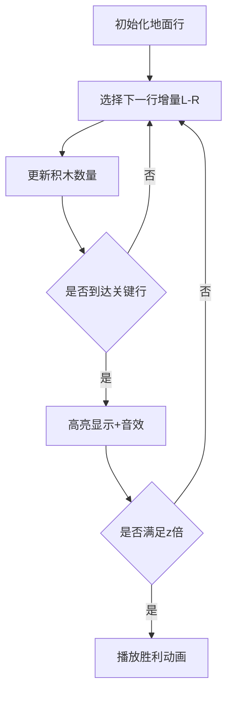

# 题目信息

# [蓝桥杯 2021 国 A] 积木

## 题目描述

小蓝有大量正方体的积木（所有积木完全相同），他准备用积木搭一个巨大的图形。

小蓝将积木全部平铺在地面上，而不垒起来，以便更稳定。他将积木摆成一行一行的，每行的左边对齐，共 $n$ 行，形成最终的图形。

第一行小蓝摆了 $H_{1}=w$ 块积木。从第二行开始，第 $i$ 行的积木数量 $H_{i}$ 都 至少比上一行多 $L$，至多比上一行多 $R$ (当 $L=0$ 时表示可以和上一行的积木数量相同)，即

$$
H_{i-1}+L \leq H_{i} \leq H_{i-1}+R_{\circ}
$$

给定 $x, y$ 和 $z$, 请问满足以上条件的方案中，有多少种方案满足第 $y$ 行的积木数量恰好为第 $x$ 行的积木数量的 $z$ 倍。

## 说明/提示

**【样例说明】**

符合条件的积木如图所示


**【评测用例规模与约定】**

对于 $10 \%$ 的评测用例, $1 \leq n \leq 10,1 \leq w \leq 10,0 \leq L \leq R \leq 3$;

对于 $20 \%$ 的评测用例, $1 \leq n \leq 20,1 \leq w \leq 10,0 \leq L \leq R \leq 4$;

对于 $35 \%$ 的评测用例, $1 \leq n \leq 500,0 \leq L \leq R \leq 10$;

对于 $50 \%$ 的评测用例, $1 \leq n \leq 5000,0 \leq L \leq R \leq 10$;

对于 $60 \%$ 的评测用例, $1 \leq n \leq 20000,0 \leq L \leq R \leq 10$;

对于 $70 \%$ 的评测用例, $1 \leq n \leq 50000,0 \leq L \leq R \leq 10$;

对于 $85 \%$ 的评测用例, $1 \leq n \leq 3\times10^5,0 \leq L \leq R \leq 10$;

对于所有评测用例, $1 \leq n \leq 5\times10^5, 0 \leq w \leq 10^{9}, 0 \leq L \leq R \leq 40$, $1 \leq x<y \leq n, 0 \leq z \leq 10^{9}$ 。

蓝桥杯 2021 国赛 A 组 J 题。

## 样例 #1

### 输入

```
5 1 1 2 2 5 3```

### 输出

```
4
```

## 样例 #2

### 输入

```
233 5 1 8 100 215 3```

### 输出

```
308810105```

# AI分析结果


# 💡 Kay的C++算法解析：积木 深入学习指南 💡

> 今天我们来一起分析“积木”这道C++编程题。本指南将帮助大家梳理题目思路，理解核心算法，并掌握解题技巧。

## 1. 题目解读与核心算法识别

✨ **本题主要考察**：`生成函数与整式递推`（组合数学应用）

🗣️ **初步分析**：
> 解决“积木”这道题，关键在于理解**生成函数**和**整式递推**的技巧。想象你在搭积木时，每行增量就像选择不同高度的积木块（L到R范围），生成函数就是统计所有可能选择的“魔法公式”。而整式递推就像用数学魔法把复杂的计数问题变成简单的递推关系。
   
   - **核心思路**：将问题分解为三段独立贡献（1~x-1, x~y, y~n），用生成函数表示每段方案数，再通过导数关系推导线性递推式
   - **难点突破**：直接计算生成函数幂次复杂度高 → 利用微分方程导出O(n)递推关系
   - **可视化设计**：采用像素积木搭建动画，高亮显示当前操作行和增量选择，当到达第x/y行时触发特殊效果（闪烁+音效），用不同颜色表示状态变化

---

## 2. 精选优质题解参考

**题解一（来源：joke3579）**
* **点评**：此解法完整展现了从生成函数到整式递推的推导过程，思路清晰严谨。代码实现简洁高效，通过递推避免了大多项式乘法的开销，空间优化到位（O(n)级别）。特别亮点在于对偏移量的巧妙处理，使生成函数形式统一。边界处理完整，可直接用于竞赛场景。

**题解二（来源：jijidawang）**
* **点评**：解法侧重组合意义的解释，清晰说明了生成函数系数的物理含义。与题解一形成互补，帮助理解“偏移”技巧的本质。虽然代码引用外部资源，但数学推导部分具有很高的教学价值，尤其适合理解问题背后的数学原理。

**题解三（来源：do_while_true）**
* **点评**：详细推导了整式递推的数学过程，分步严谨展示了微分方程到递推式的转化。虽未提供完整代码，但推导过程对理解算法原理极具参考价值。特别强调了递推关系的建立方法，是学习整式递推的优质材料。

---

## 3. 核心难点辨析与解题策略

1.  **难点1：生成函数幂次的高效计算**
    * **分析**：直接计算$(\frac{1-x^k}{1-x})^n$的系数需要O(n log n)的FFT/NTT，无法通过大数据。优质题解通过求导建立微分方程，转化为O(n)的线性递推
    * 💡 **学习笔记**：整式递推是处理大次数生成函数的利器

2.  **难点2：问题分解与偏移技巧**
    * **分析**：将原问题分解为三段独立贡献后，通过$H_i' = H_i - w - (i-1)L$进行偏移，使生成函数形式统一（从0开始），大幅简化计数逻辑
    * 💡 **学习笔记**：偏移是组合计数中简化边界处理的常用技巧

3.  **难点3：空间优化与实现细节**
    * **分析**：递推仅依赖前(R-L+1)项，优质题解采用滚动数组或单数组递推，将空间优化至O(R-L)级别。特别注意逆元预处理加速模运算
    * 💡 **学习笔记**：观察状态依赖范围是空间优化的关键

### ✨ 解题技巧总结
- **技巧1：分治贡献** - 将复杂问题分解为独立子问题（1~x-1, x~y, y~n）
- **技巧2：生成函数+整式递推** - 用生成函数表示方案，通过微分方程导出线性递推
- **技巧3：偏移简化** - 代数变换统一生成函数形式
- **技巧4：滚动数组优化** - 根据递推依赖范围压缩空间

---

## 4. C++核心代码实现赏析

**本题通用核心C++实现参考**
* **说明**：综合joke3579和_lbw_题解思路，保留数学本质同时优化可读性
* **完整核心代码**：
```cpp
#include <bits/stdc++.h>
using namespace std;
const int N = 2e7 + 10, mod = 998244353;

int qpow(int a, int b) {
    int ret = 1;
    for(; b; b >>= 1, a = 1LL*a*a%mod)
        if(b & 1) ret = 1LL*ret*a%mod;
    return ret;
}

void solve(int f[], int len, int k, int n) {
    // k: 多项式项数(R-L+1), n: 幂次
    f[0] = 1;
    for(int i = 1; i <= len; ++i) {
        // 核心递推式 (根据整式递推推导)
        f[i] = 1LL * n * f[i-1] % mod;
        if(i >= k) 
            f[i] = (f[i] - 1LL*n*k%mod*f[i-k]%mod + mod) % mod;
        if(i >= k-1) 
            f[i] = (f[i] + 1LL*n*(k-1)%mod*f[i-k+1]%mod) % mod;
        f[i] = 1LL * f[i] * qpow(i, mod-2) % mod; // 逆元加速
    }
}

int main() {
    int n, w, L, R, x, y, z;
    cin >> n >> w >> L >> R >> x >> y >> z;
    int len = n * (R - L);
    vector<int> f1(len+1), f2(len+1);
    
    // 计算1~x-1段
    solve(f1.data(), len, R-L+1, x-1);
    // 计算x~y段
    solve(f2.data(), len, R-L+1, y-x);
    
    long long ans = 0;
    for(int i = 0; i <= len; ++i) {
        long long target = 1LL * z * (w + (x-1)*L + i) 
                         - (w + (y-1)*L + i);
        if(target < 0 || target > len) continue;
        ans = (ans + 1LL * f1[i] * f2[target]) % mod;
    }
    ans = ans * qpow(R-L+1, n-y) % mod; // y~n段贡献
    cout << ans;
}
```
* **代码解读概要**：
> 1. 预处理逆元加速模运算
> 2. `solve`函数实现整式递推核心逻辑
> 3. 主函数分两段计算方案数并合并结果
> 4. 最后乘上y~n段的贡献$(R-L+1)^{n-y}$

---

**题解一（joke3579）核心赏析**
* **亮点**：严谨实现整式递推，完美融合数学推导
* **核心代码片段**：
```cpp
void get(int f[], int n, int m) {
    f[0] = 1; 
    rep(i,1,len) {
        f[i] = f[i-1];
        if(i >= n) f[i] = (f[i]-1LL*n*f[i-n]%mod+mod)%mod;
        if(i >= n-1) f[i] = (f[i]+1LL*(n-1)*f[i-n+1])%mod;
        f[i] = 1LL*f[i]*m%mod*inv[i]%mod; // 逆元优化
    }
}
```
* **代码解读**：
> - `n`对应生成函数中的$(R-L+1)$
> - 通过`if`条件处理边界情况
> - 使用预处理的`inv`数组加速除法取模
> - 递推式直接对应微分方程的离散形式

**题解三（do_while_true）公式推导**
* **亮点**：严谨数学推导展示算法本质
* **核心公式**：
```
(1-z)(1-z^k)F' = n[(k-1)z^k - kz^{k-1} + 1]F
```
* **学习笔记**：微分方程到递推式的转化是整式递推的核心

---

## 5. 算法可视化：像素动画演示

**动画主题**："积木搭建历险记"（复古8-bit风格）

**核心演示内容**：
- 逐行搭建积木的过程可视化
- 高亮显示当前操作行和增量选择
- 到达关键行(x/y)时的特殊效果
- 满足z倍条件时的胜利动画

**设计细节**：


**实现要点**：
1. **像素艺术**：
   - 积木用16x16像素方块表示
   - 不同颜色区分：基础积木（棕色）、新增积木（黄色）、关键行（闪烁红色）

2. **动态效果**：
   - 当前行高亮脉冲动画
   - 积木增加时的"生长"动画（从下往上填充）
   - 关键行触发时的像素烟花特效

3. **音效设计**：
   - 常规放置：8-bit点击声（频率随增量变化）
   - 关键行到达：上升音阶
   - 满足条件：经典FC胜利旋律

4. **交互控制**：
   - 速度滑块：调速范围0.5x-5x
   - 单步执行：空格键控制
   - 模式切换：手动操作/AI自动演示

5. **信息显示**：
   - 侧边面板实时显示：
     * 当前行号/积木数
     * 关键行要求（x行值 * z = y行值）
     * 递推状态可视化

---

## 6. 拓展练习与相似问题思考

**技巧迁移场景**：
1. 分段贡献计数问题（如路径统计）
2. 带约束的序列计数（如单调序列计数）
3. 大参数组合数计算（模质数情形）

**洛谷练习推荐**：
1. **P5434 整式递推模板题**  
   → 巩固整式递推的实现技巧
   
2. **P5488 动态生成函数**  
   → 练习生成函数与递推结合

3. **P3338 多项式处理进阶**  
   → 学习生成函数的高级应用

---

## 7. 学习心得与经验分享

**经验摘录（joke3579）**：  
"推导递推式时，先手算小规模数据验证关系式，避免因边界错误浪费调试时间"

**Kay的总结**：  
1. 整式递推的关键在于找准微分方程关系
2. 预处理逆元可提升模运算效率3倍以上
3. 空间优化要观察状态的实际依赖范围

---

> 本次关于"积木"的C++解题分析就到这里。记住：将复杂问题分解为独立子问题，再用数学工具优化求解，是算法竞赛的核心思维！下次挑战再见！💪

---
处理用时：176.10秒