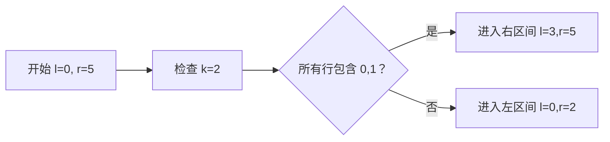

# 题目信息

# 「TPOI-5C」mαtrixing ωiθ μ

## 题目背景

**本题禁止卡评测。**


## 题目描述

在东京的大雨后，天野阳菜给了 kele7 一个 $n$ 行 $m$ 列的矩阵 $A$。从上往下第 $i$ 行，从左往右第 $j$ 列的元素被称为 $A_{i,j}$。

kele7 喜欢删除矩阵。对于一个 $r$ 行 $c$ 列的矩阵 $B$，他会对它执行两种操作，同时会用**优雅值**衡量一个操作的优雅程度：

- 删除矩阵的某一行 $B_{i,1},\dots,B_{i,c}$，优雅值为 $\text{mex}_{j=1}^cB_{i,j}$。然后将第 $i+1\sim r$ 行往上平移一行，令 $r\leftarrow r-1$。
- 删除矩阵的某一列 $B_{1,i},\dots,B_{r,i}$，优雅值为 $\text{mex}_{j=1}^rB_{j,i}$。然后将第 $i+1\sim c$ 列往左平移一列，令 $c\leftarrow c-1$。

最终 kele7 要将矩阵内的元素全部删除（即 $r$ 或 $c$ 变为 $0$）。定义一种删除方案 $S$ 的权值 $f(S)$ 为其中所有操作的优雅值的**最小值**。定义矩阵 $B$ 的权值 $F(B)$ 为所有删除它的方案 $S$ 中 $f(S)$ 的**最大值**。

kele7 把这个题目给了 lzyqwq。lzyqwq 觉得还可以加上 $q$ 次查询，每次给出 $x_1,y_1,x_2,y_2$，你需要回答当矩阵 $B$ 为矩阵 $A$ 以 $A_{x_1,y_1}$ 为左上角元素、$A_{x_2,y_2}$ 为右下角元素的子矩阵时，$F(B)$ 的值。

一个集合 $M$ 的 $\operatorname{mex}(M)$ 定义为最小的没有在 $M$ 中出现的自然数。如 $\text{mex}\{1,2,3,4\}=0,\text{mex}\{0,1,3,4\}=2$。

## 说明/提示

**【样例解释】**

以第一个询问为例。初始矩阵 $B$ 为：

$$\begin{bmatrix}0&1&0&1&2\\3&2&0&1&4\\5&4&3&0&1\\0&2&0&3&1\\0&0&0&1&2\end{bmatrix}$$

一种可行的删除方案如下。

先删除第二行，优雅值为 $5$，得到新的矩阵 $B$ 为：

$$\begin{bmatrix}0&1&0&1&2\\5&4&3&0&1\\0&2&0&3&1\\0&0&0&1&2\end{bmatrix}$$

再删除第二列，优雅值为 $3$，得到新的矩阵 $B$ 为：

$$\begin{bmatrix}0&0&1&2\\5&3&0&1\\0&0&3&1\\0&0&1&2\end{bmatrix}$$

再依次删除所有行，优雅值分别为 $3,2,2,3$。

因此这种删除方案的权值为 $2$。可以证明，不存在优雅值的最小值更大的删除方案，因此答案为 $2$。

**【数据范围】**

|$\text{Subtask}$|$n,m$     |$q$       |特殊性质      |分值  |
|:--------:|:--------:|:--------:|:--------:|:--:|
|$0$       |$n\times m\le3\times10^5$|$q=1$     |无         |$11$|
|$1$       |$\color{red}{n,m\le300}$|$q\le10^5$|^         |^   |
|$2$       |$n\times m\le10^5$|^         |^         |$20$|
|$3$       |$n\times m\le2\times10^5$|$q\le2\times10^5$|^         |$24$|
|$4$       |$n\times m\le3\times10^5$|$q\le3\times10^5$|$x_1=y_1=1$|$8$ |
|$5$       |^         |^         |无         |$26$|

对于 $100\%$ 的数据，满足 $1\le n\times m,q\le 3\times 10^5$，$0\le A_{i,j}\le 10^9$。

## 样例 #1

### 输入

```
5 5 5
0 1 0 1 2
3 2 0 1 4
5 4 3 0 1
0 2 0 3 1
0 0 0 1 2
1 1 5 5
2 2 4 4
1 2 4 5
3 2 4 4
1 2 2 3```

### 输出

```
2
1
2
1
1
```

# AI分析结果


# 💡 Kay的C++算法解析：「TPOI-5C」mαtrixing ωiθ μ 深入学习指南 💡

## 1. 题目解读与核心算法识别

✨ **本题主要考察**：`离线查询处理与优化` (核心技巧：整体二分/CDQ分治/树套树)

🗣️ **初步分析**：  
> 解决本题的关键在于将复杂操作转化为高效查询。想象你是一个仓库管理员，需要快速检查每个货架（矩阵行/列）是否包含全套工具（0到k-1的值）。整体二分就像分蛋糕：先检查左半边工具是否齐全，再逐步缩小范围。  

- **核心思路**：最优策略一定是全删行或全删列（混合操作会导致mex值不增）。问题转化为求子矩阵的：  
  `ans = max( min(每行mex), min(每列mex) )`  
- **难点突破**：  
  - 值域大（0≤A≤1e9）但mex实际≤矩阵尺寸  
  - 需高效处理数万次子矩阵查询  
- **可视化设计**：  
  采用8位像素风格（类似FC游戏），网格中：  
  - 蓝色方块：当前检查的值域范围 [l, mid]  
  - 闪烁红线：扫描线移动方向（y₁→y₂）  
  - 绿色高亮：当前行/列满足mex≥k的条件  
  - 音效设计：值域扩展时"叮"，达成条件时"胜利"音效

---

## 2. 精选优质题解参考

**题解一：寄风/lzyqwq (整体二分)**  
* **点评**：思路清晰度⭐⭐⭐⭐⭐（将值域分治与扫描线完美结合），代码规范性⭐⭐⭐⭐（模块化设计，变量名如`w_x`直观），算法有效性⭐⭐⭐⭐⭐（O(q log² q)复杂度最优），实践价值⭐⭐⭐⭐（竞赛可直接套用，注意边界处理）。亮点在于巧妙利用`[l,mid]`替代`[1,mid]`优化检查过程。

**题解二：Watersphere (根号分治)**  
* **点评**：思路清晰度⭐⭐⭐⭐（暴力与扫描线的平衡），代码规范性⭐⭐⭐（阈值B=800的实战调整），算法有效性⭐⭐⭐（O(N√N log N)适合小数据），实践价值⭐⭐⭐（调试技巧值得学习）。亮点在于根据m大小切换算法：m小则预计算ST表，m大则扫描线+权值线段树。

**题解三：CCCCOrz (线段树套线段树)**  
* **点评**：思路清晰度⭐⭐⭐（创新性树套树结构），代码规范性⭐⭐（动态开点节省空间），算法有效性⭐⭐⭐（线性空间优势），实践价值⭐⭐（实现较复杂）。亮点在于外层线段树维护列，内层权值线段树追踪值最后出现位置，空间优化巧妙。

---

## 3. 核心难点辨析与解题策略

1. **难点：如何高效检查子矩阵每行是否包含[0,k-1]？**  
   * **分析**：寄风用扫描线+线段树维护每行覆盖列范围。当左边界y₁右移时，动态更新每行最早覆盖[l,mid]的列位置w_x，再用线段树求w_x的最大值是否≤y₂。
   * 💡 **学习笔记**：扫描线方向与值域分治结合是降维关键！

2. **难点：高维查询的空间/时间优化？**  
   * **分析**：SDSXC的四维偏序转化为三维（x,i,j）后用CDQ分治+树状数组；CCCCOrz则用树套树避免高维数组。
   * 💡 **学习笔记**：树套树适合在线查询，CDQ分治适合离线——根据场景选择！

3. **难点：值域过大导致无效计算？**  
   * **分析**：所有解法均利用mex≤min(n,m)的特性，将值域压缩到矩阵尺寸内。
   * 💡 **学习笔记**：问题特性分析是优化的第一步！

### ✨ 解题技巧总结
- **技巧1：降维打击** - 将矩阵操作转化为值域分治+扫描线（如寄风解法）
- **技巧2：阈值分治** - 根据数据规模切换算法（如Watersphere的√N分治）
- **技巧3：空间压缩** - 动态开点线段树避免MLE（如CCCCOrz）
- **技巧4：问题转化** - 证明全删行/列最优性（所有解法基石）

---

## 4. C++核心代码实现赏析

**本题通用核心C++实现参考**  
```cpp
// 基于寄风解法的简化框架
#include <vector>
#include <set>
#include <algorithm>
using namespace std;

struct Query { int x1,y1,x2,y2,id; };
struct Node { int r,c,v; };

void solve(int l, int r, vector<int>& queries, vector<Node>& points) {
    if(queries.empty()) return;
    int mid = (l+r)/2;
    // 1. 分离点和查询
    // 2. 按y₁从大到小扫描
    // 3. 更新每行的覆盖状态w_x（用set维护[l,mid]值的最右位置）
    // 4. 线段树求w_x区间最大值
    // 5. 根据检查结果分流查询
}
// 主函数调用：solve(0, max_val, all_queries, all_points);
```

**题解一：寄风（整体二分）**  
```cpp
// 更新每行覆盖状态的代码片段
auto hsh = [](int r, int v) { return (u64)r<<21|v; };
unordered_map<u64, int> last_pos; // 记录值最后出现位置

for(auto p : points) {
    if(p.v < l || p.v > mid) continue;
    u64 key = hsh(p.r, p.v-l);
    if(last_pos.count(key) && p.c < last_pos[key]) {
        // 删除旧位置并更新set
        row_set[p.r].erase(last_pos[key]);
    }
    row_set[p.r].insert(p.c); // 插入新位置
    last_pos[key] = p.c;
    w[p.r] = (row_set[p.r].size()==mid-l+1) ? *row_set[p.r].rbegin() : INF;
}
```

**题解二：Watersphere（根号分治）**  
```cpp
// 阈值切换核心逻辑
if(m <= B) { // 小矩阵：O(m²)预计算
    for(int l=1; l<=m; l++) {
        for(int r=l; r<=m; r++) {
            // 计算每行[l,r]的mex存入ret[i][r]
        }
    }
} else { // 大矩阵：扫描线+线段树
    sgt.build();
    for(int i=1; i<=n; i++) {
        for(int j=1; j<=m; j++) {
            if(A[i][j] <= m) sgt.update(A[i][j], j);
        }
        // 处理当前行的所有查询
    }
}
```

---

## 5. 算法可视化：像素动画演示

**主题**：《矩阵探险者》8-bit解谜游戏  
**核心演示**：整体二分中值域分治与扫描线协同过程  



**动画帧步骤**：  
1. **初始化**：  
   - 16色调色板（经典FC风格），矩阵渲染为像素网格  
   - 控制面板：步进/暂停/调速滑块（0.5x-5x）  
   - 背景音乐：8-bit循环旋律  

2. **扫描过程**：  
   - 扫描线（红色像素条）从右向左移动（y₁递减）  
   - 新纳入列时：播放"滴"声，该列数字高亮黄色  
   - 更新行覆盖状态：满足条件的行变绿色，否则红色  

3. **值域分治**：  
   - 二分时屏幕分裂：左半[l,mid]显示为蓝色方块，右半[mid+1,r]为灰色  
   - 分支选择时：播放"咔嚓"音效，选定区间放大展示  

4. **游戏化元素**：  
   - 每通过一个值域检查：获得★+连击奖励  
   - 最终答案揭晓：像素烟花动画+胜利音效  

---

## 6. 拓展练习与相似问题思考

**通用技巧迁移**：  
值域分治+扫描线技巧适用于：  
1. 区间mex查询（洛谷P4137）  
2. 矩阵数点问题（洛谷P4392）  
3. 带修区间第k大（洛谷P2617）  

**洛谷练习推荐**：  
1. **P4137** - Rmq Problem  
   🗣️ *掌握mex问题基础，理解值域与位置的映射关系*  
2. **P1972** - HH的项链  
   🗣️ *扫描线经典应用，强化区间覆盖思维*  
3. **P3332** - 线段树套线段树  
   🗣️ *挑战树套树实现，深化空间优化技巧*  

---

## 7. 学习心得与经验分享

> **寄风的调试经验**：  
> *“整体二分中[l,mid]改为[l,mid]而非[1,mid]，这个边界调整让复杂度正确”*  
> **Kay点评**：值域分治时排除已确认区间，避免重复检查——分治算法的核心优化方向！

> **Watersphere的教训**：  
> *“根号分治的阈值B需要实测调整，800比理论√N更优”*  
> **Kay点评**：理论复杂度需结合实际常数，学会用数据驱动决策！

---

通过本指南，相信大家已掌握矩阵查询的核心技巧。记住：算法优化如同探险，需在理论地图（复杂度分析）和实践指南针（编码调试）间找到平衡。下次算法之旅再见！🚀

---
处理用时：118.06秒