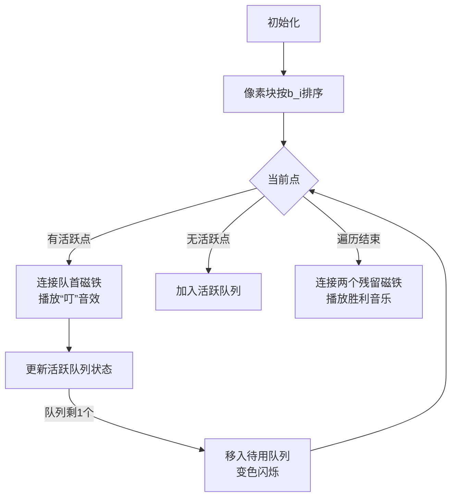

# 题目信息

# 「EZEC-6」造树

## 题目背景

> 成体系的结论会产出“低猜想水平”的机械推导，但更多的题目中需要“高猜想水平”的灵感。

——command_block 《考前小贴士》

[](https://cdn.luogu.com.cn/upload/image_hosting/1m9hce9x.png)无脑选手出思维题。

## 题目描述

你要帮 djy 造一棵树，满足以下条件：

- 由 $n$ 个点组成。

- $i$ 号点的度数为 $a_i$。

定义一条边 $(i,j)$ 的价值为 $b_i\times b_j$，你要在满足上述两个条件下，使所有边的价值和最大。

保证存在这样的树。

## 说明/提示

**本题采用捆绑测试。**

- Subtask0 (10 pts)：$n\le 6$，$type=0$；
- Subtask1 (20 pts)：$n\le 10^3$，$type=0$；
- Subtask2 (10 pts)：$n\le5\times10^5$，$b_i\le2$，$type=0$；
- Subtask3 (20 pts)：$n\le10^5$，$type=0$；
- Subtask4 (20 pts)：$n\le5\times10^5$，$type=0$；
- Subtask5 (20 pts)：$type=1$。

对于 $100\%$ 的数据，$2\le n\le10^7$，$1\le a_i\le n$，$1\le b_i\le5\times10^5$，$type\in\{0,1\}$，$0\le seed<2^{31}$。

## 样例 #1

### 输入

```
0
5
1 2 3 1 1 
5 3 1 7 9```

### 输出

```
42```

## 样例 #2

### 输入

```
1
10
114514```

### 输出

```
249899101316```

# AI分析结果


### 💡 Kay的C++算法解析：「EZEC-6」造树 深入学习指南 💡

#### 1. 题目解读与核心算法识别
✨ **本题主要考察**：贪心算法（排序+队列维护）  
🗣️ **初步分析**：  
> 本题要求构造一棵树，最大化所有边权（b_i × b_j）之和，核心思想是**排序不等式**——让大数尽可能与大数相乘。想象你有不同大小的磁铁（b_i 代表磁力），连接磁力大的磁铁能产生更强吸附力（乘积更大）。贪心策略是：  
> 1. 将点按 b_i **从大到小排序**  
> 2. 维护两个队列：  
>    - **活跃队列（p）**：可继续连边的点（非叶子节点）  
>    - **待用队列（q）**：度数为1的点（叶子节点）  
> 3. 遍历时优先连接活跃队列中的最大磁铁  
>  
> **可视化设计思路**：  
> - 用像素方块表示点，方块大小反映 b_i 值  
> - 连接时高亮两个方块并显示乘积值  
> - 队列区域用不同颜色区分（如红色=活跃队列，蓝色=待用队列）  
> - 复古音效：连接时"叮"声，结束时8-bit胜利音乐  

---

#### 2. 精选优质题解参考
**题解一（zrzring）**  
* **点评**：  
  思路严谨（证明预留度数的必要性），代码用指针高效维护连通块。亮点是桶排序实现 O(n) 复杂度，边界处理完整（如 `last` 指针处理剩余度数）。变量名 `dat[i].d`（度数）和 `dat[i].val`（权值）含义明确，竞赛实用性强。  

**题解二（ChickyHas）**  
* **点评**：  
  代码最简洁优雅（仅40行），双队列思路清晰体现贪心本质。亮点是用 `vector` 模拟队列，`ph/pt` 指针高效维护活跃队列。排序使用 lambda 表达式提升可读性，非常适合初学者理解核心逻辑。  

---

#### 3. 核心难点辨析与解题策略
1. **贪心策略的证明**  
   * **分析**：需证明"大配大"是最优解。反证：若 b₁>b₂>b₃>b₄ 但连接 b₁b₃ 和 b₂b₄，则 b₁b₂+b₃b₄ > b₁b₃+b₂b₄（由 (b₁-b₄)(b₂-b₃)>0 得证）  
   * 💡 **学习笔记**：排序不等式是贪心基础  

2. **度数约束的处理**  
   * **分析**：树需满足 ∑a_i=2n-2。遍历时：  
     - 当前点先与活跃队列连接（消耗其度数）  
     - 剩余度数加入活跃队列  
     - 活跃队列只剩1个元素时移入待用队列  
   * 💡 **学习笔记**：维护连通块时保留至少一个可连边的点  

3. **数据结构的选择**  
   * **分析**：队列（FIFO）最适合动态添加点的场景。数组模拟队列（题解二）比 STL deque（题解一）更高效  
   * 💡 **学习笔记**：数组模拟队列节省内存且访问 O(1)  

##### ✨ 解题技巧总结
- **技巧1：降维处理** - 将树结构转化为边权求和问题  
- **技巧2：双队列维护** - 活跃队列存非叶子节点，待用队列存叶子节点  
- **技巧3：桶排序优化** - 当 b_i 范围较小时（本题 5e5），用计数排序替代快排  

---

#### 4. C++核心代码实现赏析
**通用核心实现（基于题解二优化）**  
```cpp
#include <bits/stdc++.h>
using namespace std;
const int N = 1e7 + 10;
struct Node { int d, w; } a[N];

int main() {
    // 输入处理（略）
    sort(a+1, a+n+1, [](Node x, Node y) { 
        return x.w > y.w;  // 按权值降序
    });

    vector<int> p, q;  // p=活跃队列, q=待用队列
    long long ans = 0;

    for (int i = 1; i <= n; ++i) {
        if (p.empty()) {  // 无活跃点时全加入
            while (a[i].d--) p.push_back(a[i].w);
        } else {
            ans += 1LL * p[0] * a[i].w;  // 与活跃队列首连接
            a[i].d--;                     
            p.erase(p.begin());           // 移除已连点

            while (a[i].d--)              // 剩余度数加入p
                p.push_back(a[i].w);
        }
        if (p.size() == 1) {  // 活跃队列剩1个时移入q
            q.push_back(p[0]);
            p.pop_back();
        }
    }
    ans += 1LL * q[0] * q[1];  // 最后两个叶子连接
    cout << ans;
}
```
**代码解读概要**：  
1. 降序排序后遍历  
2. 优先连接活跃队列（保证大数相乘）  
3. 维护双队列状态转移  
4. 最终连接两个残留叶子节点  

**题解二片段赏析**  
```cpp
sort(a+1, a+1+n, [](A i, A j) { 
    return i.w > j.w;  // 降序排序
});
vector<int> p, q;
for (int i = 1; i <= n; ++i) {
    if (p.empty()) {
        while (a[i].d--) p.push_back(a[i].w);
    } else {
        ans += 1LL * p[0] * a[i].w;
        p.erase(p.begin());
        while (--a[i].d) p.push_back(a[i].w);
    }
    if (p.size() == 1) {
        q.push_back(p[0]); p.pop_back();
    }
}
```
💡 **学习笔记**：  
- `p.erase(p.begin())` 高效移除队首  
- 排序后只需线性遍历一次  

---

#### 5. 算法可视化：像素动画演示
**主题**：磁铁树构造大冒险（8-bit像素风）  
**核心交互设计**：  


**关键帧细节**：  
1. **磁铁表示**：  
   - 每个点：16×16像素块，颜色深浅 = b_i 大小  
   - 活跃队列：红色边框区域，待用队列：蓝色边框  
2. **连接动画**：  
   - 两点间画像素风格闪电，显示 `b_i×b_j=值`  
   - 被连点缩小表示度数减少  
3. **控制面板**：  
   - 速度滑块：调节自动播放速度  
   - 单步按钮：手动触发下一步  
   - 重置：重新初始化磁铁阵列  

---

#### 6. 拓展练习与相似问题思考
1. **洛谷 P3366** - 最小生成树  
   → 练习贪心思想（Kruskal/Prim算法）  
2. **洛谷 P1090** - 合并果子  
   → 练习队列维护和贪心选择  
3. **洛谷 P1339** - 热浪  
   → 练习图论中的路径优化  

---

#### 7. 学习心得与经验分享
> **zrzring 经验**：  
> “预留1度是保证连通性的关键，调试时打印队列状态能快速定位错误”  
>  
> **Kay总结**：  
> 树的性质（∑度数=2n-2）是解题基石，实际编码中建议：  
> 1. 用 `assert(accumulate(d))` 验证度数和  
> 2. 单步调试打印双队列状态  

---  
保持思考，编程如探险！下次见！🚀

---
处理用时：179.39秒