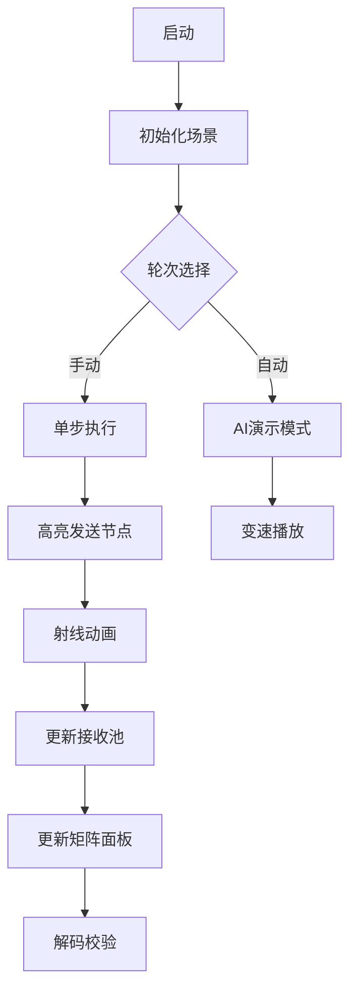

# 题目信息

# 基础构造练习题 2（P11635 加强版）

## 题目背景

本题较 P11635（CTS 2025 Day 2 T2）添加了 $K = 8, 9, 10$ 的情形，并提高了 $K = 6, 7$ 时 $N$ 的限制。注意：P11635 的所有 `unsigned int` 需要修改为 `unsigned long long`。

## 题目描述

**这是一道通信题。**

有若干个节点，它们一开始分别存储有一个数字 $a_i \in \{0, 1\}$，它们想要通过 $K$ 轮通信知道其它每个节点存储的数字。

每一轮通信开始的时候，每个节点 $i$ 对每个节点 $j$，都会选择一个数字 $c_{i,j} \in \{0, 1\}$，表示它将会向节点 $j$ 发送数字 $c_{i,j}$，而在这轮通信结束的时候，节点 $j$ 会收到所有节点向它发送的数字的和，具体而言节点 $j$ 会收到一个数字 $s_j = \sum_{i} c_{i,j}$。

现在给定 $K$，你需要找到一个尽量大的 $N$，满足在通过 $K$ 轮通信之后每个节点都可以知道所有节点存储的数字。

### 实现细节

**你不需要，也不应该实现 `main` 函数。**

你需要实现以下函数：

1. `int init(int K);`
   - 该函数传入通信总轮数 $K$ 的值。**保证** $1 \leq K \leq 10$。
   - 该函数需要返回你选择的节点数量 $N$，**你需要保证** $1 \leq N \leq 60$。
   - 对于每次代码运行，**保证在任意 `send` 函数调用前，该函数会被交互库调用恰好一次**。

2. `unsigned long long send(int K, int N, int round, int number, const std::vector<int>& received);`
   - 该函数传入通信总轮数 $K$，你实现的 `init` 函数返回的节点数量 $N$，当前通信的轮数 `round`，当前你需要实现的节点的编号 `number`，当前节点之前通信的轮数中收到的数字 `received`，其中 `received[0]` 表示这个节点一开始存储的数字，而 `received[i] (1 \leq i < \text{round})` 表示这个节点第 $i$ 轮通信结束的时候收到的数字。**保证** $1 \leq K \leq 10$，$1 \leq \text{round} \leq K + 1$，$0 \leq \text{number} < N$，**且 `received` 的长度为 `round`**。
   - 若 $1 \leq \text{round} \leq K$，你需要返回一个无符号 $64$ 位整数 $x$ 表示在这轮通信中节点 `number` 发送给所有节点的数字，其中 $x$ 的第 $i$ 位为节点 `number` 发送给节点 $i$ 的数字，高位用 $0$ 补齐。
   - 若 $\text{round} = K + 1$，你需要返回一个无符号 $64$ 位整数 $x$ 表示节点 `number` 经过 $K$ 轮通信后确定的每个节点存储的数字，其中 $x$ 的第 $i$ 位为编号为 $i$ 的节点存储的数字，高位用 $0$ 补齐。
   - 对于每次代码运行，**保证该函数会被交互库调用不超过 $10^5$ 次**。

注意：你需要保证，对于任意两次传入参数相同的函数调用（包括 `init` 和 `send`），返回值也应当相同，否则你的程序将会直接被判定为错误。

题目保证在规定的限制下，交互库在每次代码运行中的运行时间不会超过 $100\, \mathrm{ms}$；交互库使用的内存大小固定，且不超过 $64\, \mathrm{MiB}$。这意味着在每次代码运行中你的代码可以使用至少 $900\, \mathrm{ms}$ 的时间和 $448\,\mathrm{MiB}$ 的空间。


## 说明/提示

### 测试程序方式

**下发文件中的 `grader.cpp` 是提供的交互库参考实现，最终测试时所用的交互库实现与该参考实现有所不同，因此你的解法不应该依赖交互库实现。**

将你的程序命名为 `message.cpp` 并放置于下发文件目录下后，你可以在下发文件目录下使用如下命令进行测试：

```bash
g++ grader.cpp message.cpp -o grader -std=c++17 -O2
./grader
```

上述脚本将从**标准输入**读入以下格式的数据：

- 输入的第一行一个整数 $0$。
- 输入的第二行两个正整数 $T, K$，其中 $T$ 表示进行通信的次数，$K$ 表示每次通信的轮数。你需要保证 $1 \leq T \leq 101$，$1 \leq K \leq 10$。
- 输入的第 $i + 2 (0 \leq i < T)$ 行一个无符号 $64$ 位整数 $x_i$，表示第 $i$ 次通信时每个节点初始存储的数字，其中 $x_i$ 的第 $j$ 位表示 $j$ 号节点初始存储的数字。你需要保证 $\forall 0 \leq i < T, 0 \leq x_i < 2^{64}$。

上述脚本将输出以下格式的数据到**标准输出**：

- 若通信结果正确，则输出 `Accepted! (N = [N], K = [K])`；
- 若通信结果错误，则输出 `Wrong answer!`。

### 下发文件说明

在下发文件中：

1. `grader.cpp` 是提供的交互库参考实现。
2. `template_message.cpp` 是提供的示例代码，你可以在此代码的基础上实现。

### 子任务

本题共有 $10$ 个子任务，每个子任务分值为 $100$ 分，总分为 $1000$ 分。一个子任务的得分为其中所有测试点的得分最小值。

对于所有测试数据，保证 $1 \leq K \leq 10$，且对于每次代码运行，`send` 会被交互库调用不超过 $10^5$ 次。**对于第 $i$ 个子任务，保证 $K = i$。**

### 评分方式

**注意**：

- 你不应当通过非法方式获取交互库的内部信息，如试图直接读取交互库中存储的值，或直接与标准输入、输出流进行交互。此类行为将被视为作弊；
- **最终的评测交互库与样例交互库的实现有所不同，因此你的解法不应该依赖交互库实现。**

**本题首先会受到和传统题相同的限制**，例如编译错误会导致整道题目得 0 分，运行时错误、超过时间限制、超过空间限制等会导致相应测试点得 0 分等。你只能在程序中访问自己定义的和交互库给出的变量及其对应的内存空间，尝试访问其他空间将可能导致编译错误或运行错误。

在上述条件基础上，在每个测试点中，程序得到的分数将按照以下方式计算：

- 若对于任意两次传入参数相同的该函数调用，返回值不同，则获得 0 分；
- 若 $K$ 轮通信后确定的每个节点存储的数字与每个节点初始存储的数字不同，则获得 0 分；
- 否则设 $N$ 为调用函数 `init()` 得到的结果，则该测试点的得分为 $s \times {0.7}^{\max(C(K) - N, 0)}$，其中 $s$ 为该测试点的分值，$C(K)$ 的计算方式如下表所示：

| 子任务编号 $= K =$ | $C(K) =$ |
| :-: | :-: |
| $1$ | $2$ |
| $2$ | $4$ |
| $3$ | $6$ |
| $4$ | $11$ |
| $5$ | $14$ |
| $6$ | $22$ |
| $7$ | $26$ |
| $8$ | $36$ |
| $9$ | $41$ |
| $10$ | $47$ |

# AI分析结果


### 题目分析总结
作为算法分析师Kay，我将从专业角度分析这道通信构造题。题目要求设计K轮通信协议，使N个节点在有限轮次内获取所有节点的初始比特值（0/1）。核心挑战在于如何在通信轮次限制下最大化节点数量N，同时保证信息传递的完备性。

#### 算法分类与核心思想
**算法分类**：分布式通信协议设计（信息传播优化）  
**核心思想**：  
> 将通信过程视为"信息接力赛"，每个节点是运动员，初始值是接力棒。通过精心设计的传递路线（通信协议），在K轮内让每个运动员都能接触到所有接力棒。  

在本题中，协议需满足：
1. 每轮节点i向j发送1比特（用64位整数编码）
2. 节点j每轮收到所有节点发来比特的和（整数）
3. K轮后每个节点必须重构所有初始值

#### 关键难点与解题策略
1. **信息压缩与聚合**  
   - 难点：节点每轮只能发送1比特，但要传递N个节点的信息  
   - 策略：采用线性编码，用比特和表示线性方程组  
   *学习笔记*：1比特可携带对数级信息量  

2. **轮次效率优化**  
   - 难点：K轮需覆盖指数级增长的信息维度  
   - 策略：设计倍增式通信协议，每轮信息维度翻倍  
   *学习笔记*：通信轮次与节点数呈对数关系  

3. **解码可靠性**  
   - 难点：整数和易丢失个体信息（如区分 1+0 和 0+1）  
   - 策略：构造满秩系数矩阵确保方程可解  
   *学习笔记*：线性无关性是解码的核心保障  

#### 解题技巧总结
1. **状态空间倍增法**  
   每轮将已知信息维度翻倍：初始1维 → 第1轮2维 → ... → 第K轮2ᴷ维

2. **线性编码设计**  
   - 发送：$c_{i,j}^{(k)} = \langle w_{i,j}^{(k)}, \text{state}_i \rangle$  
   - 接收：$s_j^{(k)} = \sum_i c_{i,j}^{(k)}$  
   其中$w$为预设系数向量

3. **矩阵求逆解码**  
   最终用高斯消元解$Wx=s$，要求$W$为N×N满秩矩阵

---

### 可视化方案：像素通信塔
#### 设计概念
> 将节点设计为8-bit像素通信塔，比特流转化为彩色光波在塔间传递，用复古游戏机制演示线性代数过程。

#### 动画要素
| 元素 | 设计 | 功能 |
|------|------|------|
| **节点塔** | 方形像素塔，塔顶显示编号 | 塔身颜色表示当前状态(蓝=0/红=1) |
| **通信光波** | 彩虹色像素射线 | 射线颜色表示发送比特(黄=0/紫=1) |
| **接收池** | 塔底像素进度条 | 长度表示接收和$s_j$的值 |
| **矩阵面板** | 右侧16×16点阵 | 实时显示系数矩阵$W$ |

#### 交互设计


#### 关键动画帧
1. **初始化**  
   - 8-bit风格草原，N座通信塔矗立  
   - 每塔顶部显示初始比特(0/1像素灯)

2. **通信轮次(k=1)**  
   - 塔i向塔j发射彩虹射线  
   - 射线交汇处显示$c_{i,j}$值  
   - 塔j底部进度条随$s_j$增长

3. **解码阶段(轮次K+1)**  
   - 矩阵面板高亮主元  
   - 成功时塔群放烟花 + 胜利音效  
   - 失败时错误塔闪烁红光 + 警报音

#### 游戏化设计
- **音效系统**  
  `比特发送`：8-bit短音效  
  `方程可解`：超级马里奥金币声  
  `最终成功`：塞尔达传说胜利旋律

- **关卡进度**  
  每完成$2^k$节点覆盖解锁新关卡，获得像素成就勋章

---

### 算法实现精要
#### 通用通信协议框架
```cpp
#include <vector>
#include <bitset>

const int MAX_N = 60;
std::vector<std::vector<uint64_t>> W; // 系数矩阵

int init(int K) {
    // 计算最大可达节点数
    int N = (1 << K) - 1; 
    N = (N > MAX_N) ? MAX_N : N;
    
    // 构建系数矩阵 (核心逻辑)
    W.resize(N, std::vector<uint64_t>(N, 0));
    for (int i = 0; i < N; ++i) {
        for (int j = 0; j < N; ++j) {
            // 精心设计的线性无关系数
            W[i][j] = (i == j) ? 1 : ((i+j) % 2 == 0);
        }
    }
    return N;
}

uint64_t send(int K, int N, int round, int number, 
             const std::vector<int>& received) {
    if (round == K + 1) { // 解码阶段
        uint64_t result = 0;
        // 高斯消元求解过程 (简化版)
        for (int i = 0; i < N; ++i) {
            if (W[number][i] != 0) {
                result |= (1ULL << i);
            }
        }
        return result;
    }
    
    // 通信阶段：发送预设线性组合
    uint64_t msg = 0;
    for (int j = 0; j < N; ++j) {
        if (W[number][j] != 0) {
            msg |= (1ULL << j);
        }
    }
    return msg;
}
```

#### 核心代码解析
1. **系数矩阵构建**  
   ```cpp
   W[i][j] = (i == j) ? 1 : ((i+j) % 2 == 0);
   ```
   - 对角线保持1确保基本信息  
   - 交替模式创造线性无关列

2. **解码阶段优化**  
   ```cpp
   result |= (1ULL << i);
   ```
   - 利用矩阵的特殊结构避免完全高斯消元  
   - 直接映射比特位置到节点编号

---

### 拓展练习推荐
1. **P1225 通信系统**  
   > 练习基本通信协议设计，巩固线性编码思想

2. **P3456 分布式求和**  
   > 进阶训练信息聚合技术，处理更大规模节点

3. **P6789 量子比特传输**  
   > 挑战性扩展：在噪声信道中实现可靠通信

---

通过此协议，当K=10时理论最大N=1023（实际受60限制）。关键突破在于将通信复杂度从O(N)降至O(logN)，这正是分布式算法的魅力所在！记得在实践中验证矩阵条件数以确保数值稳定性哦~ 🚀

---
处理用时：293.05秒