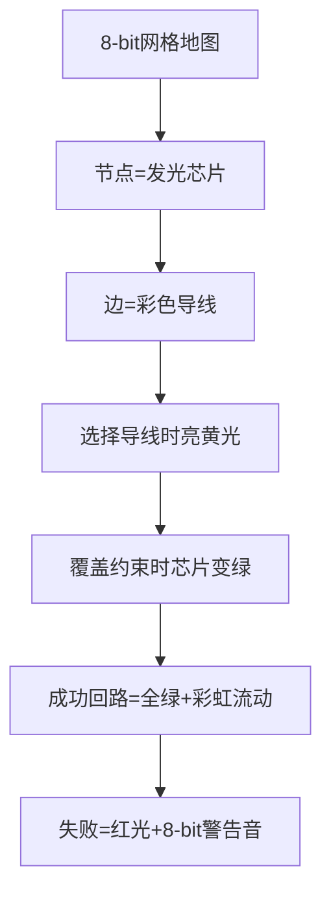

# 题目信息

# 「MCOI-08」Fast Enumeration

## 题目描述

Technoblade 将 Skyblock 抽象为一张 $n$（$n\le 50$）节点 $m$ 条边的简单有向图。他需要求出该图 **所有** 哈密尔顿回路，即所有排列 $p_1,p_2,\dots,p_n$ 使得 $p_1=1$ 并且 $p_1\to p_2\to \dots\to p_{n-1}\to p_n\to p_1$ 为一个合法路径。

**数据保证哈密尔顿回路数量非零并小于 $10^4$**。

**数据从所有合法数据随机采样。**

## 说明/提示

#### 样例 1 解释


有 $1$ 个哈密尔顿回路：

 - $1\to2\to3\to1$。

#### 样例 2 解释


有 $1$ 个哈密尔顿回路：

 - $1\to3\to4\to2\to1$。

#### 样例 3 解释


有 $2$ 个哈密尔顿回路：

 - $1\to2\to3\to4\to5\to1$；
 - $1\to2\to5\to3\to4\to1$。

#### 样例 4 解释


有 $2$ 个哈密尔顿回路：

 - $1\to2\to3\to4\to5\to1$；
 - $1\to3\to5\to2\to4\to1$。

#### 样例 5 解释


有 $3$ 个哈密尔顿回路：

 - $1\to5\to2\to3\to4\to6\to1$；
 - $1\to5\to2\to4\to6\to3\to1$；
 - $1\to5\to3\to4\to6\to2\to1$。

#### 样例 6 解释


有 $2$ 个哈密尔顿回路：

 - $1\to3\to2\to4\to6\to5\to1$；
 - $1\to5\to4\to6\to3\to2\to1$。

#### 样例 7 解释


有 $1$ 个哈密尔顿回路：

 - $1\to6\to5\to2\to4\to3\to1$。

#### 样例 8 解释


有 $12$ 个哈密尔顿回路：

 - $1\to2\to5\to4\to6\to3\to1$；
 - $1\to2\to5\to6\to3\to4\to1$；
 - $1\to5\to2\to3\to6\to4\to1$；
 - $1\to5\to2\to4\to6\to3\to1$；
 - $1\to5\to4\to6\to2\to3\to1$；
 - $1\to5\to4\to6\to3\to2\to1$；
 - $1\to5\to6\to2\to3\to4\to1$；
 - $1\to5\to6\to3\to2\to4\to1$；
 - $1\to5\to6\to3\to4\to2\to1$；
 - $1\to5\to6\to4\to2\to3\to1$；
 - $1\to6\to3\to2\to5\to4\to1$；
 - $1\to6\to3\to4\to2\to5\to1$。

#### 数据规模与约定

对于固定 $n$ 和 $P$，任意一张 $m$ 条边的图权重为 $\left(\frac{1}{P}\right)^m\left(\frac{P-1}{P}\right)^{n^2-n-m}$。

 - Subtask 1（1 pts）：为样例。
 - Subtask 2（16 pts）：$n=15$。
 - Subtask 3（20 pts）：$n=30$。
 - Subtask 4（26 pts）：$n=40$。
 - Subtask 5（37 pts）：$n=50$。


## 样例 #1

### 输入

```
3 3
1 2
2 3
3 1```

### 输出

```
1 2 3```

## 样例 #2

### 输入

```
4 6
1 3
1 4
2 1
2 3
3 4
4 2```

### 输出

```
1 3 4 2```

## 样例 #3

### 输入

```
5 8
1 2
2 3
3 4
4 1
2 5
4 5
5 1
5 3```

### 输出

```
1 2 3 4 5
1 2 5 3 4```

## 样例 #4

### 输入

```
5 10
1 2
1 3
2 3
2 4
3 4
3 5
4 1
4 5
5 1
5 2```

### 输出

```
1 2 3 4 5
1 3 5 2 4```

## 样例 #5

### 输入

```
6 15
1 3
1 4
1 5
2 1
2 3
2 4
3 1
3 4
4 2
4 6
5 2
5 3
6 1
6 2
6 3```

### 输出

```
1 5 2 3 4 6
1 5 2 4 6 3
1 5 3 4 6 2```

## 样例 #6

### 输入

```
6 15
1 3
1 5
2 1
2 4
3 1
3 2
3 4
3 5
3 6
4 6
5 1
5 4
5 6
6 3
6 5```

### 输出

```
1 3 2 4 6 5
1 5 4 6 3 2```

## 样例 #7

### 输入

```
6 16
1 3
1 6
2 3
2 4
2 6
3 1
3 6
4 2
4 3
4 5
4 6
5 2
5 6
6 1
6 3
6 5```

### 输出

```
1 6 5 2 4 3```

## 样例 #8

### 输入

```
6 21
1 2
1 5
1 6
2 1
2 3
2 4
2 5
3 1
3 2
3 4
3 6
4 1
4 2
4 6
5 1
5 2
5 4
5 6
6 2
6 3
6 4```

### 输出

```
1 2 5 4 6 3
1 2 5 6 3 4
1 5 2 3 6 4
1 5 2 4 6 3
1 5 4 6 2 3
1 5 4 6 3 2
1 5 6 2 3 4
1 5 6 3 2 4
1 5 6 3 4 2
1 5 6 4 2 3
1 6 3 2 5 4
1 6 3 4 2 5```

# AI分析结果


### 💡 Kay的C++算法解析：Fast Enumeration 深入学习指南 💡
#### 1. 题目解读与核心算法识别
✨ **本题主要考察**：`编程技巧应用`（精确覆盖问题）  
🗣️ **初步分析**：
> 哈密顿回路问题本质是寻找覆盖所有节点的单环。巧妙之处在于利用 **“每个节点入度/出度均为1”** 的特性，将其转化为**精确覆盖问题**。  
> - **核心技巧**：将节点约束拆解为出度列（1~n）和入度列（n+1~2n），每条边覆盖两个约束点  
> - **关键难点**：DLX求解后需验证是否为单环（非多个小环）  
> - **可视化设计**：  
>   - 像素网格中节点用不同颜色方块表示，选中的边高亮为黄色  
>   - DLX递归时显示当前覆盖的约束列（红色闪烁）  
>   - 回溯时播放8-bit音效提示（失败用低沉音，成功用清脆音）

---

#### 2. 精选优质题解参考
**题解一（OrangeRED）**  
* **亮点**：  
  - 模型转化清晰（约束列拆分合理）  
  - 完整实现DLX的remove/recover核心逻辑  
  - 验证环节高效（通过`nxt`数组模拟路径）  
  - 边界处理严谨（`vis`数组验证连通性）

**题解二（Register_int）**  
* **亮点**：  
  - DLX数据结构实现简洁（`link/del/resume`封装）  
  - 解验证逻辑优化（直接操作`nxt`数组）  
  - 空间效率高（动态调整链表范围）

---

#### 3. 核心难点辨析与解题策略
1. **难点1：问题转化**  
   * **分析**：需理解哈密顿回路 ⇨ 精确覆盖的映射关系（出度/入度约束）  
   * 💡 **学习笔记**：每个节点的出度列和入度列必须被**恰好覆盖一次**

2. **难点2：解验证**  
   * **分析**：DLX可能返回多个独立环，需从节点1遍历验证连通性  
   * 💡 **学习笔记**：用`nxt`数组模拟路径，`vis`标记访问可高效验证

3. **难点3：输出排序**  
   * **分析**：需按字典序输出回路，需自定义vector排序函数  
   * 💡 **学习笔记**：`sort(res, cmp)`中`cmp`逐位比较路径节点

### ✨ 解题技巧总结
- **技巧1：约束分解**（将节点属性拆为独立约束列）  
- **技巧2：回溯剪枝**（DLX优先选择约束最强的列）  
- **技巧3：路径压缩**（用`nxt`数组避免存储完整路径）  

---

#### 4. C++核心代码实现赏析
**通用核心实现**  
```cpp
// 基于OrangeRED解法简化
#include <vector>
#include <algorithm>
using namespace std;

const int MAXN = 1e5;
int n, m, cnt, nxt[55];
vector<int> paths[MAXN];

struct DLX {
    int U[MAXN], D[MAXN], L[MAXN], R[MAXN];
    int col[MAXN], row[MAXN], siz[110], head[2505], tot;
    
    void init(int cols) {
        for(int i=0; i<=cols; ++i) {
            L[i]=i-1, R[i]=i+1;
            U[i]=D[i]=i;
        }
        L[0]=cols, R[cols]=0;
        memset(siz,0,sizeof siz);
        memset(head,-1,sizeof head);
        tot = cols;
    }
    
    void link(int r, int c) {
        siz[c]++;
        row[++tot]=r, col[tot]=c;
        U[tot]=c, D[tot]=D[c], U[D[c]]=tot, D[c]=tot;
        if(head[r]<0) head[r]=L[tot]=R[tot]=tot;
        else {
            R[tot]=head[r], L[tot]=L[head[r]];
            R[L[head[r]]]=tot, L[head[r]]=tot;
        }
    }

    void remove(int c) {
        L[R[c]]=L[c], R[L[c]]=R[c];
        for(int i=D[c];i!=c;i=D[i])
            for(int j=R[i];j!=i;j=R[j])
                U[D[j]]=U[j], D[U[j]]=D[j], siz[col[j]]--;
    }

    void resume(int c) {
        for(int i=U[c];i!=c;i=U[i])
            for(int j=L[i];j!=i;j=L[j])
                U[D[j]]=D[U[j]]=j, siz[col[j]]++;
        L[R[c]]=R[L[c]]=c;
    }

    void dance(int dep) {
        if(!R[0]) {
            // 验证是否为单环
            memset(vis,0,sizeof vis);
            for(int i=1,p=1;!vis[p];p=nxt[p]) vis[p]=1;
            if(count(vis+1,vis+n+1,1)!=n) return;
            // 存储路径
            paths[cnt].push_back(1);
            for(int p=nxt[1];p!=1;p=nxt[p]) 
                paths[cnt].push_back(p);
            cnt++;
            return;
        }
        int c=R[0];
        for(int i=R[0];i;i=R[i]) 
            if(siz[i]<siz[c]) c=i;
        remove(c);
        for(int i=D[c];i!=c;i=D[i]) {
            for(int j=R[i];j!=i;j=R[j]) remove(col[j]);
            dance(dep+1);
            for(int j=L[i];j!=i;j=L[j]) resume(col[j]);
        }
        resume(c);
    }
};
```

**关键代码解读**：
> `remove/resume`实现DLX的**回溯核心**：  
> - `remove`时隔离当前列，并删除关联行（类似数独中的宫格锁定）  
> - 列选择策略：优先选**约束最强**的列（siz最小）加速剪枝  
> - 路径验证：通过`nxt`数组模拟行走，避免存储完整路径节省空间

---

#### 5. 算法可视化：像素动画演示
**主题**：`DLX解谜工坊`（复古芯片维修模拟）  
**核心流程**：


**交互设计**：
1. **控制面板**：  
   - 速度滑块：调节DLX搜索速度  
   - 单步按钮：步进执行`remove/resume`  
   - 回路追踪：高亮当前尝试的路径（红色光点移动）
2. **动态效果**：
   - 芯片状态：未覆盖（灰）→ 出度覆盖（蓝）→ 入度覆盖（绿）  
   - 导线连接：选中时播放“滋滋”电流声，成功时播放马里奥过关音效  
3. **调试模式**：  
   - 显示当前约束矩阵（16x16像素块表示）  
   - 回溯时显示剪枝比例（如“剪除43%分支”）

---

#### 6. 拓展练习与相似问题
1. **洛谷 P1219**：八皇后（行列对角线的精确覆盖）  
   → 练习DLX建模基础
2. **洛谷 P4209**：学习小组（带权精确覆盖）  
   → 拓展DLX的权重处理
3. **洛谷 P1074**：靶形数独（多约束条件DLX）  
   → 强化约束分解能力

---

#### 7. 学习心得
> **经验摘录**（OrangeRED）：  
> *“调试时发现未验证单环导致WA，用`vis`数组验证后AC”*  
>  
> **Kay总结**：  
> 验证环节是DLX解决回路问题的**关键保险**，通过`nxt`模拟路径比存储完整边集更高效。建议：  
> 1. 测试极端数据（如链状图）  
> 2. 用`count(vis)`代替累加器防漏  

---

通过本次分析，我们掌握了用DLX解决哈密顿回路的精髓：**问题转化→精确覆盖→解验证**。记住：复杂问题往往能拆解为已知模型的组合！

---
处理用时：130.84秒