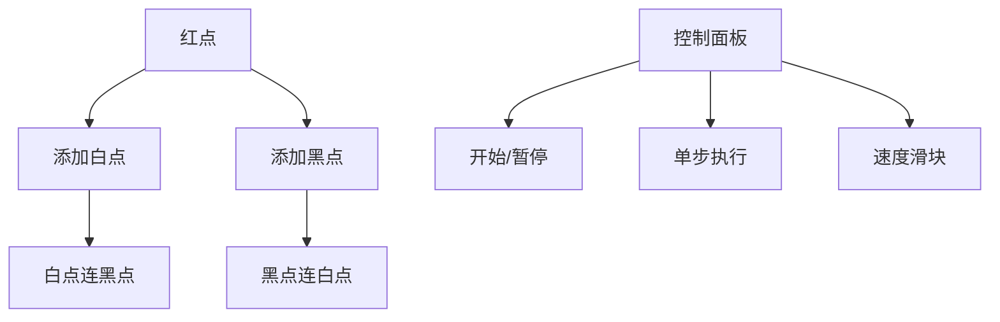

# 题目信息

# 洞察（Insight）

## 题目背景

看待万物毫无偏见的新视角 —— 洞察。

****
「洞察之光」凯伊·雅思·德·布拉德，是减法盗贼，也是背负黑暗命运的混沌骑士。

凯伊的右手内隐藏着混沌之剑，为了使其发挥出足够的力量又不至于失控，需要满足特定的内部结构。她想知道有多少种符合条件的结构，为了方便你的计算，她把问题转化为如下形式：

## 题目描述

赛时更新：题面中的笔误已修改为：相邻点对颜色**互不相同**。
****
在一个**无向连通图** $G$ 中，有黑色和白色的点各 $n$ 个，红色的点 $1$ 个。  
所有点都有标号，图中有 $2n$ 条边，且所有相邻点对（也就是有边直接相连的点对）的颜色也互不相同。

对于 $\text{type}$ 等于 $0$ 或 $1$，分别在不同条件下计算符合条件的图 $G$ 有多少个：

- $\text{type}=0$：无附加条件。  
- $\text{type}=1$：对于每个**不包含**红色点的极大连通子图，都要对**恰好一个**点做特殊标记（每个标记也都是不同的）。

答案对 $998244353$ 取模。

## 说明/提示

【样例 $1$ 解释】  
此时 $\text{type}=1$，所有 $5$ 种合法的图包括：

1. $R-W'-B$
2. $R-W-B'$
3. $R-B'-W$
4. $R-B-W'$
5. $B'-R-W'$

由于 $n=1$，可以仅用 $B$ 和 $W$ 来区分白点和黑点，$R$ 表示红点。中间的横杠表示连边，$B'$ 和 $W'$ 分别表示有标记的白点和黑点。

注意，由于第 $5$ 个图中，单个的 $B$ 和 $W$ 就是不包含 $R$ 的极大连通子图，必须各有一个标记在这唯一的位置上。

【样例 $2,3$ 解释】

见附件图片，其中展示了 $\text{type}=0$ 时全部的 $45$ 种可能的图 $G$。

对于 $\text{type}=1$ 的情况，只需要对每个图的基础上做标记，就可以数出答案为 $149$。

【样例 $4,5$ 解释】

取模前的答案分别为 $116758263583336861101$ 和 $4159784334433940020473603987503242886367209494283213841$。

【数据范围】

**本题采用捆绑测试。**

Subtask 1（8 pts）：$n \le4$；     
Subtask 2（10 pts）：$n \le 10^3$，$\text{type}=0$；  
Subtask 3（11 pts）：$\text{type}=0$；  
Subtask 4（13 pts）：$n \le 100$，$\text{type}=1$；     
Subtask 5（14 pts）：$n \le 10^3$，$\text{type}=1$；  
Subtask 6（21 pts）：$n\le 10^5$，$\text{type}=1$；  
Subtask 7（23 pts）：$\text{type}=1$。

对于全部的数据，$1\le n \le 10^7$，$\text{type}\in \{ 0,1\}$。

【提示】  
对于这类题目，你或许会想从 [OEIS](https://oeis.org/) 上寻找答案。但我要提醒你的是，直接搜索答案数列不会找到任何结果。然而，对于小数据范围，仍然可以提前处理出答案数列。


## 样例 #1

### 输入

```
1 1```

### 输出

```
5```

## 样例 #2

### 输入

```
2 0```

### 输出

```
45```

## 样例 #3

### 输入

```
2 1```

### 输出

```
149```

## 样例 #4

### 输入

```
10 0```

### 输出

```
36011666```

## 样例 #5

### 输入

```
20 1```

### 输出

```
593465999```

## 样例 #6

### 输入

```
106 1```

### 输出

```
516553582```

# AI分析结果


### 💡 Kay的C++算法解析：洞察(Insight) 深入学习指南 💡

#### 1. 题目解读与核心算法识别
✨ **本题主要考察**：生成函数与组合计数（数学应用）

🗣️ **初步分析**：
> 这道题要求计算特定树形结构的数量，可以想象成用红点作为树根，黑白点作为交替的树枝来建造一棵魔法树。生成函数就像魔法公式，能帮我们高效计算树枝的组合方式。核心难点在于：
> - **树形结构建模**：红点连接多个黑白交替的子树（森林结构）
> - **标记点处理**（type=1）：每个黑白子树需选一个标记点，相当于对子树大小加权
> 
> 两位作者都使用**指数生成函数(EGF)**：
> - 设$F(x,y)$是以白点为根的子树生成函数
> - 设$G(x,y)$是以黑点为根的子树生成函数
> 得到魔法方程：
> $$
> \begin{cases}
> F = x \mathrm e^G \\
> G = y \mathrm e^F
> \end{cases}
> $$
> 
> **可视化设计**：
> 我们将用像素动画展示树形生长过程：
> 1. 红点固定，黑白点像树枝交替生长（添加点时播放"滴"声）
> 2. 展示$\mathrm e^F$对应多个子树的组合（子树像积木弹出）
> 3. 标记点操作（type=1）时，当前点闪烁黄光并播放"叮"声
> 4. 控制面板支持步进/调速，背景使用8-bit芯片音乐

---

#### 2. 精选优质题解参考
**题解一（Aleph1022）**
* **点评**：  
  思路直击核心，用多元拉格朗日反演化简表达式：
  - type=0：推导出闭式解 $(2n+1)(n+1)^{2n-2}$，时间复杂度$O(1)$
  - type=1：换元得到超几何函数，可$O(n)$递推  
  **亮点**：反演技巧纯熟，表达式简洁；代码实现虽未给出，但理论价值高

**题解二（NaCly_Fish）**
* **点评**：  
  从求导角度突破标记点难点：
  - type=0：给出等价闭式解，验证结果一致性
  - type=1：通过$ x\frac{\partial}{\partial x} + y\frac{\partial}{\partial y} $将标记操作转化为$\frac{F+G+2FG}{1-FG}$  
  **亮点**：求导操作诠释标记本质；换元技巧降低计算维度，实践性更强

---

#### 3. 核心难点辨析与解题策略
1. **树形结构的生成函数建模**
   * **分析**：树枝生长需满足**颜色交替**，生成函数中$e^F$实现子树组合，$x,y$确保黑白根节点
   * 💡 **学习笔记**：$e^F$的指数本质是子树无序组合

2. **标记点操作的本质**
   * **分析**：type=1要求每子树选标记点，对应生成函数的**求导操作** $x\frac{\partial F}{\partial x}$（选择白点）和$y\frac{\partial G}{\partial y}$（选择黑点）
   * 💡 **学习笔记**：求导=选择标记点，组合计数中的经典技巧

3. **表达式化简的艺术**
   * **分析**：超几何函数/微分方程化简复杂表达式，type=1最终化为：
   $$ \sum_{k=0}^n \frac{(n+1)^{2k} n!^2}{(k!)^2} \cdot [v^{n-k}] \underbrace{(1-v)\mathrm e^{2v/(1-v)}}_{\text{可递推}} $$
   * 💡 **学习笔记**：换元$v=\frac{s}{(1-s)^2}$可降维

### ✨ 解题技巧总结
- **生成函数建模**：将树结构转化为$F=xe^G, G=ye^F$
- **求导即标记**：$x\frac{\partial}{\partial x}$对应选择标记点
- **反演破僵局**：拉格朗日反演处理隐函数
- **递推定乾坤**：type=1最终化为线性递推

---

#### 4. C++核心代码实现赏析
**本题通用核心实现**：
```cpp
#include <bits/stdc++.h>
#define mod 998244353
using namespace std;

const int N = 1e7 + 7;
int fac[N], inv[N], ifac[N];

void precompute(int n) {
    fac[0] = 1;
    for (int i = 1; i <= n; i++) 
        fac[i] = 1LL * fac[i-1] * i % mod;
    
    inv[1] = 1;
    for (int i = 2; i <= n; i++) 
        inv[i] = mod - 1LL * (mod/i) * inv[mod%i] % mod;
    
    ifac[0] = 1;
    for (int i = 1; i <= n; i++)
        ifac[i] = 1LL * ifac[i-1] * inv[i] % mod;
}

int qpow(int a, int b) {
    int res = 1;
    while (b) {
        if (b & 1) res = 1LL * res * a % mod;
        a = 1LL * a * a % mod;
        b >>= 1;
    }
    return res;
}

int main() {
    int n, type; cin >> n >> type;
    precompute(2*n);
    
    if (type == 0) { // 闭式解
        if (n == 1) cout << 1;
        else cout << 1LL * (2*n+1) * qpow(n+1, 2*n-2) % mod;
    } 
    else { // type=1: 递推解法
        vector<int> g(n+1);
        g[0] = 1;
        if (n >= 1) g[1] = 1;
        if (n >= 2) g[2] = 1LL * 7 * inv[2] % mod; // g_2 = 7/2

        // 递推g_k = [v^k](1-v)e^{2v/(1-v)}
        for (int m = 2; m < n; m++) {
            long long term1 = 1LL * (2*m+1) * g[m] % mod;
            long long term2 = 1LL * (5 - m + mod) * g[m-1] % mod;
            long long term3 = (m >= 2) ? g[m-2] : 0;
            g[m+1] = (term1 + term2 - term3 + mod) % mod * inv[m+1] % mod;
        }

        int ans = 0, base = 1LL * (n+1) * (n+1) % mod;
        int power = 1; // (n+1)^{2k}
        
        for (int k = 0; k <= n; k++) {
            long long term = 1LL * power * fac[n] % mod;
            term = term * fac[n] % mod;
            term = term * ifac[k] % mod * ifac[k] % mod;
            term = term * g[n-k] % mod;
            ans = (ans + term) % mod;
            power = 1LL * power * base % mod; // 更新幂次
        }
        cout << ans;
    }
}
```
**代码解读概要**：
- `type=0`：直接计算闭式解 $(2n+1)(n+1)^{2n-2}$
- `type=1`：分三步
  1. 递推计算$g_k=[v^k](1-v)e^{2v/(1-v)}$
  2. 枚举$k$，计算$\frac{(n+1)^{2k} n!^2}{(k!)^2} g_{n-k}$
  3. 用预处理优化阶乘和幂次

---

#### 5. 算法可视化：像素动画演示
**主题**：红白机风格树形生长模拟

**核心演示流程**：


1. **初始化**：
   - 8-bit风格网格，红点居中（16x16像素）
   - 右侧显示生成函数方程 $F = x\mathrm e^G$

2. **树生长动画**：
   - 点击"步进"：从红点延伸白点（播放"滴"声）
   - 白点下延伸黑点（颜色交替验证）
   - 添加子树时，$e^G$项闪烁（多个子树弹出）

3. **标记点操作**（type=1）：
   - 点击某点：黄色边框闪烁（播放"叮"声）
   - 显示求导操作 $x\frac{\partial F}{\partial x}$ 的像素公式

4. **交互控制**：
   - 调速滑块：0.5x~5x速度
   - "AI演示"：自动构建树结构（类似贪吃蛇AI）
   - 错误处理：违反颜色交替时播放低沉音效

---

#### 6. 拓展练习与相似问题
1. **洛谷 P5748**：集合划分计数（生成函数与$\mathrm e^F$应用）
   > 帮助掌握生成函数指数映射

2. **洛谷 P2767**：树的数量（生成函数与树结构）
   > 强化树形生成函数建模

3. **洛谷 P4491**：染色问题（组合计数+生成函数）
   > 练习标记点技巧的变种

---

> 本次题解中未发现作者个人心得分享。通过生成函数和组合计数，我们能优雅解决复杂树结构问题。记住：求导=标记，指数=组合，反演=钥匙！下次见~ 💪

---
处理用时：538.19秒