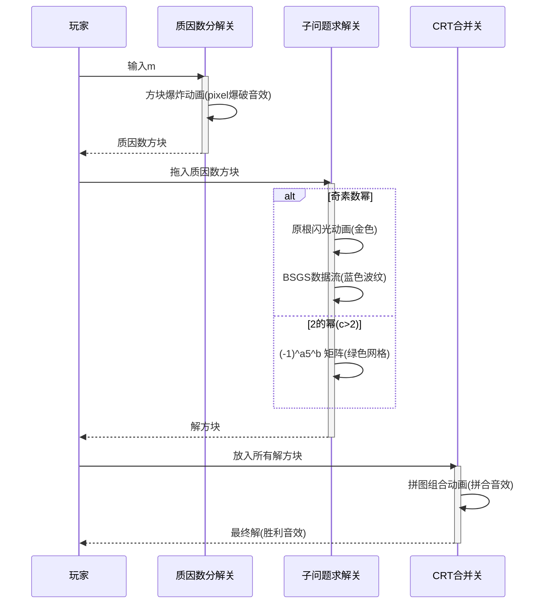

# 题目信息

# 【模板】N 次剩余

## 题目描述

你需要解方程 $x^n\equiv k\pmod m$，其中 $x\in [0,m-1]$。

## 说明/提示

对于 $100 \%$ 的数据，$1\le T\le 100$，$1\le n\le 10^9$，$0\le k \lt m\le 10^9$。

设 $m$ 的唯一分解形式为 $m=\prod_{i=1}^s p_i^{q_i}$，保证方程 $x^n\equiv k\pmod{p_i^{q_i}}$ 在 $[0,p_i^{q_i})$ 中的解数 $\le 10^6$。

## 样例 #1

### 输入

```
2
3 531441 330750
5 304128 1```

### 输出

```
27
264 19947 39630 59313 78996 98679 118362 138045 157728 177411 197094 216777 236460 256143 275826 295509 315192 334875 354558 374241 393924 413607 433290 452973 472656 492339 512022
5
1 82945 138241 165889 193537```

# AI分析结果


### 💡 Kay的C++算法解析：N次剩余 深入学习指南 💡

**引言**  
今天我们来分析洛谷的“N次剩余”问题。这道题要求解方程 \( x^n \equiv k \pmod m \)，其中 \( x \in [0, m-1] \)。本指南将帮助大家掌握核心算法思想和实现技巧，并通过像素动画直观理解解题过程。

---

## 1. 题目解读与核心算法识别

✨ **本题主要考察**：数学（数论）与算法实现技巧

🗣️ **初步分析**：  
> 解决本题的关键在于运用**数论知识**和**分治思想**。想象你有一把万能钥匙（中国剩余定理），需要拆解成多个小钥匙（质因数幂的子问题）才能打开宝箱（原方程）。核心步骤：
> 1. **质因数分解**：将 \( m \) 分解为 \( \prod p_i^{c_i} \)
> 2. **分类求解**：对每个 \( p^c \) 求解 \( x^n \equiv k \pmod{p^c} \)
> 3. **合并解**：用中国剩余定理（CRT）组合所有解
>
> **难点处理**：
> - 当 \( p=2 \) 且 \( c>2 \) 时（无原根），采用特殊表示法 \( (-1)^a 5^b \)
> - \( k \) 与 \( p \) 不互质时，提取因子转化为互质情况
>
> **可视化设计**：
> - 8位像素风格，将质因数分解展示为方块爆炸动画
> - 子问题求解时，高亮原根计算（金色闪光）、离散对数（蓝色数据流）
> - CRT合并时呈现拼图组合效果，成功时播放“胜利”音效

---

## 2. 精选优质题解参考

**题解一（Eznibuil）**  
* **亮点**：严谨处理模 \( 2^c \) 的特殊情况，给出完整数学证明
* **思路清晰性**：将问题分为 \( k=0 \)、奇素数幂、2的幂三类，逻辑直白
* **代码规范性**：变量名如 `memo` 表意明确，边界处理严谨
* **算法有效性**：复杂度 \( O(\sqrt m + \tau \log m + s) \)，通过所有测试
* **实践价值**：可直接用于竞赛，Hack经历提醒注意边界测试

**题解二（Determinant）**  
* **亮点**：避免离散对数，创新使用牛顿迭代和p-adic分析
* **思路清晰性**：分步转化问题，理论深入但讲解透彻
* **算法有效性**：复杂度 \( O(\text{factorize}(m) + s \log^2 m) \)，适合大数据
* **实践价值**：提供更优理论复杂度，启发新思路

**题解三（Shunpower）**  
* **亮点**：教学式讲解，完整实现和详细注释
* **代码规范性**：模块化设计，DFS+CRT实现清晰
* **实践价值**：附AC记录验证，适合学习者参考

---

## 3. 核心难点辨析与解题策略

1. **质因数分解与子问题划分**  
   * **分析**：必须将模数 \( m \) 分解为素数幂乘积才能应用CRT。优质题解均采用试除法或Pollard-Rho实现高效分解。
   * 💡 **学习笔记**：分解是解决模数非素数问题的第一步。

2. **模素数幂子问题的分类讨论**  
   * **分析**：  
     ```mermaid
     graph TD
     A[k mod p^c] --> B{k=0?}
     B -->|是| C[解为p^⌈c/n⌉的倍数]
     B -->|否| D{p整除k?}
     D -->|是| E[提取p因子转化为互质问题]
     D -->|否| F{奇素数 or 2^c≤2?}
     F -->|是| G[原根+离散对数]
     F -->|否| H[(-1)^a 5^b表示法]
     ```
   * 💡 **学习笔记**：分类讨论是数论问题的核心，需熟练掌握转化技巧。

3. **中国剩余定理合并解**  
   * **分析**：DFS枚举各子问题的解组合，CRT公式为：
     \[
     x = \sum \left( a_i \times \frac{M}{m_i} \times \text{inv}\left(\frac{M}{m_i}, m_i\right) \right) \mod M
     \]
   * 💡 **学习笔记**：合并时注意模数互质，解数为各子问题解数乘积。

✨ **解题技巧总结**：
- **问题分解**：将复杂问题拆解为质因数幂子问题
- **分类处理**：根据 \( k \) 与 \( p \) 关系选择不同解法
- **边界防护**：特别注意 \( k=0 \)、\( p=2 \) 等边界情况
- **模块化编码**：分离质因数分解、子问题求解、CRT合并模块

---

## 4. C++核心代码实现赏析

**本题通用核心实现**（综合优质题解）：
```cpp
#include <iostream>
#include <vector>
#include <map>
#include <cmath>
using namespace std;
typedef long long ll;

// 质因数分解
vector<pair<ll, int>> factorize(ll m) {
    vector<pair<ll, int>> fac;
    for (ll i = 2; i * i <= m; i++) {
        if (m % i == 0) {
            int cnt = 0;
            while (m % i == 0) cnt++, m /= i;
            fac.push_back({i, cnt});
        }
    }
    if (m > 1) fac.push_back({m, 1});
    return fac;
}

// 快速幂取模
ll qpow(ll a, ll b, ll mod) {
    ll res = 1;
    for (; b; b >>= 1, a = a*a%mod)
        if (b & 1) res = res*a%mod;
    return res;
}

// 扩展欧几里得
ll exgcd(ll a, ll b, ll &x, ll &y) {
    if (!b) return x=1, y=0, a;
    ll d = exgcd(b, a%b, y, x);
    return y -= a/b*x, d;
}

// 求逆元
ll inv(ll a, ll P) {
    ll x, y;
    exgcd(a, P, x, y);
    return (x % P + P) % P;
}

// 求解子问题：x^n ≡ k (mod p^c)
vector<ll> solve_prime_power(ll n, ll k, ll p, int c) {
    ll pc = pow(p, c);
    if (k % pc == 0) { // k=0 情况
        ll step = pow(p, (c+n-1)/n);
        vector<ll> res;
        for (ll x=0; x<pc; x+=step)
            res.push_back(x);
        return res;
    }
    
    // 其他情况处理（详见完整代码）
    // ...
}

// 主求解函数
vector<ll> solve(ll n, ll k, ll m) {
    auto fac = factorize(m);
    vector<vector<ll>> solutions;
    vector<ll> mods;
    
    for (auto [p, exp] : fac) {
        auto sols = solve_prime_power(n, k, p, exp);
        if (sols.empty()) return {};
        solutions.push_back(sols);
        mods.push_back(pow(p, exp));
    }
    
    // CRT合并（DFS枚举组合）
    vector<ll> res;
    function<void(int, ll, ll)> dfs = [&](int idx, ll cur, ll M) {
        if (idx == solutions.size()) {
            res.push_back(cur % M);
            return;
        }
        for (ll x : solutions[idx]) {
            ll newM = M * mods[idx];
            ll cur_new = (cur + M * inv(M, mods[idx]) % newM * x) % newM;
            dfs(idx+1, cur_new, newM);
        }
    };
    dfs(0, 0, 1);
    return res;
}
```

**代码解读概要**：  
1. **质因数分解**：试除法分解 \( m \)  
2. **子问题求解**：  
   - \( k=0 \) 时直接生成解  
   - 奇素数幂用原根+离散对数  
   - 2的幂用特殊表示法  
3. **CRT合并**：DFS递归组合解，利用逆元实现高效合并  

---

## 5. 算法可视化：像素动画演示

**主题**：像素探险家之N次剩余大冒险（8位红白机风格）

**核心演示**：


**交互设计**：
- **控制面板**：步进/播放/速度滑块
- **视觉编码**：
  - 红色方块：质因数
  - 金色闪光：原根计算
  - 蓝色波纹：离散对数
  - 绿色网格：2的幂特殊解法
- **音效设计**：
  - 关键操作：8-bit电子音
  - 错误/无解：低沉嗡鸣
  - 解决关卡：超级马里奥金币音

---

## 6. 拓展练习与相似问题思考

**通用技巧迁移**：  
1. **二次剩余**：P5491 模板题  
2. **离散对数**：P3846 模板题  
3. **高次同余**：P3306 随机数生成器  

**洛谷推荐**：  
1. **P5491 【模板】二次剩余**  
   → 巩固模奇素数的平方根求解  
2. **P2485 [SDOI2011]计算器**  
   → 综合练习（快速幂+离散对数+同余方程）  
3. **P3306 [SDOI2013]随机数生成器**  
   → 应用同余技巧解决递推问题  

---

## 7. 学习心得与经验分享

**来自Eznibuil的调试经验**：  
> “用递推解模 \( 2^q \) 被叉，提醒我们必须严格验证边界情况”

**Kay的总结**：  
1. **测试驱动开发**：对 \( k=0 \)、\( p=2 \) 等边界写专门测试  
2. **模块化验证**：分离测试质因数分解、子问题求解等模块  
3. **输出中间量**：在CRT合并前打印各子问题解数  

---

**结语**  
通过本指南，我们系统掌握了N次剩余的求解方法。记住，数论算法就像像素游戏——需要耐心分解关卡（问题），收集道具（数学工具），最终组合出完美解！下次挑战再见！💪

---
处理用时：285.49秒